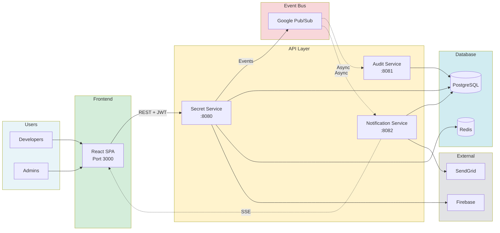
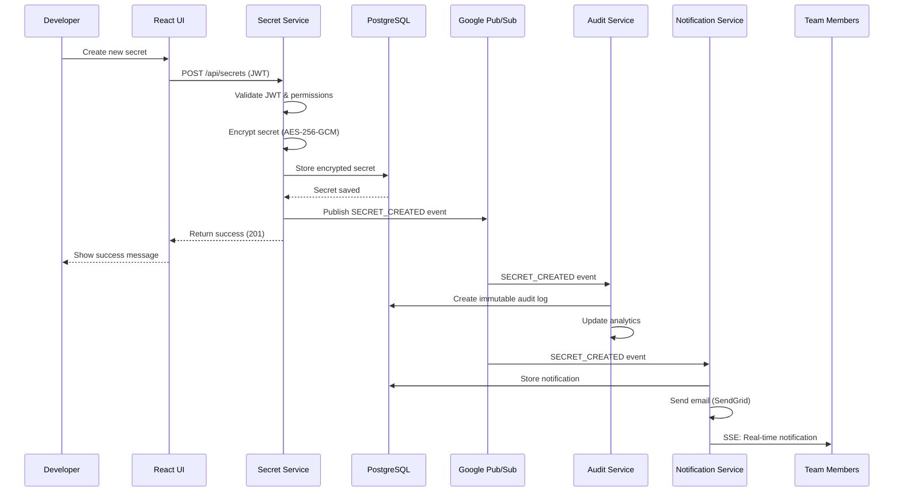

<div align="center">

<table>
  <tr>
    <td align="center" valign="middle" style="border: none; padding-right: 20px;">
      
    </td>
    <td align="center" valign="middle" style="border: none;">
      <h1 style="margin: 0; font-size: 3.5rem; font-weight: 700;">Cloud Secrets Manager</h1>
    </td>
  </tr>
</table>

**Enterprise-Grade Secrets Management Platform**

[](https://github.com/aminlahbib/Cloud-Secrets-Manager)
[](https://github.com/aminlahbib/Cloud-Secrets-Manager/wiki)
[](https://github.com/aminlahbib/Cloud-Secrets-Manager)

### Built with

[](https://openjdk.org/)
[](https://spring.io/projects/spring-boot)
[](https://reactjs.org/)
[](https://www.typescriptlang.org/)
[](https://www.postgresql.org/)
[](https://kubernetes.io/)
[](https://cloud.google.com/)
[](LICENSE)


**Securely store, manage, and audit sensitive credentials across your organization**

</div>

## 📚 Documentation

For detailed documentation visit the Project's [Wiki](https://github.com/aminlahbib/Cloud-Secrets-Manager/wiki) 📖


## 💡 Why Cloud Secrets Manager?

### 🔴 **Without Cloud Secrets Manager**

-  **Hardcoded Secrets** - API keys and passwords scattered in code repositories
-  **No Access Control** - Everyone has access to everything, or no one knows who has access
-  **No Audit Trail** - Can't track who accessed what secrets and when
-  **Security Breaches** - Exposed credentials lead to compromised systems
-  **Compliance Nightmares** - No way to prove compliance with security standards
-  **Manual Rotation** - Secret rotation is a manual, error-prone process
-  **No Versioning** - Can't rollback to previous secret values
-  **Scattered Management** - Secrets stored in multiple places (config files, environment variables, spreadsheets)

### ✅ **With Cloud Secrets Manager**

-  **Centralized Security** - All secrets encrypted and stored in one secure location
-  **Granular Access Control** - Role-based permissions (Owner, Admin, Member, Viewer) per project
-  **Complete Audit Trail** - Every access, modification, and deletion is logged with user, timestamp, and context
-  **Military-Grade Encryption** - AES-256-GCM encryption at rest, secrets never stored in plaintext
-  **Compliance Ready** - Immutable audit logs for SOC 2, GDPR, and other compliance requirements
-  **Automated Lifecycle** - Secret expiration warnings and automated rotation workflows
-  **Full Versioning** - Complete history of all secret changes with rollback capability
-  **Team Collaboration** - Project-based organization with team sharing and permissions

 

## Distinctive Features

### 1. Military-Grade Encryption with Zero-Knowledge Architecture

Unlike traditional secrets managers that store encrypted data server-side, Cloud Secrets Manager implements a zero-knowledge architecture where secrets are encrypted before leaving your control, ensuring that even the platform operators cannot access your sensitive data.

- AES-256-GCM encryption at rest - All secrets encrypted before database storage
- Zero-knowledge architecture - Secrets encrypted client-side when possible
- Secure key management - Encryption keys stored in Google Secret Manager, never exposed
- TLS 1.3 in transit - All communications encrypted with the latest security standards

### 2. Complete Audit Trail and Compliance Ready

Unlike basic logging systems, Cloud Secrets Manager provides immutable, tamper-proof audit logs that capture every action with full context, making compliance reporting effortless and security investigations comprehensive.

- Immutable audit logs - Every access, modification, and deletion logged with user, timestamp, IP, and context
- Compliance reporting - Export audit logs for SOC 2, GDPR, HIPAA compliance requirements
- Analytics dashboard - Track secret access patterns, usage metrics, and security events
- Real-time security alerts - Instant notifications for suspicious activity and policy violations

### 3. Real-Time Notifications with Smart Batching

Unlike notification systems that spam users with every event, Cloud Secrets Manager intelligently batches similar notifications and delivers them through multiple channels, ensuring you stay informed without being overwhelmed.

- Server-Sent Events (SSE) - Real-time in-app notifications without polling
- Smart batching - Similar notifications grouped within 5-minute windows to reduce spam
- Multi-channel delivery - In-app notifications, HTML email templates, and customizable preferences
- Action tracking - Analytics on notification opens and user engagement

### 4. Microservices Architecture with Event-Driven Design

Unlike monolithic secrets managers that are difficult to scale and maintain, Cloud Secrets Manager uses a microservices architecture with event-driven communication, allowing each service to scale independently and ensuring high availability.

- Independent service scaling - Secret, Audit, and Notification services scale separately based on load
- Event-driven communication - Asynchronous Pub/Sub messaging for loose coupling and resilience
- Cloud-native design - Built for Kubernetes from day one with Helm charts and Terraform modules
- Production-ready - Complete observability stack with Prometheus, Grafana, and Loki integration

 

## 🏗️ How It Works

### Architecture Overview

Cloud Secrets Manager uses a **microservices architecture** with event-driven communication for scalability and resilience.



### Key Design Principles

- **🔒 Security by Design** - Zero-trust architecture, encryption at rest and in transit
- **📦 Microservices** - Decoupled services for independent scaling and deployment
- **⚡ Event-Driven** - Asynchronous Pub/Sub messaging for loose coupling
- **📊 Observability First** - Built-in metrics, logging, and tracing
- **☁️ Cloud-Native** - Designed for Kubernetes and GCP from day one

### Data Flow Example: Creating a Secret



### Security Model

- **Encryption at Rest** - All secrets encrypted with AES-256-GCM before database storage
- **Encryption in Transit** - TLS 1.3 for all API communications
- **Key Management** - Encryption keys stored in Google Secret Manager
- **Access Control** - JWT-based authentication with role-based authorization
- **Audit Trail** - Immutable logs of all operations for compliance

 

## 🚀 Quick Start

### Prerequisites

- **Java 21+** - [Download](https://openjdk.org/)
- **Docker & Docker Compose** - [Install Docker](https://docs.docker.com/get-docker/)
- **Node.js 18+** - [Download Node.js](https://nodejs.org/) (for frontend development)
- **Maven 3.9+** - Optional (Maven wrapper included)

### Option 1: Docker Compose (Recommended)

The fastest way to get started - runs all services with a single command:

Clone the repository
```bash
git clone https://github.com/aminlahbib/Cloud-Secrets-Manager.git
cd Cloud-Secrets-Manager
```

Start all services
```bash
docker compose -f docker/docker-compose.yml up --build -d
```

**Services will be available at:**
-  **Frontend:** http://localhost:3000
-  **Secret Service API:** http://localhost:8080
-  **Audit Service API:** http://localhost:8081
-  **Notification Service API:** http://localhost:8082
-  **PostgreSQL:** localhost:5432
-  **Swagger UI:** http://localhost:8080/swagger-ui.html

### Option 2: Local Development

For development with hot-reload:

Start PostgreSQL and Redis
```bash
docker compose -f docker/docker-compose.yml up postgres redis -d
```

Start Backend Services
```bash 
cd apps/backend/secret-service && ./mvnw spring-boot:run
cd apps/backend/audit-service && ./mvnw spring-boot:run
cd apps/backend/notification-service && ./mvnw spring-boot:run
```

Start Frontend
```bash
cd apps/frontend
npm install
npm run dev
```

Don't forget to add your API keys to the configuration:
- in the root .env of your Project
- in the "env" section of your mcp config for taskmaster-ai

### Verify Installation

```bash
# Check all services are healthy
curl http://localhost:8080/actuator/health  # Secret Service
curl http://localhost:8081/actuator/health  # Audit Service
curl http://localhost:8082/actuator/health  # Notification Service
```

### First Steps

1. **Access the Application** - Open http://localhost:3000 in your browser
2. **Sign In** - Use Google OAuth to authenticate
3. **Create a Project** - Set up your first project to organize secrets
4. **Add Secrets** - Start adding API keys, passwords, or other credentials
5. **Invite Team Members** - Share your project with team members

### API Documentation

- **Swagger UI:** http://localhost:8080/swagger-ui.html
- **OpenAPI Spec:** http://localhost:8080/v3/api-docs

 

## 🛠️ Tech Stack

### Backend
- **Java 21** - Modern Java with virtual threads
- **Spring Boot 3.3.5** - Enterprise framework
- **PostgreSQL 16** - Reliable relational database
- **Redis** - Token blacklisting and caching
- **Google Pub/Sub** - Event-driven messaging

### Frontend
- **React 18** - Modern UI library
- **TypeScript 5.3** - Type-safe development
- **Vite** - Fast build tool
- **Tailwind CSS** - Utility-first styling
- **TanStack Query** - Server state management

### Infrastructure
- **Kubernetes** - Container orchestration
- **Docker** - Containerization
- **Terraform** - Infrastructure as Code
- **Helm** - Kubernetes package management
- **Google Cloud Platform** - Cloud hosting

### Observability
- **Prometheus** - Metrics collection
- **Grafana** - Visualization dashboards
- **Loki** - Log aggregation
- **Promtail** - Log collection


## ⚖️ License

This project is licensed under the **MIT License** - see the [LICENSE](LICENSE) file for details.

 

<div align="center">
**A lot of Coffee was consumed in developement**
*Last Updated: December 2025*
</div>
