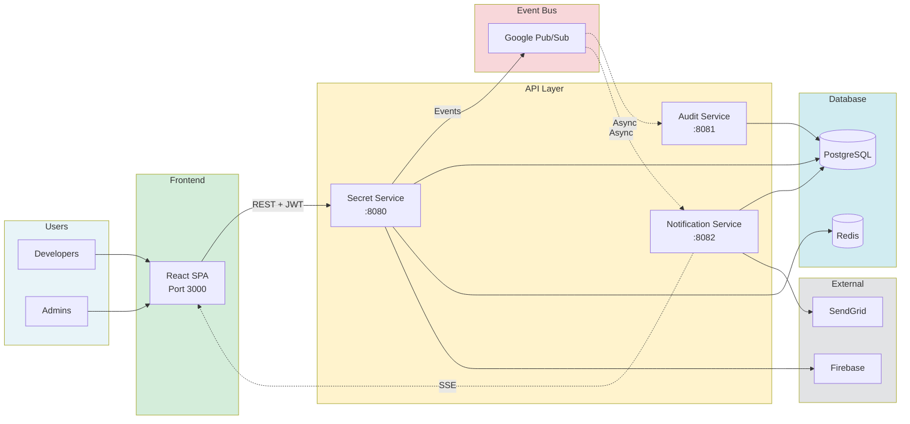
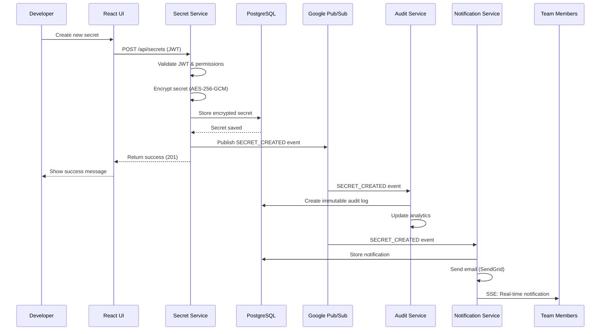

<div align="center">

# Cloud Secrets Manager

**Enterprise-Grade Secrets Management Platform**

[](https://your-site.com)
[](https://docs.your-site.com)
[](https://demo.your-site.com)
[](https://github.com/aminlahbib/Cloud-Secrets-Manager)

[](https://openjdk.org/)
[](https://spring.io/projects/spring-boot)
[](https://reactjs.org/)
[](https://www.typescriptlang.org/)
[](https://www.postgresql.org/)
[](https://kubernetes.io/)
[](https://cloud.google.com/)
[](LICENSE)

</div>

<!-- TODO: Add screenshot of the application -->
<div align="center">
  
  <p><em>Securely store, manage, and audit sensitive credentials across your organization</em></p>
</div>


## 📚 Documentation

📖 **[View Full Documentation](https://docs.your-site.com)** | [Wiki](https://github.com/aminlahbib/Cloud-Secrets-Manager/wiki)

For detailed guides, API references, and comprehensive examples, visit our [documentation site](https://docs.your-site.com).


## 💡 Why Cloud Secrets Manager?

### ❌ **Without Cloud Secrets Manager**

- 🔴 **Hardcoded Secrets** - API keys and passwords scattered in code repositories
- 🔴 **No Access Control** - Everyone has access to everything, or no one knows who has access
- 🔴 **No Audit Trail** - Can't track who accessed what secrets and when
- 🔴 **Security Breaches** - Exposed credentials lead to compromised systems
- 🔴 **Compliance Nightmares** - No way to prove compliance with security standards
- 🔴 **Manual Rotation** - Secret rotation is a manual, error-prone process
- 🔴 **No Versioning** - Can't rollback to previous secret values
- 🔴 **Scattered Management** - Secrets stored in multiple places (config files, environment variables, spreadsheets)

### ✅ **With Cloud Secrets Manager**

- ✅ **Centralized Security** - All secrets encrypted and stored in one secure location
- ✅ **Granular Access Control** - Role-based permissions (Owner, Admin, Member, Viewer) per project
- ✅ **Complete Audit Trail** - Every access, modification, and deletion is logged with user, timestamp, and context
- ✅ **Military-Grade Encryption** - AES-256-GCM encryption at rest, secrets never stored in plaintext
- ✅ **Compliance Ready** - Immutable audit logs for SOC 2, GDPR, and other compliance requirements
- ✅ **Automated Lifecycle** - Secret expiration warnings and automated rotation workflows
- ✅ **Full Versioning** - Complete history of all secret changes with rollback capability
- ✅ **Team Collaboration** - Project-based organization with team sharing and permissions

 

## What It Does

Cloud Secrets Manager is an enterprise-grade platform that eliminates the security risks of hardcoded secrets and provides centralized, secure credential management.

### Core Features

#### **Secure Secret Storage**
- **AES-256-GCM Encryption** - All secrets encrypted at rest before database storage
- **Secure Key Management** - Encryption keys managed securely, never exposed
- **Zero-Knowledge Architecture** - Secrets are encrypted client-side when possible

#### **Access Control & Permissions**
- **Project-Based Organization** - Group secrets by project, team, or application
- **Role-Based Access Control (RBAC)** - 5 permission levels:
  -  **Owner** - Full control, can delete project
  -  **Admin** - Manage secrets and members
  -  **Member** - Create and edit secrets
  -  **Viewer** - Read-only access
  -  **Auditor** - View-only with audit log access
- **Team Management** - Invite team members, manage permissions, track access

#### **Secret Lifecycle Management**
- **Version Control** - Complete history of all secret changes
- **Rollback Capability** - Restore previous secret versions instantly
- **Expiration Management** - Set expiration dates, receive warnings before expiry
- **Bulk Operations** - Update, delete, or rotate multiple secrets at once

#### **Audit & Compliance**
- **Immutable Audit Logs** - Every action logged with user, timestamp, IP, and context
- **Compliance Reporting** - Export audit logs for SOC 2, GDPR, HIPAA compliance
- **Analytics Dashboard** - Track secret access patterns and usage metrics
- **Security Alerts** - Real-time notifications for suspicious activity

#### **Authentication & Security**
- **Multi-Provider Auth** - Google OAuth, Firebase Authentication
- **Two-Factor Authentication (2FA)** - TOTP-based 2FA with recovery codes
- **JWT Tokens** - Secure, stateless authentication
- **Session Management** - Automatic token refresh and secure logout

#### **Notifications & Alerts**
- **Real-Time Notifications** - Server-Sent Events (SSE) for instant updates
- **Email Alerts** - HTML email templates for important events
- **Smart Batching** - Similar notifications grouped to reduce spam
- **Customizable Preferences** - Control notification types and delivery methods

#### **Developer Experience**
- **RESTful API** - Complete OpenAPI/Swagger documentation
- **Modern UI** - React-based dashboard with real-time updates
- **Docker Support** - One-command local development setup
- **Kubernetes Ready** - Production-ready Helm charts and manifests

 

## 🏗️ How It Works

### Architecture Overview

Cloud Secrets Manager uses a **microservices architecture** with event-driven communication for scalability and resilience.



### Key Design Principles

- **🔒 Security by Design** - Zero-trust architecture, encryption at rest and in transit
- **📦 Microservices** - Decoupled services for independent scaling and deployment
- **⚡ Event-Driven** - Asynchronous Pub/Sub messaging for loose coupling
- **📊 Observability First** - Built-in metrics, logging, and tracing
- **☁️ Cloud-Native** - Designed for Kubernetes and GCP from day one

### Data Flow Example: Creating a Secret



### Security Model

- **Encryption at Rest** - All secrets encrypted with AES-256-GCM before database storage
- **Encryption in Transit** - TLS 1.3 for all API communications
- **Key Management** - Encryption keys stored in Google Secret Manager
- **Access Control** - JWT-based authentication with role-based authorization
- **Audit Trail** - Immutable logs of all operations for compliance

 

## 🚀 Quick Start

### Prerequisites

- **Java 21+** - [Download](https://openjdk.org/)
- **Docker & Docker Compose** - [Install Docker](https://docs.docker.com/get-docker/)
- **Node.js 18+** - [Download Node.js](https://nodejs.org/) (for frontend development)
- **Maven 3.9+** - Optional (Maven wrapper included)

### Option 1: Docker Compose (Recommended)

The fastest way to get started - runs all services with a single command:

```bash
# Clone the repository
git clone https://github.com/aminlahbib/Cloud-Secrets-Manager.git
cd Cloud-Secrets-Manager

# Start all services
docker compose -f docker/docker-compose.yml up --build
```

**Services will be available at:**
-  **Frontend:** http://localhost:3000
-  **Secret Service API:** http://localhost:8080
-  **Audit Service API:** http://localhost:8081
-  **Notification Service API:** http://localhost:8082
-  **PostgreSQL:** localhost:5432
-  **Swagger UI:** http://localhost:8080/swagger-ui.html

### Option 2: Local Development

For development with hot-reload:

Start PostgreSQL and Redis
```bash
docker compose -f docker/docker-compose.yml up postgres redis -d
```

Start Backend Services
```bash 
cd apps/backend/secret-service && ./mvnw spring-boot:run
cd apps/backend/audit-service && ./mvnw spring-boot:run
cd apps/backend/notification-service && ./mvnw spring-boot:run
```

Start Frontend
```bash
cd apps/frontend
npm install
npm run dev
```

Don't forget to add your API keys to the configuration:
- in the root .env of your Project
- in the "env" section of your mcp config for taskmaster-ai

### Verify Installation

```bash
# Check all services are healthy
curl http://localhost:8080/actuator/health  # Secret Service
curl http://localhost:8081/actuator/health  # Audit Service
curl http://localhost:8082/actuator/health  # Notification Service
```

### First Steps

1. **Access the Application** - Open http://localhost:3000 in your browser
2. **Sign In** - Use Google OAuth to authenticate
3. **Create a Project** - Set up your first project to organize secrets
4. **Add Secrets** - Start adding API keys, passwords, or other credentials
5. **Invite Team Members** - Share your project with team members

### API Documentation

- **Swagger UI:** http://localhost:8080/swagger-ui.html
- **OpenAPI Spec:** http://localhost:8080/v3/api-docs

 

## 🛠️ Tech Stack

### Backend
- **Java 21** - Modern Java with virtual threads
- **Spring Boot 3.3.5** - Enterprise framework
- **PostgreSQL 16** - Reliable relational database
- **Redis** - Token blacklisting and caching
- **Google Pub/Sub** - Event-driven messaging

### Frontend
- **React 18** - Modern UI library
- **TypeScript 5.3** - Type-safe development
- **Vite** - Fast build tool
- **Tailwind CSS** - Utility-first styling
- **TanStack Query** - Server state management

### Infrastructure
- **Kubernetes** - Container orchestration
- **Docker** - Containerization
- **Terraform** - Infrastructure as Code
- **Helm** - Kubernetes package management
- **Google Cloud Platform** - Cloud hosting

### Observability
- **Prometheus** - Metrics collection
- **Grafana** - Visualization dashboards
- **Loki** - Log aggregation
- **Promtail** - Log collection


## 📄 License

This project is licensed under the **MIT License** - see the [LICENSE](LICENSE) file for details.

 

<div align="center">
**A lot of Coffee was consumed in developement**
*Last Updated: December 2025*
</div>
