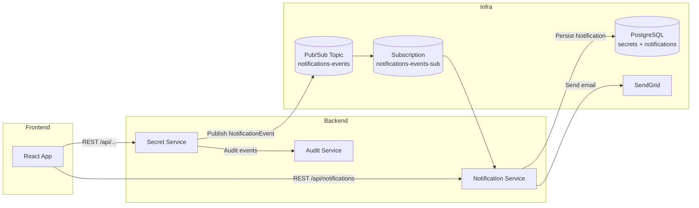
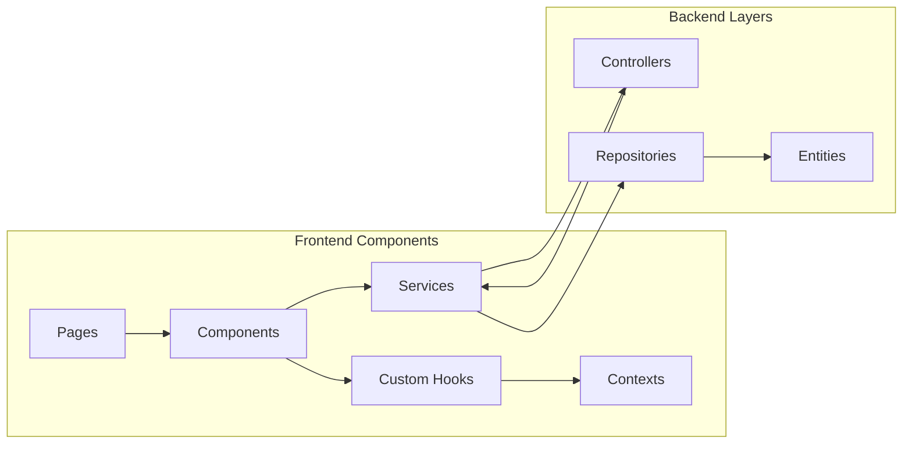
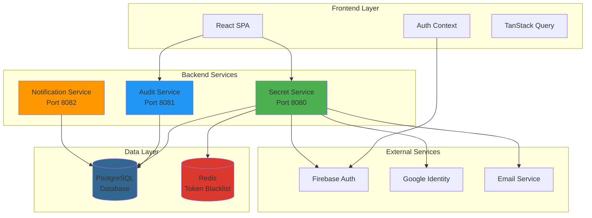

## Cloud Secrets Manager – Architecture & Deployment

> Single-source overview of services, infrastructure, and deployment strategy.

---

### 1. System Overview

Cloud Secrets Manager (CSM) is a **microservice-based secrets management platform**. It provides:

- Secure storage and rotation of application secrets.
- Collaboration via projects, teams, and workflows.
- Full audit logging and analytics.
- Notification pipeline (email + in‑app) for important security events.
- Optional 2FA (TOTP) for user accounts.

At a high level:

```text
Browser (React/Vite)
        │  HTTPS (REST)
        ▼
Secret Service (Spring Boot, port 8080)
  - Auth, RBAC, projects, teams, secrets, workflows
  - Publishes NotificationEvents to Pub/Sub
  - Proxies to audit-service and notification-service
        │
        ├────────────► Audit Service (8081)
        │               - Append-only audit logs
        │               - Analytics & reports
        │
        └────────────► Notification Service (8082)
                        - Pub/Sub subscriber
                        - Email + in‑app notifications

PostgreSQL (Cloud SQL) – shared relational database
Google Cloud Pub/Sub – notifications-events topic
Firebase / Google Identity Platform – primary auth provider
```

#### 1.1 High-Level System Architecture Diagram



#### 1.2 Component Architecture



#### High-Level System Architecture Diagram


#### Component Architecture



---

### 2. Backend Services

All backend services are **Spring Boot 3 / Java 21** applications packaged as Docker images and deployed to GKE.

#### 2.1 Secret Service (`apps/backend/secret-service`)

**Responsibilities**

- API gateway for all client traffic.
- Authentication & authorization (Firebase ID tokens + local JWT).
- User management (profile, 2FA status, preferences).
- Projects, teams, workflows, secrets, memberships, invitations.
- Secret versioning, rotation, and expiration scheduler.
- Publishes `NotificationEvent` messages to Pub/Sub.
- Proxies:
  - `/api/audit/**` → audit-service.
  - `/api/notifications/**` → notification-service.

**Key modules**

- `controller/*` – REST endpoints (auth, projects, secrets, teams, workflows, audit proxy, notifications proxy, 2FA).
- `service/*` – business logic (`ProjectService`, `ProjectSecretService`, `TwoFactorService`, `NotificationEventPublisher`, etc.).
- `entity/*` – JPA entities (`User`, `Project`, `Secret`, `SecretVersion`, `Workflow`, `ProjectMembership`, `Notification` table shared with notification-service).
- `config/*` – security, WebClient, Pub/Sub, rate limiting, OpenAPI.

#### 2.2 Audit Service (`apps/backend/audit-service`)

**Responsibilities**

- Dedicated microservice for **immutable audit logging**.
- Stores audit entries (who did what, when, on which resource) in its own schema.
- Exposes an HTTP API for:
  - Paginated audit log browsing.
  - Project‑level filtering and analytics.
- Consumed only via `AuditLogProxyController` in secret-service.

**Notes**

- Uses PostgreSQL for storage.
- Secured with service‑to‑service authentication (API key header).

#### 2.3 Notification Service (`apps/backend/notification-service`)

**Responsibilities**

- Subscribes to the `notifications-events` Pub/Sub topic.
- Resolves user preferences from `users.notification_preferences`.
- Persists in‑app notifications into the shared `notifications` table.
- Sends transactional emails via SendGrid:
  - Project and team invitations.
  - Role changes.
  - Secret expiration warnings.
- Exposes JWT‑secured HTTP APIs:
  - `GET /api/notifications?unreadOnly=false`
  - `POST /api/notifications/{id}/read`
  - `POST /api/notifications/read-all`

**Security**

- Validates JWTs using its own `JwtTokenProvider` but **shares `JWT_SECRET`** with secret-service.
- Only reachable from the cluster; external clients go through secret-service proxy.

---

### 3. Frontend Application (`apps/frontend`)

**Tech stack**

- React 18 + TypeScript.
- Vite build tool.
- Tailwind‑based design system and custom UI components.
- TanStack Query for server state.
- React Router v6 for routing.
- Firebase Web SDK for Google sign‑in and optional email/password.

**Key pages**

- `Login` – Google/Firebase login + 2FA verification step.
- `Home` – dashboard, workflows list, quick actions.
- `Projects` + `ProjectDetail` – core secrets UI with tabs (Secrets, Members, Activity, Settings).
- `Teams` + `TeamDetail`.
- `Secrets` detail and create/edit flows.
- `Workflows` (list and detail).
- `Notifications` – full notification inbox.
- `Activity` / `AuditLogs` – project and global audit browsing.
- `Settings` – profile, security (2FA), notifications, preferences.

**Integration points**

- Calls secret-service at `VITE_API_BASE_URL` (e.g. `http://localhost:8080` or ingress URL).
- Uses `/api/notifications` and `/api/audit` through secret-service proxy.
- Handles 2FA flows with:
  - `POST /api/auth/2fa/totp/start`
  - `POST /api/auth/2fa/totp/confirm`
  - `POST /api/auth/2fa/totp/verify-login`
  - `POST /api/auth/2fa/disable`

---

### 4. Infrastructure (Terraform, Kubernetes, Helm)

#### 4.1 Terraform (Infrastructure as Code)

Location: `infrastructure/terraform/`

- **Modules**
  - `gke-cluster` – GKE cluster, node pools, networking.
  - `postgresql` – Cloud SQL (PostgreSQL 16) instances.
  - `artifact-registry` – container image registry.
  - `iam` – service accounts, IAM roles, workload identity bindings.
  - `billing-budget` – cost alerting.

- **Environments**
  - `environments/dev` – full stack for dev.
  - `environments/staging` – (optional) pre‑prod.
  - `environments/production` – production setup.

- **Key resources**
  - `google_pubsub_topic.notifications_events` and subscription.
  - Service accounts:
    - `secret-service-<env>` with `roles/pubsub.publisher`.
    - `notification-service-<env>` with `roles/pubsub.subscriber`.
  - Workload Identity mappings between GCP SAs and K8s SAs.

#### 4.2 Kubernetes Manifests

Location: `infrastructure/kubernetes/k8s/`

- Deployments & Services for:
  - `secret-service`, `audit-service`, `notification-service`.
- Ingress (HTTP/HTTPS routing to frontend + API).
- Network policies and Pod Security Standards for locked‑down traffic and pods.
- External Secrets / config for DB credentials, JWT secrets, SendGrid keys, etc.

#### 4.3 Helm Chart

Location: `infrastructure/helm/cloud-secrets-manager/`

- Templates:
  - `*-deployment.yaml` for each backend service.
  - `ingress.yaml` for HTTP routing.
  - `serviceaccount.yaml` with Workload Identity annotations.
  - `secret-config.yaml` / `databases.yaml` for config & connection strings.
- Values files:
  - `values.yaml` – dev.
  - `values-staging.yaml` – staging.
  - `values-production.yaml` – production.

---

### 5. Environments & Configuration

**Environments**

- **dev** – feature development; may share a GCP project with lower quotas.
- **staging** – (optional) pre‑production with production‑like infra.
- **production** – hardened, monitored environment.

**Configuration sources**

- `.env` (local Docker Compose).
- Kubernetes Secrets and External Secrets Operator.
- Helm values for per‑environment differences.
- Terraform variables and `terraform.tfvars` for cloud resources.

**Critical env vars**

- `SPRING_DATASOURCE_*` – DB URL/user/password.
- `JWT_SECRET` – shared signing key for secret-service and notification-service.
- `ENCRYPTION_KEY` – AES‑GCM secret encryption key.
- `SENDGRID_API_KEY`, `EMAIL_FROM_*`, `APP_BASE_URL`.
- `GCP_PROJECT_ID` – used for Pub/Sub config.

---

### 6. Deployment Plan (End-to-End)

#### 6.1 First-Time Deployment (Per Environment)

1. **Prepare GCP project**
   - Enable required APIs (`compute`, `container`, `sqladmin`, `artifactregistry`, `secretmanager`, `pubsub`, etc.).
2. **Apply Terraform**
   - `terraform -chdir=infrastructure/terraform/environments/<env> init`
   - `terraform -chdir=infrastructure/terraform/environments/<env> apply`
3. **Build and publish images**
   - Via Cloud Build (`infrastructure/ci-cd/cloudbuild-*.yaml`) or local `docker build` to Artifact Registry.
4. **Install / upgrade Helm release**
   - `helm upgrade --install cloud-secrets-manager infrastructure/helm/cloud-secrets-manager -f values-<env>.yaml`
5. **Bootstrap secrets**
   - Create JWT + encryption keys, DB passwords, SendGrid API key in Secret Manager.
   - Ensure External Secrets sync them into the cluster.

#### 6.2 Ongoing Deployments

Typical CI/CD flow:

1. Developer pushes to `main` or release branch.
2. Cloud Build:
   - Runs tests (unit + integration).
   - Builds Docker images for all services.
   - Pushes to Artifact Registry.
   - Applies Terraform if infra changes are present.
   - Runs `helm upgrade --install` with updated image tags.

#### 6.3 Rollback Strategy

- **Application rollback**
  - Use previous container image tags.
  - `helm rollback cloud-secrets-manager <revision>`.
- **Database safety**
  - All schema changes managed by Flyway.
  - Prefer forward‑only migrations; use hotfix migrations rather than schema rollback.
- **Feature rollback**
  - Guard risky behaviour with feature flags/config toggles where possible (e.g. 2FA enforcement, notifications enabled).

This file is the **authoritative overview** of how the system is structured and how it is deployed. For flows and API details, see `02_SYSTEM_FLOWS_AND_APIS.md`. For operations and incident playbooks, see `05_OPERATIONS_AND_RUNBOOK.md`.
