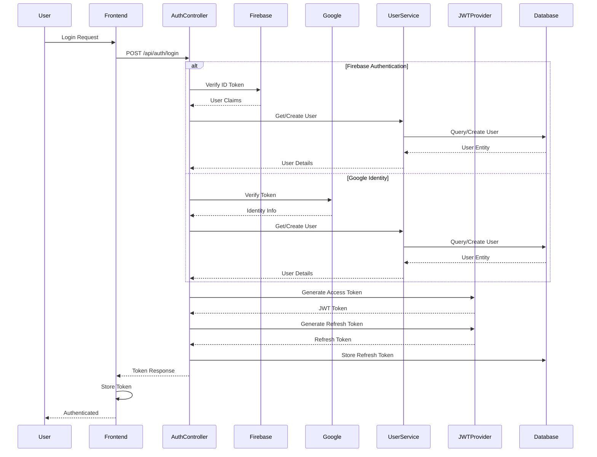
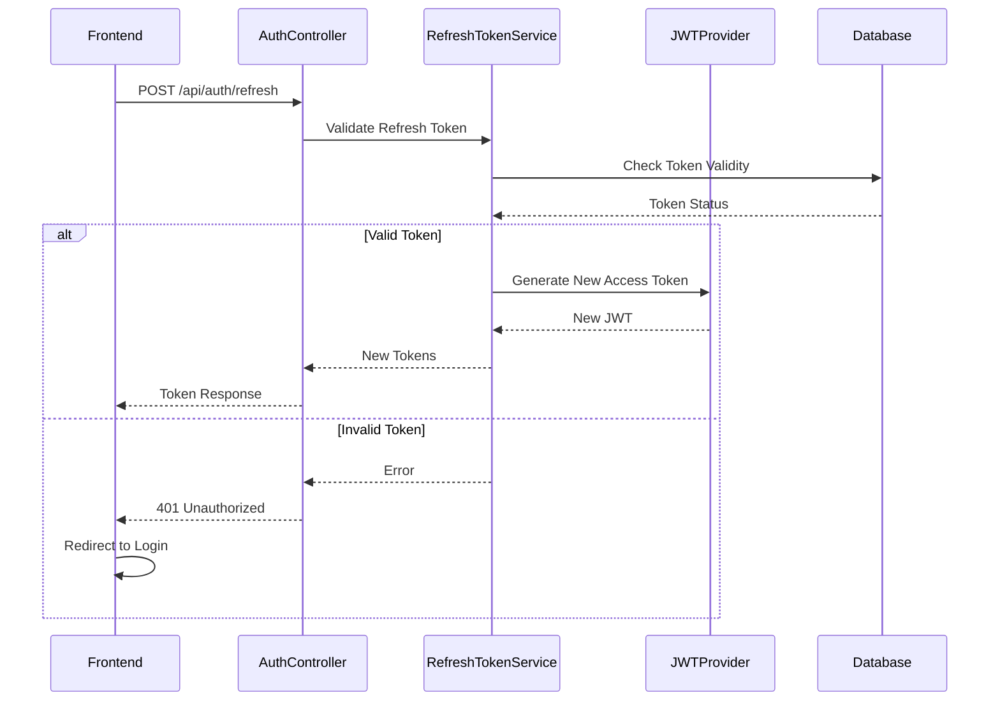
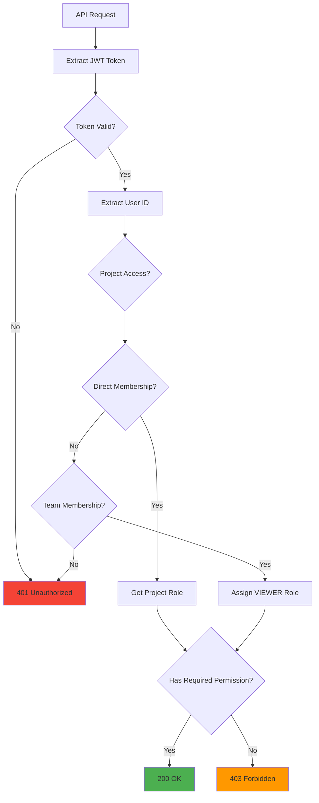
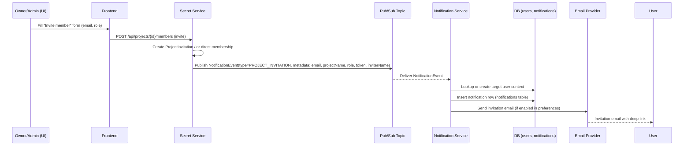
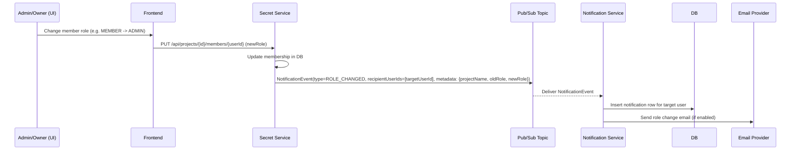
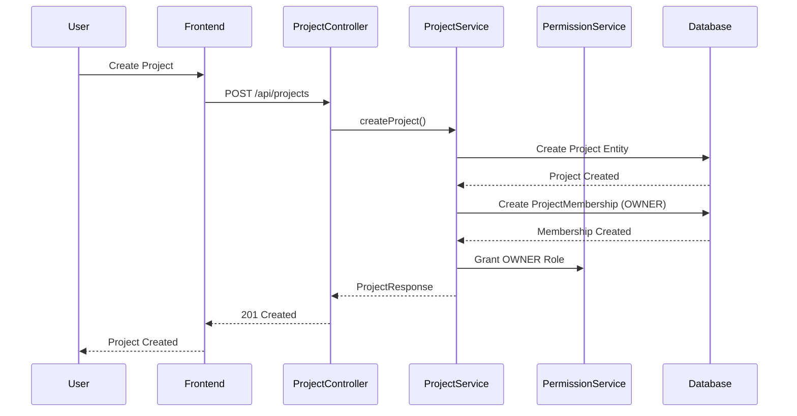
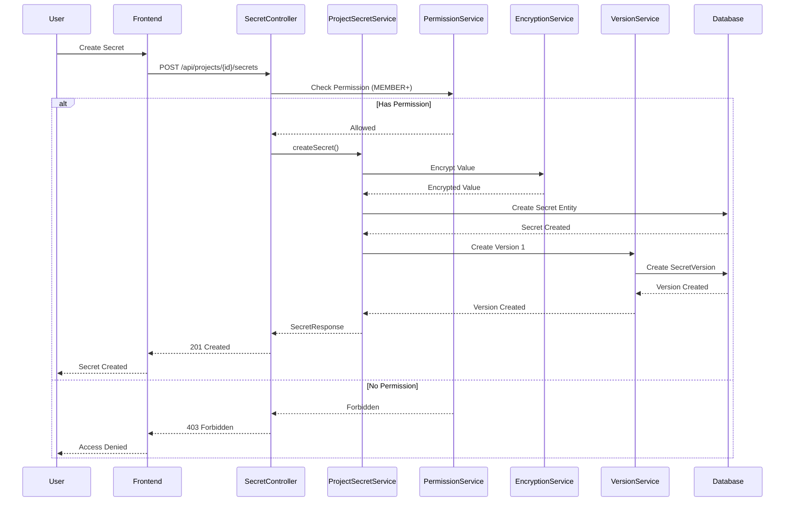
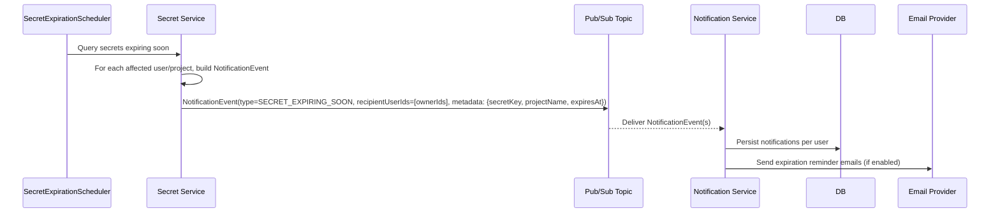

## Cloud Secrets Manager – System Flows & API Contracts

> End-to-end flows (auth, projects/teams, secrets, notifications, audit) and the HTTP contracts they rely on.

This file is intentionally **high-level**. For exhaustive field‑by‑field API docs, use the generated OpenAPI spec exposed by secret-service.

---

### 1. Authentication & 2FA Flows

#### 1.1 Authentication Flow Diagram



#### 1.2 Token Refresh Flow



#### 1.3 Authorization Flow (Project-Scoped RBAC)



#### 1.4 Login (Google Identity / Firebase)

1. Frontend opens Google sign‑in via Firebase.
2. Firebase returns an **ID token**.
3. Frontend calls:

```http
POST /api/auth/login
Content-Type: application/json

{ "idToken": "<firebase_id_token>" }
```

4. Backend validates the token with Firebase Admin SDK and:
   - If the user **does not** have 2FA enabled:
     - Returns a full `TokenResponse` with access and refresh tokens.
   - If the user **has 2FA enabled**:
     - Returns:
       ```json
       {
         "requiresTwoFactor": true,
         "intermediateToken": "<short_lived_jwt>",
         "twoFactorType": "TOTP",
         "expiresIn": 300
       }
       ```
5. Frontend:
   - If `requiresTwoFactor=false`: saves tokens and navigates to `/home`.
   - If `requiresTwoFactor=true`: shows the **2FA verification** screen.

#### 1.2 2FA (TOTP) – Setup Flow

Endpoints (user must be authenticated with an access token):

```http
POST /api/auth/2fa/totp/start
Authorization: Bearer <accessToken>

→ 200 OK
{
  "qrCodeDataUrl": "data:image/png;base64,...",
  "manualSecret": "JBSWY3DPEHPK3PXP",
  "otpAuthUrl": "otpauth://totp/Cloud%20Secrets..."
}
```

User scans the QR code / enters `manualSecret` in their authenticator app, then:

```http
POST /api/auth/2fa/totp/confirm
Authorization: Bearer <accessToken>
Content-Type: application/json

{ "code": "123456" }
```

On success:

```json
{
  "twoFactorEnabled": true,
  "twoFactorType": "TOTP",
  "recoveryCodes": ["XXXX-XXXX", "..."]
}
```

Errors:

- `400` – invalid code or no pending setup.
- `401` – user not authenticated.

#### 1.3 2FA – Login Verification

When login requires 2FA:

```http
POST /api/auth/2fa/totp/verify-login
Content-Type: application/json

{
  "intermediateToken": "<short_lived_jwt>",
  "code": "123456",          // or,
  "recoveryCode": "ABCD-EFGH"
}
```

Responses:

- `200 OK` – full `TokenResponse` with `accessToken`, `refreshToken`, `expiresIn`.
- `401 Unauthorized` – invalid/expired intermediate token or invalid code.
- `429 Too Many Requests` – rate limit triggered.

Frontend behaviour:

- On `200` – saves tokens, fetches `/api/auth/me`, navigates to `/home`.
- On `401/429` – displays inline error on the 2FA screen without redirecting or clearing `intermediateToken`.

#### 1.4 2FA – Disable & Recovery Codes

```http
POST /api/auth/2fa/disable
Authorization: Bearer <accessToken>
Content-Type: application/json

{ "code": "123456" }  // or recoveryCode
```

```http
POST /api/auth/2fa/recovery-codes/regenerate
Authorization: Bearer <accessToken>
```

---

### 2. Core Product Flows

#### 2.1 Project Invitation Flow (Event-Driven)



#### 2.2 Membership Role Change Flow



#### 2.3 Project Creation Flow



#### 2.4 Projects & Teams

**Create project**

```http
POST /api/projects
Authorization: Bearer <token>
Content-Type: application/json

{
  "name": "Backend Services",
  "description": "All backend infra secrets",
  "workflowId": "uuid-of-workflow"
}
```

**Invite member**

```http
POST /api/projects/{projectId}/members/invite
Authorization: Bearer <token>

{
  "email": "user@example.com",
  "role": "PROJECT_ADMIN"
}
```

Flow:

1. Secret-service validates permissions.
2. An invitation record is created; an audit event is logged.
3. A `PROJECT_INVITATION` `NotificationEvent` is published to Pub/Sub.
4. Notification-service:
   - Creates an in‑app notification.
   - Sends an email if preferences allow.
5. Invitee accepts via:

```http
POST /api/invitations/{token}/accept
```

The same pattern is used for team invitations and role changes.

#### 2.5 Secret Creation Flow



#### 2.6 Secret Expiration Flow



#### 2.7 Secrets Lifecycle

**Create / update secret**

```http
POST /api/projects/{projectId}/secrets
Authorization: Bearer <token>

{
  "key": "DATABASE_URL",
  "value": "postgres://...",
  "description": "Prod DB connection string",
  "expiresAt": "2025-12-31T23:59:59Z"
}
```

Business logic:

- Value is encrypted with AES‑GCM using `ENCRYPTION_KEY`.
- A new row in `secrets` plus an entry in `secret_versions` is created.
- Audit event: `SECRET_CREATED`.

**Secret rotation / versioning**

```http
POST /api/projects/{projectId}/secrets/{key}/rotate
POST /api/projects/{projectId}/secrets/{key}/versions/{version}/restore
```

Expiration flow:

1. `SecretExpirationScheduler` scans for secrets close to `expires_at`.
2. For each affected secret:
   - Emits `SECRET_EXPIRING_SOON` `NotificationEvent`.
   - Logs audit event.
3. Notification-service:
   - Generates email + in‑app notifications for owners/members.

---

### 3. Notifications Flows

#### 3.1 Event Publishing (Secret Service)

Events are normalised using `NotificationEvent` and `NotificationType` enums:

- `PROJECT_INVITATION`
- `TEAM_INVITATION`
- `SECRET_EXPIRING_SOON`
- `ROLE_CHANGED`
- `SECURITY_ALERT`

Publishing flow:

1. Controller/service executes business logic.
2. `NotificationEventPublisher` builds a `NotificationEvent` with:
   - `type`, `recipientUserId`, `title`, `body`, `metadata`.
3. Event is published to Pub/Sub topic `notifications-events`.

#### 3.2 Notification Service Consumption

`NotificationEventMessageReceiver`:

1. Receives Pub/Sub messages.
2. Deserializes event and loads recipient `User` + preferences.
3. If the category is enabled:
   - Writes a row to `notifications` table (for in‑app).
   - Sends an email via SendGrid if email is enabled.

#### 3.3 Frontend Flows

**List notifications**

```http
GET /api/notifications?unreadOnly=false
Authorization: Bearer <token>
```

**Mark as read**

```http
POST /api/notifications/{id}/read
POST /api/notifications/read-all
```

The frontend uses `useNotifications` and `notificationsService` to:

- Show an unread count badge in the top bar.
- Render a dropdown with recent notifications.
- Offer a `/notifications` page with history and “Mark all as read”.

---

### 4. Audit & Analytics Flows

#### 4.1 Logging Strategy

- Almost all meaningful user actions emit an audit event:
  - Project/secret CRUD.
  - Role changes.
  - 2FA enable/disable.
  - Login verification.
- Events flow:
  - From domain services to `AuditClient` in secret-service.
  - Across HTTP to audit-service.
  - Persisted in `audit_logs` table.

#### 4.2 Query Flows

The frontend never talks to audit-service directly; it calls **proxy endpoints** in secret-service:

```http
GET /api/audit?page=0&size=50&sortBy=createdAt&sortDir=DESC
GET /api/audit/project/{projectId}
GET /api/audit/project/{projectId}/analytics
```

Permission checks:

- For global logs: platform admin only.
- For project logs: membership in the project.

---

### 5. Consolidated API Surface (By Domain)

This is a non‑exhaustive list of the **most important** endpoints exposed to the frontend.

- **Auth & 2FA**
  - `POST /api/auth/login`
  - `GET /api/auth/me`
  - `POST /api/auth/logout`
  - `POST /api/auth/2fa/totp/start`
  - `POST /api/auth/2fa/totp/confirm`
  - `POST /api/auth/2fa/totp/verify-login`
  - `POST /api/auth/2fa/disable`
  - `POST /api/auth/2fa/recovery-codes/regenerate`

- **Projects / Teams / Workflows**
  - `GET /api/projects`, `POST /api/projects`, `GET /api/projects/{id}`, `PUT /api/projects/{id}`, `DELETE /api/projects/{id}`, `POST /api/projects/{id}/restore`
  - `GET /api/projects/{id}/members`, `POST /api/projects/{id}/members/invite`, `PUT /api/projects/{id}/members/{memberId}/role`, `DELETE /api/projects/{id}/members/{memberId}`, `POST /api/projects/{id}/members/transfer-ownership`
  - `GET /api/workflows`, `POST /api/workflows`, `POST /api/workflows/{id}/projects/{projectId}/move`

- **Secrets**
  - `GET /api/projects/{projectId}/secrets`
  - `GET /api/projects/{projectId}/secrets/{key}`
  - `POST /api/projects/{projectId}/secrets`
  - `PUT /api/projects/{projectId}/secrets/{key}`
  - `DELETE /api/projects/{projectId}/secrets/{key}`
  - `POST /api/projects/{projectId}/secrets/{key}/rotate`
  - `GET /api/projects/{projectId}/secrets/{key}/versions`
  - `POST /api/projects/{projectId}/secrets/{key}/versions/{version}/restore`

- **Notifications (proxy to notification-service)**
  - `GET /api/notifications?unreadOnly=false`
  - `POST /api/notifications/{id}/read`
  - `POST /api/notifications/read-all`

- **Audit (proxy to audit-service)**
  - `GET /api/audit`
  - `GET /api/audit/project/{projectId}`
  - `GET /api/audit/project/{projectId}/analytics`

For full request/response schemas, refer to the OpenAPI UI exposed by secret-service in each environment.

**Create / update secret**

```http
POST /api/projects/{projectId}/secrets
Authorization: Bearer <token>

{
  "key": "DATABASE_URL",
  "value": "postgres://...",
  "description": "Prod DB connection string",
  "expiresAt": "2025-12-31T23:59:59Z"
}
```

Business logic:

- Value is encrypted with AES‑GCM using `ENCRYPTION_KEY`.
- A new row in `secrets` plus an entry in `secret_versions` is created.
- Audit event: `SECRET_CREATED`.

**Secret rotation / versioning**

```http
POST /api/projects/{projectId}/secrets/{key}/rotate
POST /api/projects/{projectId}/secrets/{key}/versions/{version}/restore
```

Expiration flow:

1. `SecretExpirationScheduler` scans for secrets close to `expires_at`.
2. For each affected secret:
   - Emits `SECRET_EXPIRING_SOON` `NotificationEvent`.
   - Logs audit event.
3. Notification-service:
   - Generates email + in‑app notifications for owners/members.

---

### 3. Notifications Flows

#### 3.1 Event Publishing (Secret Service)

Events are normalised using `NotificationEvent` and `NotificationType` enums:

- `PROJECT_INVITATION`
- `TEAM_INVITATION`
- `SECRET_EXPIRING_SOON`
- `ROLE_CHANGED`
- `SECURITY_ALERT`

Publishing flow:

1. Controller/service executes business logic.
2. `NotificationEventPublisher` builds a `NotificationEvent` with:
   - `type`, `recipientUserId`, `title`, `body`, `metadata`.
3. Event is published to Pub/Sub topic `notifications-events`.

#### 3.2 Notification Service Consumption

`NotificationEventMessageReceiver`:

1. Receives Pub/Sub messages.
2. Deserializes event and loads recipient `User` + preferences.
3. If the category is enabled:
   - Writes a row to `notifications` table (for in‑app).
   - Sends an email via SendGrid if email is enabled.

#### 3.3 Frontend Flows

**List notifications**

```http
GET /api/notifications?unreadOnly=false
Authorization: Bearer <token>
```

**Mark as read**

```http
POST /api/notifications/{id}/read
POST /api/notifications/read-all
```

The frontend uses `useNotifications` and `notificationsService` to:

- Show an unread count badge in the top bar.
- Render a dropdown with recent notifications.
- Offer a `/notifications` page with history and “Mark all as read”.

---

### 4. Audit & Analytics Flows

#### 4.1 Logging Strategy

- Almost all meaningful user actions emit an audit event:
  - Project/secret CRUD.
  - Role changes.
  - 2FA enable/disable.
  - Login verification.
- Events flow:
  - From domain services to `AuditClient` in secret-service.
  - Across HTTP to audit-service.
  - Persisted in `audit_logs` table.

#### 4.2 Query Flows

The frontend never talks to audit-service directly; it calls **proxy endpoints** in secret-service:

```http
GET /api/audit?page=0&size=50&sortBy=createdAt&sortDir=DESC
GET /api/audit/project/{projectId}
GET /api/audit/project/{projectId}/analytics
```

Permission checks:

- For global logs: platform admin only.
- For project logs: membership in the project.

---

### 5. Consolidated API Surface (By Domain)

This is a non‑exhaustive list of the **most important** endpoints exposed to the frontend.

- **Auth & 2FA**
  - `POST /api/auth/login`
  - `GET /api/auth/me`
  - `POST /api/auth/logout`
  - `POST /api/auth/2fa/totp/start`
  - `POST /api/auth/2fa/totp/confirm`
  - `POST /api/auth/2fa/totp/verify-login`
  - `POST /api/auth/2fa/disable`
  - `POST /api/auth/2fa/recovery-codes/regenerate`

- **Projects / Teams / Workflows**
  - `GET /api/projects`, `POST /api/projects`, `GET /api/projects/{id}`, `PUT /api/projects/{id}`, `DELETE /api/projects/{id}`, `POST /api/projects/{id}/restore`
  - `GET /api/projects/{id}/members`, `POST /api/projects/{id}/members/invite`, `PUT /api/projects/{id}/members/{memberId}/role`, `DELETE /api/projects/{id}/members/{memberId}`, `POST /api/projects/{id}/members/transfer-ownership`
  - `GET /api/workflows`, `POST /api/workflows`, `POST /api/workflows/{id}/projects/{projectId}/move`

- **Secrets**
  - `GET /api/projects/{projectId}/secrets`
  - `GET /api/projects/{projectId}/secrets/{key}`
  - `POST /api/projects/{projectId}/secrets`
  - `PUT /api/projects/{projectId}/secrets/{key}`
  - `DELETE /api/projects/{projectId}/secrets/{key}`
  - `POST /api/projects/{projectId}/secrets/{key}/rotate`
  - `GET /api/projects/{projectId}/secrets/{key}/versions`
  - `POST /api/projects/{projectId}/secrets/{key}/versions/{version}/restore`

- **Notifications (proxy to notification-service)**
  - `GET /api/notifications?unreadOnly=false`
  - `POST /api/notifications/{id}/read`
  - `POST /api/notifications/read-all`

- **Audit (proxy to audit-service)**
  - `GET /api/audit`
  - `GET /api/audit/project/{projectId}`
  - `GET /api/audit/project/{projectId}/analytics`

For full request/response schemas, refer to the OpenAPI UI exposed by secret-service in each environment.

sequenceDiagram
    participant User
    participant Frontend
    participant SecretController
    participant ProjectSecretService
    participant PermissionService
    participant EncryptionService
    participant VersionService
    participant Database

    User->>Frontend: Create Secret
    Frontend->>SecretController: POST /api/projects/{id}/secrets
    SecretController->>PermissionService: Check Permission (MEMBER+)
    
    alt Has Permission
        PermissionService-->>SecretController: Allowed
        SecretController->>ProjectSecretService: createSecret()
        ProjectSecretService->>EncryptionService: Encrypt Value
        EncryptionService-->>ProjectSecretService: Encrypted Value
        ProjectSecretService->>Database: Create Secret Entity
        Database-->>ProjectSecretService: Secret Created
        ProjectSecretService->>VersionService: Create Version 1
        VersionService->>Database: Create SecretVersion
        Database-->>VersionService: Version Created
        VersionService-->>ProjectSecretService: Version Created
        ProjectSecretService-->>SecretController: SecretResponse
        SecretController-->>Frontend: 201 Created
        Frontend-->>User: Secret Created
    else No Permission
        PermissionService-->>SecretController: Forbidden
        SecretController-->>Frontend: 403 Forbidden
        Frontend-->>User: Access Denied
    end
```

#### 2.6 Secret Expiration Flow


#### 2.7 Secrets Lifecycle

**Create / update secret**

```http
POST /api/projects/{projectId}/secrets
Authorization: Bearer <token>

{
  "key": "DATABASE_URL",
  "value": "postgres://...",
  "description": "Prod DB connection string",
  "expiresAt": "2025-12-31T23:59:59Z"
}
```

Business logic:

- Value is encrypted with AES‑GCM using `ENCRYPTION_KEY`.
- A new row in `secrets` plus an entry in `secret_versions` is created.
- Audit event: `SECRET_CREATED`.

**Secret rotation / versioning**

```http
POST /api/projects/{projectId}/secrets/{key}/rotate
POST /api/projects/{projectId}/secrets/{key}/versions/{version}/restore
```

Expiration flow:

1. `SecretExpirationScheduler` scans for secrets close to `expires_at`.
2. For each affected secret:
   - Emits `SECRET_EXPIRING_SOON` `NotificationEvent`.
   - Logs audit event.
3. Notification-service:
   - Generates email + in‑app notifications for owners/members.

---

### 3. Notifications Flows

#### 3.1 Event Publishing (Secret Service)

Events are normalised using `NotificationEvent` and `NotificationType` enums:

- `PROJECT_INVITATION`
- `TEAM_INVITATION`
- `SECRET_EXPIRING_SOON`
- `ROLE_CHANGED`
- `SECURITY_ALERT`

Publishing flow:

1. Controller/service executes business logic.
2. `NotificationEventPublisher` builds a `NotificationEvent` with:
   - `type`, `recipientUserId`, `title`, `body`, `metadata`.
3. Event is published to Pub/Sub topic `notifications-events`.

#### 3.2 Notification Service Consumption

`NotificationEventMessageReceiver`:

1. Receives Pub/Sub messages.
2. Deserializes event and loads recipient `User` + preferences.
3. If the category is enabled:
   - Writes a row to `notifications` table (for in‑app).
   - Sends an email via SendGrid if email is enabled.

#### 3.3 Frontend Flows

**List notifications**

```http
GET /api/notifications?unreadOnly=false
Authorization: Bearer <token>
```

**Mark as read**

```http
POST /api/notifications/{id}/read
POST /api/notifications/read-all
```

The frontend uses `useNotifications` and `notificationsService` to:

- Show an unread count badge in the top bar.
- Render a dropdown with recent notifications.
- Offer a `/notifications` page with history and “Mark all as read”.

---

### 4. Audit & Analytics Flows

#### 4.1 Logging Strategy

- Almost all meaningful user actions emit an audit event:
  - Project/secret CRUD.
  - Role changes.
  - 2FA enable/disable.
  - Login verification.
- Events flow:
  - From domain services to `AuditClient` in secret-service.
  - Across HTTP to audit-service.
  - Persisted in `audit_logs` table.

#### 4.2 Query Flows

The frontend never talks to audit-service directly; it calls **proxy endpoints** in secret-service:

```http
GET /api/audit?page=0&size=50&sortBy=createdAt&sortDir=DESC
GET /api/audit/project/{projectId}
GET /api/audit/project/{projectId}/analytics
```

Permission checks:

- For global logs: platform admin only.
- For project logs: membership in the project.

---

### 5. Consolidated API Surface (By Domain)

This is a non‑exhaustive list of the **most important** endpoints exposed to the frontend.

- **Auth & 2FA**
  - `POST /api/auth/login`
  - `GET /api/auth/me`
  - `POST /api/auth/logout`
  - `POST /api/auth/2fa/totp/start`
  - `POST /api/auth/2fa/totp/confirm`
  - `POST /api/auth/2fa/totp/verify-login`
  - `POST /api/auth/2fa/disable`
  - `POST /api/auth/2fa/recovery-codes/regenerate`

- **Projects / Teams / Workflows**
  - `GET /api/projects`, `POST /api/projects`, `GET /api/projects/{id}`, `PUT /api/projects/{id}`, `DELETE /api/projects/{id}`, `POST /api/projects/{id}/restore`
  - `GET /api/projects/{id}/members`, `POST /api/projects/{id}/members/invite`, `PUT /api/projects/{id}/members/{memberId}/role`, `DELETE /api/projects/{id}/members/{memberId}`, `POST /api/projects/{id}/members/transfer-ownership`
  - `GET /api/workflows`, `POST /api/workflows`, `POST /api/workflows/{id}/projects/{projectId}/move`

- **Secrets**
  - `GET /api/projects/{projectId}/secrets`
  - `GET /api/projects/{projectId}/secrets/{key}`
  - `POST /api/projects/{projectId}/secrets`
  - `PUT /api/projects/{projectId}/secrets/{key}`
  - `DELETE /api/projects/{projectId}/secrets/{key}`
  - `POST /api/projects/{projectId}/secrets/{key}/rotate`
  - `GET /api/projects/{projectId}/secrets/{key}/versions`
  - `POST /api/projects/{projectId}/secrets/{key}/versions/{version}/restore`

- **Notifications (proxy to notification-service)**
  - `GET /api/notifications?unreadOnly=false`
  - `POST /api/notifications/{id}/read`
  - `POST /api/notifications/read-all`

- **Audit (proxy to audit-service)**
  - `GET /api/audit`
  - `GET /api/audit/project/{projectId}`
  - `GET /api/audit/project/{projectId}/analytics`

For full request/response schemas, refer to the OpenAPI UI exposed by secret-service in each environment.

**Create / update secret**

```http
POST /api/projects/{projectId}/secrets
Authorization: Bearer <token>

{
  "key": "DATABASE_URL",
  "value": "postgres://...",
  "description": "Prod DB connection string",
  "expiresAt": "2025-12-31T23:59:59Z"
}
```

Business logic:

- Value is encrypted with AES‑GCM using `ENCRYPTION_KEY`.
- A new row in `secrets` plus an entry in `secret_versions` is created.
- Audit event: `SECRET_CREATED`.

**Secret rotation / versioning**

```http
POST /api/projects/{projectId}/secrets/{key}/rotate
POST /api/projects/{projectId}/secrets/{key}/versions/{version}/restore
```

Expiration flow:

1. `SecretExpirationScheduler` scans for secrets close to `expires_at`.
2. For each affected secret:
   - Emits `SECRET_EXPIRING_SOON` `NotificationEvent`.
   - Logs audit event.
3. Notification-service:
   - Generates email + in‑app notifications for owners/members.

---

### 3. Notifications Flows

#### 3.1 Event Publishing (Secret Service)

Events are normalised using `NotificationEvent` and `NotificationType` enums:

- `PROJECT_INVITATION`
- `TEAM_INVITATION`
- `SECRET_EXPIRING_SOON`
- `ROLE_CHANGED`
- `SECURITY_ALERT`

Publishing flow:

1. Controller/service executes business logic.
2. `NotificationEventPublisher` builds a `NotificationEvent` with:
   - `type`, `recipientUserId`, `title`, `body`, `metadata`.
3. Event is published to Pub/Sub topic `notifications-events`.

#### 3.2 Notification Service Consumption

`NotificationEventMessageReceiver`:

1. Receives Pub/Sub messages.
2. Deserializes event and loads recipient `User` + preferences.
3. If the category is enabled:
   - Writes a row to `notifications` table (for in‑app).
   - Sends an email via SendGrid if email is enabled.

#### 3.3 Frontend Flows

**List notifications**

```http
GET /api/notifications?unreadOnly=false
Authorization: Bearer <token>
```

**Mark as read**

```http
POST /api/notifications/{id}/read
POST /api/notifications/read-all
```

The frontend uses `useNotifications` and `notificationsService` to:

- Show an unread count badge in the top bar.
- Render a dropdown with recent notifications.
- Offer a `/notifications` page with history and “Mark all as read”.

---

### 4. Audit & Analytics Flows

#### 4.1 Logging Strategy

- Almost all meaningful user actions emit an audit event:
  - Project/secret CRUD.
  - Role changes.
  - 2FA enable/disable.
  - Login verification.
- Events flow:
  - From domain services to `AuditClient` in secret-service.
  - Across HTTP to audit-service.
  - Persisted in `audit_logs` table.

#### 4.2 Query Flows

The frontend never talks to audit-service directly; it calls **proxy endpoints** in secret-service:

```http
GET /api/audit?page=0&size=50&sortBy=createdAt&sortDir=DESC
GET /api/audit/project/{projectId}
GET /api/audit/project/{projectId}/analytics
```

Permission checks:

- For global logs: platform admin only.
- For project logs: membership in the project.

---

### 5. Consolidated API Surface (By Domain)

This is a non‑exhaustive list of the **most important** endpoints exposed to the frontend.

- **Auth & 2FA**
  - `POST /api/auth/login`
  - `GET /api/auth/me`
  - `POST /api/auth/logout`
  - `POST /api/auth/2fa/totp/start`
  - `POST /api/auth/2fa/totp/confirm`
  - `POST /api/auth/2fa/totp/verify-login`
  - `POST /api/auth/2fa/disable`
  - `POST /api/auth/2fa/recovery-codes/regenerate`

- **Projects / Teams / Workflows**
  - `GET /api/projects`, `POST /api/projects`, `GET /api/projects/{id}`, `PUT /api/projects/{id}`, `DELETE /api/projects/{id}`, `POST /api/projects/{id}/restore`
  - `GET /api/projects/{id}/members`, `POST /api/projects/{id}/members/invite`, `PUT /api/projects/{id}/members/{memberId}/role`, `DELETE /api/projects/{id}/members/{memberId}`, `POST /api/projects/{id}/members/transfer-ownership`
  - `GET /api/workflows`, `POST /api/workflows`, `POST /api/workflows/{id}/projects/{projectId}/move`

- **Secrets**
  - `GET /api/projects/{projectId}/secrets`
  - `GET /api/projects/{projectId}/secrets/{key}`
  - `POST /api/projects/{projectId}/secrets`
  - `PUT /api/projects/{projectId}/secrets/{key}`
  - `DELETE /api/projects/{projectId}/secrets/{key}`
  - `POST /api/projects/{projectId}/secrets/{key}/rotate`
  - `GET /api/projects/{projectId}/secrets/{key}/versions`
  - `POST /api/projects/{projectId}/secrets/{key}/versions/{version}/restore`

- **Notifications (proxy to notification-service)**
  - `GET /api/notifications?unreadOnly=false`
  - `POST /api/notifications/{id}/read`
  - `POST /api/notifications/read-all`

- **Audit (proxy to audit-service)**
  - `GET /api/audit`
  - `GET /api/audit/project/{projectId}`
  - `GET /api/audit/project/{projectId}/analytics`

For full request/response schemas, refer to the OpenAPI UI exposed by secret-service in each environment.
