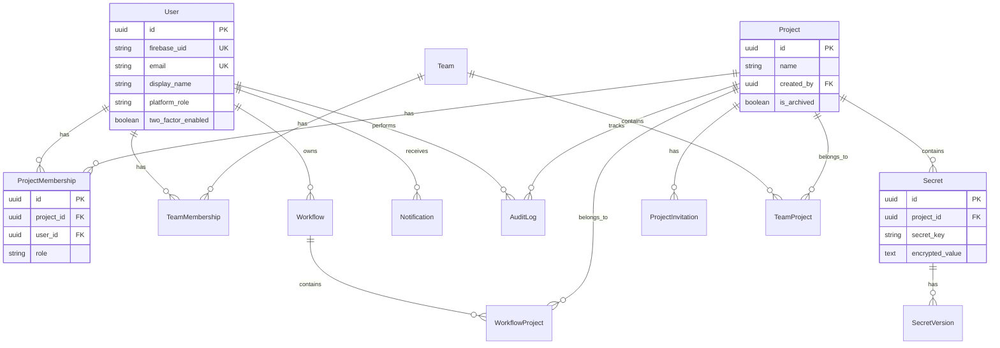
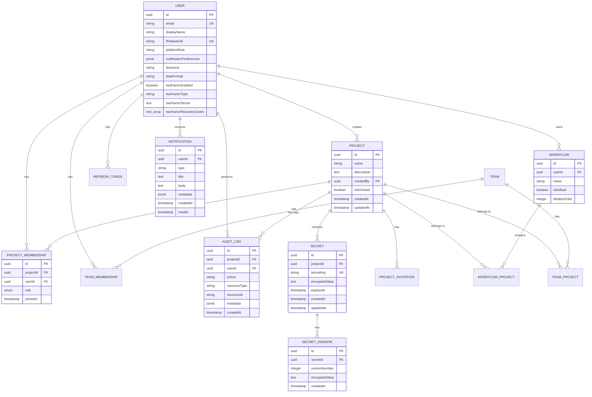

## Cloud Secrets Manager – Data Model & Database Diagrams

> Overview of relational schemas, key entities, relationships, and how they map to code.

### 1. Core Schemas

- **PostgreSQL**:
  - Users, teams, projects, memberships.
  - Secrets, versions, workflows, audit logs (if applicable).
  - 2FA-related columns and constraints.

### 2. Entity-Relationship Diagrams

- Logical ERD for:
  - Collaboration model (users/teams/projects).
  - Secrets model.
  - Audit/notification model.

### 3. Mapping to Code

- How JPA entities in `secret-service` map to DB tables.
- How `audit-service` and `notification-service` persist their data.

---

### 4. Detailed Schema (Conceptual)

The sections below summarise the schemas that are actually implemented in the Flyway migrations and used by the services.

#### 4.1 Users & Security

```sql
users (
  id                         UUID PRIMARY KEY,
  firebase_uid               VARCHAR(128) UNIQUE NOT NULL,
  email                      VARCHAR(255) UNIQUE NOT NULL,
  display_name               VARCHAR(255),
  avatar_url                 TEXT,
  platform_role              VARCHAR(20) DEFAULT 'USER',
  is_active                  BOOLEAN DEFAULT TRUE,
  notification_preferences   JSONB,
  timezone                   VARCHAR(64),
  date_format                VARCHAR(32),
  created_at                 TIMESTAMPTZ,
  updated_at                 TIMESTAMPTZ,

  two_factor_enabled         BOOLEAN NOT NULL DEFAULT FALSE,
  two_factor_type            VARCHAR(20),
  two_factor_secret          TEXT,
  two_factor_recovery_codes  TEXT[],
  two_factor_enabled_at      TIMESTAMPTZ,
  two_factor_last_verified_at TIMESTAMPTZ,
  pending_two_factor_secret  TEXT,
  pending_two_factor_created_at TIMESTAMPTZ
);
```

Mapped to `com.secrets.entity.User` and mirrored partially in notification-service.

#### 4.2 Projects, Teams, Memberships

```sql
projects (
  id           UUID PRIMARY KEY,
  name         VARCHAR(100) NOT NULL,
  description  TEXT,
  created_by   UUID REFERENCES users(id),
  is_archived  BOOLEAN DEFAULT FALSE,
  workflow_id  UUID NULL,
  created_at   TIMESTAMPTZ,
  updated_at   TIMESTAMPTZ
);

project_memberships (
  id           UUID PRIMARY KEY,
  project_id   UUID REFERENCES projects(id),
  user_id      UUID REFERENCES users(id),
  role         VARCHAR(32) NOT NULL,
  created_at   TIMESTAMPTZ,
  UNIQUE(project_id, user_id)
);
```

Teams and team memberships follow the same pattern (`teams`, `team_memberships`, `team_projects`).

#### 4.3 Secrets & Versions

```sql
secrets (
  id             UUID PRIMARY KEY,
  project_id     UUID REFERENCES projects(id),
  secret_key     VARCHAR(255) NOT NULL,
  encrypted_value TEXT NOT NULL,
  description    TEXT,
  expires_at     TIMESTAMPTZ,
  created_by     UUID REFERENCES users(id),
  created_at     TIMESTAMPTZ,
  updated_at     TIMESTAMPTZ,
  UNIQUE(project_id, secret_key)
);

secret_versions (
  id             UUID PRIMARY KEY,
  secret_id      UUID REFERENCES secrets(id),
  version_number INTEGER NOT NULL,
  encrypted_value TEXT NOT NULL,
  change_note    TEXT,
  created_by     UUID REFERENCES users(id),
  created_at     TIMESTAMPTZ,
  UNIQUE(secret_id, version_number)
);
```

The encryption logic lives in `TwoFactorService`/`EncryptionService`; the DB only stores encrypted blobs.

#### 4.4 Workflows

```sql
workflows (
  id          UUID PRIMARY KEY,
  owner_id    UUID REFERENCES users(id),
  name        VARCHAR(100) NOT NULL,
  description TEXT,
  created_at  TIMESTAMPTZ,
  updated_at  TIMESTAMPTZ
);

workflow_projects (
  id          UUID PRIMARY KEY,
  workflow_id UUID REFERENCES workflows(id),
  project_id  UUID REFERENCES projects(id),
  position    INTEGER,
  UNIQUE(workflow_id, project_id)
);
```

#### 4.5 Notifications

```sql
notifications (
  id          UUID PRIMARY KEY,
  user_id     UUID REFERENCES users(id),
  type        VARCHAR(64) NOT NULL,
  title       TEXT NOT NULL,
  body        TEXT,
  metadata    JSONB,
  created_at  TIMESTAMPTZ NOT NULL,
  read_at     TIMESTAMPTZ NULL
);
```

Used jointly by notification-service and secret-service (via proxy).

#### 4.6 Audit Logs

```sql
audit_logs (
  id            UUID PRIMARY KEY,
  project_id    UUID NULL,
  user_id       UUID NULL,
  action        VARCHAR(128) NOT NULL,
  resource_type VARCHAR(64),
  resource_id   VARCHAR(128),
  timestamp     TIMESTAMPTZ NOT NULL,
  metadata      JSONB
);
```

Owned exclusively by audit-service.

---

### 5. Entity-Relationship Diagrams

#### 5.1 Core Entity Relationships



#### 5.2 Collaboration Model

```text
User ───< ProjectMembership >─── Project
   └───< TeamMembership >─── Team
```

#### 5.3 Secrets Model

```text
Project ───< Secret ───< SecretVersion
```

#### 5.4 Notifications & Audit Model

```text
User ───< Notification

User ───< AuditLog >─── Project
```

#### 5.5 Project Lifecycle Workflow

```mermaid
flowchart TD
    A[User creates Project] --> B[Owner assigns to Workflow]
    B --> C[Owner invites collaborators]
    C -->|User exists| D[Direct membership + NotificationEvent(PROJECT_INVITATION)]
    C -->|User not registered| E[Pending ProjectInvitation + NotificationEvent(PROJECT_INVITATION)]

    D --> F[Member joins project immediately]
    E --> G[User signs up via Firebase/Identity]
    G --> H[Secret Service auto-accepts valid invitations]
    H --> I[ProjectMembership created]

    I --> J[Members manage secrets]
    J --> K[Secret expiration scheduler runs daily]
    K --> L[NotificationEvent(SECRET_EXPIRING_SOON) published]

    I --> M[Owners/Admins update roles]
    M --> N[NotificationEvent(ROLE_CHANGED) published]
```

### 4. Detailed Schema (Conceptual)

The sections below summarise the schemas that are actually implemented in the Flyway migrations and used by the services.

#### 4.1 Users & Security

```sql
users (
  id                         UUID PRIMARY KEY,
  firebase_uid               VARCHAR(128) UNIQUE NOT NULL,
  email                      VARCHAR(255) UNIQUE NOT NULL,
  display_name               VARCHAR(255),
  avatar_url                 TEXT,
  platform_role              VARCHAR(20) DEFAULT 'USER',
  is_active                  BOOLEAN DEFAULT TRUE,
  notification_preferences   JSONB,
  timezone                   VARCHAR(64),
  date_format                VARCHAR(32),
  created_at                 TIMESTAMPTZ,
  updated_at                 TIMESTAMPTZ,

  two_factor_enabled         BOOLEAN NOT NULL DEFAULT FALSE,
  two_factor_type            VARCHAR(20),
  two_factor_secret          TEXT,
  two_factor_recovery_codes  TEXT[],
  two_factor_enabled_at      TIMESTAMPTZ,
  two_factor_last_verified_at TIMESTAMPTZ,
  pending_two_factor_secret  TEXT,
  pending_two_factor_created_at TIMESTAMPTZ
);
```

Mapped to `com.secrets.entity.User` and mirrored partially in notification-service.

#### 4.2 Projects, Teams, Memberships

```sql
projects (
  id           UUID PRIMARY KEY,
  name         VARCHAR(100) NOT NULL,
  description  TEXT,
  created_by   UUID REFERENCES users(id),
  is_archived  BOOLEAN DEFAULT FALSE,
  workflow_id  UUID NULL,
  created_at   TIMESTAMPTZ,
  updated_at   TIMESTAMPTZ
);

project_memberships (
  id           UUID PRIMARY KEY,
  project_id   UUID REFERENCES projects(id),
  user_id      UUID REFERENCES users(id),
  role         VARCHAR(32) NOT NULL,
  created_at   TIMESTAMPTZ,
  UNIQUE(project_id, user_id)
);
```

Teams and team memberships follow the same pattern (`teams`, `team_memberships`, `team_projects`).

#### 4.3 Secrets & Versions

```sql
secrets (
  id             UUID PRIMARY KEY,
  project_id     UUID REFERENCES projects(id),
  secret_key     VARCHAR(255) NOT NULL,
  encrypted_value TEXT NOT NULL,
  description    TEXT,
  expires_at     TIMESTAMPTZ,
  created_by     UUID REFERENCES users(id),
  created_at     TIMESTAMPTZ,
  updated_at     TIMESTAMPTZ,
  UNIQUE(project_id, secret_key)
);

secret_versions (
  id             UUID PRIMARY KEY,
  secret_id      UUID REFERENCES secrets(id),
  version_number INTEGER NOT NULL,
  encrypted_value TEXT NOT NULL,
  change_note    TEXT,
  created_by     UUID REFERENCES users(id),
  created_at     TIMESTAMPTZ,
  UNIQUE(secret_id, version_number)
);
```

The encryption logic lives in `TwoFactorService`/`EncryptionService`; the DB only stores encrypted blobs.

#### 4.4 Workflows

```sql
workflows (
  id          UUID PRIMARY KEY,
  owner_id    UUID REFERENCES users(id),
  name        VARCHAR(100) NOT NULL,
  description TEXT,
  created_at  TIMESTAMPTZ,
  updated_at  TIMESTAMPTZ
);

workflow_projects (
  id          UUID PRIMARY KEY,
  workflow_id UUID REFERENCES workflows(id),
  project_id  UUID REFERENCES projects(id),
  position    INTEGER,
  UNIQUE(workflow_id, project_id)
);
```

#### 4.5 Notifications

```sql
notifications (
  id          UUID PRIMARY KEY,
  user_id     UUID REFERENCES users(id),
  type        VARCHAR(64) NOT NULL,
  title       TEXT NOT NULL,
  body        TEXT,
  metadata    JSONB,
  created_at  TIMESTAMPTZ NOT NULL,
  read_at     TIMESTAMPTZ NULL
);
```

Used jointly by notification-service and secret-service (via proxy).

#### 4.6 Audit Logs

```sql
audit_logs (
  id            UUID PRIMARY KEY,
  project_id    UUID NULL,
  user_id       UUID NULL,
  action        VARCHAR(128) NOT NULL,
  resource_type VARCHAR(64),
  resource_id   VARCHAR(128),
  timestamp     TIMESTAMPTZ NOT NULL,
  metadata      JSONB
);
```

Owned exclusively by audit-service.

---

### 5. Entity Relationship Diagrams

#### 5.1 Complete ERD (Mermaid)



#### 5.2 Textual ER Diagrams

**Collaboration Model:**
```text
User ───< ProjectMembership >─── Project
   └───< TeamMembership >─── Team
   └───< Workflow (owner)
```

**Secrets Model:**
```text
Project ───< Secret ───< SecretVersion
```

**Notifications & Audit:**
```text
User ───< Notification

User ───< AuditLog >─── Project
```
