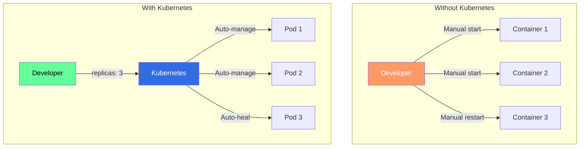
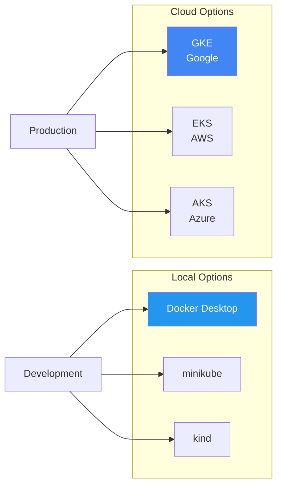
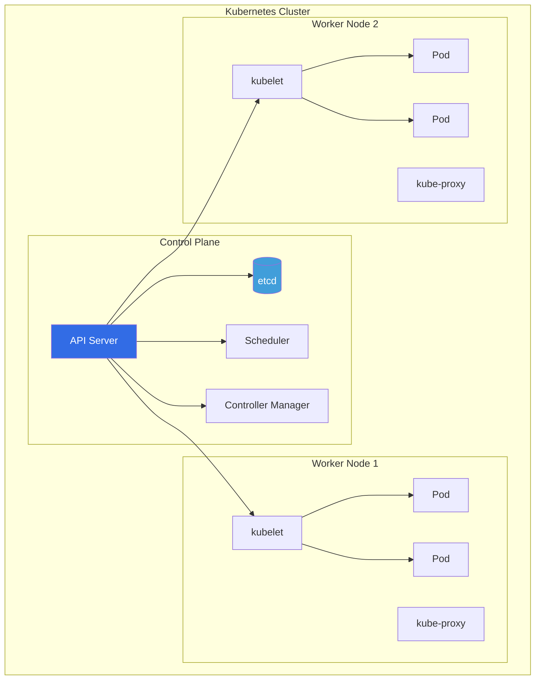
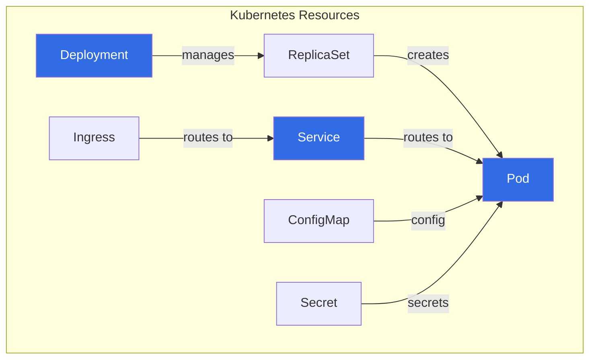
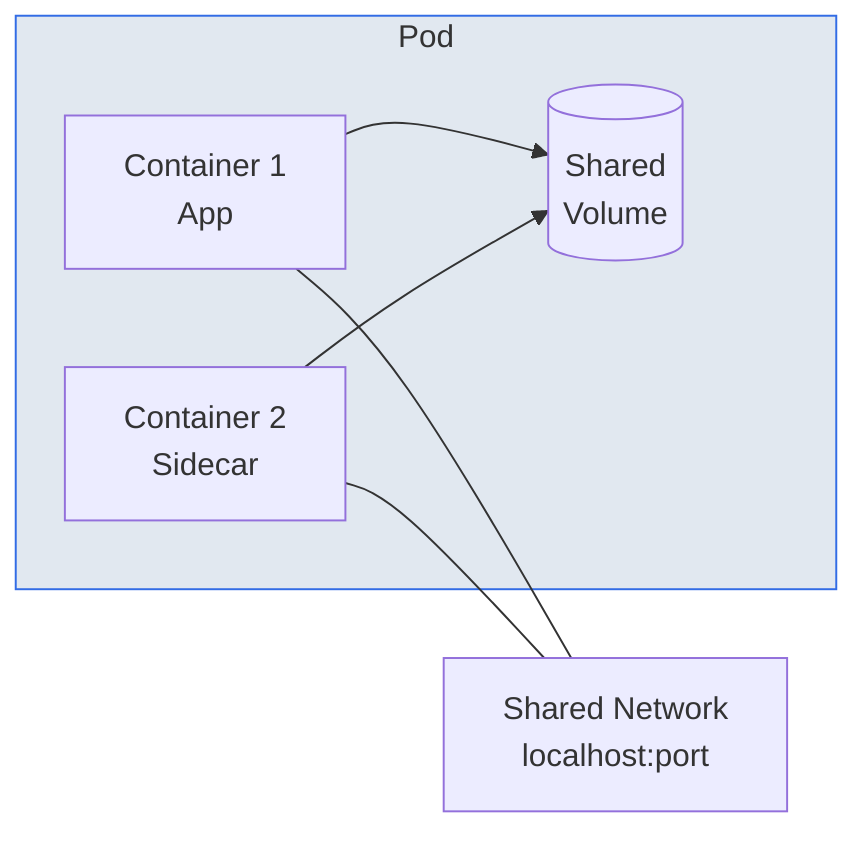
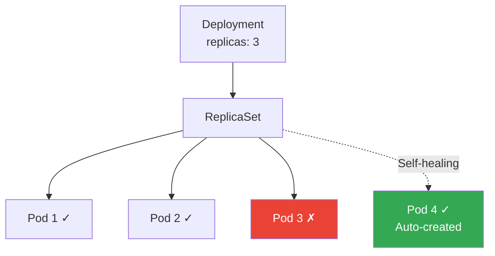
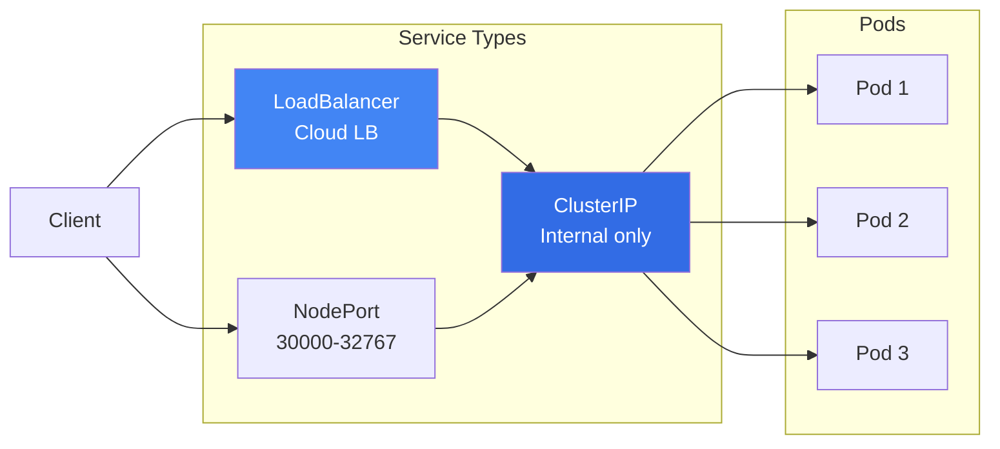
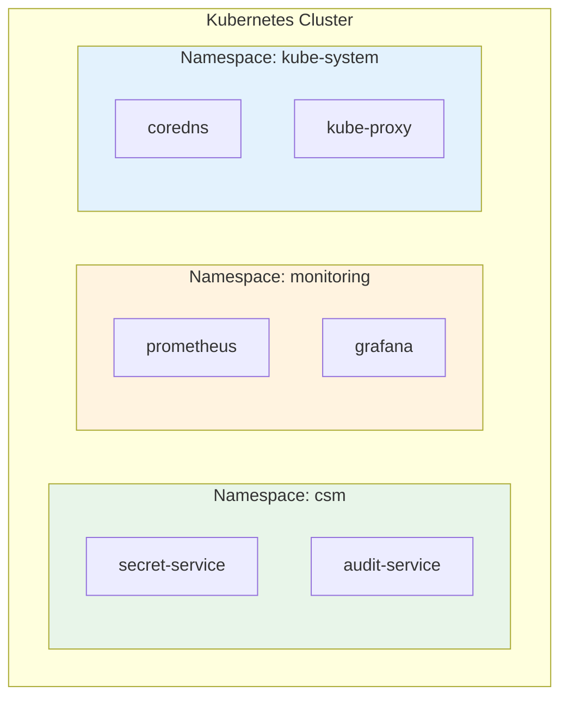
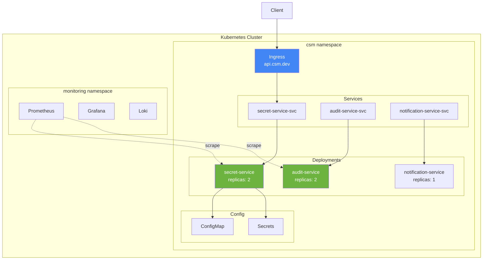
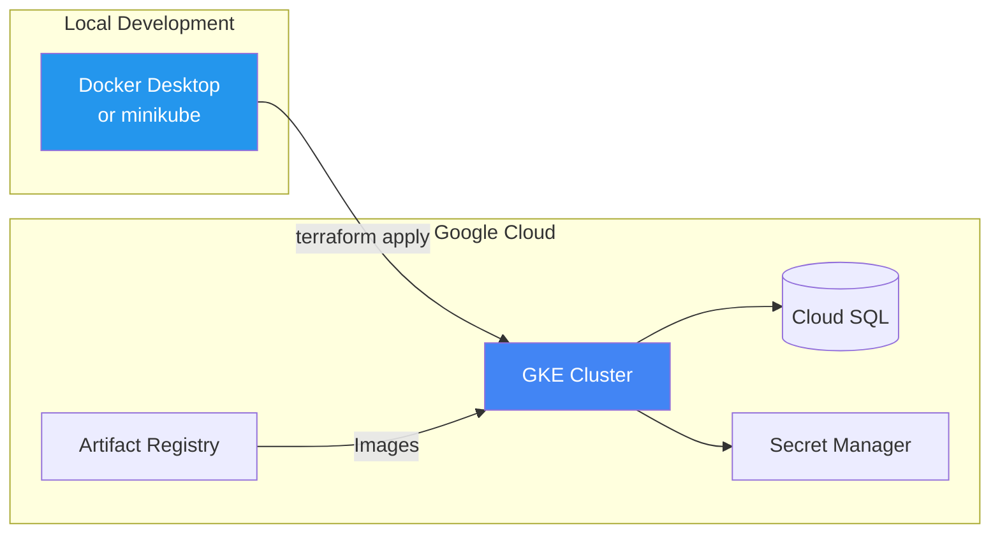

# Kubernetes 101: From Zero to Production

**Level:** Beginner  
**Time:** 3-4 hours  
**Prerequisites:** Basic command line, Docker basics

---

## Table of Contents
1. [What is Kubernetes?](#what-is-kubernetes)
2. [Local vs Cloud Kubernetes](#local-vs-cloud-kubernetes)
3. [Core Concepts](#core-concepts)
4. [Setting Up Local Kubernetes](#setting-up-local-kubernetes)
5. [Your First Deployment](#your-first-deployment)
6. [Hands-on Exercises](#hands-on-exercises)
7. [Cloud Secrets Manager on K8s](#cloud-secrets-manager-on-k8s)
8. [Moving to Cloud (GKE)](#moving-to-cloud-gke)
9. [Troubleshooting](#troubleshooting)

---

## What is Kubernetes?

**Kubernetes (K8s)** is an open-source container orchestration platform that automates deployment, scaling, and management of containerized applications.



### What Kubernetes Automates

| Feature | Description |
|---------|-------------|
| **Deployment** | Rolling out new versions with zero downtime |
| **Scaling** | Adding/removing instances based on demand |
| **Self-healing** | Restarting failed containers automatically |
| **Networking** | Service discovery and load balancing |
| **Storage** | Managing persistent volumes |
| **Configuration** | Secrets and ConfigMaps management |

---

## Local vs Cloud Kubernetes



### Comparison

| Feature | Local K8s | Cloud K8s (GKE) |
|---------|-----------|-----------------|
| **Control Plane** | On your machine | Managed by Google |
| **Nodes** | Your machine | GCP VMs |
| **Cost** | Free | ~$70/month + nodes |
| **Load Balancer** | NodePort only | Cloud LB included |
| **Storage** | Local volumes | Persistent Disks |
| **Best For** | Learning, dev | Production |

---

## Core Concepts

### Cluster Architecture



### Key Resources



### Pod - The Smallest Unit

A **Pod** is the smallest deployable unit containing one or more containers.



### Deployment - Managing Pods

A **Deployment** ensures the desired number of pod replicas are running.



### Service - Networking

A **Service** provides stable networking to pods.



### Namespace - Logical Isolation



---

## Setting Up Local Kubernetes

### Option 1: Docker Desktop (Easiest - Recommended for Mac/Windows)

1. **Install Docker Desktop**
   ```bash
   # Download from: https://www.docker.com/products/docker-desktop
   ```

2. **Enable Kubernetes**
   - Open Docker Desktop
   - Go to Settings → Kubernetes
   - Check "Enable Kubernetes"
   - Click "Apply & Restart"

3. **Verify Installation**
   ```bash
   kubectl version --client
   kubectl cluster-info
   kubectl get nodes
   ```

### Option 2: minikube (Cross-platform)

1. **Install minikube**
   ```bash
   # macOS
   brew install minikube
   
   # Linux
   curl -LO https://storage.googleapis.com/minikube/releases/latest/minikube-linux-amd64
   sudo install minikube-linux-amd64 /usr/local/bin/minikube
   ```

2. **Start minikube**
   ```bash
   minikube start
   minikube status
   ```

3. **Verify**
   ```bash
   kubectl get nodes
   ```

### Option 3: kind (Kubernetes in Docker)

1. **Install kind**
   ```bash
   # macOS
   brew install kind
   
   # Linux
   curl -Lo ./kind https://kind.sigs.k8s.io/dl/v0.20.0/kind-linux-amd64
   chmod +x ./kind
   sudo mv ./kind /usr/local/bin/kind
   ```

2. **Create cluster**
   ```bash
   kind create cluster --name learning
   kubectl cluster-info --context kind-learning
   ```

### Install kubectl (Kubernetes CLI)

```bash
# macOS
brew install kubectl

# Linux
curl -LO "https://dl.k8s.io/release/$(curl -L -s https://dl.k8s.io/release/stable.txt)/bin/linux/amd64/kubectl"
chmod +x kubectl
sudo mv kubectl /usr/local/bin/

# Verify
kubectl version --client
```

---

## Your First Deployment

Let's deploy a simple web application!

### Step 1: Create a Deployment

Create `hello-kubernetes.yaml`:

```yaml
apiVersion: apps/v1
kind: Deployment
metadata:
  name: hello-kubernetes
  labels:
    app: hello-kubernetes
spec:
  replicas: 3  # Run 3 instances
  selector:
    matchLabels:
      app: hello-kubernetes
  template:
    metadata:
      labels:
        app: hello-kubernetes
    spec:
      containers:
      - name: hello
        image: paulbouwer/hello-kubernetes:1.10
        ports:
        - containerPort: 8080
        resources:
          requests:
            memory: "64Mi"
            cpu: "100m"
          limits:
            memory: "128Mi"
            cpu: "200m"
```

### Step 2: Apply the Deployment

```bash
kubectl apply -f hello-kubernetes.yaml
```

### Step 3: Check Status

```bash
# See deployments
kubectl get deployments

# See pods
kubectl get pods

# See pod details
kubectl describe pod <pod-name>

# See pod logs
kubectl logs <pod-name>
```

### Step 4: Create a Service

Create `hello-service.yaml`:

```yaml
apiVersion: v1
kind: Service
metadata:
  name: hello-kubernetes-service
spec:
  type: NodePort  # Expose on node IP
  selector:
    app: hello-kubernetes
  ports:
  - port: 80
    targetPort: 8080
    nodePort: 30080  # Access on <node-ip>:30080
```

Apply it:
```bash
kubectl apply -f hello-service.yaml
kubectl get services
```

### Step 5: Access Your App

**Docker Desktop:**
```bash
# Get service URL
kubectl get service hello-kubernetes-service
# Access at: http://localhost:30080
```

**minikube:**
```bash
minikube service hello-kubernetes-service
```

**kind:**
```bash
# Port forward
kubectl port-forward service/hello-kubernetes-service 8080:80
# Access at: http://localhost:8080
```

---

## Hands-on Exercises

### Exercise 1: Scale Your Deployment

```bash
# Scale to 5 replicas
kubectl scale deployment hello-kubernetes --replicas=5

# Watch pods being created
kubectl get pods -w

# Scale back down
kubectl scale deployment hello-kubernetes --replicas=2
```

### Exercise 2: Update Your App

```bash
# Update the image
kubectl set image deployment/hello-kubernetes \
  hello=paulbouwer/hello-kubernetes:1.11

# Watch the rolling update
kubectl rollout status deployment/hello-kubernetes

# Check rollout history
kubectl rollout history deployment/hello-kubernetes

# Rollback if needed
kubectl rollout undo deployment/hello-kubernetes
```

### Exercise 3: Debug a Pod

```bash
# Get pod status
kubectl get pods

# Describe pod (see events, status)
kubectl describe pod <pod-name>

# View logs
kubectl logs <pod-name>

# Follow logs
kubectl logs -f <pod-name>

# Execute command in pod
kubectl exec -it <pod-name> -- /bin/sh
```

### Exercise 4: Create a Namespace

```bash
# Create namespace
kubectl create namespace development

# Deploy to namespace
kubectl apply -f hello-kubernetes.yaml -n development

# List pods in namespace
kubectl get pods -n development

# Switch default namespace
kubectl config set-context --current --namespace=development
```

### Exercise 5: Resource Limits

Update your deployment to include resource limits:

```yaml
resources:
  requests:
    memory: "128Mi"
    cpu: "100m"
  limits:
    memory: "256Mi"
    cpu: "500m"
```

Apply and test:
```bash
kubectl apply -f hello-kubernetes.yaml
kubectl top pods  # See resource usage
```

---

## Cloud Secrets Manager on K8s

This is how our project deploys to Kubernetes:

### Architecture



### Project K8s Files

```
infrastructure/
├── kubernetes/k8s/
│   ├── namespace.yaml           # CSM namespace
│   ├── secret-service-deployment.yaml
│   ├── audit-service-deployment.yaml
│   ├── ingress.yaml            # HTTP routing
│   ├── external-secrets.yaml   # Google Secret Manager sync
│   └── network-policies.yaml   # Pod security
│
└── helm/cloud-secrets-manager/
    ├── Chart.yaml
    ├── values.yaml             # Default config
    ├── values-staging.yaml
    └── values-production.yaml
```

### Deploy Locally with Helm

```bash
# Create namespace
kubectl create namespace csm

# Install with Helm
cd infrastructure/helm/cloud-secrets-manager
helm install csm . -n csm \
  --set postgres.enabled=true \
  --set cloudSql.enabled=false

# Check pods
kubectl get pods -n csm

# Port forward to test
kubectl port-forward svc/secret-service 8080:8080 -n csm
```

---

## Moving to Cloud (GKE)



### Key Differences

| Feature | Local | GKE |
|---------|-------|-----|
| Control Plane | On your machine | Managed by Google |
| Database | Local Postgres | Cloud SQL |
| Secrets | K8s Secrets | Google Secret Manager |
| Images | Local | Artifact Registry |
| Load Balancer | Port-forward | Cloud Load Balancer |
| Cost | Free | ~$70/month + nodes |

### Migration Checklist

- [ ] Understand local Kubernetes concepts
- [ ] Can deploy and manage apps locally
- [ ] Understand Services and Deployments
- [ ] Can debug pod issues
- [ ] Ready to learn GKE-specific features

**Next:** See [GKE 101](./05-GKE-101.md) for cloud deployment!

---

## Troubleshooting

### Pods Not Starting

```bash
# Check pod status
kubectl get pods

# Describe pod for events
kubectl describe pod <pod-name>

# Check logs
kubectl logs <pod-name>

# Common issues:
# - Image pull errors → Check image name/tag
# - Resource limits → Check node resources
# - CrashLoopBackOff → Check application logs
```

### Service Not Accessible

```bash
# Check service
kubectl get svc

# Check endpoints (pods behind service)
kubectl get endpoints

# Test service from inside cluster
kubectl run -it --rm debug --image=busybox --restart=Never -- wget -O- http://hello-kubernetes-service:80
```

### Resource Issues

```bash
# Check node resources
kubectl top nodes

# Check pod resources
kubectl top pods

# Describe node
kubectl describe node <node-name>
```

### Common Commands Cheat Sheet

```bash
# Get resources
kubectl get pods,svc,deployments

# Describe resource
kubectl describe <resource> <name>

# View logs
kubectl logs <pod-name> -f

# Execute command
kubectl exec -it <pod-name> -- <command>

# Port forward
kubectl port-forward <pod-name> <local-port>:<pod-port>

# Delete resource
kubectl delete <resource> <name>

# Apply YAML
kubectl apply -f <file.yaml>

# Edit resource
kubectl edit <resource> <name>
```

---

## Next Steps

1. ✅ Complete all exercises above
2. ✅ Deploy a multi-container application
3. ✅ Set up ConfigMaps and Secrets
4. ✅ Learn about Ingress
5. ✅ Move to [Helm 101](./02-HELM-101.md)

---

## Additional Resources

- [Kubernetes Official Docs](https://kubernetes.io/docs/)
- [Kubernetes Tutorials](https://kubernetes.io/docs/tutorials/)
- [Play with Kubernetes](https://labs.play-with-k8s.com/) - Free online playground
- [Kubernetes by Example](http://kubernetesbyexample.com/)

---

**Congratulations!** You now understand Kubernetes fundamentals. Time to learn [Helm](./02-HELM-101.md) to manage complex deployments!

