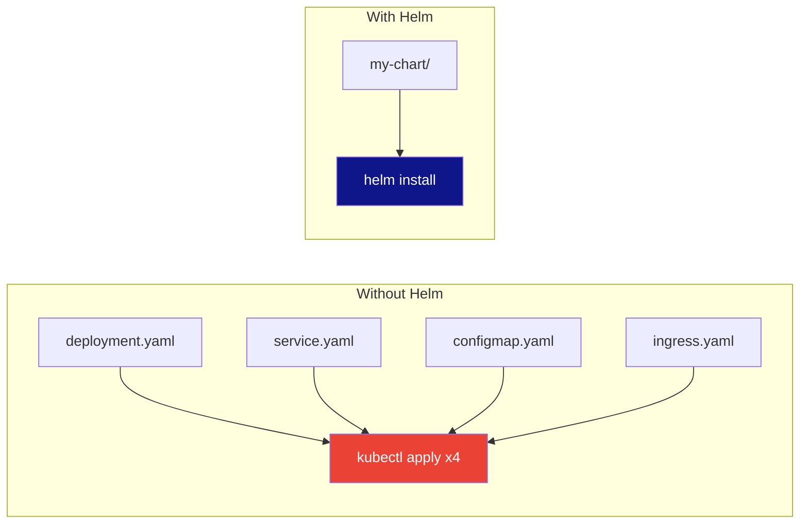
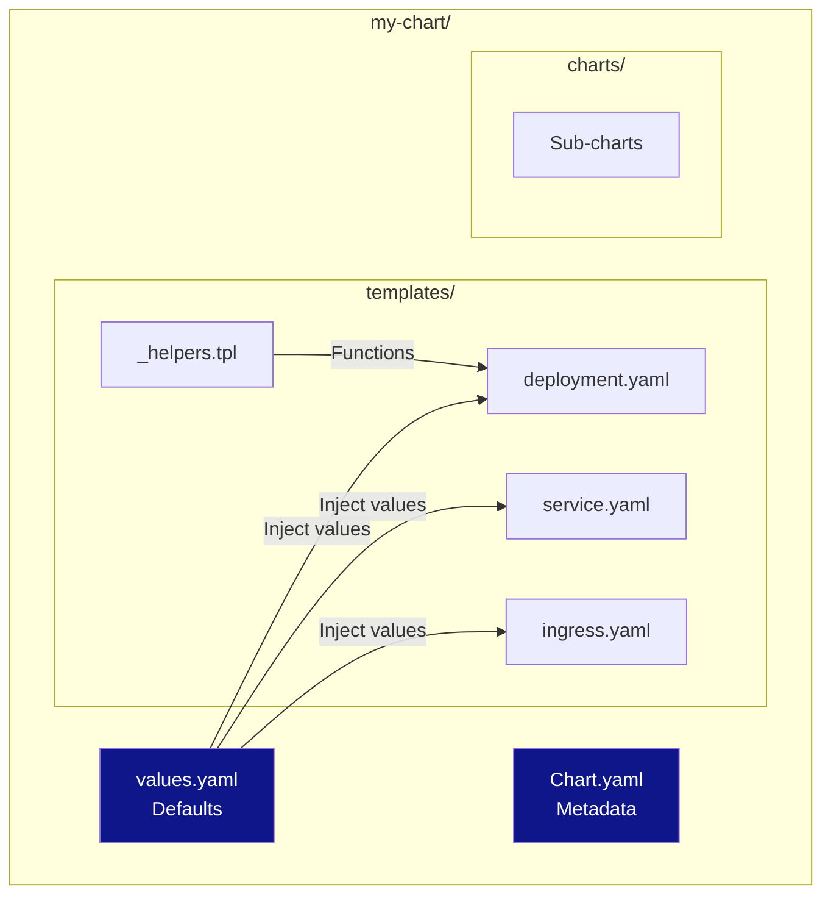
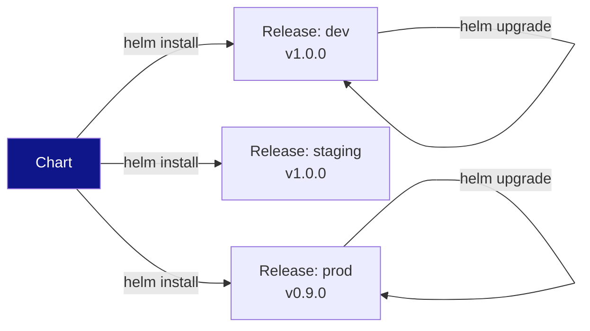
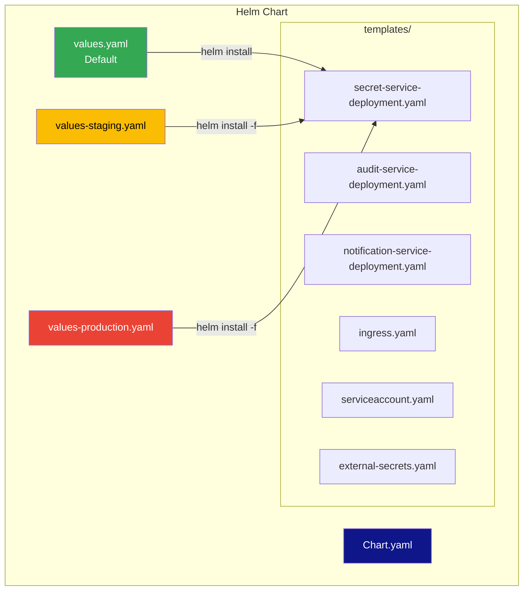
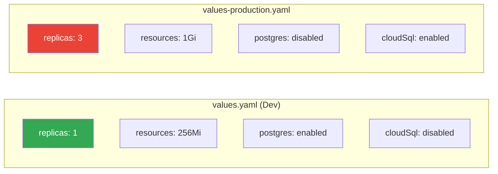

# Helm 101: Package Manager for Kubernetes

**Level:** Beginner  
**Time:** 2 hours  
**Prerequisites:** Kubernetes 101

---

## Table of Contents
1. [What is Helm?](#what-is-helm)
2. [Why Use Helm?](#why-use-helm)
3. [Core Concepts](#core-concepts)
4. [Installation](#installation)
5. [Using Existing Charts](#using-existing-charts)
6. [Creating Your First Chart](#creating-your-first-chart)
7. [Templates and Values](#templates-and-values)
8. [Cloud Secrets Manager Helm Chart](#cloud-secrets-manager-helm-chart)
9. [Hands-on Exercises](#hands-on-exercises)
10. [Best Practices](#best-practices)

---

## What is Helm?

**Helm** is the package manager for Kubernetes - think of it like `npm` for Node.js or `pip` for Python, but for Kubernetes applications.



### The Problem Helm Solves

**Without Helm:**
```bash
# Deploy an application
kubectl apply -f deployment.yaml
kubectl apply -f service.yaml
kubectl apply -f configmap.yaml
kubectl apply -f secret.yaml
kubectl apply -f ingress.yaml

# Update? Change values in 5 files, reapply all
# Rollback? Hope you saved the old files
# Share? Send 5 YAML files and instructions
```

**With Helm:**
```bash
# Deploy an application
helm install my-app ./my-chart

# Update
helm upgrade my-app ./my-chart --set image.tag=v2.0

# Rollback
helm rollback my-app

# Share
helm package ./my-chart
helm install my-app ./my-chart-1.0.0.tgz
```

---

## Why Use Helm?

### 1. **Template Management**
Instead of hardcoding values, use templates:
```yaml
# Without Helm (hardcoded)
replicas: 3
image: my-app:v1.0
port: 8080

# With Helm (templated)
replicas: {{ .Values.replicas }}
image: {{ .Values.image.repository }}:{{ .Values.image.tag }}
port: {{ .Values.service.port }}
```

### 2. **Versioning**
Track releases and rollback easily:
```bash
helm list                    # See all releases
helm history my-app          # See version history
helm rollback my-app 2       # Rollback to version 2
```

### 3. **Dependency Management**
Install complex apps with dependencies:
```yaml
dependencies:
  - name: postgresql
    version: 12.0.0
    repository: https://charts.bitnami.com/bitnami
  - name: redis
    version: 17.0.0
    repository: https://charts.bitnami.com/bitnami
```

### 4. **Reusability**
Share charts across teams and projects.

---

## Core Concepts

### Chart Structure



A **chart** is a collection of files that describe a Kubernetes application.

```
my-chart/
├── Chart.yaml          # Chart metadata
├── values.yaml         # Default values
├── templates/          # Kubernetes manifests (templated)
│   ├── deployment.yaml
│   ├── service.yaml
│   └── configmap.yaml
└── charts/             # Sub-charts (dependencies)
```

### Release Lifecycle



A **release** is an instance of a chart deployed to Kubernetes.

### Repository

A **repository** is a collection of charts (like npm registry).

- **Artifact Hub**: https://artifacthub.io (public charts)
- **Bitnami**: https://charts.bitnami.com/bitnami
- **Your own**: Private repository

---

## Installation

### macOS
```bash
brew install helm
```

### Linux
```bash
curl https://raw.githubusercontent.com/helm/helm/main/scripts/get-helm-3 | bash
```

### Windows
```powershell
choco install kubernetes-helm
```

### Verify Installation
```bash
helm version
```

---

## Using Existing Charts

### Search for Charts
```bash
# Search Artifact Hub
helm search hub nginx

# Search repositories you've added
helm search repo nginx
```

### Add a Repository
```bash
# Add Bitnami repository
helm repo add bitnami https://charts.bitnami.com/bitnami

# Update repository index
helm repo update

# List repositories
helm repo list
```

### Install a Chart
```bash
# Install nginx
helm install my-nginx bitnami/nginx

# Install with custom values
helm install my-nginx bitnami/nginx \
  --set service.type=LoadBalancer \
  --set replicaCount=3

# Install from values file
helm install my-nginx bitnami/nginx -f my-values.yaml
```

### Manage Releases
```bash
# List releases
helm list

# Get release info
helm status my-nginx

# Upgrade release
helm upgrade my-nginx bitnami/nginx --set replicaCount=5

# Uninstall release
helm uninstall my-nginx
```

---

## Creating Your First Chart

### Step 1: Create Chart Structure
```bash
helm create my-first-chart
cd my-first-chart
```

This creates:
```
my-first-chart/
├── Chart.yaml
├── values.yaml
├── charts/
├── templates/
│   ├── deployment.yaml
│   ├── service.yaml
│   ├── ingress.yaml
│   ├── _helpers.tpl
│   └── tests/
└── .helmignore
```

### Step 2: Understand Chart.yaml
```yaml
apiVersion: v2
name: my-first-chart
description: A Helm chart for my first application
type: application
version: 0.1.0
appVersion: "1.0"
```

### Step 3: Understand values.yaml
```yaml
replicaCount: 1

image:
  repository: nginx
  pullPolicy: IfNotPresent
  tag: ""

service:
  type: ClusterIP
  port: 80

ingress:
  enabled: false
  className: ""
  annotations: {}
  hosts:
    - host: chart-example.local
      paths:
        - path: /
          pathType: Prefix
```

### Step 4: Understand Templates

Look at `templates/deployment.yaml`:
```yaml
apiVersion: apps/v1
kind: Deployment
metadata:
  name: {{ include "my-first-chart.fullname" . }}
  labels:
    {{- include "my-first-chart.labels" . | nindent 4 }}
spec:
  replicas: {{ .Values.replicaCount }}
  selector:
    matchLabels:
      {{- include "my-first-chart.selectorLabels" . | nindent 6 }}
  template:
    metadata:
      labels:
        {{- include "my-first-chart.selectorLabels" . | nindent 8 }}
    spec:
      containers:
        - name: {{ .Chart.Name }}
          image: "{{ .Values.image.repository }}:{{ .Values.image.tag | default .Chart.AppVersion }}"
          ports:
            - containerPort: {{ .Values.service.port }}
```

### Step 5: Install Your Chart
```bash
# Install
helm install my-app .

# Check status
helm status my-app

# List resources
kubectl get all -l app.kubernetes.io/instance=my-app
```

---

## Templates and Values

### Template Syntax

Helm uses Go templates with special functions:

```yaml
# Variables
{{ .Values.replicaCount }}
{{ .Chart.Name }}
{{ .Release.Name }}

# Conditionals
{{- if .Values.ingress.enabled }}
apiVersion: networking.k8s.io/v1
kind: Ingress
{{- end }}

# Loops
{{- range .Values.env }}
- name: {{ .name }}
  value: {{ .value }}
{{- end }}

# Functions
{{ include "mychart.fullname" . }}
{{ .Values.image.tag | default "latest" }}
{{ .Values.name | upper }}
```

### Helper Functions

`templates/_helpers.tpl` contains reusable templates:

```yaml
{{/*
Common labels
*/}}
{{- define "mychart.labels" -}}
app.kubernetes.io/name: {{ include "mychart.name" . }}
app.kubernetes.io/instance: {{ .Release.Name }}
{{- end }}

{{/*
Create the name of the service account to use
*/}}
{{- define "mychart.serviceAccountName" -}}
{{- if .Values.serviceAccount.create }}
{{- default (include "mychart.fullname" .) .Values.serviceAccount.name }}
{{- else }}
{{- default "default" .Values.serviceAccount.name }}
{{- end }}
{{- end }}
```

### Values Hierarchy

Values can come from multiple sources (last one wins):

1. `values.yaml` (default)
2. `-f values-prod.yaml` (file)
3. `--set key=value` (command line)

```bash
helm install my-app . \
  -f values.yaml \
  -f values-prod.yaml \
  --set replicaCount=5
```

---

## Hands-on Exercises

### Exercise 1: Install and Customize a Chart

```bash
# Add repository
helm repo add bitnami https://charts.bitnami.com/bitnami
helm repo update

# Install WordPress
helm install my-wordpress bitnami/wordpress

# Get credentials
helm get notes my-wordpress

# Customize
helm upgrade my-wordpress bitnami/wordpress \
  --set wordpressUsername=admin \
  --set wordpressPassword=MySecurePassword123 \
  --set service.type=LoadBalancer
```

### Exercise 2: Create a Custom Chart

```bash
# Create chart
helm create my-app

# Edit values.yaml
# Edit templates/deployment.yaml

# Test template rendering (dry-run)
helm install my-app . --dry-run --debug

# Install
helm install my-app .

# Upgrade
helm upgrade my-app . --set replicaCount=3
```

### Exercise 3: Use Values Files

Create `values-dev.yaml`:
```yaml
replicaCount: 1
image:
  tag: "dev"
ingress:
  enabled: false
```

Create `values-prod.yaml`:
```yaml
replicaCount: 3
image:
  tag: "prod"
ingress:
  enabled: true
  hosts:
    - host: myapp.example.com
```

Install:
```bash
helm install my-app . -f values-dev.yaml
helm install my-app-prod . -f values-prod.yaml
```

### Exercise 4: Rollback

```bash
# Make a bad change
helm upgrade my-app . --set image.tag=broken

# Check status
helm status my-app

# Rollback
helm rollback my-app

# Rollback to specific version
helm rollback my-app 2
```

### Exercise 5: Package and Share

```bash
# Package chart
helm package my-app

# Creates: my-app-0.1.0.tgz

# Install from package
helm install my-app ./my-app-0.1.0.tgz

# Create index for repository
helm repo index . --url https://my-charts.example.com
```

---

## Best Practices

### 1. Use Semantic Versioning
```yaml
version: 1.2.3  # Major.Minor.Patch
```

### 2. Document Values
```yaml
# values.yaml
replicaCount: 1  # Number of replicas to run

image:
  repository: nginx  # Container image repository
  tag: "1.21"        # Container image tag
```

### 3. Use Helper Templates
Create reusable templates in `_helpers.tpl`:
```yaml
{{- define "mychart.fullname" -}}
{{- printf "%s-%s" .Release.Name .Chart.Name | trunc 63 | trimSuffix "-" }}
{{- end }}
```

### 4. Validate Templates
```bash
# Lint chart
helm lint my-app

# Dry-run
helm install my-app . --dry-run --debug

# Test with different values
helm install my-app . --dry-run --debug -f values-prod.yaml
```

### 5. Use Named Templates
Instead of repeating code:
```yaml
{{- define "mychart.labels" -}}
app: {{ .Chart.Name }}
version: {{ .Chart.AppVersion }}
{{- end }}

# Use it
metadata:
  labels:
    {{- include "mychart.labels" . | nindent 4 }}
```

### 6. Environment-Specific Values
```
charts/
├── Chart.yaml
├── values.yaml          # Defaults
├── values-dev.yaml      # Development
├── values-staging.yaml  # Staging
└── values-prod.yaml     # Production
```

---

## Cloud Secrets Manager Helm Chart

### Our Chart Architecture



### Chart Structure

```
infrastructure/helm/cloud-secrets-manager/
├── Chart.yaml              # Chart metadata
├── values.yaml             # Default (development)
├── values-staging.yaml     # Staging overrides
├── values-production.yaml  # Production overrides
└── templates/
    ├── _helpers.tpl                    # Template functions
    ├── secret-service-deployment.yaml  # Main API
    ├── audit-service-deployment.yaml   # Audit logging
    ├── notification-service-deployment.yaml
    ├── ingress.yaml                    # HTTP routing
    ├── serviceaccount.yaml             # Workload Identity
    └── databases.yaml                  # PostgreSQL
```

### Environment Values Comparison



### Example values.yaml

```yaml
# Default values (development)
global:
  environment: development
  projectId: cloud-secrets-manager

secretService:
  replicas: 1
  image:
    repository: gcr.io/cloud-secrets-manager/secret-service
    tag: latest
  resources:
    requests:
      memory: "256Mi"
      cpu: "100m"
    limits:
      memory: "512Mi"
      cpu: "500m"

# Local PostgreSQL for development
postgres:
  enabled: true
  
# Cloud SQL for production  
cloudSql:
  enabled: false
  connectionName: ""

# Workload Identity
googleIdentity:
  enabled: false  # true in production
```

### Deploy Commands

```bash
cd infrastructure/helm/cloud-secrets-manager

# Development (local K8s)
helm install csm . -n csm --create-namespace

# Staging
helm install csm . -n csm \
  -f values-staging.yaml

# Production
helm install csm . -n csm \
  -f values-production.yaml \
  --set secretService.image.tag=v1.2.3

# Upgrade existing release
helm upgrade csm . -n csm \
  --set secretService.replicas=3

# Rollback if issues
helm rollback csm 1 -n csm

# Check status
helm status csm -n csm
helm list -n csm
```

---

## Next Steps

1. ✅ Create your own chart
2. ✅ Use values files for different environments
3. ✅ Learn about chart dependencies
4. ✅ Move to [Terraform 101](./03-TERRAFORM-101.md) for infrastructure

---

## Additional Resources

- [Helm Official Docs](https://helm.sh/docs/)
- [Helm Chart Best Practices](https://helm.sh/docs/chart_best_practices/)
- [Artifact Hub](https://artifacthub.io/) - Find charts
- [Helm Chart Template Guide](https://helm.sh/docs/chart_template_guide/)

---

**Great job!** You now understand Helm. Next, learn [Terraform](./03-TERRAFORM-101.md) to manage your cloud infrastructure!

