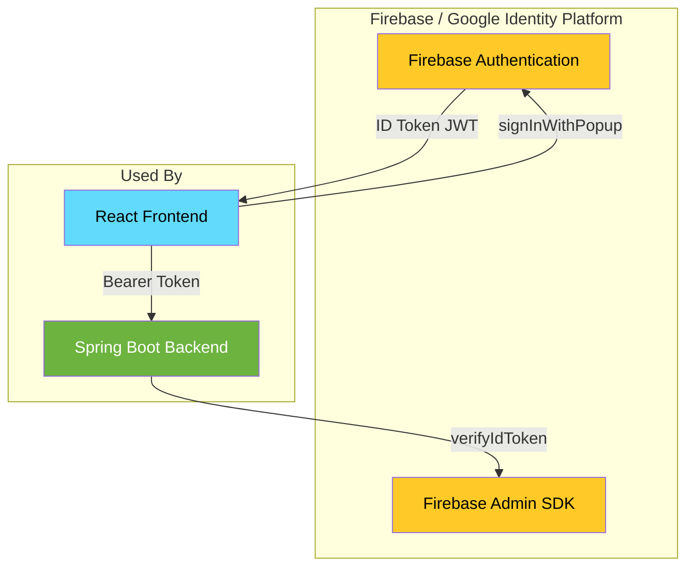
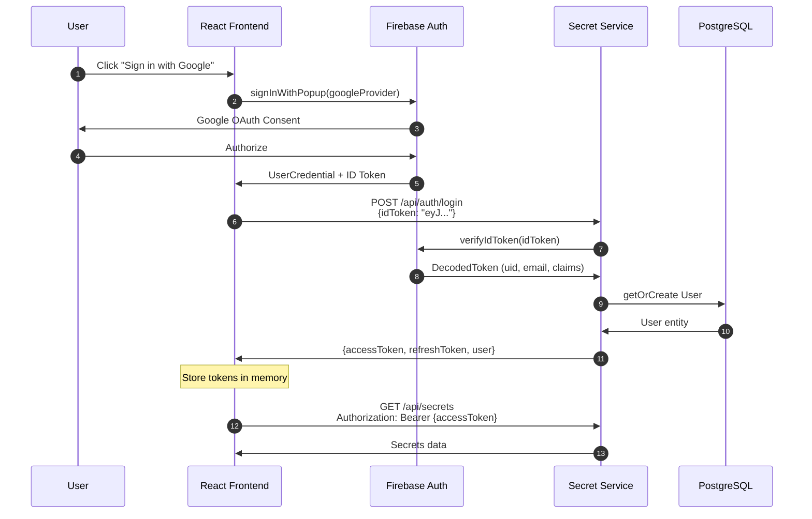
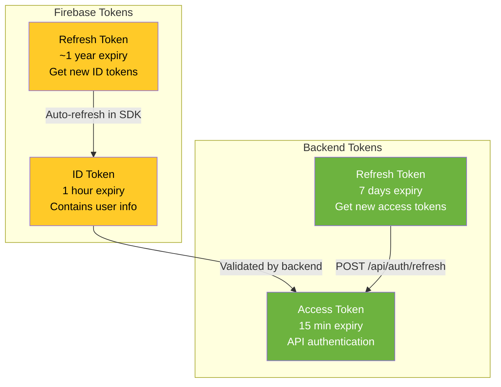
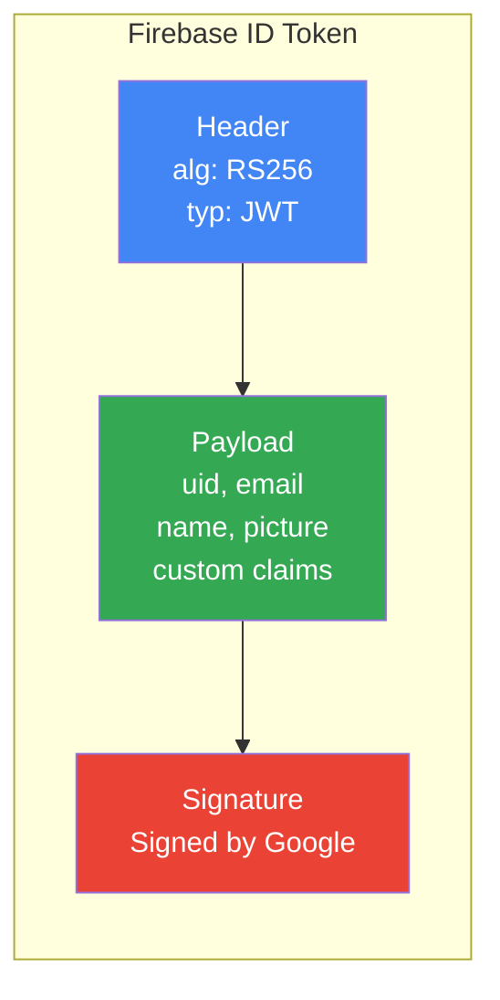
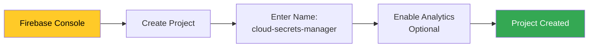
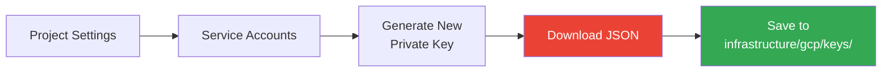
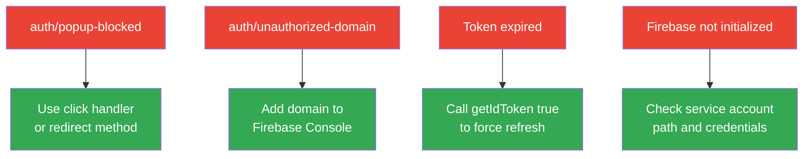

# Firebase Fundamentals for Cloud Secrets Manager

**Level:** Beginner to Intermediate  
**Time:** 2-3 hours  
**Prerequisites:** Basic JavaScript/TypeScript knowledge

---

## Table of Contents

1. [What is Firebase?](#1-what-is-firebase)
2. [Authentication Architecture](#2-authentication-architecture)
3. [Setting Up Firebase](#3-setting-up-firebase)
4. [Frontend Integration](#4-frontend-integration)
5. [Backend Integration](#5-backend-integration)
6. [Custom Claims & RBAC](#6-custom-claims--rbac)
7. [Hands-on Exercises](#7-hands-on-exercises)
8. [Troubleshooting](#8-troubleshooting)

---

## 1. What is Firebase?

Firebase is Google's **Backend-as-a-Service (BaaS)** platform. In Cloud Secrets Manager, we use **Firebase Authentication** (via Google Identity Platform) for user identity.

### Firebase Products Used in This Project



### Why Firebase for Authentication?

| Feature | Benefit |
|---------|---------|
| **Managed Service** | No password storage, Google handles security |
| **Multiple Providers** | Google, Email, Phone, GitHub, etc. |
| **Token-based** | Stateless authentication with JWTs |
| **Custom Claims** | Built-in RBAC support |
| **Free Tier** | 50K authentications/month free |

---

## 2. Authentication Architecture

### Complete Authentication Flow



### Token Types Explained



### ID Token Structure (JWT)



**Example Decoded Payload:**
```json
{
  "iss": "https://securetoken.google.com/cloud-secrets-manager",
  "aud": "cloud-secrets-manager",
  "sub": "abc123xyz",
  "email": "user@example.com",
  "email_verified": true,
  "name": "John Doe",
  "picture": "https://...",
  "iat": 1701936000,
  "exp": 1701939600,
  "roles": ["USER"],
  "platformRole": "USER"
}
```

---

## 3. Setting Up Firebase

### Step 1: Create Firebase Project



1. Go to [Firebase Console](https://console.firebase.google.com)
2. Click **"Create a project"**
3. Name: `cloud-secrets-manager`
4. Enable/Disable Google Analytics
5. Click **Create project**

### Step 2: Enable Google Sign-In

1. Go to **Authentication** → **Sign-in method**
2. Click **Google**
3. Toggle **Enable**
4. Set support email
5. **Save**

### Step 3: Get Web App Config

1. Go to **Project Settings** → **Your apps**
2. Click **Web** icon (`</>`)
3. Register app name
4. Copy the config:

```javascript
// Save these to apps/frontend/.env.local
VITE_FIREBASE_API_KEY=AIzaSy...
VITE_FIREBASE_AUTH_DOMAIN=cloud-secrets-manager.firebaseapp.com
VITE_FIREBASE_PROJECT_ID=cloud-secrets-manager
VITE_FIREBASE_STORAGE_BUCKET=cloud-secrets-manager.appspot.com
VITE_FIREBASE_MESSAGING_SENDER_ID=123456789
VITE_FIREBASE_APP_ID=1:123456789:web:abc123
```

### Step 4: Generate Service Account Key (Backend)



1. Go to **Project Settings** → **Service accounts**
2. Click **"Generate new private key"**
3. Save as `infrastructure/gcp/keys/firebase-admin-key.json`

> ⚠️ **NEVER commit this file to git!** It's in `.gitignore`

---

## 4. Frontend Integration

### Project Files

```
apps/frontend/src/
├── config/
│   └── firebase.ts          # Firebase initialization
├── services/
│   └── firebase-auth.ts     # Auth methods
├── contexts/
│   └── AuthContext.tsx      # React context
└── pages/
    └── Login.tsx            # Login UI
```

### Firebase Initialization

```typescript
// apps/frontend/src/config/firebase.ts
import { initializeApp } from 'firebase/app';
import { getAuth, GoogleAuthProvider } from 'firebase/auth';

const firebaseConfig = {
  apiKey: import.meta.env.VITE_FIREBASE_API_KEY,
  authDomain: import.meta.env.VITE_FIREBASE_AUTH_DOMAIN,
  projectId: import.meta.env.VITE_FIREBASE_PROJECT_ID,
  storageBucket: import.meta.env.VITE_FIREBASE_STORAGE_BUCKET,
  messagingSenderId: import.meta.env.VITE_FIREBASE_MESSAGING_SENDER_ID,
  appId: import.meta.env.VITE_FIREBASE_APP_ID,
};

const app = initializeApp(firebaseConfig);
export const auth = getAuth(app);
export const googleProvider = new GoogleAuthProvider();

googleProvider.setCustomParameters({
  prompt: 'select_account',  // Always show account picker
});
```

### Auth Service

```typescript
// apps/frontend/src/services/firebase-auth.ts
import { signInWithPopup, signOut, onAuthStateChanged } from 'firebase/auth';
import { auth, googleProvider } from '@/config/firebase';

export const firebaseAuthService = {
  // Google Sign-In
  async signInWithGoogle(persistent = false): Promise<string> {
    const result = await signInWithPopup(auth, googleProvider);
    return await result.user.getIdToken();
  },

  // Sign Out
  async signOut(): Promise<void> {
    await signOut(auth);
  },

  // Get current token
  async getIdToken(forceRefresh = false): Promise<string | null> {
    const user = auth.currentUser;
    if (!user) return null;
    return await user.getIdToken(forceRefresh);
  },

  // Listen to auth state
  onAuthStateChanged(callback: (user: any) => void) {
    return onAuthStateChanged(auth, callback);
  },

  // Check if Firebase is configured
  isFirebaseEnabled(): boolean {
    return !!(
      import.meta.env.VITE_FIREBASE_API_KEY &&
      import.meta.env.VITE_FIREBASE_AUTH_DOMAIN &&
      import.meta.env.VITE_FIREBASE_PROJECT_ID
    );
  }
};
```

### Usage in React

```typescript
// Example Login Component
const LoginPage = () => {
  const { loginWithGoogle, isLoading } = useAuth();
  
  const handleGoogleLogin = async () => {
    try {
      await loginWithGoogle();
      // Redirected to /home on success
    } catch (error) {
      console.error('Login failed:', error);
    }
  };

  return (
    <button onClick={handleGoogleLogin} disabled={isLoading}>
      Sign in with Google
    </button>
  );
};
```

---

## 5. Backend Integration

### Project Files

```
apps/backend/secret-service/src/main/java/com/secrets/
├── config/
│   └── FirebaseConfig.java           # SDK initialization
├── security/
│   ├── GoogleIdentityTokenValidator.java  # Token validation
│   ├── JwtAuthenticationFilter.java       # Security filter
│   └── JwtTokenProvider.java              # Local JWT issuing
└── service/
    └── FirebaseClaimsService.java    # Custom claims
```

### Firebase Admin SDK Initialization

```java
// apps/backend/secret-service/src/main/java/com/secrets/config/FirebaseConfig.java
@Configuration
public class FirebaseConfig {

    @Value("${google.cloud.identity.enabled:false}")
    private boolean enabled;

    @Value("${google.cloud.identity.project-id:}")
    private String projectId;

    @Value("${google.cloud.identity.service-account-path:}")
    private String serviceAccountPath;

    @PostConstruct
    public void initialize() {
        if (!enabled) return;

        try {
            if (FirebaseApp.getApps().isEmpty()) {
                InputStream serviceAccount = new FileInputStream(serviceAccountPath);
                
                FirebaseOptions options = FirebaseOptions.builder()
                    .setCredentials(GoogleCredentials.fromStream(serviceAccount))
                    .setProjectId(projectId)
                    .build();

                FirebaseApp.initializeApp(options);
                log.info("Firebase Admin SDK initialized for: {}", projectId);
            }
        } catch (IOException e) {
            log.error("Failed to initialize Firebase", e);
        }
    }

    @Bean
    @ConditionalOnProperty(name = "google.cloud.identity.enabled", havingValue = "true")
    public FirebaseAuth firebaseAuth() {
        return FirebaseAuth.getInstance();
    }
}
```

### Token Validation

```java
// apps/backend/secret-service/src/main/java/com/secrets/security/GoogleIdentityTokenValidator.java
@Component
public class GoogleIdentityTokenValidator {

    @Autowired(required = false)
    private FirebaseAuth firebaseAuth;
    
    public Authentication validateToken(String idToken) throws FirebaseAuthException {
        if (firebaseAuth == null) {
            throw new IllegalStateException("Firebase not initialized");
        }

        // Verify token with Firebase
        FirebaseToken decodedToken = firebaseAuth.verifyIdToken(idToken);
        
        String uid = decodedToken.getUid();
        String email = decodedToken.getEmail();
        
        // Extract custom claims for RBAC
        Map<String, Object> claims = decodedToken.getClaims();
        List<String> roles = (List<String>) claims.getOrDefault("roles", List.of("USER"));

        // Build Spring Security authorities
        List<GrantedAuthority> authorities = roles.stream()
            .map(role -> new SimpleGrantedAuthority("ROLE_" + role))
            .collect(Collectors.toList());

        UserDetails userDetails = new User(email, "", authorities);
        
        UsernamePasswordAuthenticationToken auth = 
            new UsernamePasswordAuthenticationToken(userDetails, idToken, authorities);
        auth.setDetails(decodedToken);
        
        return auth;
    }
}
```

### Configuration

```yaml
# apps/backend/secret-service/src/main/resources/application.yml
google:
  cloud:
    identity:
      enabled: ${GOOGLE_IDENTITY_ENABLED:true}
      project-id: ${GOOGLE_PROJECT_ID:cloud-secrets-manager}
      service-account-path: ${GOOGLE_SERVICE_ACCOUNT_PATH:infrastructure/gcp/keys/firebase-admin-key.json}
```

---

## 6. Custom Claims & RBAC

### How Custom Claims Work

```mermaid
graph TB
    subgraph "Admin Action"
        ADMIN[Admin User]
        API[POST /api/admin/users/{id}/role]
    end
    
    subgraph "Backend"
        SVC[FirebaseClaimsService]
        FB_SDK[Firebase Admin SDK]
    end
    
    subgraph "Firebase"
        USER_REC[User Record]
        CLAIMS[Custom Claims:<br/>roles, platformRole]
    end
    
    subgraph "User's Next Login"
        NEW_TOKEN[New ID Token<br/>includes claims]
    end
    
    ADMIN --> API
    API --> SVC
    SVC --> FB_SDK
    FB_SDK --> USER_REC
    USER_REC --> CLAIMS
    CLAIMS -.->|Next token refresh| NEW_TOKEN
    
    style CLAIMS fill:#FFCA28,color:#000
    style NEW_TOKEN fill:#34A853,color:#fff
```

### Setting Custom Claims

```java
// apps/backend/secret-service/src/main/java/com/secrets/service/FirebaseClaimsService.java
@Service
public class FirebaseClaimsService {

    private final FirebaseAuth firebaseAuth;

    public void setUserRoles(String uid, List<String> roles) throws FirebaseAuthException {
        Map<String, Object> claims = new HashMap<>();
        claims.put("roles", roles);
        claims.put("platformRole", roles.contains("PLATFORM_ADMIN") ? "PLATFORM_ADMIN" : "USER");
        claims.put("updatedAt", System.currentTimeMillis());
        
        firebaseAuth.setCustomUserClaims(uid, claims);
    }

    public void promoteToAdmin(String uid) throws FirebaseAuthException {
        setUserRoles(uid, List.of("PLATFORM_ADMIN", "USER"));
    }

    public void demoteToUser(String uid) throws FirebaseAuthException {
        setUserRoles(uid, List.of("USER"));
    }
}
```

### Reading Claims in Frontend

```typescript
// Get claims from token
const getUserClaims = async () => {
  const user = auth.currentUser;
  if (!user) return null;
  
  const tokenResult = await user.getIdTokenResult();
  return {
    roles: tokenResult.claims.roles as string[],
    platformRole: tokenResult.claims.platformRole as string,
  };
};

// Force refresh to get updated claims
const refreshClaims = async () => {
  const user = auth.currentUser;
  if (user) {
    await user.getIdToken(true);  // true = force refresh
  }
};
```

### Claim Limitations

| Constraint | Limit |
|------------|-------|
| Total claims size | 1000 bytes |
| Reserved prefixes | `firebase`, `google`, `oidc` |
| Propagation | Requires token refresh |

---

## 7. Hands-on Exercises

### Exercise 1: Test Authentication Flow

```bash
# 1. Start services
cd docker
docker compose up --build

# 2. Open frontend
open http://localhost:5173

# 3. Click "Sign in with Google"
# 4. Check browser console for token
# 5. Check backend logs for validation
docker logs csm-backend 2>&1 | grep -i firebase
```

### Exercise 2: Decode ID Token

```javascript
// In browser console after login
const user = firebase.auth().currentUser;
const token = await user.getIdToken();

// Decode (don't do this in production - just for learning)
const payload = JSON.parse(atob(token.split('.')[1]));
console.log('Token payload:', payload);
```

### Exercise 3: Test Token Refresh

```javascript
// Get fresh token
const freshToken = await user.getIdToken(true);

// Compare with old token
console.log('Token changed:', freshToken !== oldToken);
```

### Exercise 4: View Custom Claims

```javascript
const tokenResult = await user.getIdTokenResult();
console.log('Custom claims:', tokenResult.claims);
// Should show: { roles: ["USER"], platformRole: "USER", ... }
```

---

## 8. Troubleshooting

### Common Errors



### Error: "Firebase not initialized"

**Backend logs show:**
```
Firebase service account file not found
```

**Solution:**
```bash
# Check file exists
ls -la infrastructure/gcp/keys/firebase-admin-key.json

# Check environment variable
echo $GOOGLE_SERVICE_ACCOUNT_PATH

# For Docker, check volume mount in docker-compose.yml
```

### Error: "auth/popup-blocked"

**Solution:**
```typescript
// Trigger from user click (not programmatically)
<button onClick={() => signInWithPopup(auth, googleProvider)}>
  Sign In
</button>

// Or use redirect instead
import { signInWithRedirect } from 'firebase/auth';
signInWithRedirect(auth, googleProvider);
```

### Error: "auth/unauthorized-domain"

**Solution:**
1. Go to Firebase Console → Authentication → Settings
2. Add domain to "Authorized domains"
3. Add: `localhost`, your production domain

### Debug: View Token in Backend

```java
// Add to JwtAuthenticationFilter for debugging
log.debug("Received token: {}", jwt.substring(0, 50) + "...");
log.debug("Token valid: {}", authentication != null);
```

---

## Quick Reference

### Environment Variables

```bash
# Frontend (.env.local)
VITE_FIREBASE_API_KEY=...
VITE_FIREBASE_AUTH_DOMAIN=...
VITE_FIREBASE_PROJECT_ID=...

# Backend (docker/.env)
GOOGLE_IDENTITY_ENABLED=true
GOOGLE_PROJECT_ID=cloud-secrets-manager
GOOGLE_SERVICE_ACCOUNT_PATH=/app/firebase-admin-key.json
```

### Key Files

| File | Purpose |
|------|---------|
| `apps/frontend/src/config/firebase.ts` | Firebase init |
| `apps/frontend/src/services/firebase-auth.ts` | Auth methods |
| `apps/backend/.../config/FirebaseConfig.java` | Admin SDK init |
| `apps/backend/.../security/GoogleIdentityTokenValidator.java` | Token validation |
| `infrastructure/gcp/keys/firebase-admin-key.json` | Service account (gitignored) |

### Common Commands

```bash
# Check Firebase initialization
docker logs csm-backend 2>&1 | grep -i firebase

# Test backend health
curl http://localhost:8080/actuator/health

# Verify token in API call
curl -H "Authorization: Bearer <token>" http://localhost:8080/api/secrets
```

---

## Next Steps

1. **Complete all exercises** above
2. **Read** [05-GKE-101.md](./05-GKE-101.md) for Kubernetes deployment
3. **Review** [08-SECURITY-SECRETS-101.md](./08-SECURITY-SECRETS-101.md) for security best practices
4. **Practice** setting custom claims for different user roles

---

**Document Version:** 2.0  
**Last Updated:** December 7, 2025
