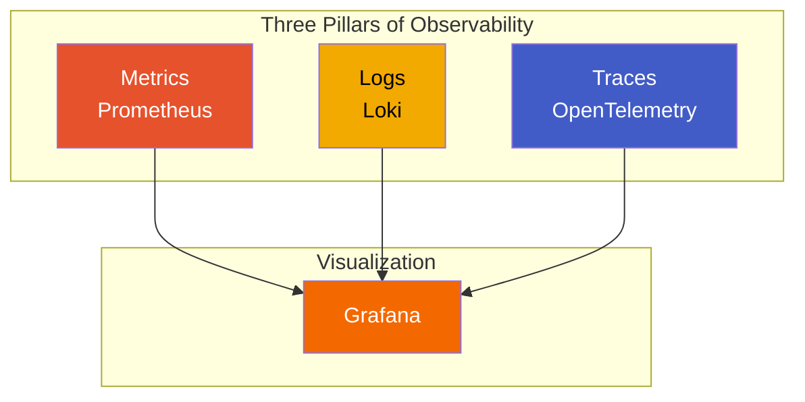
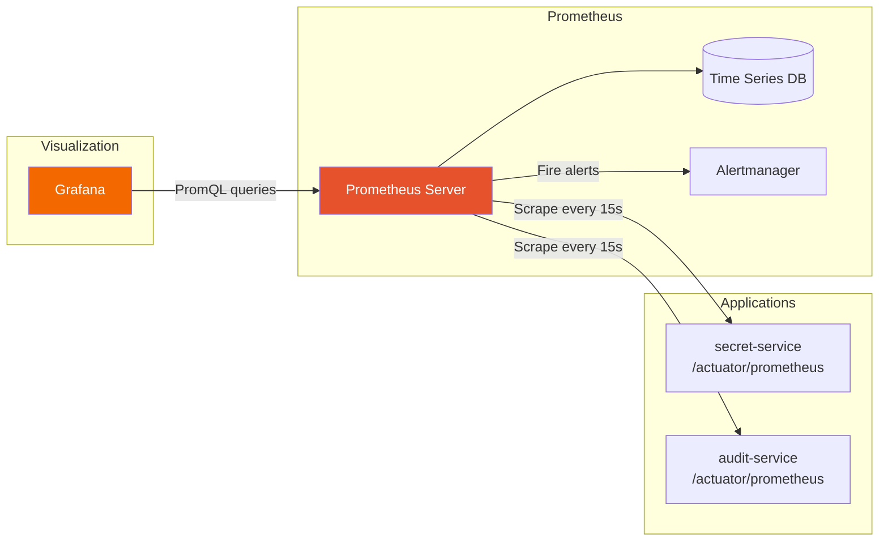
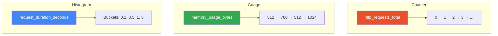
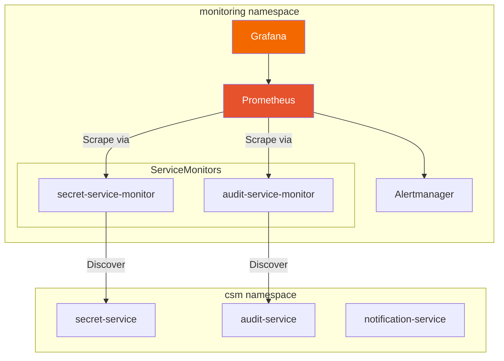

# Prometheus & Grafana 101: Monitoring and Observability

**Level:** Intermediate  
**Time:** 3 hours  
**Prerequisites:** Kubernetes 101, Helm 101

---

## Table of Contents
1. [What is Monitoring?](#what-is-monitoring)
2. [Prometheus Overview](#prometheus-overview)
3. [Grafana Overview](#grafana-overview)
4. [Core Concepts](#core-concepts)
5. [Setting Up Locally](#setting-up-locally)
6. [Instrumenting Applications](#instrumenting-applications)
7. [Creating Dashboards](#creating-dashboards)
8. [Alerting](#alerting)
9. [Cloud Secrets Manager Monitoring](#cloud-secrets-manager-monitoring)
10. [Hands-on Exercises](#hands-on-exercises)

---

## What is Monitoring?



**Monitoring** is observing your application's behavior to:
- **Detect problems** before users do
- **Understand performance** bottlenecks
- **Track business metrics** (requests, errors, latency)
- **Plan capacity** based on trends
- **Debug issues** faster

---

## Prometheus Overview

**Prometheus** is a time-series database and monitoring system.

### Architecture



### Metrics Types



1. **Counter**: Always increases (total requests)
2. **Gauge**: Can go up or down (CPU usage, memory)
3. **Histogram**: Distribution of values (request duration)
4. **Summary**: Similar to histogram, with quantiles

---

## Grafana Overview

**Grafana** is a visualization and analytics platform.

### Key Features

- **Dashboards**: Visualize metrics
- **Alerts**: Notify on thresholds
- **Data Sources**: Prometheus, CloudWatch, etc.
- **Panels**: Graphs, tables, gauges
- **Templating**: Dynamic dashboards

### How It Works

```
Prometheus (Data Source)
    ↓
Grafana
    ↓ (queries PromQL)
Dashboard Panels
    ↓
Visualizations (Graphs, Tables, etc.)
```

---

## Core Concepts

### 1. Metrics

A **metric** is a measurement with:
- **Name**: `http_requests_total`
- **Labels**: `{method="GET", status="200"}`
- **Value**: `1234`
- **Timestamp**: `2024-01-15T10:30:00Z`

**Example:**
```
http_requests_total{method="GET", status="200"} 1234
http_requests_total{method="POST", status="500"} 5
```

### 2. Scraping

**Scraping** is how Prometheus collects metrics:

```yaml
scrape_configs:
  - job_name: 'my-app'
    scrape_interval: 15s
    static_configs:
      - targets: ['localhost:8080']
```

### 3. PromQL

**PromQL** is Prometheus Query Language:

```promql
# Count total requests
http_requests_total

# Filter by label
http_requests_total{status="200"}

# Rate over time
rate(http_requests_total[5m])

# Sum by label
sum(http_requests_total) by (method)
```

### 4. Dashboards

A **dashboard** is a collection of panels showing different metrics.

---

## Setting Up Locally

### Option 1: Docker Compose (Easiest)

Create `docker-compose.yml`:

```yaml
version: '3.8'

services:
  prometheus:
    image: prom/prometheus:latest
    ports:
      - "9090:9090"
    volumes:
      - ./prometheus.yml:/etc/prometheus/prometheus.yml
      - prometheus-data:/prometheus
    command:
      - '--config.file=/etc/prometheus/prometheus.yml'
      - '--storage.tsdb.path=/prometheus'

  grafana:
    image: grafana/grafana:latest
    ports:
      - "3000:3000"
    volumes:
      - grafana-data:/var/lib/grafana
    environment:
      - GF_SECURITY_ADMIN_PASSWORD=admin
    depends_on:
      - prometheus

volumes:
  prometheus-data:
  grafana-data:
```

Create `prometheus.yml`:

```yaml
global:
  scrape_interval: 15s
  evaluation_interval: 15s

scrape_configs:
  - job_name: 'prometheus'
    static_configs:
      - targets: ['localhost:9090']
  
  - job_name: 'my-app'
    static_configs:
      - targets: ['host.docker.internal:8080']
```

Start:
```bash
docker-compose up -d
```

Access:
- Prometheus: http://localhost:9090
- Grafana: http://localhost:3000 (admin/admin)

### Option 2: Kubernetes (Local)

Create `prometheus-deployment.yaml`:

```yaml
apiVersion: apps/v1
kind: Deployment
metadata:
  name: prometheus
spec:
  replicas: 1
  selector:
    matchLabels:
      app: prometheus
  template:
    metadata:
      labels:
        app: prometheus
    spec:
      containers:
      - name: prometheus
        image: prom/prometheus:latest
        ports:
        - containerPort: 9090
        volumeMounts:
        - name: config
          mountPath: /etc/prometheus
      volumes:
      - name: config
        configMap:
          name: prometheus-config
---
apiVersion: v1
kind: Service
metadata:
  name: prometheus
spec:
  selector:
    app: prometheus
  ports:
  - port: 9090
    targetPort: 9090
  type: NodePort
```

Create ConfigMap:
```bash
kubectl create configmap prometheus-config \
  --from-file=prometheus.yml
```

Deploy:
```bash
kubectl apply -f prometheus-deployment.yaml
kubectl port-forward service/prometheus 9090:9090
```

---

## Instrumenting Applications

### Java (Spring Boot)

**Add dependency** (`pom.xml`):
```xml
<dependency>
    <groupId>io.micrometer</groupId>
    <artifactId>micrometer-registry-prometheus</artifactId>
</dependency>
```

**Configure** (`application.yml`):
```yaml
management:
  endpoints:
    web:
      exposure:
        include: prometheus,health,metrics
  metrics:
    export:
      prometheus:
        enabled: true
```

**Access metrics:**
```
http://localhost:8080/actuator/prometheus
```

### Node.js

**Install:**
```bash
npm install prom-client
```

**Use:**
```javascript
const promClient = require('prom-client');

// Create a counter
const httpRequestsTotal = new promClient.Counter({
  name: 'http_requests_total',
  help: 'Total number of HTTP requests',
  labelNames: ['method', 'status']
});

// Increment
httpRequestsTotal.inc({ method: 'GET', status: '200' });

// Expose metrics endpoint
app.get('/metrics', async (req, res) => {
  res.set('Content-Type', promClient.register.contentType);
  res.end(await promClient.register.metrics());
});
```

### Python

**Install:**
```bash
pip install prometheus-client
```

**Use:**
```python
from prometheus_client import Counter, start_http_server

# Create a counter
http_requests_total = Counter(
    'http_requests_total',
    'Total number of HTTP requests',
    ['method', 'status']
)

# Increment
http_requests_total.labels(method='GET', status='200').inc()

# Start metrics server
start_http_server(8000)
```

---

## Creating Dashboards

### Step 1: Add Prometheus Data Source

1. Open Grafana: http://localhost:3000
2. Go to **Configuration → Data Sources**
3. Click **Add data source**
4. Select **Prometheus**
5. URL: `http://prometheus:9090` (or `http://localhost:9090`)
6. Click **Save & Test**

### Step 2: Create Dashboard

1. Go to **Dashboards → New Dashboard**
2. Click **Add visualization**
3. Select **Prometheus** data source
4. Enter PromQL query:
   ```promql
   rate(http_requests_total[5m])
   ```
5. Customize visualization
6. Click **Apply**

### Step 3: Common Queries

**Request Rate:**
```promql
rate(http_requests_total[5m])
```

**Error Rate:**
```promql
rate(http_requests_total{status=~"5.."}[5m])
```

**95th Percentile Latency:**
```promql
histogram_quantile(0.95, rate(http_request_duration_seconds_bucket[5m]))
```

**CPU Usage:**
```promql
100 - (avg(irate(container_cpu_usage_seconds_total[5m])) * 100)
```

**Memory Usage:**
```promql
container_memory_usage_bytes / container_spec_memory_limit_bytes * 100
```

---

## Alerting

### Prometheus Alerts

Create `alerts.yml`:

```yaml
groups:
  - name: example
    interval: 30s
    rules:
      - alert: HighErrorRate
        expr: rate(http_requests_total{status=~"5.."}[5m]) > 0.05
        for: 5m
        labels:
          severity: critical
        annotations:
          summary: "High error rate detected"
          description: "Error rate is {{ $value }} requests/second"
      
      - alert: HighLatency
        expr: histogram_quantile(0.95, rate(http_request_duration_seconds_bucket[5m])) > 1
        for: 5m
        labels:
          severity: warning
        annotations:
          summary: "High latency detected"
          description: "95th percentile latency is {{ $value }}s"
```

Update `prometheus.yml`:
```yaml
rule_files:
  - "alerts.yml"

alerting:
  alertmanagers:
    - static_configs:
        - targets: ['alertmanager:9093']
```

### Grafana Alerts

1. Create panel in dashboard
2. Click **Edit**
3. Go to **Alert** tab
4. Create alert rule:
   - Condition: `WHEN avg() OF query(A, 5m, now) IS ABOVE 100`
   - Evaluate every: `1m`
   - For: `5m`
5. Add notification channel
6. Save

---

## Hands-on Exercises

### Exercise 1: Monitor a Simple App

1. **Create a simple HTTP server** (Node.js example):
```javascript
const express = require('express');
const promClient = require('prom-client');

const app = express();
const register = new promClient.Registry();

// Metrics
const httpRequestsTotal = new promClient.Counter({
  name: 'http_requests_total',
  help: 'Total HTTP requests',
  labelNames: ['method', 'status'],
  registers: [register]
});

const httpRequestDuration = new promClient.Histogram({
  name: 'http_request_duration_seconds',
  help: 'HTTP request duration',
  labelNames: ['method'],
  registers: [register]
});

// Middleware
app.use((req, res, next) => {
  const start = Date.now();
  res.on('finish', () => {
    const duration = (Date.now() - start) / 1000;
    httpRequestDuration.labels(req.method).observe(duration);
    httpRequestsTotal.inc({ method: req.method, status: res.statusCode });
  });
  next();
});

// Routes
app.get('/', (req, res) => res.send('Hello!'));
app.get('/metrics', async (req, res) => {
  res.set('Content-Type', register.contentType);
  res.end(await register.metrics());
});

app.listen(8080);
```

2. **Start Prometheus** (docker-compose)
3. **Configure Prometheus** to scrape `localhost:8080`
4. **Create Grafana dashboard** with:
   - Request rate
   - Error rate
   - Request duration

### Exercise 2: Monitor Kubernetes

**Install Prometheus Operator:**
```bash
kubectl create namespace monitoring
helm repo add prometheus-community https://prometheus-community.github.io/helm-charts
helm install prometheus prometheus-community/kube-prometheus-stack \
  --namespace monitoring
```

**Access:**
```bash
kubectl port-forward -n monitoring svc/prometheus-grafana 3000:80
# Login: admin/prom-operator
```

### Exercise 3: Create Custom Metrics

**Add business metrics:**
```javascript
const ordersTotal = new promClient.Counter({
  name: 'orders_total',
  help: 'Total orders',
  labelNames: ['product', 'status']
});

const revenue = new promClient.Gauge({
  name: 'revenue_dollars',
  help: 'Total revenue'
});

// Use in your app
ordersTotal.inc({ product: 'widget', status: 'completed' });
revenue.set(1234.56);
```

### Exercise 4: Set Up Alerts

1. **Create alert rules** in Prometheus
2. **Configure Alertmanager** to send notifications
3. **Test alerts** by triggering conditions
4. **Create Grafana alerts** for dashboard panels

---

## Cloud Secrets Manager Monitoring

### Our Monitoring Stack



### ServiceMonitor Configuration

```yaml
# infrastructure/monitoring/servicemonitors/secret-service-monitor.yaml
apiVersion: monitoring.coreos.com/v1
kind: ServiceMonitor
metadata:
  name: secret-service-monitor
  namespace: monitoring
  labels:
    release: prometheus
spec:
  selector:
    matchLabels:
      app: secret-service
  namespaceSelector:
    matchNames:
      - csm
  endpoints:
    - port: http
      path: /actuator/prometheus
      interval: 15s
```

### Key Metrics We Track

```yaml
# infrastructure/monitoring/alerts/prometheus-rules.yaml
groups:
  - name: csm-alerts
    rules:
      # High error rate
      - alert: HighErrorRate
        expr: |
          sum(rate(http_server_requests_seconds_count{status=~"5.."}[5m])) 
          / sum(rate(http_server_requests_seconds_count[5m])) > 0.05
        for: 5m
        labels:
          severity: critical
        annotations:
          summary: "High error rate detected"
      
      # High latency
      - alert: HighLatency
        expr: |
          histogram_quantile(0.95, 
            rate(http_server_requests_seconds_bucket[5m])
          ) > 2
        for: 5m
        labels:
          severity: warning
      
      # Pod not ready
      - alert: PodNotReady
        expr: |
          kube_pod_status_ready{namespace="csm"} == 0
        for: 5m
        labels:
          severity: critical
```

### Deploy Monitoring Stack

```bash
# Add Prometheus community Helm repo
helm repo add prometheus-community \
  https://prometheus-community.github.io/helm-charts
helm repo update

# Install kube-prometheus-stack
helm install prometheus prometheus-community/kube-prometheus-stack \
  -n monitoring --create-namespace \
  -f infrastructure/monitoring/prometheus-values.yaml

# Apply ServiceMonitors
kubectl apply -f infrastructure/monitoring/servicemonitors/

# Apply Alert Rules
kubectl apply -f infrastructure/monitoring/alerts/

# Access Grafana
kubectl port-forward -n monitoring svc/prometheus-grafana 3000:80
# Login: admin / prom-operator

# Access Prometheus
kubectl port-forward -n monitoring svc/prometheus-kube-prometheus-prometheus 9090:9090
```

### Useful PromQL Queries

```promql
# Request rate by service
sum(rate(http_server_requests_seconds_count[5m])) by (application)

# Error rate percentage
sum(rate(http_server_requests_seconds_count{status=~"5.."}[5m])) 
/ sum(rate(http_server_requests_seconds_count[5m])) * 100

# 95th percentile latency
histogram_quantile(0.95, 
  sum(rate(http_server_requests_seconds_bucket[5m])) by (le, application)
)

# Memory usage by pod
container_memory_usage_bytes{namespace="csm"} 
/ container_spec_memory_limit_bytes{namespace="csm"} * 100

# CPU usage by pod  
rate(container_cpu_usage_seconds_total{namespace="csm"}[5m]) * 100
```

---

## Best Practices

### 1. Use Meaningful Metric Names
```promql
# ❌ Bad
counter1
metric_xyz

# ✅ Good
http_requests_total
database_connection_pool_size
```

### 2. Use Labels Wisely
- Don't create high-cardinality labels (user IDs, etc.)
- Use labels for dimensions you'll query by
- Keep label values bounded

### 3. Set Appropriate Scrape Intervals
- High-frequency metrics: 15s
- Standard metrics: 30s-1m
- Low-frequency metrics: 5m

### 4. Monitor the Four Golden Signals
- **Latency**: Request duration
- **Traffic**: Request rate
- **Errors**: Error rate
- **Saturation**: Resource usage

### 5. Use Recording Rules
Pre-compute expensive queries:
```yaml
groups:
  - name: recording_rules
    interval: 30s
    rules:
      - record: http:requests:rate5m
        expr: rate(http_requests_total[5m])
```

---

## Common PromQL Queries

```promql
# Request rate
rate(http_requests_total[5m])

# Error percentage
sum(rate(http_requests_total{status=~"5.."}[5m])) / 
sum(rate(http_requests_total[5m])) * 100

# Top 10 endpoints by request rate
topk(10, sum(rate(http_requests_total[5m])) by (endpoint))

# CPU usage percentage
100 - (avg(irate(container_cpu_usage_seconds_total[5m])) * 100)

# Memory usage percentage
(container_memory_usage_bytes / container_spec_memory_limit_bytes) * 100

# Request duration (p95)
histogram_quantile(0.95, rate(http_request_duration_seconds_bucket[5m]))
```

---

## Next Steps

1. ✅ Set up Prometheus and Grafana locally
2. ✅ Instrument your application
3. ✅ Create dashboards
4. ✅ Set up alerts
5. ✅ Deploy to Kubernetes

---

## Additional Resources

- [Prometheus Docs](https://prometheus.io/docs/)
- [PromQL Guide](https://prometheus.io/docs/prometheus/latest/querying/basics/)
- [Grafana Docs](https://grafana.com/docs/)
- [Prometheus Best Practices](https://prometheus.io/docs/practices/)

---

**Great work!** You now understand monitoring. Check out [Firebase 101](./05-FIREBASE-101.md) for authentication!

