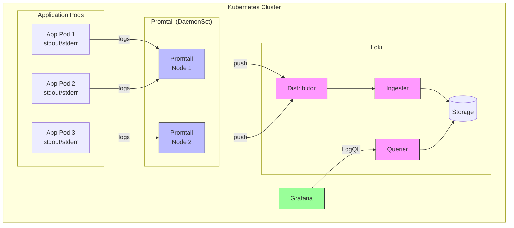

# Loki & Promtail 101 - Centralized Logging

**Last Updated:** December 5, 2025  
**Difficulty:** Intermediate  
**Prerequisites:** Kubernetes 101, Helm 101

---

## Table of Contents

1. [What is Loki?](#what-is-loki)
2. [Why Use Loki?](#why-use-loki)
3. [Core Concepts](#core-concepts)
4. [Architecture Overview](#architecture-overview)
5. [Local Setup](#local-setup)
6. [Hands-On Exercises](#hands-on-exercises)
7. [LogQL Query Language](#logql-query-language)
8. [Cloud Deployment](#cloud-deployment)
9. [Best Practices](#best-practices)
10. [Troubleshooting](#troubleshooting)

---

## What is Loki?

**Loki** is a horizontally-scalable, highly-available, multi-tenant log aggregation system inspired by Prometheus. It's designed to be cost-effective and easy to operate.

**Key Characteristics:**
- **Like Prometheus, but for logs** - Uses similar label-based indexing
- **Cost-effective** - Only indexes metadata, not full log content
- **Kubernetes-native** - Designed for cloud-native environments
- **Multi-tenant** - Supports multiple isolated tenants

**Promtail** is the agent that ships logs to Loki. It runs on every node and collects logs from pods.

---

## Why Use Loki?

### Traditional Logging vs Loki

**Traditional (ELK Stack):**
```
Application → Filebeat → Elasticsearch → Kibana
- Indexes full log content (expensive)
- Complex to operate
- High resource usage
```

**Loki Approach:**
```
Application → Promtail → Loki → Grafana
- Indexes only labels (cheap)
- Simple to operate
- Low resource usage
```

### Benefits

1. **Cost-Effective**
   - Only indexes metadata (labels)
   - Stores logs as compressed chunks
   - 10x cheaper than Elasticsearch

2. **Simple to Operate**
   - Single binary deployment
   - No complex sharding
   - Easy to scale

3. **Kubernetes-Native**
   - Automatic label extraction from K8s metadata
   - Service discovery built-in
   - Works seamlessly with Prometheus

4. **Unified Observability**
   - Same labels as Prometheus metrics
   - Integrated with Grafana
   - Correlate logs with metrics and traces

---

## Core Concepts

### 1. Labels

Labels are key-value pairs that identify log streams:

```
{namespace="production", service="api", level="error"}
```

**Important:** Only index high-cardinality labels (namespace, service, level)
**Don't index:** User IDs, request IDs, timestamps

### 2. Log Streams

A log stream is a unique combination of labels:

```
Stream 1: {service="api", level="info"}
Stream 2: {service="api", level="error"}
Stream 3: {service="worker", level="info"}
```

### 3. Chunks

Logs are compressed and stored in chunks:
- Chunk size: ~1MB compressed
- Retention: Configurable (e.g., 30 days)
- Storage: Filesystem, S3, GCS

### 4. LogQL

Query language for searching logs:

```logql
# All logs from api service
{service="api"}

# Error logs from production
{namespace="production", level="error"}

# Logs containing "timeout"
{service="api"} |= "timeout"

# Count errors per minute
rate({level="error"}[1m])
```

---

## Architecture Overview

### Components



### Data Flow

1. **Log Generation**
   - Applications write to stdout/stderr
   - Kubernetes captures logs in `/var/log/pods`

2. **Log Collection (Promtail)**
   - Promtail tails log files
   - Extracts Kubernetes metadata as labels
   - Adds custom labels from config
   - Pushes to Loki

3. **Log Ingestion (Loki)**
   - Distributor receives logs
   - Validates and rate-limits
   - Forwards to Ingesters
   - Ingesters batch and compress
   - Writes chunks to storage

4. **Log Querying**
   - Grafana sends LogQL query
   - Querier fetches from storage
   - Returns matching log lines

---

## Local Setup

### Prerequisites

```bash
# Verify tools
kubectl version --client
helm version
docker --version
```

### Step 1: Start Local Kubernetes

**Docker Desktop:**
```bash
# Enable Kubernetes in Docker Desktop settings
# Verify
kubectl get nodes
```

**Minikube:**
```bash
minikube start --cpus=2 --memory=4096
```

### Step 2: Add Helm Repository

```bash
# Add Grafana charts
helm repo add grafana https://grafana.github.io/helm-charts

# Update
helm repo update

# Verify
helm search repo grafana/loki-stack
```

### Step 3: Create Namespace

```bash
kubectl create namespace logging
```

### Step 4: Create Values File

Create `loki-values.yaml`:

```yaml
loki:
  enabled: true
  persistence:
    enabled: false  # Use emptyDir for local
  resources:
    requests:
      cpu: 100m
      memory: 128Mi
    limits:
      cpu: 200m
      memory: 256Mi
  config:
    auth_enabled: false
    limits_config:
      retention_period: 168h  # 7 days for local

promtail:
  enabled: true
  resources:
    requests:
      cpu: 50m
      memory: 64Mi
    limits:
      cpu: 100m
      memory: 128Mi

grafana:
  enabled: true
  adminPassword: admin

prometheus:
  enabled: false
```

### Step 5: Deploy Loki Stack

```bash
# Install
helm install loki grafana/loki-stack \
  -n logging \
  -f loki-values.yaml

# Watch deployment
kubectl get pods -n logging -w
```

**Expected Output:**
```
NAME                  READY   STATUS    RESTARTS   AGE
loki-0                1/1     Running   0          2m
loki-promtail-xxxxx   1/1     Running   0          2m
loki-grafana-xxxxx    1/1     Running   0          2m
```

### Step 6: Access Grafana

```bash
# Port-forward
kubectl port-forward -n logging svc/loki-grafana 3000:80

# Open browser
open http://localhost:3000

# Login: admin / admin
```

---

## Hands-On Exercises

### Exercise 1: Send Test Logs

```bash
# Port-forward Loki
kubectl port-forward -n logging svc/loki 3100:3100 &

# Send test log
curl -H "Content-Type: application/json" \
  -XPOST "http://localhost:3100/loki/api/v1/push" \
  --data-raw '{
    "streams": [{
      "stream": {
        "job": "test",
        "level": "info"
      },
      "values": [
        ["'$(date +%s)'000000000", "Hello from Loki!"]
      ]
    }]
  }'
```

### Exercise 2: Query Logs via API

```bash
# Query last hour
curl -G "http://localhost:3100/loki/api/v1/query_range" \
  --data-urlencode 'query={job="test"}' \
  --data-urlencode "start=$(date -u -v-1H +%s)000000000" \
  --data-urlencode "end=$(date -u +%s)000000000" \
  | jq '.data.result'
```

### Exercise 3: Deploy Sample Application

Create `sample-app.yaml`:

```yaml
apiVersion: apps/v1
kind: Deployment
metadata:
  name: log-generator
  namespace: logging
spec:
  replicas: 1
  selector:
    matchLabels:
      app: log-generator
  template:
    metadata:
      labels:
        app: log-generator
    spec:
      containers:
      - name: generator
        image: busybox
        command:
        - sh
        - -c
        - |
          while true; do
            echo "INFO: Application running normally"
            sleep 5
            echo "WARN: High memory usage detected"
            sleep 5
            echo "ERROR: Failed to connect to database"
            sleep 10
          done
```

Deploy and view logs:

```bash
# Deploy
kubectl apply -f sample-app.yaml

# Wait for pod
kubectl wait --for=condition=ready pod -l app=log-generator -n logging

# View in Grafana
# Query: {app="log-generator"}
```

### Exercise 4: Filter Logs by Level

In Grafana Explore:

```logql
# All logs
{app="log-generator"}

# Only errors
{app="log-generator"} |= "ERROR"

# Only warnings and errors
{app="log-generator"} |~ "ERROR|WARN"

# Exclude info logs
{app="log-generator"} != "INFO"
```

### Exercise 5: Aggregate Logs

```logql
# Count logs per minute
rate({app="log-generator"}[1m])

# Count errors per minute
rate({app="log-generator"} |= "ERROR" [1m])

# Top 10 error messages
topk(10, 
  sum by (message) (
    rate({app="log-generator"} |= "ERROR" [5m])
  )
)
```

---

## LogQL Query Language

### Basic Syntax

```logql
{label="value"}
```

### Label Matchers

```logql
# Exact match
{service="api"}

# Regex match
{service=~"api|worker"}

# Not equal
{service!="api"}

# Regex not match
{service!~"test.*"}
```

### Line Filters

```logql
# Contains
{service="api"} |= "error"

# Not contains
{service="api"} != "debug"

# Regex match
{service="api"} |~ "error|timeout"

# Regex not match
{service="api"} !~ "debug|trace"
```

### Parser Expressions

```logql
# JSON parser
{service="api"} | json

# Logfmt parser
{service="api"} | logfmt

# Pattern parser
{service="api"} | pattern `<level> <message>`

# Regex parser
{service="api"} | regexp `(?P<level>\\w+) (?P<message>.*)`
```

### Label Filters (Post-Parsing)

```logql
# Filter by parsed field
{service="api"} 
  | json 
  | level="error"

# Multiple conditions
{service="api"} 
  | json 
  | level="error" 
  | status_code >= 500
```

### Aggregations

```logql
# Count logs
count_over_time({service="api"}[5m])

# Rate (logs per second)
rate({service="api"}[5m])

# Sum of values
sum_over_time({service="api"} | json | unwrap bytes [5m])

# Average
avg_over_time({service="api"} | json | unwrap duration [5m])
```

### Grouping

```logql
# Sum by label
sum by (service) (
  rate({namespace="production"}[5m])
)

# Count errors by service
sum by (service) (
  rate({level="error"}[5m])
)
```

---

## Cloud Deployment

### GKE Deployment

```bash
# Create GKE cluster (if not exists)
gcloud container clusters create logging-cluster \
  --zone us-central1-a \
  --num-nodes 2 \
  --machine-type n1-standard-2

# Get credentials
gcloud container clusters get-credentials logging-cluster \
  --zone us-central1-a

# Deploy Loki (with persistence)
helm install loki grafana/loki-stack \
  -n logging \
  --create-namespace \
  --set loki.persistence.enabled=true \
  --set loki.persistence.size=10Gi \
  --set loki.persistence.storageClassName=standard
```

### Production Configuration

Create `loki-production-values.yaml`:

```yaml
loki:
  enabled: true
  
  # Enable persistence
  persistence:
    enabled: true
    size: 50Gi
    storageClassName: standard-rwo
  
  # Resource allocation
  resources:
    requests:
      cpu: 500m
      memory: 1Gi
    limits:
      cpu: 1000m
      memory: 2Gi
  
  # Configuration
  config:
    auth_enabled: false
    
    # Retention
    limits_config:
      retention_period: 720h  # 30 days
      ingestion_rate_mb: 50
      ingestion_burst_size_mb: 100
      max_query_length: 721h
    
    # Storage
    storage_config:
      boltdb_shipper:
        active_index_directory: /data/loki/boltdb-shipper-active
        cache_location: /data/loki/boltdb-shipper-cache
      filesystem:
        directory: /data/loki/chunks
    
    # Compaction
    compactor:
      working_directory: /data/loki/compactor
      shared_store: filesystem
      retention_enabled: true

promtail:
  enabled: true
  
  resources:
    requests:
      cpu: 100m
      memory: 128Mi
    limits:
      cpu: 200m
      memory: 256Mi
  
  # Tolerations for all nodes
  tolerations:
    - effect: NoSchedule
      operator: Exists

# Monitoring
monitoring:
  serviceMonitor:
    enabled: true
```

---

## Best Practices

### 1. Label Design

**Good Labels (Low Cardinality):**
```
namespace, service, level, environment, region
```

**Bad Labels (High Cardinality):**
```
user_id, request_id, timestamp, ip_address
```

**Why?** Each unique label combination creates a new stream. Too many streams = poor performance.

### 2. Log Format

**Use Structured Logging:**

```json
{
  "timestamp": "2025-12-05T10:30:45Z",
  "level": "ERROR",
  "service": "api",
  "message": "Database connection failed",
  "error": "connection timeout",
  "duration_ms": 5000
}
```

**Benefits:**
- Easy to parse
- Searchable fields
- Consistent format

### 3. Retention Policy

```yaml
# Development: 7 days
retention_period: 168h

# Staging: 14 days
retention_period: 336h

# Production: 30 days
retention_period: 720h
```

### 4. Resource Limits

**Loki:**
```yaml
resources:
  requests:
    cpu: 200m
    memory: 256Mi
  limits:
    cpu: 500m
    memory: 512Mi
```

**Promtail:**
```yaml
resources:
  requests:
    cpu: 50m
    memory: 64Mi
  limits:
    cpu: 100m
    memory: 128Mi
```

### 5. Query Optimization

**Fast Queries:**
```logql
# Use specific labels
{service="api", level="error"}

# Limit time range
{service="api"}[5m]
```

**Slow Queries:**
```logql
# Too broad
{}

# Too long time range
{service="api"}[30d]

# Complex regex
{service="api"} |~ ".*error.*timeout.*"
```

---

## Troubleshooting

### Issue 1: Promtail Not Collecting Logs

**Check Promtail logs:**
```bash
kubectl logs -n logging -l app=promtail --tail=100
```

**Common causes:**
- RBAC permissions missing
- Can't reach Loki
- Log file path incorrect

**Solution:**
```bash
# Check RBAC
kubectl get clusterrole promtail
kubectl get clusterrolebinding promtail

# Test connectivity
kubectl exec -it -n logging <promtail-pod> -- \
  wget -O- http://loki:3100/ready
```

### Issue 2: Loki Out of Memory

**Symptoms:**
```
loki-0   0/1     OOMKilled
```

**Solution:**
```bash
# Increase memory
helm upgrade loki grafana/loki-stack \
  -n logging \
  --set loki.resources.limits.memory=1Gi

# Or reduce ingestion rate
helm upgrade loki grafana/loki-stack \
  -n logging \
  --set loki.config.limits_config.ingestion_rate_mb=10
```

### Issue 3: Query Timeout

**Error:**
```
Query timeout exceeded
```

**Solutions:**
1. Reduce time range
2. Add more specific labels
3. Increase query timeout:

```yaml
loki:
  config:
    limits_config:
      query_timeout: 5m
```

### Issue 4: No Logs in Grafana

**Checklist:**
1. ✓ Loki is running
2. ✓ Promtail is running
3. ✓ Loki data source configured
4. ✓ Correct time range selected
5. ✓ Labels exist

**Debug:**
```bash
# Check if logs are being ingested
curl http://localhost:3100/metrics | grep loki_distributor_lines_received_total

# List available labels
curl http://localhost:3100/loki/api/v1/labels | jq

# List values for a label
curl http://localhost:3100/loki/api/v1/label/service/values | jq
```

---

## Next Steps

1. **Complete Exercises** - Practice with sample applications
2. **Integrate with Prometheus** - Correlate logs and metrics
3. **Create Dashboards** - Build log visualization dashboards
4. **Set Up Alerts** - Alert on log patterns
5. **Learn Advanced LogQL** - Master complex queries

---

## Resources

- [Loki Documentation](https://grafana.com/docs/loki/latest/)
- [LogQL Reference](https://grafana.com/docs/loki/latest/logql/)
- [Promtail Configuration](https://grafana.com/docs/loki/latest/clients/promtail/configuration/)
- [Best Practices](https://grafana.com/docs/loki/latest/best-practices/)

---

**Ready for production?** Check out the [Logging Setup Guide](../../deployment/logging/LOGGING_SETUP.md)
