# Security & Secrets 101 for Cloud Secrets Manager

**Level:** Intermediate  
**Time:** 2-3 hours  
**Prerequisites:** Kubernetes 101, Terraform 101, Firebase 101

---

## Table of Contents

1. [Security Overview](#1-security-overview)
2. [Google Secret Manager](#2-google-secret-manager)
3. [External Secrets Operator](#3-external-secrets-operator)
4. [Workload Identity](#4-workload-identity)
5. [Network Policies](#5-network-policies)
6. [Pod Security Standards](#6-pod-security-standards)
7. [Authentication & Authorization](#7-authentication--authorization)
8. [Best Practices](#8-best-practices)

---

## 1. Security Overview

### Security Layers in Cloud Secrets Manager

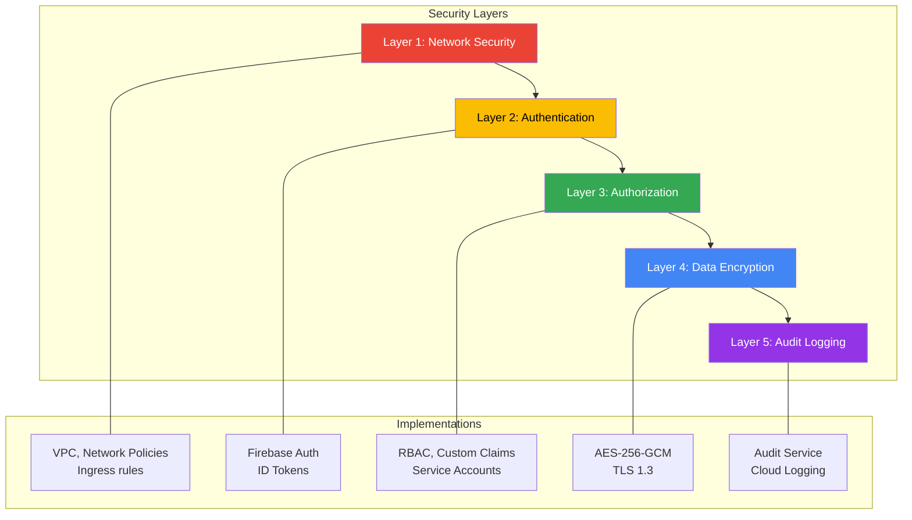

### Zero Trust Architecture

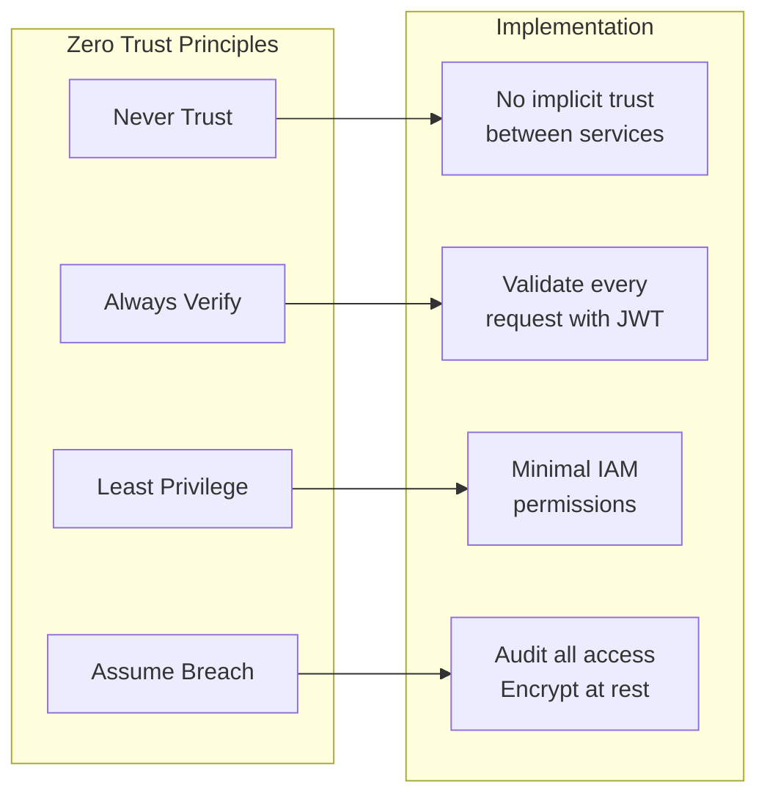

---

## 2. Google Secret Manager

### What is Google Secret Manager?

Google Secret Manager is a fully managed service for storing API keys, passwords, certificates, and other sensitive data.

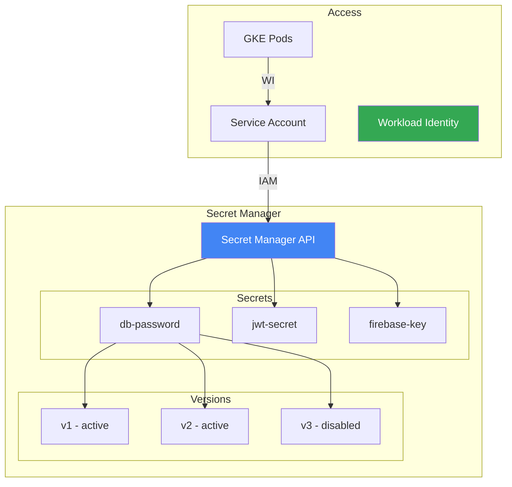

### Creating Secrets with Terraform

```hcl
# infrastructure/terraform/modules/secrets/main.tf

# Create a secret
resource "google_secret_manager_secret" "db_password" {
  secret_id = "csm-db-password"
  project   = var.project_id
  
  replication {
    auto {}
  }
  
  labels = {
    environment = var.environment
    app         = "cloud-secrets-manager"
  }
}

# Add a version (the actual value)
resource "google_secret_manager_secret_version" "db_password" {
  secret      = google_secret_manager_secret.db_password.id
  secret_data = var.db_password  # From tfvars or vault
}

# Grant access to service account
resource "google_secret_manager_secret_iam_member" "accessor" {
  secret_id = google_secret_manager_secret.db_password.id
  role      = "roles/secretmanager.secretAccessor"
  member    = "serviceAccount:${var.service_account_email}"
}
```

### Accessing Secrets from Java

```java
// Using Google Cloud SDK
import com.google.cloud.secretmanager.v1.*;

@Service
public class SecretManagerService {
    
    private final SecretManagerServiceClient client;
    
    public String getSecret(String secretId) {
        String name = String.format(
            "projects/%s/secrets/%s/versions/latest",
            projectId, secretId
        );
        
        AccessSecretVersionResponse response = 
            client.accessSecretVersion(name);
            
        return response.getPayload().getData().toStringUtf8();
    }
}
```

---

## 3. External Secrets Operator

### Why External Secrets Operator?

ESO syncs secrets from Google Secret Manager to Kubernetes Secrets.

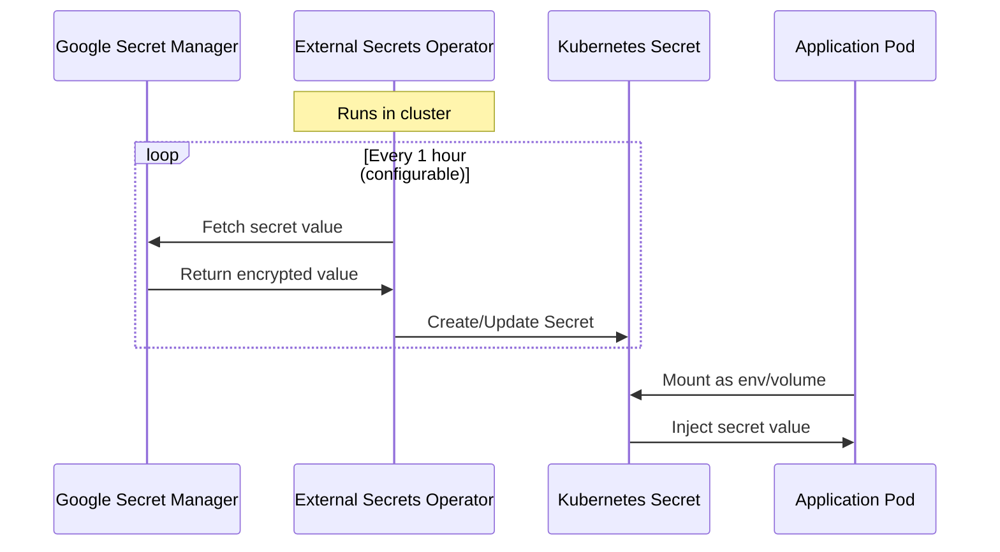

### Architecture

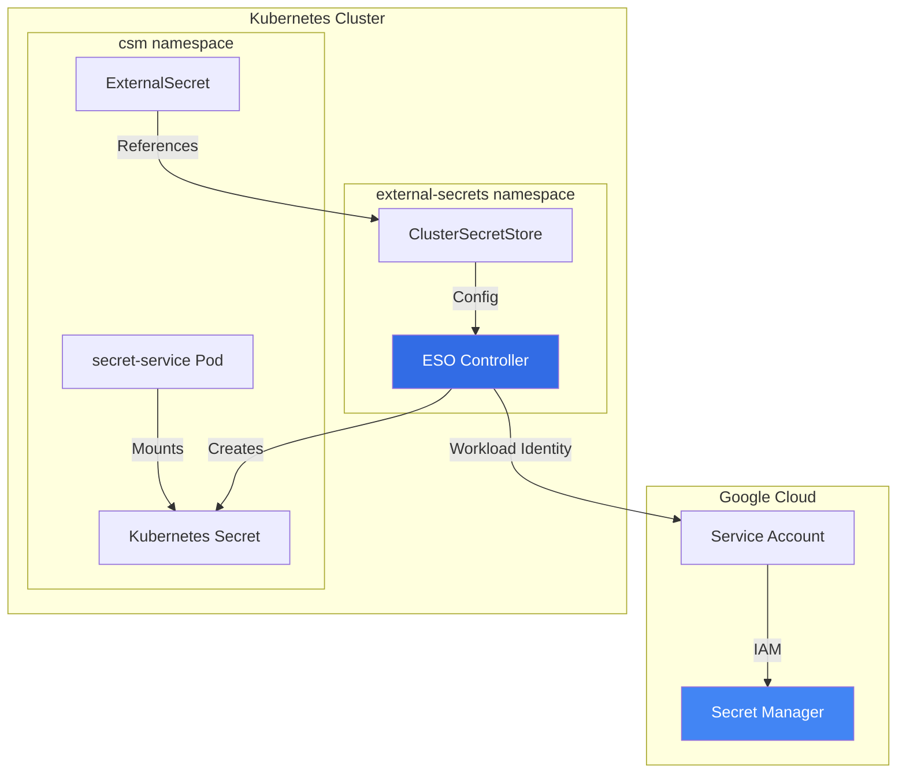

### ClusterSecretStore Configuration

```yaml
# infrastructure/kubernetes/k8s/external-secrets.yaml
apiVersion: external-secrets.io/v1beta1
kind: ClusterSecretStore
metadata:
  name: gcp-secret-store
spec:
  provider:
    gcpsm:
      projectID: cloud-secrets-manager
      auth:
        workloadIdentity:
          clusterLocation: us-central1
          clusterName: csm-cluster
          serviceAccountRef:
            name: external-secrets-sa
            namespace: external-secrets
```

### ExternalSecret Definition

```yaml
apiVersion: external-secrets.io/v1beta1
kind: ExternalSecret
metadata:
  name: csm-secrets
  namespace: csm
spec:
  refreshInterval: 1h
  secretStoreRef:
    name: gcp-secret-store
    kind: ClusterSecretStore
  target:
    name: csm-secrets          # K8s Secret name
    creationPolicy: Owner
  data:
    - secretKey: DB_PASSWORD   # Key in K8s Secret
      remoteRef:
        key: csm-db-password   # Secret Manager secret name
        version: latest
    
    - secretKey: JWT_SECRET
      remoteRef:
        key: csm-jwt-secret
        version: latest
```

---

## 4. Workload Identity

### What is Workload Identity?

Workload Identity allows Kubernetes pods to authenticate as GCP service accounts without key files.

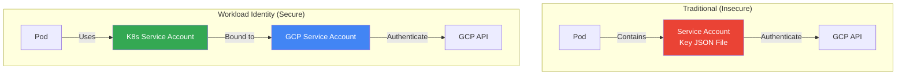

### Setup Flow

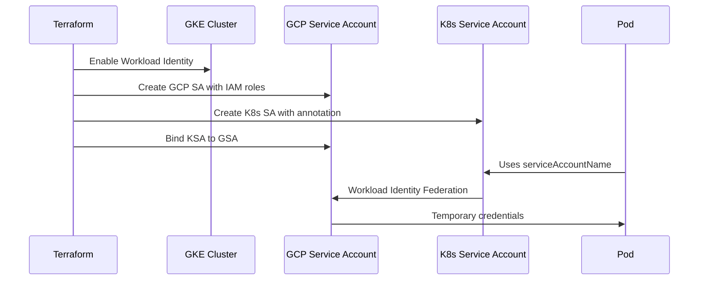

### Terraform Configuration

```hcl
# Enable Workload Identity on cluster
resource "google_container_cluster" "primary" {
  name = "csm-cluster"
  
  workload_identity_config {
    workload_pool = "${var.project_id}.svc.id.goog"
  }
}

# GCP Service Account
resource "google_service_account" "secret_service" {
  account_id   = "secret-service-sa"
  display_name = "Secret Service SA"
}

# Grant Secret Manager access
resource "google_project_iam_member" "secret_accessor" {
  project = var.project_id
  role    = "roles/secretmanager.secretAccessor"
  member  = "serviceAccount:${google_service_account.secret_service.email}"
}

# Bind K8s SA to GCP SA
resource "google_service_account_iam_member" "workload_identity" {
  service_account_id = google_service_account.secret_service.name
  role               = "roles/iam.workloadIdentityUser"
  member             = "serviceAccount:${var.project_id}.svc.id.goog[csm/secret-service-sa]"
}
```

### Kubernetes Service Account

```yaml
# infrastructure/helm/cloud-secrets-manager/templates/serviceaccount.yaml
apiVersion: v1
kind: ServiceAccount
metadata:
  name: secret-service-sa
  namespace: csm
  annotations:
    iam.gke.io/gcp-service-account: secret-service-sa@PROJECT_ID.iam.gserviceaccount.com
```

---

## 5. Network Policies

### Default Deny All

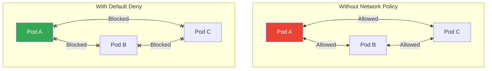

### Network Policy Example

```yaml
# infrastructure/kubernetes/k8s/network-policies.yaml

# Default deny all ingress
apiVersion: networking.k8s.io/v1
kind: NetworkPolicy
metadata:
  name: default-deny-ingress
  namespace: csm
spec:
  podSelector: {}
  policyTypes:
    - Ingress

---
# Allow ingress to secret-service from ingress controller only
apiVersion: networking.k8s.io/v1
kind: NetworkPolicy
metadata:
  name: allow-ingress-to-secret-service
  namespace: csm
spec:
  podSelector:
    matchLabels:
      app: secret-service
  policyTypes:
    - Ingress
  ingress:
    - from:
        - namespaceSelector:
            matchLabels:
              name: ingress-nginx
        - podSelector:
            matchLabels:
              app.kubernetes.io/name: ingress-nginx
      ports:
        - protocol: TCP
          port: 8080

---
# Allow secret-service to audit-service
apiVersion: networking.k8s.io/v1
kind: NetworkPolicy
metadata:
  name: allow-secret-to-audit
  namespace: csm
spec:
  podSelector:
    matchLabels:
      app: audit-service
  policyTypes:
    - Ingress
  ingress:
    - from:
        - podSelector:
            matchLabels:
              app: secret-service
      ports:
        - protocol: TCP
          port: 8081
```

### Visualizing Policies

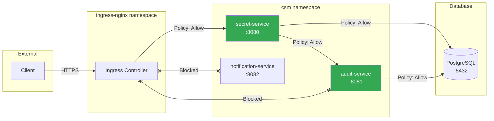

---

## 6. Pod Security Standards

### Security Levels

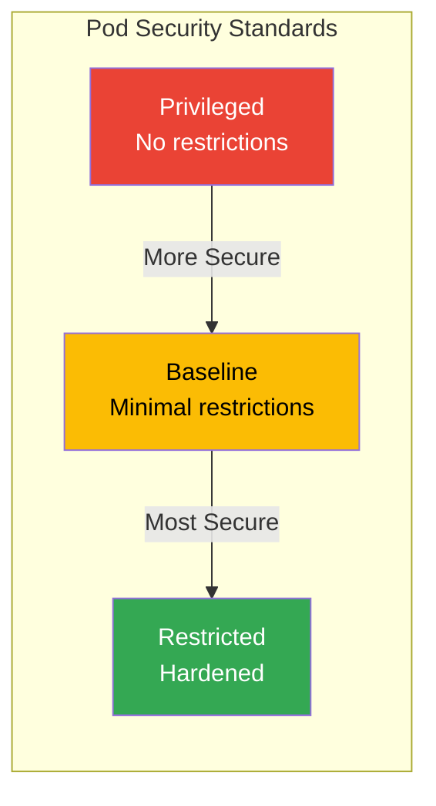

### Namespace Labels

```yaml
# infrastructure/kubernetes/k8s/namespace.yaml
apiVersion: v1
kind: Namespace
metadata:
  name: csm
  labels:
    # Pod Security Standards
    pod-security.kubernetes.io/enforce: restricted
    pod-security.kubernetes.io/audit: restricted
    pod-security.kubernetes.io/warn: restricted
```

### Secure Pod Specification

```yaml
# Deployment with security best practices
apiVersion: apps/v1
kind: Deployment
metadata:
  name: secret-service
spec:
  template:
    spec:
      securityContext:
        runAsNonRoot: true
        runAsUser: 1000
        runAsGroup: 1000
        fsGroup: 1000
        seccompProfile:
          type: RuntimeDefault
      
      containers:
        - name: secret-service
          image: gcr.io/PROJECT/secret-service:latest
          
          securityContext:
            allowPrivilegeEscalation: false
            readOnlyRootFilesystem: true
            capabilities:
              drop:
                - ALL
          
          resources:
            requests:
              cpu: 100m
              memory: 256Mi
            limits:
              cpu: 500m
              memory: 512Mi
          
          # Probes for health
          livenessProbe:
            httpGet:
              path: /actuator/health/liveness
              port: 8080
          readinessProbe:
            httpGet:
              path: /actuator/health/readiness
              port: 8080
```

---

## 7. Authentication & Authorization

### RBAC Flow

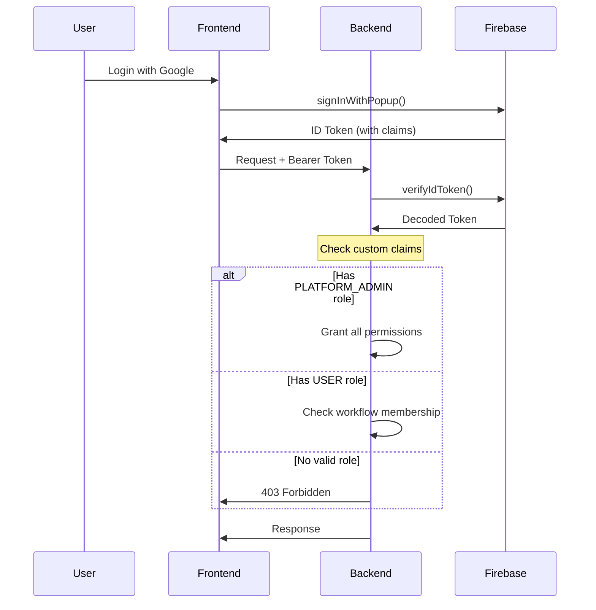

### Custom Claims for RBAC

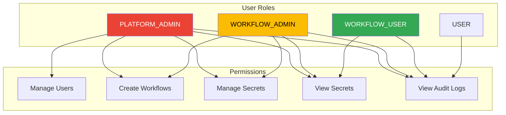

### Backend Authorization

```java
// Spring Security configuration
@Configuration
@EnableMethodSecurity
public class SecurityConfig {

    @Bean
    public SecurityFilterChain securityFilterChain(HttpSecurity http) {
        return http
            .authorizeHttpRequests(auth -> auth
                .requestMatchers("/api/admin/**").hasRole("PLATFORM_ADMIN")
                .requestMatchers("/api/secrets/**").hasAnyRole("PLATFORM_ADMIN", "WORKFLOW_ADMIN", "WORKFLOW_USER")
                .requestMatchers("/api/workflows/**").hasAnyRole("PLATFORM_ADMIN", "WORKFLOW_ADMIN")
                .requestMatchers("/api/audit/**").authenticated()
                .requestMatchers("/actuator/health/**").permitAll()
                .anyRequest().authenticated()
            )
            .build();
    }
}
```

---

## 8. Best Practices

### Security Checklist

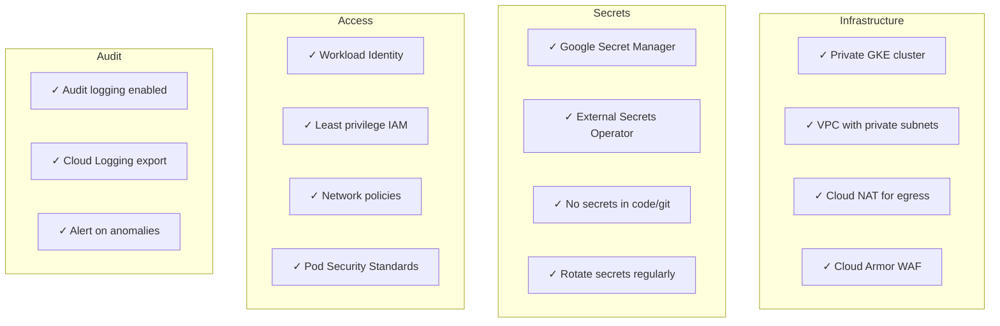

### Never Do This

```yaml
# ❌ BAD - Secret in environment variable
env:
  - name: DB_PASSWORD
    value: "super-secret-password"

# ❌ BAD - Secret in ConfigMap
apiVersion: v1
kind: ConfigMap
data:
  password: "super-secret-password"

# ❌ BAD - Running as root
securityContext:
  runAsUser: 0

# ❌ BAD - Privileged container
securityContext:
  privileged: true
```

### Always Do This

```yaml
# ✅ GOOD - Secret from Secret Manager via ESO
env:
  - name: DB_PASSWORD
    valueFrom:
      secretKeyRef:
        name: csm-secrets
        key: DB_PASSWORD

# ✅ GOOD - Non-root user
securityContext:
  runAsNonRoot: true
  runAsUser: 1000
  allowPrivilegeEscalation: false
  readOnlyRootFilesystem: true
  capabilities:
    drop:
      - ALL
```

---

## Quick Reference

### Key Files

| File | Purpose |
|------|---------|
| `infrastructure/terraform/modules/secrets/` | Secret Manager resources |
| `infrastructure/kubernetes/k8s/external-secrets.yaml` | ESO configuration |
| `infrastructure/kubernetes/k8s/network-policies.yaml` | Network isolation |
| `infrastructure/kubernetes/k8s/pod-security-standards.yaml` | Pod security |
| `infrastructure/helm/.../templates/serviceaccount.yaml` | Workload Identity |

### Common Commands

```bash
# Check External Secrets status
kubectl get externalsecrets -n csm
kubectl describe externalsecret csm-secrets -n csm

# Verify Workload Identity
kubectl run test --rm -it --image=google/cloud-sdk:slim \
  --serviceaccount=secret-service-sa -n csm \
  -- gcloud auth list

# Test network policy
kubectl run test --rm -it --image=busybox -n csm \
  -- wget -O- http://secret-service:8080/actuator/health

# Check pod security
kubectl get pods -n csm -o jsonpath='{.items[*].spec.securityContext}'
```

---

## Next Steps

1. **Review** the [Terraform 101](./03-TERRAFORM-101.md) for IaC security
2. **Practice** creating network policies
3. **Set up** External Secrets Operator locally
4. **Test** Workload Identity bindings
5. **Audit** your current security posture

---

**Document Version:** 1.0  
**Last Updated:** December 7, 2025
