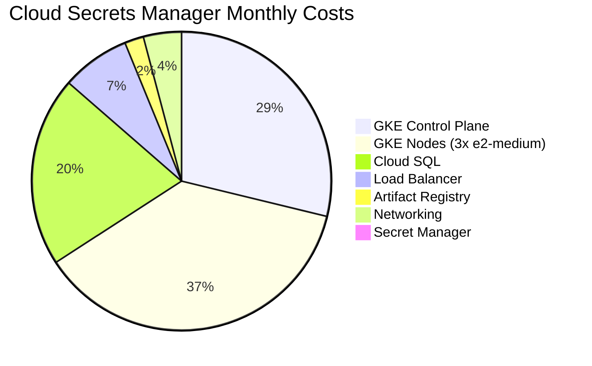
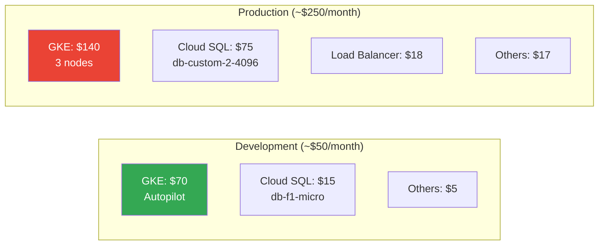
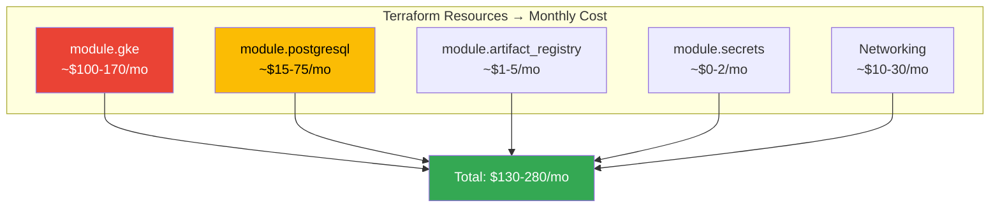

# Cost Management 101: Understanding and Optimizing Cloud Costs

**Level:** Beginner  
**Time:** 1 hour  
**Prerequisites:** Basic GCP knowledge

---

## Table of Contents
1. [Understanding Your Billing Report](#understanding-your-billing-report)
2. [Cost Breakdown by Service](#cost-breakdown-by-service)
3. [Cloud Secrets Manager Costs](#cloud-secrets-manager-costs)
4. [Cost Optimization Strategies](#cost-optimization-strategies)
5. [Setting Up Budgets and Alerts](#setting-up-budgets-and-alerts)
6. [Cost Monitoring Tools](#cost-monitoring-tools)
7. [Best Practices](#best-practices)

---

## Understanding Your Billing Report

### GCP Cost Visualization



### Typical Development vs Production Costs



### Cost Breakdown

| Service | Dev Cost | Prod Cost | What It Is |
|---------|----------|-----------|------------|
| **GKE Control Plane** | ~$70/mo | ~$70/mo | Managed Kubernetes |
| **GKE Nodes** | $0-30 | $90+ | Worker VMs |
| **Cloud SQL** | $10-20 | $50-100 | Managed PostgreSQL |
| **Load Balancer** | $0 | ~$18/mo | External access |
| **Artifact Registry** | ~$1 | ~$5 | Container images |
| **Secret Manager** | $0 | ~$2 | Secrets storage |

---

## Cost Breakdown by Service

### 1. Compute Engine (€7.87)

**What it is:**
- Virtual machines (VMs)
- Persistent disks
- Snapshots

**Why you're being charged:**
- VM instances still running
- Disks attached to deleted VMs (not deleted)
- Snapshots taking up space

**How to reduce:**
```bash
# List all VMs
gcloud compute instances list

# List all disks
gcloud compute disks list

# List all snapshots
gcloud compute snapshots list

# Delete unused disks
gcloud compute disks delete DISK_NAME --zone=ZONE

# Delete snapshots
gcloud compute snapshots delete SNAPSHOT_NAME
```

### 2. Kubernetes Engine (€3.97)

**What it is:**
- GKE cluster control plane
- Managed Kubernetes master nodes

**Why you're being charged:**
- Control plane still exists (even with 0 nodes)
- ~€70/month if cluster is running
- This cost suggests cluster was running for ~2 days

**How to reduce:**
```bash
# List clusters
gcloud container clusters list

# Delete cluster (stops all billing)
gcloud container clusters delete CLUSTER_NAME --region=REGION

# Or scale nodes to 0 (reduces to ~€70/month for control plane)
gcloud container node-pools update NODE_POOL \
  --cluster=CLUSTER_NAME \
  --enable-autoscaling \
  --min-nodes=0 \
  --max-nodes=0 \
  --region=REGION
```

### 3. Cloud SQL (€2.35)

**What it is:**
- Managed PostgreSQL/MySQL databases
- Database instances

**Why you're being charged:**
- Database instance is running
- Storage costs
- Backup costs (if enabled)

**How to reduce:**
```bash
# List instances
gcloud sql instances list

# Stop instance (dev/test only - not for production)
gcloud sql instances patch INSTANCE_NAME --activation-policy=NEVER

# Delete instance (⚠️ deletes all data)
gcloud sql instances delete INSTANCE_NAME

# Reduce instance size
gcloud sql instances patch INSTANCE_NAME --tier=db-f1-micro
```

### 4. Artifact Registry (€0.28)

**What it is:**
- Container image storage
- Docker images

**How to reduce:**
```bash
# List and clean old images
gcloud artifacts docker images list REPOSITORY
gcloud artifacts docker images delete IMAGE_NAME
```

---

## Cloud Secrets Manager Costs

### Terraform Cost Estimation



### Environment Cost Comparison

```hcl
# Development Environment (~$50-100/month)
module "gke" {
  # GKE Autopilot - pay per pod
  cluster_type = "autopilot"  # $0.10/vCPU/hour
}

module "postgresql" {
  tier = "db-f1-micro"  # ~$10/month
}

# Production Environment (~$200-350/month)
module "gke" {
  # Standard cluster
  node_count   = 3
  machine_type = "e2-medium"  # ~$30/node/month
}

module "postgresql" {
  tier = "db-custom-2-4096"  # ~$75/month
  high_availability = true   # +50%
}
```

### Cost-Saving Tips for This Project

```bash
# 1. Use Autopilot for dev (pay per pod)
gcloud container clusters create csm-dev \
  --autopilot \
  --region us-central1

# 2. Stop Cloud SQL when not in use
gcloud sql instances patch csm-db --activation-policy=NEVER

# 3. Use preemptible nodes for dev
# In Terraform:
# preemptible = true  # 80% cheaper

# 4. Delete old container images
gcloud artifacts docker images list \
  us-central1-docker.pkg.dev/PROJECT/csm \
  --include-tags --sort-by=CREATE_TIME

# 5. Clean up Terraform state resources
cd infrastructure/terraform/environments/dev
terraform destroy  # When not needed
```

---

## Cost Optimization Strategies

### 1. Delete Unused Resources

**Regular cleanup:**
```bash
# Create cleanup script
cat > cleanup-unused-resources.sh << 'EOF'
#!/bin/bash

echo "Checking for unused resources..."

# List all VMs
echo "VMs:"
gcloud compute instances list

# List all disks
echo "Disks:"
gcloud compute disks list

# List all snapshots
echo "Snapshots:"
gcloud compute snapshots list

# List all clusters
echo "Clusters:"
gcloud container clusters list

# List all SQL instances
echo "SQL Instances:"
gcloud sql instances list
EOF

chmod +x cleanup-unused-resources.sh
./cleanup-unused-resources.sh
```

### 2. Use Preemptible/Spot VMs

**For development/testing:**
```hcl
# In Terraform
resource "google_container_node_pool" "spot_pool" {
  node_config {
    preemptible = true  # 80% cheaper
  }
}
```

### 3. Right-Size Resources

**Don't over-provision:**
```yaml
# Kubernetes - Use appropriate resource requests
resources:
  requests:
    memory: "256Mi"  # Not 2Gi if you only need 256Mi
    cpu: "200m"      # Not 2 cores if you only need 0.2
```

### 4. Enable Autoscaling

**Scale down when not in use:**
```bash
# GKE autoscaling
gcloud container clusters update CLUSTER_NAME \
  --enable-autoscaling \
  --min-nodes=0 \
  --max-nodes=5 \
  --region=REGION
```

### 5. Use Committed Use Discounts

**For predictable workloads:**
- 1-year commitment: ~20% discount
- 3-year commitment: ~57% discount

### 6. Schedule Resources

**Stop resources during off-hours:**
```bash
# Use Cloud Scheduler to stop/start VMs
gcloud scheduler jobs create http stop-vm \
  --schedule="0 18 * * *" \
  --uri="https://compute.googleapis.com/compute/v1/projects/PROJECT/zones/ZONE/instances/VM/stop"
```

---

## Setting Up Budgets and Alerts

### Create Budget

**Using Console:**
1. Go to **Billing → Budgets & alerts**
2. Click **Create Budget**
3. Set amount (e.g., €50/month)
4. Add alert thresholds (50%, 90%, 100%)
5. Add notification email

**Using gcloud:**
```bash
gcloud billing budgets create \
  --billing-account=BILLING_ACCOUNT_ID \
  --display-name="Monthly Budget" \
  --budget-amount=50EUR \
  --threshold-rule=percent=50 \
  --threshold-rule=percent=90 \
  --threshold-rule=percent=100 \
  --notification-rule=pubsub-topic=projects/PROJECT/topics/budget-alerts
```

**Using Terraform:**
```hcl
resource "google_billing_budget" "budget" {
  billing_account = var.billing_account_id
  display_name    = "Monthly Budget"

  budget_filter {
    projects = ["projects/${var.project_id}"]
  }

  amount {
    specified_amount {
      currency_code = "EUR"
      units         = "50"
    }
  }

  threshold_rules {
    threshold_percent = 0.5
  }
  threshold_rules {
    threshold_percent = 0.9
  }
  threshold_rules {
    threshold_percent = 1.0
  }
}
```

---

## Cost Monitoring Tools

### 1. Billing Reports

**View in Console:**
- **Billing → Reports**: Visual cost breakdown
- **Billing → Cost table**: Detailed line items
- **Billing → Cost breakdown**: By service/resource

### 2. Cost Explorer API

**Programmatic access:**
```bash
# Install billing API
gcloud services enable cloudbilling.googleapis.com

# Query costs
gcloud billing accounts list
```

### 3. Export to BigQuery

**Detailed analysis:**
1. Go to **Billing → Billing export**
2. Enable **Export to BigQuery**
3. Query costs with SQL

### 4. Cost Anomaly Detection

**Automatic alerts:**
1. Go to **Billing → Anomalies**
2. Enable anomaly detection
3. Get alerts for unusual spending

---

## Best Practices

### 1. Regular Cost Reviews

**Weekly/Monthly:**
- Review billing reports
- Identify unused resources
- Optimize resource sizes
- Delete unused resources

### 2. Tag Resources

**Track costs by project/environment:**
```hcl
# Terraform
resource "google_compute_instance" "vm" {
  labels = {
    environment = "dev"
    project     = "cloud-secrets-manager"
    team        = "backend"
  }
}
```

### 3. Use Separate Projects

**Isolate environments:**
- `project-dev`: Development (can be stopped)
- `project-staging`: Staging
- `project-prod`: Production

### 4. Set Up Alerts Early

**Don't wait for surprise bills:**
- Set budget alerts at 50%, 90%, 100%
- Monitor daily during development
- Review weekly in production

### 5. Understand Free Tier

**Google Cloud Free Tier:**
- Always Free: Some services have permanent free tier
- 90-day trial: $300 credit for new accounts
- Always Free limits: Check per-service limits

### 6. Use Cost Calculators

**Estimate before deploying:**
- [Google Cloud Pricing Calculator](https://cloud.google.com/products/calculator)
- Estimate monthly costs
- Compare different configurations

---

## Cost Optimization Checklist

### Immediate Actions

- [ ] Review current billing report
- [ ] List all running resources
- [ ] Delete unused VMs
- [ ] Delete unused disks
- [ ] Delete unused snapshots
- [ ] Stop/delete unused clusters
- [ ] Review Cloud SQL instances
- [ ] Clean up old container images

### Ongoing Actions

- [ ] Set up budget alerts
- [ ] Enable cost anomaly detection
- [ ] Review costs weekly
- [ ] Right-size resources
- [ ] Use autoscaling
- [ ] Tag resources for tracking
- [ ] Use preemptible VMs for dev/test
- [ ] Schedule resource shutdowns

### Long-term Actions

- [ ] Consider committed use discounts
- [ ] Optimize database sizes
- [ ] Use appropriate machine types
- [ ] Implement resource quotas
- [ ] Set up cost allocation tags
- [ ] Export billing to BigQuery
- [ ] Create cost dashboards

---

## Your Current Situation Analysis

Based on your billing report (€14.48 total):

### ✅ Good News

1. **Very low costs** - Excellent cost management!
2. **GKE cluster deleted** - No ongoing cluster costs
3. **Most services minimal** - Good resource cleanup

### 🔍 Potential Optimizations

1. **Compute Engine (€7.87)**
   - Check for any running VMs
   - Delete unused disks
   - Clean up snapshots

2. **Kubernetes Engine (€3.97)**
   - Verify cluster is fully deleted
   - This might be residual cost from when cluster existed

3. **Cloud SQL (€2.35)**
   - If not needed, stop or delete instance
   - If needed, consider smaller instance size

4. **Artifact Registry (€0.28)**
   - Clean up old/unused images
   - Consider lifecycle policies

### 📊 Cost Breakdown Recommendation

```bash
# Quick audit script
cat > audit-costs.sh << 'EOF'
#!/bin/bash

echo "=== Cost Audit ==="
echo ""
echo "Compute Engine Resources:"
gcloud compute instances list --format="table(name,zone,status,machineType)"
echo ""
gcloud compute disks list --format="table(name,zone,sizeGb,status)"
echo ""

echo "Kubernetes Clusters:"
gcloud container clusters list --format="table(name,location,status)"
echo ""

echo "Cloud SQL Instances:"
gcloud sql instances list --format="table(name,region,tier,status)"
echo ""

echo "Artifact Registry:"
gcloud artifacts repositories list --format="table(name,location,format)"
echo ""
EOF

chmod +x audit-costs.sh
./audit-costs.sh
```

---

## Next Steps

1. ✅ Review your billing report (done!)
2. ✅ Understand cost breakdown
3. ⬜ Run cost audit script
4. ⬜ Delete unused resources
5. ⬜ Set up budget alerts
6. ⬜ Monitor costs regularly

---

## Additional Resources

- [Google Cloud Pricing](https://cloud.google.com/pricing)
- [Cost Optimization Best Practices](https://cloud.google.com/cost-optimization)
- [Billing Documentation](https://cloud.google.com/billing/docs)
- [Pricing Calculator](https://cloud.google.com/products/calculator)

---

**Great job on keeping costs low!** Your €14.48 total is excellent. Continue monitoring and optimizing as you learn and deploy more resources.

