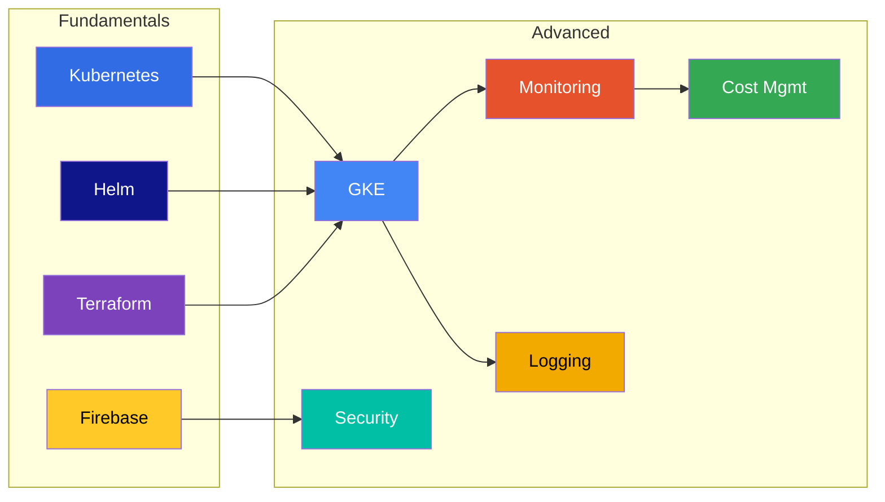
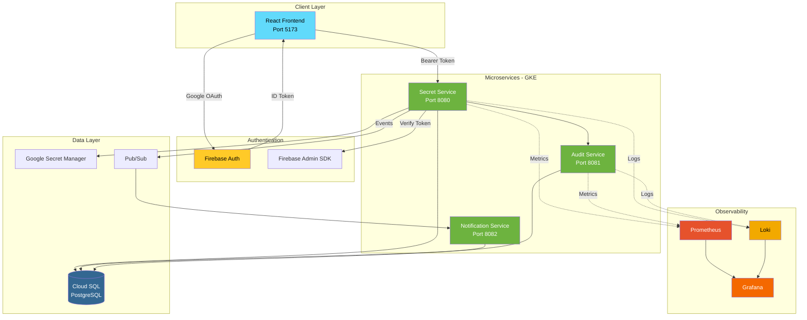
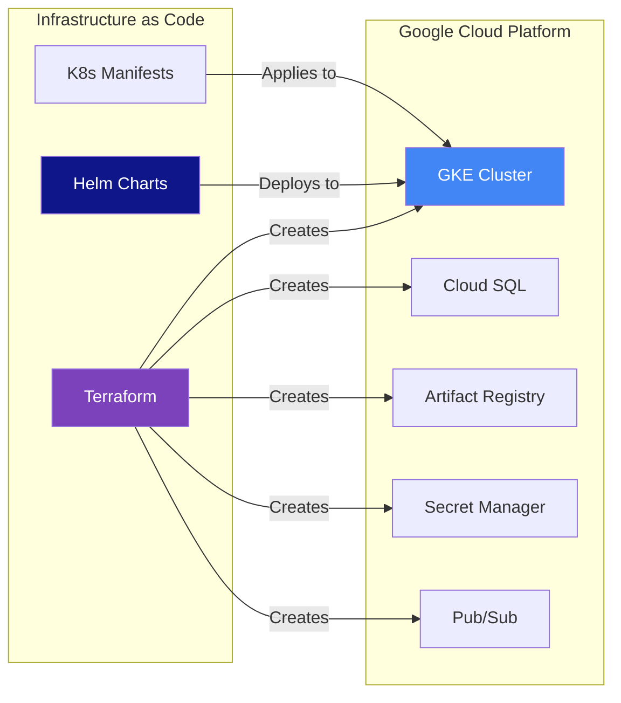

# Cloud Secrets Manager - Technology Learning Path

> **Master the technologies powering this enterprise secrets management platform**



---

## 📚 Learning Path Overview

### Phase 1: Fundamentals (Week 1-2)

| # | Tutorial | Time | Description |
|---|----------|------|-------------|
| 01 | [Kubernetes 101](./01-KUBERNETES-101.md) | 3h | Container orchestration basics |
| 02 | [Helm 101](./02-HELM-101.md) | 2h | Kubernetes package management |
| 03 | [Terraform 101](./03-TERRAFORM-101.md) | 3h | Infrastructure as Code |
| 04 | [Firebase 101](./04-FIREBASE-FUNDAMENTALS.md) | 2h | Authentication & Identity |

### Phase 2: Advanced (Week 3-4)

| # | Tutorial | Time | Description |
|---|----------|------|-------------|
| 05 | [GKE 101](./05-GKE-101.md) | 3h | Google Kubernetes Engine |
| 06 | [Prometheus & Grafana 101](./06-PROMETHEUS-GRAFANA-101.md) | 3h | Monitoring & Metrics |
| 07 | [Loki & Promtail 101](./07-LOKI-PROMTAIL-101.md) | 2h | Centralized Logging |
| 08 | [Security & Secrets 101](./08-SECURITY-SECRETS-101.md) | 2h | Security Best Practices |
| 09 | [Cost Management 101](./09-COST-MANAGEMENT-101.md) | 1h | Cloud Cost Optimization |

### Quick Reference

| Doc | Purpose |
|-----|---------|
| [Quick Reference Card](./QUICK-REFERENCE.md) | Commands cheat sheet |
| [Architecture Spec](./Architecture_Specification_v3.md) | System design |

---

## 🏗️ Cloud Secrets Manager Architecture



---

## 🛠️ Technology Stack

### Infrastructure as Code



### Project Structure

```
Cloud-Secrets-Manager/
├── apps/
│   ├── backend/
│   │   ├── secret-service/      # Core API (Java/Spring Boot)
│   │   ├── audit-service/       # Audit logging
│   │   └── notification-service/ # Notifications
│   └── frontend/                # React/TypeScript SPA
│
├── infrastructure/
│   ├── terraform/               # IaC modules
│   │   ├── modules/
│   │   │   ├── gke-cluster/
│   │   │   ├── postgresql/
│   │   │   ├── iam/
│   │   │   └── artifact-registry/
│   │   └── environments/
│   │       └── dev/
│   │
│   ├── helm/                    # Kubernetes deployments
│   │   └── cloud-secrets-manager/
│   │       ├── Chart.yaml
│   │       ├── values.yaml
│   │       ├── values-staging.yaml
│   │       └── values-production.yaml
│   │
│   ├── kubernetes/              # Raw K8s manifests
│   └── monitoring/              # Prometheus/Grafana configs
│
├── docker/                      # Local development
│   ├── docker-compose.yml
│   └── .env.example
│
└── docs/
    └── 101/                     # 👈 You are here!
```

---

## 🚀 Quick Start Commands

### Local Development

```bash
# Start all services locally
cd docker
docker compose up --build

# Access services
# Frontend: http://localhost:5173
# Backend:  http://localhost:8080
# Swagger:  http://localhost:8080/swagger-ui.html
```

### Kubernetes (Local)

```bash
# Start local K8s (Docker Desktop or minikube)
kubectl cluster-info

# Deploy with Helm
cd infrastructure/helm/cloud-secrets-manager
helm install csm . --namespace csm --create-namespace

# Check status
kubectl get pods -n csm
```

### Terraform (GCP)

```bash
# Initialize and deploy
cd infrastructure/terraform/environments/dev
terraform init
terraform plan
terraform apply
```

---

## 📊 Learning Objectives

After completing this learning path, you will be able to:

### Fundamentals
- [ ] Deploy containerized applications to Kubernetes
- [ ] Create and manage Helm charts
- [ ] Write Terraform modules for GCP resources
- [ ] Implement Firebase authentication

### Advanced
- [ ] Configure GKE clusters with Workload Identity
- [ ] Set up Prometheus monitoring with alerting
- [ ] Implement centralized logging with Loki
- [ ] Apply security best practices (Pod Security, Network Policies)
- [ ] Optimize cloud costs and set up budgets

---

## 🔗 Related Documentation

| Document | Description |
|----------|-------------|
| [Deployment Guide](../deployment/) | Production deployment steps |
| [Operations Runbook](../05_OPERATIONS_AND_RUNBOOK.md) | Day-to-day operations |
| [Security Guide](../security/) | Security hardening |
| [API Documentation](http://localhost:8080/swagger-ui.html) | OpenAPI/Swagger |

---

## 💡 Tips for Success

1. **Start Local** - Use Docker Compose before Kubernetes
2. **Read the Errors** - Error messages tell you exactly what's wrong
3. **Use `kubectl describe`** - Essential for debugging K8s issues
4. **Check Logs** - `kubectl logs` and `docker logs` are your friends
5. **Don't Skip Exercises** - Hands-on practice is crucial
6. **Break Things** - The best way to learn is by fixing mistakes

---

## 📝 Progress Tracker

```
[ ] Phase 1: Fundamentals
    [ ] Kubernetes 101 - Complete all exercises
    [ ] Helm 101 - Create custom chart
    [ ] Terraform 101 - Deploy to GCP
    [ ] Firebase 101 - Implement auth flow

[ ] Phase 2: Advanced
    [ ] GKE 101 - Create cluster with Workload Identity
    [ ] Monitoring 101 - Set up Prometheus + Grafana
    [ ] Logging 101 - Configure Loki + Promtail
    [ ] Security 101 - Apply Pod Security Standards
    [ ] Cost 101 - Set up budget alerts
```

---

**Ready to start?** Begin with [Kubernetes 101](./01-KUBERNETES-101.md) →

---

*Last Updated: December 7, 2025*
