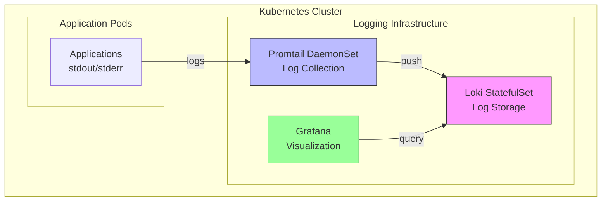

# Logging Infrastructure Runbook

**Last Updated:** December 5, 2025  
**Status:** Production Ready  
**Maintainer:** DevOps Team

---

## Table of Contents

1. [Overview](#overview)
2. [Architecture](#architecture)
3. [Common Operations](#common-operations)
4. [Troubleshooting](#troubleshooting)
5. [Maintenance](#maintenance)
6. [Monitoring](#monitoring)
7. [Incident Response](#incident-response)
8. [Escalation](#escalation)

---

## Overview

This runbook provides operational procedures for the Loki/Promtail logging infrastructure.

### Components

- **Loki**: Log aggregation and storage
- **Promtail**: Log collection agent (DaemonSet)
- **Grafana**: Log visualization

### Key Metrics

- **Namespace**: `logging`
- **Retention**: 30 days
- **Ingestion Rate**: 10 MB/s
- **Storage**: 10Gi (expandable)

---

## Architecture



### Endpoints

- **Loki API**: `http://loki.logging.svc.cluster.local:3100`
- **Loki Metrics**: `http://loki.logging.svc.cluster.local:3100/metrics`
- **Grafana**: `http://grafana.monitoring.svc.cluster.local:3000`

---

## Common Operations

### Check System Health

```bash
# Check all pods
kubectl get pods -n logging

# Expected output:
# NAME                  READY   STATUS    RESTARTS   AGE
# loki-0                1/1     Running   0          5d
# loki-promtail-xxxxx   1/1     Running   0          5d

# Check services
kubectl get svc -n logging

# Check Loki health
kubectl port-forward -n logging svc/loki 3100:3100 &
curl http://localhost:3100/ready
# Expected: "ready"
```

### View Logs

**Loki logs:**
```bash
kubectl logs -n logging loki-0 -f
```

**Promtail logs:**
```bash
# Get Promtail pod name
PROMTAIL_POD=$(kubectl get pods -n logging -l app=promtail -o jsonpath='{.items[0].metadata.name}')

# View logs
kubectl logs -n logging $PROMTAIL_POD -f
```

### Restart Components

**Restart Loki:**
```bash
kubectl delete pod loki-0 -n logging
# StatefulSet will recreate it
```

**Restart Promtail:**
```bash
kubectl delete pod -l app=promtail -n logging
# DaemonSet will recreate them
```

**Restart All:**
```bash
kubectl rollout restart statefulset/loki -n logging
kubectl rollout restart daemonset/loki-promtail -n logging
```

### Query Logs via CLI

```bash
# Port-forward Loki
kubectl port-forward -n logging svc/loki 3100:3100 &

# Query logs from last hour
curl -G "http://localhost:3100/loki/api/v1/query_range" \
  --data-urlencode 'query={namespace="production"}' \
  --data-urlencode "start=$(date -u -v-1H +%s)000000000" \
  --data-urlencode "end=$(date -u +%s)000000000" \
  | jq '.data.result'

# Count error logs
curl -G "http://localhost:3100/loki/api/v1/query" \
  --data-urlencode 'query=count_over_time({level="error"}[1h])' \
  | jq
```

### Scale Resources

**Increase Loki memory:**
```bash
helm upgrade loki grafana/loki-stack \
  -n logging \
  -f infrastructure/helm/loki-stack-values.yaml \
  --set loki.resources.limits.memory=512Mi
```

**Increase storage:**
```bash
# Edit PVC
kubectl edit pvc storage-loki-0 -n logging
# Change spec.resources.requests.storage to desired size

# Restart Loki
kubectl delete pod loki-0 -n logging
```

---

## Troubleshooting

### Issue 1: Loki Pod Not Starting

**Symptoms:**
```bash
$ kubectl get pods -n logging
NAME     READY   STATUS             RESTARTS   AGE
loki-0   0/1     CrashLoopBackOff   5          5m
```

**Diagnosis:**
```bash
# Check pod events
kubectl describe pod loki-0 -n logging | tail -20

# Check logs
kubectl logs loki-0 -n logging --previous
```

**Common Causes & Solutions:**

1. **Out of Memory**
   ```bash
   # Increase memory limit
   helm upgrade loki grafana/loki-stack \
     -n logging \
     --set loki.resources.limits.memory=512Mi
   ```

2. **Storage Issues**
   ```bash
   # Check PVC status
   kubectl get pvc -n logging
   
   # If pending, check storage class
   kubectl get storageclass
   
   # Create PV manually if needed (Docker Desktop)
   kubectl apply -f infrastructure/kubernetes/loki-pv.yaml
   ```

3. **Configuration Error**
   ```bash
   # Check config
   kubectl get configmap loki -n logging -o yaml
   
   # Validate syntax
   kubectl exec -it loki-0 -n logging -- \
     /usr/bin/loki -config.file=/etc/loki/config/config.yaml -verify-config
   ```

---

### Issue 2: Promtail Not Collecting Logs

**Symptoms:**
- No logs appearing in Grafana
- Promtail pods running but no data

**Diagnosis:**
```bash
# Check Promtail logs
kubectl logs -n logging -l app=promtail --tail=100

# Check if Promtail can reach Loki
kubectl exec -it -n logging <promtail-pod> -- \
  wget -O- http://loki:3100/ready
```

**Common Causes & Solutions:**

1. **RBAC Permissions**
   ```bash
   # Check service account
   kubectl get serviceaccount -n logging
   
   # Check cluster role
   kubectl get clusterrole | grep promtail
   
   # Check cluster role binding
   kubectl get clusterrolebinding | grep promtail
   
   # If missing, reinstall
   helm upgrade loki grafana/loki-stack -n logging
   ```

2. **Can't Reach Loki**
   ```bash
   # Test connectivity
   kubectl exec -it -n logging <promtail-pod> -- \
     nc -zv loki 3100
   
   # Check Loki service
   kubectl get svc loki -n logging
   ```

3. **Wrong Log Path**
   ```bash
   # Check Promtail config
   kubectl get configmap loki-promtail -n logging -o yaml
   
   # Verify log path exists
   kubectl exec -it -n logging <promtail-pod> -- \
     ls -la /var/log/pods/
   ```

---

### Issue 3: High Memory Usage

**Symptoms:**
```bash
$ kubectl top pod loki-0 -n logging
NAME     CPU(cores)   MEMORY(bytes)
loki-0   150m         480Mi
```

**Diagnosis:**
```bash
# Check metrics
kubectl port-forward -n logging svc/loki 3100:3100 &
curl http://localhost:3100/metrics | grep memory

# Check ingestion rate
curl http://localhost:3100/metrics | grep loki_distributor_bytes_received_total
```

**Solutions:**

1. **Increase Memory Limit**
   ```bash
   helm upgrade loki grafana/loki-stack \
     -n logging \
     --set loki.resources.limits.memory=1Gi
   ```

2. **Reduce Ingestion Rate**
   ```bash
   helm upgrade loki grafana/loki-stack \
     -n logging \
     --set loki.config.limits_config.ingestion_rate_mb=5
   ```

3. **Reduce Retention**
   ```bash
   helm upgrade loki grafana/loki-stack \
     -n logging \
     --set loki.config.limits_config.retention_period=168h  # 7 days
   ```

---

### Issue 4: Disk Full

**Symptoms:**
```bash
$ kubectl describe pod loki-0 -n logging
Events:
  Warning  Evicted  pod has been evicted due to disk pressure
```

**Diagnosis:**
```bash
# Check disk usage
kubectl exec -it loki-0 -n logging -- df -h

# Check PVC size
kubectl get pvc -n logging
```

**Solutions:**

1. **Expand PVC**
   ```bash
   # Edit PVC
   kubectl edit pvc storage-loki-0 -n logging
   # Change size to 20Gi
   
   # Restart pod
   kubectl delete pod loki-0 -n logging
   ```

2. **Clean Old Logs**
   ```bash
   # Reduce retention
   helm upgrade loki grafana/loki-stack \
     -n logging \
     --set loki.config.limits_config.retention_period=168h
   
   # Force compaction
   kubectl exec -it loki-0 -n logging -- \
     rm -rf /data/loki/compactor/*
   ```

3. **Clean Docker (Docker Desktop)**
   ```bash
   docker system prune -a -f --volumes
   
   # Remove disk pressure taint
   kubectl taint nodes docker-desktop node.kubernetes.io/disk-pressure:NoSchedule-
   ```

---

### Issue 5: Query Timeout

**Symptoms:**
```
Error: Query timeout exceeded
```

**Diagnosis:**
```bash
# Check query performance
curl http://localhost:3100/metrics | grep loki_query_duration_seconds
```

**Solutions:**

1. **Optimize Query**
   ```logql
   # Bad: Too broad
   {}
   
   # Good: Specific labels
   {service="api", level="error"}[5m]
   ```

2. **Increase Timeout**
   ```bash
   helm upgrade loki grafana/loki-stack \
     -n logging \
     --set loki.config.limits_config.query_timeout=5m
   ```

3. **Add Indexes**
   ```bash
   # Ensure proper labels are indexed
   # Check config
   kubectl get configmap loki -n logging -o yaml
   ```

---

### Issue 6: No Logs in Grafana

**Diagnosis Checklist:**

```bash
# 1. Check Loki is running
kubectl get pods -n logging

# 2. Check Loki is receiving logs
curl http://localhost:3100/metrics | grep loki_distributor_lines_received_total

# 3. Check Grafana data source
# Go to Grafana → Configuration → Data Sources → Loki
# Test connection

# 4. List available labels
curl http://localhost:3100/loki/api/v1/labels | jq

# 5. List values for a label
curl http://localhost:3100/loki/api/v1/label/namespace/values | jq

# 6. Try simple query
curl -G "http://localhost:3100/loki/api/v1/query_range" \
  --data-urlencode 'query={namespace=~".+"}' \
  --data-urlencode "start=$(date -u -v-1H +%s)000000000" \
  --data-urlencode "end=$(date -u +%s)000000000" \
  | jq '.data.result | length'
```

**Common Issues:**

1. **Wrong Time Range**
   - Adjust time range in Grafana
   - Use "Last 15 minutes" for testing

2. **Wrong Labels**
   - Use label browser in Grafana
   - Check available labels with API

3. **Data Source Not Configured**
   ```
   URL: http://loki.logging.svc.cluster.local:3100
   ```

---

## Maintenance

### Daily Tasks

```bash
# Check system health
kubectl get pods -n logging

# Check resource usage
kubectl top pod -n logging

# Check for errors
kubectl logs -n logging loki-0 --tail=100 | grep -i error
```

### Weekly Tasks

```bash
# Review metrics
kubectl port-forward -n logging svc/loki 3100:3100 &
curl http://localhost:3100/metrics > loki-metrics.txt

# Check storage usage
kubectl exec -it loki-0 -n logging -- df -h

# Review ingestion rate
curl http://localhost:3100/metrics | grep loki_distributor_bytes_received_total
```

### Monthly Tasks

```bash
# Update Helm charts
helm repo update
helm search repo grafana/loki-stack

# Review retention policy
# Check if 30 days is appropriate

# Review resource allocation
kubectl top pod -n logging

# Backup configuration
kubectl get configmap -n logging -o yaml > loki-config-backup.yaml
```

### Backup Procedures

**Backup Loki Data:**
```bash
# Create backup
kubectl exec -n logging loki-0 -- \
  tar czf /tmp/loki-backup.tar.gz /data/loki

# Copy to local
kubectl cp logging/loki-0:/tmp/loki-backup.tar.gz ./loki-backup-$(date +%Y%m%d).tar.gz

# Upload to GCS (optional)
gsutil cp loki-backup-$(date +%Y%m%d).tar.gz gs://csm-backups/loki/
```

**Restore from Backup:**
```bash
# Download backup
gsutil cp gs://csm-backups/loki/loki-backup-20251205.tar.gz ./

# Copy to pod
kubectl cp ./loki-backup-20251205.tar.gz logging/loki-0:/tmp/

# Extract
kubectl exec -n logging loki-0 -- \
  tar xzf /tmp/loki-backup-20251205.tar.gz -C /

# Restart Loki
kubectl delete pod loki-0 -n logging
```

---

## Monitoring

### Key Metrics to Monitor

**Loki Metrics:**
```promql
# Ingestion rate
rate(loki_distributor_bytes_received_total[5m])

# Query performance
histogram_quantile(0.99, rate(loki_request_duration_seconds_bucket[5m]))

# Error rate
rate(loki_request_duration_seconds_count{status_code=~"5.."}[5m])

# Storage usage
loki_ingester_memory_chunks / loki_ingester_memory_chunks_total
```

**Promtail Metrics:**
```promql
# Logs sent
rate(promtail_sent_entries_total[5m])

# Logs dropped
rate(promtail_dropped_entries_total[5m])

# Read errors
rate(promtail_read_errors_total[5m])
```

### Alerts

**Critical Alerts:**

1. **LokiDown**
   ```yaml
   alert: LokiDown
   expr: up{job="loki"} == 0
   for: 5m
   severity: critical
   ```

2. **HighErrorRate**
   ```yaml
   alert: HighErrorRate
   expr: rate(loki_request_duration_seconds_count{status_code=~"5.."}[5m]) > 0.1
   for: 5m
   severity: warning
   ```

3. **PromtailNotSending**
   ```yaml
   alert: PromtailNotSending
   expr: rate(promtail_sent_entries_total[5m]) == 0
   for: 5m
   severity: warning
   ```

---

## Incident Response

### Severity Levels

**P1 - Critical:**
- Loki completely down
- No logs being collected
- Data loss occurring

**P2 - High:**
- Degraded performance
- High error rate
- Partial log loss

**P3 - Medium:**
- Single component issue
- Performance degradation
- No immediate impact

**P4 - Low:**
- Minor issues
- Cosmetic problems
- Documentation updates

### Response Procedures

**P1 Incident:**
1. Page on-call engineer
2. Check system health
3. Review recent changes
4. Restore from backup if needed
5. Post-incident review

**P2 Incident:**
1. Notify team
2. Investigate root cause
3. Apply fix
4. Monitor for 24 hours
5. Document resolution

---

## Escalation

### Contact Information

**Primary:** DevOps Team  
**Secondary:** Platform Team  
**Emergency:** On-call Engineer

### Escalation Path

1. **Level 1:** DevOps Engineer (15 min)
2. **Level 2:** Senior DevOps Engineer (30 min)
3. **Level 3:** Platform Lead (1 hour)
4. **Level 4:** CTO (2 hours)

---

## Useful Commands

```bash
# Quick health check
kubectl get pods -n logging && \
kubectl top pod -n logging && \
curl -s http://localhost:3100/ready

# View all logs
kubectl logs -n logging --all-containers --tail=100

# Restart everything
kubectl delete pod --all -n logging

# Export metrics
kubectl port-forward -n logging svc/loki 3100:3100 &
curl http://localhost:3100/metrics > metrics.txt

# Check configuration
kubectl get configmap -n logging -o yaml

# Uninstall (emergency)
helm uninstall loki -n logging
```

---

## References

- [Logging Setup Guide](./LOGGING_SETUP.md)
- [LogQL Examples](./LOGQL_EXAMPLES.md)
- [Loki Documentation](https://grafana.com/docs/loki/latest/)
- [Troubleshooting Guide](https://grafana.com/docs/loki/latest/operations/troubleshooting/)

---

**Last Review:** December 5, 2025  
**Next Review:** January 5, 2026
