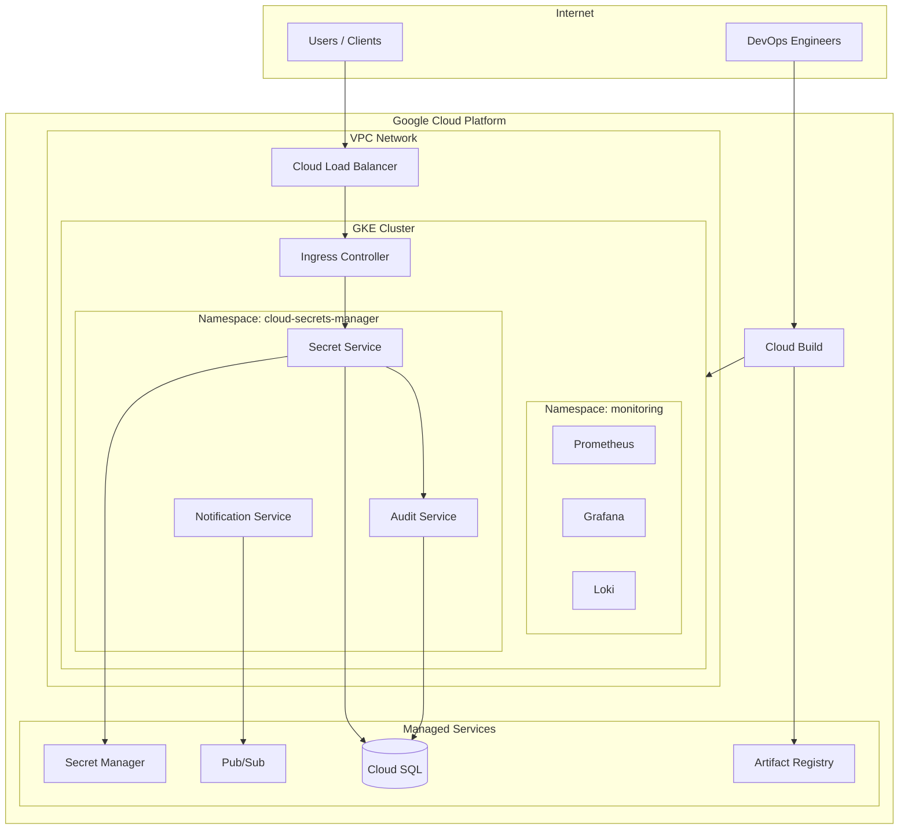

# Infrastructure Overview

> Purpose, architecture, and cloud context for Cloud Secrets Manager

---

## Purpose

The infrastructure layer provides a secure, scalable, and observable platform for running the Cloud Secrets Manager application. It follows cloud-native best practices with infrastructure defined as code, automated deployments, and defense-in-depth security.

## How Infrastructure Supports the Application

Cloud Secrets Manager is a microservices application requiring:

- **High availability** for secrets access (critical path for dependent applications)
- **Strong security posture** (secrets management demands zero-trust networking)
- **Audit compliance** (immutable logging for regulatory requirements)
- **Cost efficiency** (right-sized resources per environment)

The infrastructure is designed to meet these requirements through managed Kubernetes, encrypted storage, isolated networking, and comprehensive observability.

---

## Cloud and Cluster Context

| Aspect | Value |
|--------|-------|
| **Cloud Provider** | Google Cloud Platform (GCP) |
| **Primary Region** | europe-west10 (Berlin) |
| **Container Orchestration** | Google Kubernetes Engine (GKE) |
| **Database** | Cloud SQL for PostgreSQL |
| **Secrets Backend** | GCP Secret Manager |
| **Image Registry** | Artifact Registry |
| **CI/CD Platform** | Google Cloud Build |

---

## High-Level Architecture

---

## Key Design Decisions

### 1. Regional GKE (Not Zonal)

GKE runs in regional mode for higher availability. The control plane spans multiple zones, and node pools can distribute across availability zones.

### 2. Workload Identity

Kubernetes service accounts are bound to GCP service accounts via Workload Identity, eliminating the need for long-lived credentials in the cluster.

### 3. Private Nodes (Production)

In staging and production, GKE nodes have no public IP addresses. All egress routes through Cloud NAT, reducing attack surface.

### 4. External Secrets Operator

Secrets are stored in GCP Secret Manager and synchronized to Kubernetes via External Secrets Operator, providing a single source of truth.

### 5. Managed PostgreSQL

Cloud SQL provides automated backups, point-in-time recovery, and high availability without operational overhead.

---

## Environment Comparison

| Aspect | Development | Staging | Production |
|--------|-------------|---------|------------|
| GKE Nodes | 1 (e2-medium) | 2 (e2-standard-2) | 3+ (e2-standard-4) |
| Node Pool | Single | Single | Multi-zone |
| Cloud SQL Tier | db-g1-small | db-custom-2-4096 | db-custom-4-8192 |
| High Availability | No | No | Yes (HA Cloud SQL) |
| Private Nodes | No | Yes | Yes |
| Deletion Protection | Disabled | Enabled | Enabled |
| Replicas per Service | 1 | 2 | 3 |
| Auto-scaling | Limited | Yes | Yes |
| Budget Alert | $50/month | $150/month | $500/month |

---

## Infrastructure Components

### Compute

- **GKE Cluster**: Managed Kubernetes with auto-repair, auto-upgrade
- **Node Pools**: Preemptible nodes for dev, standard for prod
- **Cloud SQL Proxy**: Sidecar for secure database connectivity

### Networking

- **VPC**: Default VPC with GKE-managed subnets
- **Cloud Load Balancer**: L7 load balancing via GKE Ingress
- **Network Policies**: Calico-based pod-to-pod traffic control

### Storage

- **Cloud SQL**: PostgreSQL 16 for application data
- **Persistent Volumes**: GCE Persistent Disks for stateful workloads
- **Secret Manager**: Encrypted secrets storage

### Security

- **IAM**: Role-based access with least privilege
- **Workload Identity**: Keyless authentication for pods
- **Binary Authorization**: Image signing verification (production)

### Observability

- **Cloud Logging**: Centralized log aggregation
- **Cloud Monitoring**: GKE and managed service metrics
- **Prometheus/Grafana**: Application-level metrics and dashboards
- **Loki**: Log aggregation within the cluster

---

## Related Documentation

- [CI/CD Pipeline](./02-CI-CD-PIPELINE.md) - Automated build and deployment
- [Kubernetes Architecture](./03-KUBERNETES-ARCHITECTURE.md) - Cluster details
- [Terraform & IaC](./04-TERRAFORM-IAC.md) - Infrastructure provisioning

---

*Last Updated: December 2025*
