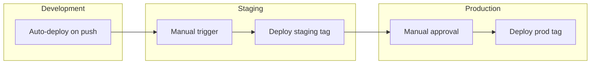

# CI/CD Pipeline

> Build and deployment automation for Cloud Secrets Manager

---

## Overview

The CI/CD pipeline automates the journey from code commit to production deployment. Google Cloud Build serves as the primary automation platform, providing native GCP integration and secure access to cluster resources.

## Pipeline Philosophy

- **Trunk-based development**: Short-lived branches merge to main frequently
- **Progressive delivery**: Dev → Staging → Production promotion
- **Immutable artifacts**: Same container image deployed across environments
- **Security scanning**: Vulnerability checks before deployment
- **GitOps-ready**: Infrastructure and application changes tracked in Git

---

## High-Level Pipeline Flow

```mermaid
flowchart LR
    subgraph Trigger
        Push[Git Push]
        PR[Pull Request]
    end
    
    subgraph Build["Build Stage"]
        Lint[Lint & Test]
        Build[Docker Build]
        Scan[Security Scan]
    end
    
    subgraph Package["Package Stage"]
        Tag[Tag Image]
        Push[Push to Registry]
    end
    
    subgraph Deploy["Deploy Stage"]
        Auth[Get Credentials]
        Helm[Helm Upgrade]
        Verify[Health Check]
    end
    
    Push --> Lint
    PR --> Lint
    Lint --> Build
    Build --> Scan
    Scan --> Tag
    Tag --> Push
    Push --> Auth
    Auth --> Helm
    Helm --> Verify
```

---

## Pipeline Stages

### 1. Build Stage

**Trigger**: Push to `main` branch or pull request

**Steps**:
- Lint code and run unit tests (Maven for backend)
- Build Docker images with BuildKit for layer caching
- Tag images with commit SHA and environment label

**Parallelization**: Secret Service, Audit Service, and Notification Service build concurrently for faster execution.

### 2. Security Scanning

**Tools**: Google Container Analysis

**Checks**:
- Known CVE vulnerabilities in base images
- Dependency vulnerabilities
- Configuration issues

**Policy**: Pipeline continues with warnings for non-critical findings. Critical vulnerabilities block deployment.

### 3. Artifact Management

**Registry**: Google Artifact Registry (europe-west10)

**Tagging Strategy**:
- `{sha}`: Unique identifier for each build
- `{env}-latest`: Rolling tag per environment
- `v{semver}`: Release tags for production

**Cleanup**: Retention policy keeps last 5 images per tag to control storage costs.

### 4. Deployment Stage

**Method**: Helm upgrade/install with environment-specific values

**Steps**:
1. Authenticate to GKE cluster
2. Create/update image pull secret
3. Deploy via Helm with new image tag
4. Wait for rollout completion
5. Verify health endpoints

**Rollback**: Failed deployments trigger automatic rollback to previous revision.

---

## Environment Promotion



| Environment | Trigger | Auto-deploy | Approval Required |
|-------------|---------|-------------|-------------------|
| Development | Push to main | Yes | No |
| Staging | Manual or schedule | No | No |
| Production | Manual | No | Yes |

---

## Pipeline Configuration Files

| File | Purpose |
|------|---------|
| `cloudbuild.yaml` | Base configuration for builds |
| `cloudbuild-dev.yaml` | Development environment overrides |
| `cloudbuild-staging.yaml` | Staging environment overrides |
| `cloudbuild-production.yaml` | Production environment overrides |

---

## Build Variables

| Variable | Description | Default |
|----------|-------------|---------|
| `_ARTIFACT_REGISTRY` | Registry hostname | `europe-west10-docker.pkg.dev` |
| `_GKE_REGION` | Cluster region | `europe-west10` |
| `_GKE_NAMESPACE` | Target namespace | `cloud-secrets-manager` |
| `_ENV` | Environment label | `dev` |
| `_DEPLOY` | Enable deployment | `false` |

---

## Security Considerations

### Build-Time Security

- **Minimal base images**: Distroless or Alpine-based images
- **Multi-stage builds**: Build dependencies excluded from runtime
- **Non-root execution**: Containers run as non-root user

### Deployment Security

- **Workload Identity**: No service account keys in pipeline
- **Short-lived tokens**: OAuth tokens for registry access
- **Namespace isolation**: Deployments scoped to specific namespace

### Supply Chain Security

- **Image signing**: Binary Authorization for production (planned)
- **SBOM generation**: Software Bill of Materials for auditing (planned)
- **Dependency scanning**: Container Analysis for known vulnerabilities

---

## Monitoring Pipeline Health

### Metrics to Track

- Build success/failure rate
- Average build duration
- Deployment frequency
- Change failure rate
- Mean time to recovery

### Alerting

Cloud Build integrates with Cloud Monitoring for pipeline failure alerts via email, Slack, or PagerDuty.

---

## Troubleshooting

### Build Failures

1. Check Cloud Build logs in GCP Console
2. Verify Dockerfile syntax and dependencies
3. Ensure base image is accessible

### Deployment Failures

1. Check Helm release status: `helm status cloud-secrets-manager`
2. Review pod events: `kubectl describe pod -l app=secret-service`
3. Check container logs for startup errors

### Registry Authentication

If image push fails, verify Cloud Build service account has `roles/artifactregistry.writer` role.

---

## Related Documentation

- [Deployment Workflow](./08-DEPLOYMENT-WORKFLOW.md) - Environment details
- [Kubernetes Architecture](./03-KUBERNETES-ARCHITECTURE.md) - Deployment targets

---

*Last Updated: December 2025*
