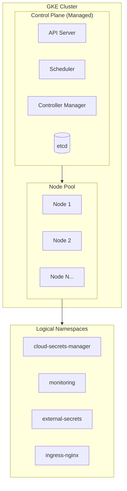
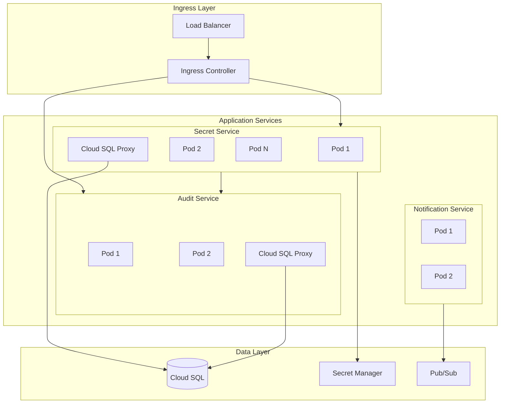
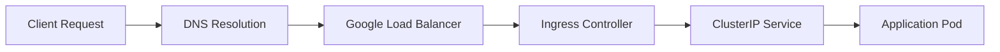

# Kubernetes Architecture & Operations

> Cluster topology, workloads, and operational patterns

---

## Overview

Cloud Secrets Manager runs on Google Kubernetes Engine (GKE), leveraging managed Kubernetes for reduced operational overhead. The cluster hosts application services, databases (in development), and observability tools.

---

## Cluster Topology



### Cluster Configuration

| Setting | Development | Staging | Production |
|---------|-------------|---------|------------|
| Type | Regional | Regional | Regional |
| Release Channel | Regular | Regular | Stable |
| Node Machine Type | e2-medium | e2-standard-2 | e2-standard-4 |
| Min Nodes | 1 | 2 | 3 |
| Max Nodes | 3 | 5 | 10 |
| Workload Identity | Enabled | Enabled | Enabled |
| Network Policy | Enabled | Enabled | Enabled |
| Private Nodes | Disabled | Enabled | Enabled |

---

## Namespace Strategy

| Namespace | Purpose | Workloads |
|-----------|---------|-----------|
| `cloud-secrets-manager` | Application services | secret-service, audit-service, notification-service |
| `monitoring` | Observability stack | Prometheus, Grafana, Loki, Alertmanager |
| `external-secrets` | Secrets synchronization | External Secrets Operator |
| `ingress-nginx` | Traffic ingress | NGINX Ingress Controller |
| `kube-system` | Cluster services | CoreDNS, kube-proxy, etc. |

---

## Application Workloads

### Deployment Architecture



### Workload Details

| Service | Replicas | Resources | Health Probes |
|---------|----------|-----------|---------------|
| secret-service | 1-3 | 256Mi-512Mi, 200m-500m | Liveness + Readiness |
| audit-service | 1-2 | 128Mi-256Mi, 100m-250m | Liveness + Readiness |
| notification-service | 1-2 | 128Mi-256Mi, 100m-250m | Liveness + Readiness |

---

## Helm Charts

### Chart Structure

The application is deployed via a Helm chart located at `infrastructure/helm/cloud-secrets-manager/`.

```
cloud-secrets-manager/
├── Chart.yaml              # Chart metadata
├── values.yaml             # Default values (dev)
├── values-local.yaml       # Local K8s development
├── values-staging.yaml     # Staging overrides
├── values-production.yaml  # Production overrides
└── templates/
    ├── secret-service-deployment.yaml
    ├── audit-service-deployment.yaml
    ├── notification-service-deployment.yaml
    ├── databases.yaml      # Local PostgreSQL (dev only)
    ├── serviceaccount.yaml
    ├── secret-config.yaml
    └── ingress.yaml
```

### Values Strategy

| Values File | Use Case |
|-------------|----------|
| `values.yaml` | Base defaults, GKE development |
| `values-local.yaml` | Docker Desktop / local Kubernetes |
| `values-staging.yaml` | Staging environment overrides |
| `values-production.yaml` | Production environment overrides |

### Key Helm Values

| Value Path | Description |
|------------|-------------|
| `image.tag` | Container image tag |
| `secretService.replicaCount` | Number of secret-service pods |
| `cloudSql.enabled` | Use Cloud SQL (vs local PostgreSQL) |
| `googleIdentity.enabled` | Enable Firebase authentication |
| `monitoring.enabled` | Deploy ServiceMonitors |

---

## Networking

### Ingress Flow



### Service Mesh

*Assumption: Service mesh (Istio/Linkerd) is not currently deployed. Internal communication uses standard Kubernetes networking with Network Policies for segmentation.*

### Network Policies

Network policies implement zero-trust networking:

- **Default deny**: All traffic blocked by default
- **Explicit allow**: Only defined paths permitted
- **Namespace isolation**: Cross-namespace traffic controlled

**Allowed Traffic Flows**:
- Ingress → secret-service (port 8080)
- secret-service → audit-service (port 8081)
- secret-service → Cloud SQL Proxy (port 5432)
- Prometheus → All services (metrics ports)

---

## Storage

### Persistent Volumes

| Use Case | Storage Class | Size | Access Mode |
|----------|---------------|------|-------------|
| Local PostgreSQL (dev) | standard | 1Gi | ReadWriteOnce |
| Prometheus data | standard | 10Gi | ReadWriteOnce |
| Loki chunks | standard | 10Gi | ReadWriteOnce |

### Cloud SQL Connectivity

Application pods connect to Cloud SQL via the Cloud SQL Proxy sidecar, which:
- Handles IAM authentication via Workload Identity
- Encrypts traffic between pod and Cloud SQL
- Provides a local socket for the application

---

## Operational Runbooks

### Scaling Workloads

```bash
# Manual scaling
kubectl scale deployment secret-service --replicas=3 -n cloud-secrets-manager

# HPA (if configured)
kubectl autoscale deployment secret-service --min=2 --max=5 --cpu-percent=70
```

### Rolling Updates

Deployments use `RollingUpdate` strategy:
- `maxSurge: 1` - One additional pod during update
- `maxUnavailable: 0` - No downtime during rollout

### Troubleshooting Commands

```bash
# Check pod status
kubectl get pods -n cloud-secrets-manager

# View pod logs
kubectl logs -f deployment/secret-service -n cloud-secrets-manager

# Describe failing pod
kubectl describe pod <pod-name> -n cloud-secrets-manager

# Check events
kubectl get events -n cloud-secrets-manager --sort-by='.lastTimestamp'

# Port-forward for local access
kubectl port-forward svc/secret-service 8080:8080 -n cloud-secrets-manager
```

---

## Related Documentation

- [Helm Values Reference](../../infrastructure/helm/README.md)
- [Deployment Workflow](./08-DEPLOYMENT-WORKFLOW.md)
- [Monitoring](./06-MONITORING-OBSERVABILITY.md)

---

*Last Updated: December 2025*
