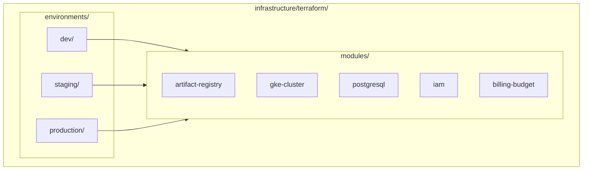
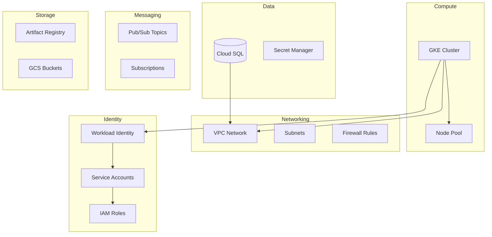
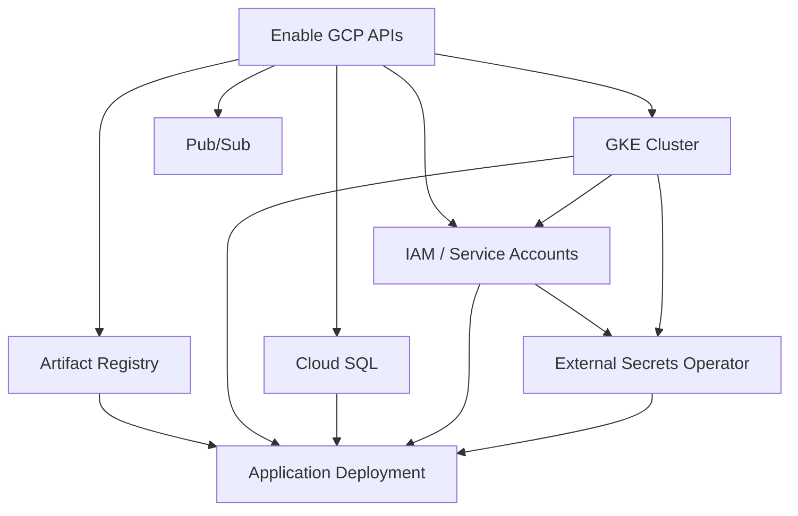

# Terraform & Infrastructure as Code

> Infrastructure provisioning with Terraform modules and environments

---

## Overview

All cloud infrastructure is defined as code using Terraform. This enables version-controlled, repeatable, and auditable infrastructure changes. The codebase follows a modular architecture with environment-specific configurations.

---

## Project Structure



### Directory Layout

```
terraform/
├── modules/                    # Reusable infrastructure modules
│   ├── artifact-registry/      # Docker image registry
│   ├── gke-cluster/           # Kubernetes cluster
│   ├── postgresql/            # Cloud SQL database
│   ├── iam/                   # Service accounts and roles
│   └── billing-budget/        # Cost alerts
├── environments/              # Environment-specific configs
│   ├── dev/                   # Development
│   ├── staging/               # Staging
│   └── production/            # Production (planned)
└── .gitignore                 # Exclude state and secrets
```

---

## Module Overview

### GKE Cluster (`gke-cluster`)

Provisions a regional GKE cluster with:
- Managed node pools with auto-scaling
- Workload Identity for secure GCP access
- Network policies via Calico
- Shielded nodes with secure boot
- Cloud Logging and Monitoring integration

### PostgreSQL (`postgresql`)

Provisions Cloud SQL for PostgreSQL with:
- Configurable tier and storage
- Optional high availability
- Automated backups
- Point-in-time recovery (PITR)
- Multiple databases per instance

### Artifact Registry (`artifact-registry`)

Provisions a Docker registry with:
- Regional storage
- IAM-based access control
- Image cleanup policies

### IAM (`iam`)

Manages service accounts and Workload Identity:
- Per-service GCP service accounts
- Role bindings with least privilege
- Kubernetes-to-GCP identity mapping

### Billing Budget (`billing-budget`)

Creates cost alerts:
- Monthly budget thresholds
- Email notifications at 50%, 80%, 100%
- Optional Pub/Sub for automation

---

## Resource Groups



---

## IaC Workflow

```mermaid
flowchart LR
    subgraph Plan["Plan Phase"]
        Code[Write Terraform]
        Validate[Validate]
        Plan[Plan]
    end
    
    subgraph Review["Review Phase"]
        PR[Pull Request]
        Diff[Review Diff]
        Approve[Approve]
    end
    
    subgraph Apply["Apply Phase"]
        Apply[Apply]
        Verify[Verify]
        Commit[Commit State]
    end
    
    Code --> Validate
    Validate --> Plan
    Plan --> PR
    PR --> Diff
    Diff --> Approve
    Approve --> Apply
    Apply --> Verify
    Verify --> Commit
```

### Workflow Steps

1. **Write**: Modify Terraform configuration
2. **Validate**: Run `terraform validate` for syntax
3. **Plan**: Generate execution plan with `terraform plan`
4. **Review**: Submit PR, review planned changes
5. **Approve**: Get approval for infrastructure changes
6. **Apply**: Execute with `terraform apply`
7. **Verify**: Confirm resources created correctly
8. **Commit**: State automatically saved to backend

---

## State Management

### Backend Configuration

State is stored in Google Cloud Storage with:
- **Encryption**: Server-side encryption at rest
- **Versioning**: State history for recovery
- **Locking**: Prevents concurrent modifications

### State Buckets

| Environment | Bucket |
|-------------|--------|
| Development | `cloud-secrets-manager-tfstate-dev` |
| Staging | `cloud-secrets-manager-tfstate-staging` |
| Production | `cloud-secrets-manager-tfstate-prod` |

*Assumption: State buckets are created manually before first terraform init, as described in the Terraform README.*

### State Operations

| Operation | Use Case |
|-----------|----------|
| `terraform state list` | View managed resources |
| `terraform state show <resource>` | Inspect resource details |
| `terraform state rm <resource>` | Remove from state (not cloud) |
| `terraform import <resource> <id>` | Import existing resource |

---

## Environment Configuration

### Variables Pattern

Each environment defines:
- `variables.tf` - Input variable declarations
- `terraform.tfvars.example` - Example values (committed)
- `terraform.tfvars` - Actual values (gitignored)

### Key Variables

| Variable | Description | Example |
|----------|-------------|---------|
| `project_id` | GCP project ID | `cloud-secrets-manager` |
| `region` | Deployment region | `europe-west10` |
| `environment` | Environment name | `dev`, `staging`, `prod` |
| `billing_account_id` | For budget alerts | (optional) |

---

## Dependencies and Flow



### Dependency Order

1. **GCP APIs**: Enable required services
2. **Networking**: VPC, subnets (using defaults)
3. **GKE Cluster**: Kubernetes control plane
4. **Cloud SQL**: Database instance
5. **IAM**: Service accounts, Workload Identity
6. **External Secrets**: Helm deployment via Terraform
7. **Application**: Helm deployment (separate step)

---

## Best Practices

### Do

- Run `terraform plan` before every apply
- Use modules for reusable components
- Tag all resources with environment and ownership
- Enable deletion protection for production databases
- Store state remotely with locking

### Don't

- Commit `terraform.tfvars` with secrets
- Manually modify Terraform-managed resources
- Use `terraform apply -auto-approve` in production
- Store state files locally

---

## Troubleshooting

### Common Issues

| Issue | Solution |
|-------|----------|
| State lock stuck | `terraform force-unlock <lock-id>` |
| Resource already exists | Import with `terraform import` |
| Provider version mismatch | Run `terraform init -upgrade` |
| Permission denied | Check IAM roles for service account |

---

## Related Documentation

- [GCP Architecture](./05-GCP-ARCHITECTURE.md) - Cloud service details
- [Deployment Workflow](./08-DEPLOYMENT-WORKFLOW.md) - How Terraform fits in deployments

---

*Last Updated: December 2025*
