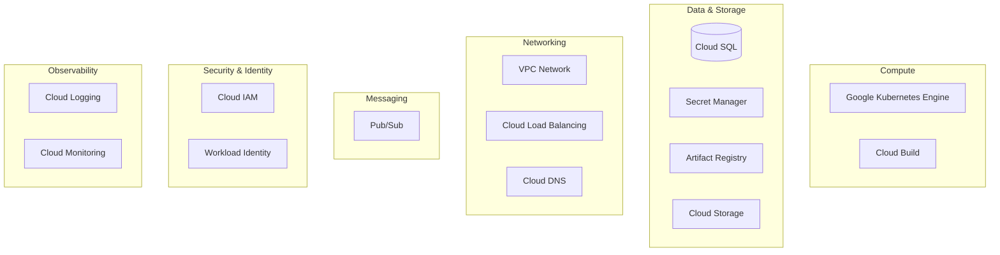
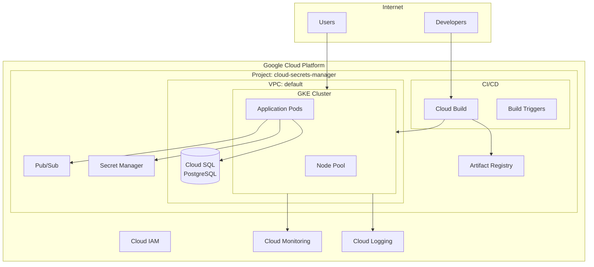
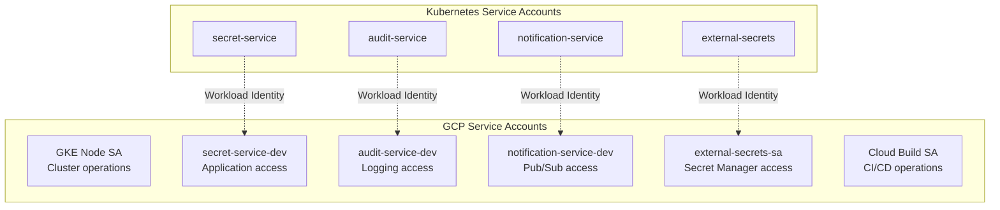
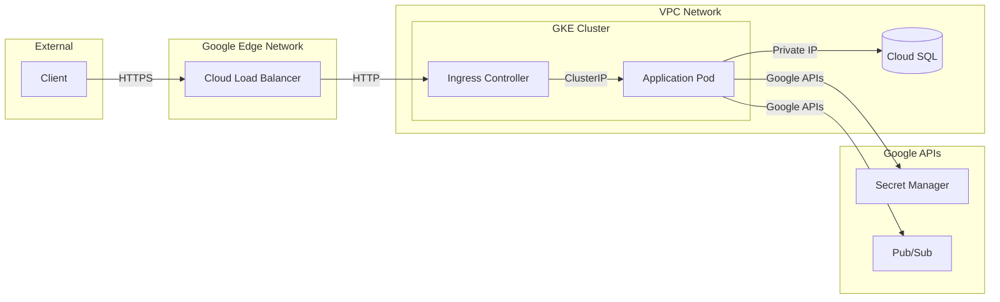

# GCP Architecture

> Google Cloud Platform services, networking, and integration

---

## Overview

Cloud Secrets Manager is deployed entirely on Google Cloud Platform, leveraging managed services for reduced operational overhead and native security integrations. The architecture prioritizes security, cost-efficiency, and observability.

---

## Services Used

### Service Summary

| Service | Purpose | Justification |
|---------|---------|---------------|
| **GKE** | Container orchestration | Managed Kubernetes, auto-scaling, security |
| **Cloud SQL** | Relational database | Managed PostgreSQL, HA, backups |
| **Secret Manager** | Secrets storage | Encryption, versioning, audit logging |
| **Artifact Registry** | Container images | Regional, IAM-integrated, cleanup policies |
| **Cloud Build** | CI/CD pipelines | Native GCP integration, no credential management |
| **Pub/Sub** | Async messaging | Decoupled notifications, event-driven |
| **Cloud IAM** | Access management | Fine-grained permissions, audit trails |
| **Cloud Logging** | Log aggregation | Centralized, searchable, integrated |
| **Cloud Monitoring** | Metrics and alerts | Managed Prometheus, dashboards |

---

## High-Level GCP Architecture

---

## Identity & Access Management

### Service Account Hierarchy

### Role Assignments

| Service Account | Key Roles |
|-----------------|-----------|
| `secret-service-*` | `cloudsql.client`, `secretmanager.secretAccessor`, `pubsub.publisher` |
| `audit-service-*` | `cloudsql.client`, `logging.logWriter` |
| `notification-service-*` | `cloudsql.client`, `pubsub.subscriber` |
| `external-secrets-sa` | `secretmanager.secretAccessor` |
| GKE Node SA | `logging.logWriter`, `monitoring.metricWriter`, `artifactregistry.reader` |

### Workload Identity

Workload Identity eliminates the need for service account keys:

1. Kubernetes ServiceAccount annotated with GCP SA email
2. Pod assumes K8s ServiceAccount identity
3. GKE metadata server provides GCP credentials
4. Application accesses GCP APIs without key files

---

## Networking

### VPC Configuration

| Component | Configuration |
|-----------|---------------|
| **VPC** | Default VPC (auto-mode) |
| **Subnets** | Auto-created per region |
| **IP Ranges** | GKE-managed pod and service CIDRs |
| **Firewall** | Default rules + GKE-managed |

*Assumption: Custom VPC is not used; default VPC with GKE-managed networking suffices for current scale.*

### Network Flow

### Ingress/Egress Strategy

| Direction | Path | Notes |
|-----------|------|-------|
| **Ingress** | Internet → Cloud LB → GKE Ingress → Pods | TLS terminated at LB or Ingress |
| **Egress (APIs)** | Pods → Google Private Access → APIs | No public IPs needed |
| **Egress (SQL)** | Pods → Cloud SQL Proxy → Cloud SQL | Encrypted, authenticated |

### Private Networking (Production)

In production, GKE nodes have no public IPs:
- **Cloud NAT** provides outbound internet access
- **Private Google Access** for GCP API calls
- **Authorized Networks** restrict kubectl access

---

## Database Architecture

### Cloud SQL Configuration

| Aspect | Development | Staging | Production |
|--------|-------------|---------|------------|
| **Instance Type** | db-g1-small | db-custom-2-4096 | db-custom-4-8192 |
| **Storage** | 20GB SSD | 30GB SSD | 100GB SSD |
| **High Availability** | No | No | Yes (Regional) |
| **Backups** | Daily | Daily | Continuous |
| **PITR** | Disabled | Enabled | Enabled |
| **Deletion Protection** | Disabled | Enabled | Enabled |

### Databases

| Database | Purpose | Service |
|----------|---------|---------|
| `secrets` | Application data, secrets metadata | secret-service |
| `audit` | Audit logs and compliance records | audit-service |

### Connection Pattern

Applications connect via Cloud SQL Proxy sidecar:
1. Proxy runs as sidecar container in pod
2. Application connects to `localhost:5432`
3. Proxy authenticates via Workload Identity
4. Traffic encrypted to Cloud SQL

---

## Cost Management

### Budget Alerts

| Environment | Monthly Budget | Alert Thresholds |
|-------------|----------------|------------------|
| Development | $50 | 50%, 80%, 100% |
| Staging | $150 | 50%, 80%, 100% |
| Production | $500 | 50%, 80%, 100%, 120% |

### Cost Optimization Strategies

- **Committed use discounts** for production GKE nodes
- **Preemptible VMs** for development workloads
- **Auto-scaling** to match actual demand
- **Storage lifecycle policies** for logs and images
- **Right-sizing** based on actual resource utilization

---

## Integration Points

### CI/CD Integration

Cloud Build natively integrates with:
- **Source**: GitHub via Cloud Build GitHub App
- **Registry**: Artifact Registry push without key management
- **Deploy**: GKE credentials via service account

### Observability Integration

- **Cloud Logging**: All GKE logs automatically exported
- **Cloud Monitoring**: GKE metrics auto-collected
- **Managed Prometheus**: Native GKE integration enabled

---

## Related Documentation

- [Terraform & IaC](./04-TERRAFORM-IAC.md) - Resource provisioning
- [Security Architecture](./07-SECURITY-ARCHITECTURE.md) - GCP security features
- [Monitoring & Observability](./06-MONITORING-OBSERVABILITY.md) - GCP observability services

---

*Last Updated: December 2025*
