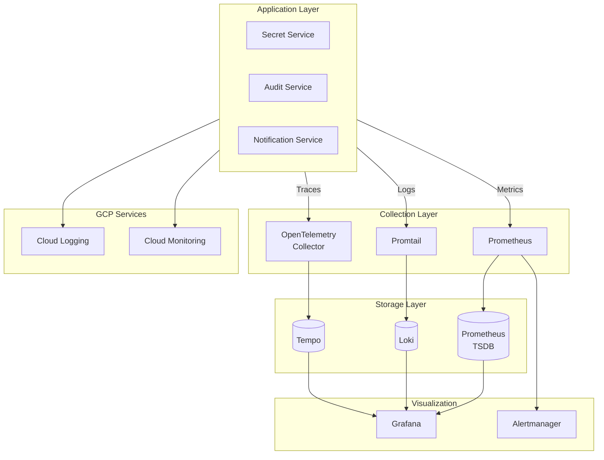
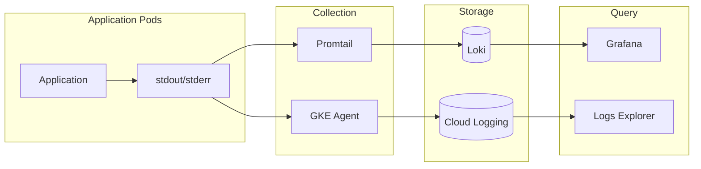
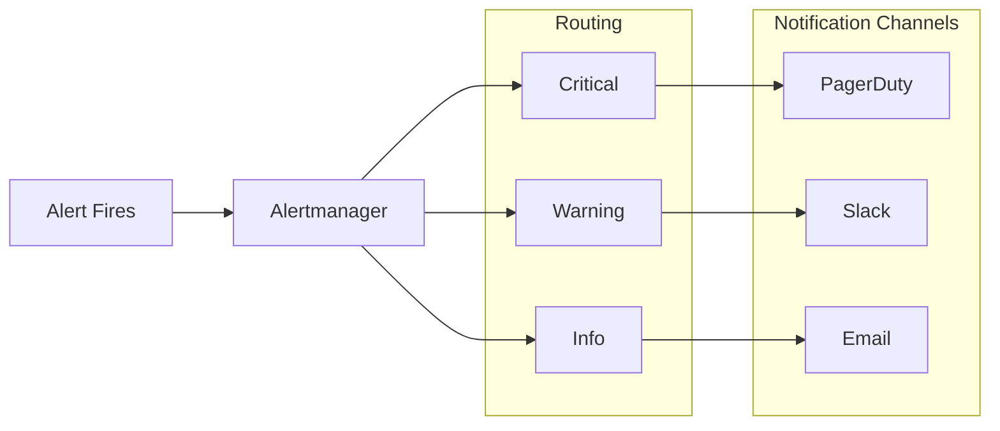

# Monitoring & Observability

> Metrics, logs, traces, and alerting for Cloud Secrets Manager

---

## Overview

The observability stack provides visibility into application health, performance, and behavior. It combines GCP-managed services with self-hosted tools for comprehensive coverage.

---

## Observability Stack



### Component Summary

| Component | Purpose | Deployment |
|-----------|---------|------------|
| **Prometheus** | Metrics collection and storage | Kubernetes (kube-prometheus-stack) |
| **Grafana** | Dashboards and visualization | Kubernetes (kube-prometheus-stack) |
| **Alertmanager** | Alert routing and notifications | Kubernetes (kube-prometheus-stack) |
| **Loki** | Log aggregation | Kubernetes (loki-stack) |
| **Promtail** | Log collection | Kubernetes DaemonSet |
| **Tempo** | Distributed tracing | Kubernetes (planned) |
| **Cloud Logging** | GCP-native log aggregation | Managed service |
| **Cloud Monitoring** | GCP-native metrics | Managed service |

---

## Metrics Collection

### What's Collected

| Category | Metrics | Source |
|----------|---------|--------|
| **JVM** | Heap usage, GC pauses, thread count | Spring Actuator |
| **HTTP** | Request rate, latency, errors | Spring Micrometer |
| **Database** | Connection pool, query time | HikariCP |
| **Business** | Secrets accessed, rotations, failures | Custom metrics |
| **Kubernetes** | CPU, memory, pod status | kube-state-metrics |
| **Node** | CPU, memory, disk, network | node-exporter |

### ServiceMonitors

Prometheus auto-discovers services via ServiceMonitor CRDs:

| ServiceMonitor | Target | Scrape Interval |
|----------------|--------|-----------------|
| `secret-service-monitor` | secret-service:8080 | 30s |
| `audit-service-monitor` | audit-service:8081 | 30s |

### Key Metrics

| Metric | Description | Alert Threshold |
|--------|-------------|-----------------|
| `http_server_requests_seconds` | Request latency histogram | P99 > 1s |
| `jvm_memory_used_bytes` | JVM heap usage | > 85% of limit |
| `hikaricp_connections_active` | DB connection pool | > 80% of max |
| `secret_access_total` | Secrets accessed counter | Anomaly detection |

---

## Logging

### Log Flow



### Log Levels

| Level | Use Case | Retention |
|-------|----------|-----------|
| ERROR | Failures requiring attention | 90 days |
| WARN | Potential issues | 30 days |
| INFO | Normal operations | 14 days |
| DEBUG | Development troubleshooting | 7 days |

### Structured Logging

Applications emit JSON-formatted logs with standard fields:
- `timestamp`: ISO-8601 timestamp
- `level`: Log level
- `message`: Log message
- `service`: Service name
- `traceId`: Distributed trace ID
- `userId`: Request user (if applicable)

---

## Alerting

### Alert Rules

Prometheus alerting rules are defined in `infrastructure/monitoring/alerts/prometheus-rules.yaml`.

| Alert | Severity | Condition | Action |
|-------|----------|-----------|--------|
| `ServiceDown` | Critical | Service unreachable for 1m | Page on-call |
| `HighErrorRate` | Critical | > 1% 5xx errors for 5m | Page on-call |
| `HighLatencyP95` | Warning | P95 > 500ms for 10m | Investigate |
| `HighLatencyP99` | Critical | P99 > 1s for 10m | Page on-call |
| `HighMemoryUsage` | Warning | > 85% memory for 10m | Scale up |
| `DatabaseConnectionExhausted` | Critical | Connection pool full | Investigate |

### Alert Routing



*Assumption: Notification channels (PagerDuty, Slack) are configured but channel details are not committed to the repository.*

---

## Dashboards

### Pre-built Dashboards

| Dashboard | Purpose | Key Panels |
|-----------|---------|------------|
| **Service Overview** | Application health | Request rate, latency, errors |
| **JVM Performance** | Java runtime | Heap, GC, threads |
| **Database** | PostgreSQL health | Connections, query time |
| **Kubernetes** | Cluster health | Pods, nodes, resources |

### Dashboard Organization

Dashboards are stored as ConfigMaps and provisioned automatically via Grafana sidecar.

---

## Troubleshooting Workflows

### High Latency Investigation

1. **Identify scope**: Check which endpoints are affected
2. **Check database**: Query times, connection pool
3. **Check resources**: CPU, memory constraints
4. **Check dependencies**: External service latency
5. **Check logs**: Error patterns, slow queries

### Error Spike Investigation

1. **Identify error type**: 4xx vs 5xx, specific codes
2. **Check recent changes**: Deployments, config changes
3. **Check logs**: Stack traces, error messages
4. **Check upstream**: Database, external APIs
5. **Correlate with metrics**: Resource exhaustion

### Service Unavailability

1. **Check pod status**: Running, CrashLoopBackOff
2. **Check events**: OOMKilled, FailedScheduling
3. **Check probes**: Liveness, readiness failures
4. **Check logs**: Startup errors
5. **Check dependencies**: Database, secrets access

---

## Observability Gaps & Recommendations

### Current Gaps

| Gap | Impact | Recommendation |
|-----|--------|----------------|
| No distributed tracing | Difficult to debug cross-service issues | Deploy Tempo or Jaeger |
| Limited custom metrics | Missing business-level visibility | Add business metrics |
| No SLO dashboards | Manual SLA tracking | Implement SLO-based alerting |
| No runbook links | Slow incident response | Add runbook URLs to alerts |

### Recommended Improvements

1. **Enable distributed tracing** with Tempo and OpenTelemetry
2. **Create SLO dashboards** tracking availability and latency
3. **Add business metrics** for secrets operations
4. **Implement alert annotations** with runbook links
5. **Set up on-call rotation** integrated with Alertmanager

---

## Access Information

| Tool | URL | Credentials |
|------|-----|-------------|
| Grafana | `http://localhost:3001` (port-forward) | admin / admin |
| Prometheus | `http://localhost:9090` (port-forward) | No auth |
| Alertmanager | `http://localhost:9093` (port-forward) | No auth |

### Port-Forward Commands

```bash
# Grafana
kubectl port-forward -n monitoring svc/prometheus-grafana 3001:80

# Prometheus
kubectl port-forward -n monitoring svc/prometheus-kube-prometheus-prometheus 9090:9090

# Alertmanager
kubectl port-forward -n monitoring svc/prometheus-kube-prometheus-alertmanager 9093:9093
```

---

## Related Documentation

- [Kubernetes Architecture](./03-KUBERNETES-ARCHITECTURE.md) - Where monitoring runs
- [Security Architecture](./07-SECURITY-ARCHITECTURE.md) - Audit logging
- [Deployment Workflow](./08-DEPLOYMENT-WORKFLOW.md) - Monitoring in deployments

---

*Last Updated: December 2025*
