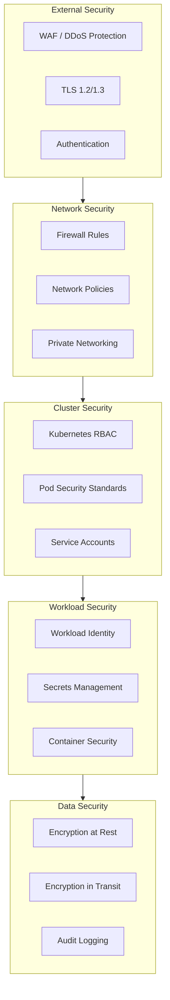
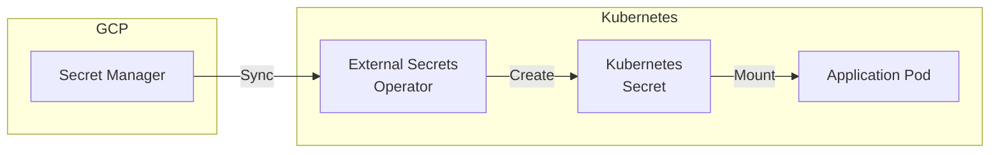
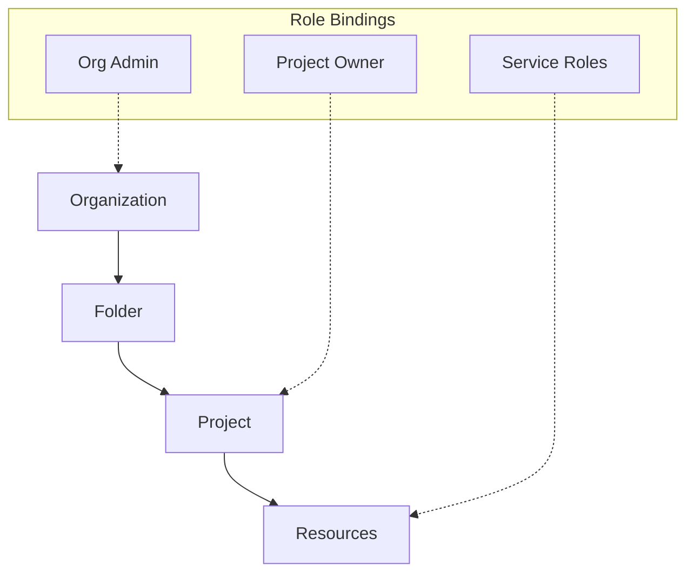
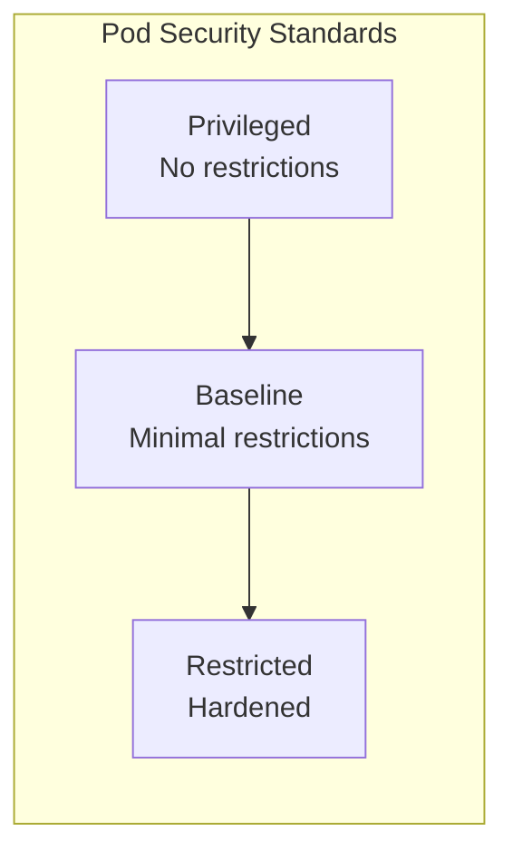
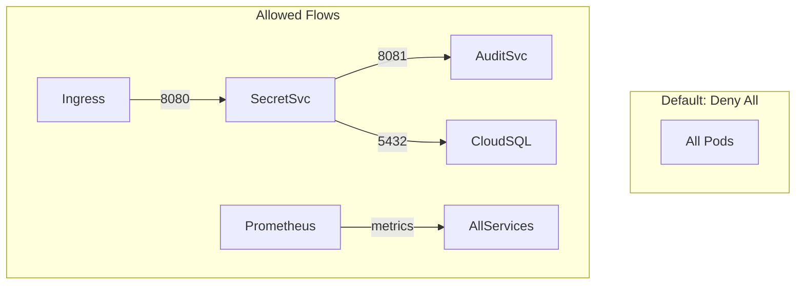

# Security Architecture

> Defense-in-depth security posture for Cloud Secrets Manager

---

## Overview

Cloud Secrets Manager requires enterprise-grade security as it handles sensitive credentials. The security architecture implements defense-in-depth with multiple layers of protection across infrastructure, network, application, and data.

---

## Security Layers

---

## Secrets Management

### Architecture

### Secret Flow

1. **Source of truth**: GCP Secret Manager stores all secrets
2. **Synchronization**: External Secrets Operator syncs to Kubernetes
3. **Consumption**: Applications read from Kubernetes Secrets
4. **Rotation**: Update in Secret Manager, ESO auto-syncs

### Secret Types

| Secret | Storage | Rotation |
|--------|---------|----------|
| Database credentials | Secret Manager | Manual + planned automation |
| JWT signing key | Secret Manager | Periodic rotation |
| AES encryption key | Secret Manager | Periodic rotation |
| Firebase admin key | Secret Manager | Manual |
| API keys | Secret Manager | As needed |

### Best Practices

- **Never commit secrets** to Git
- **Use Secret Manager** as single source of truth
- **Limit secret access** via IAM
- **Rotate credentials** periodically
- **Audit secret access** via Cloud Audit Logs

---

## IAM & Access Control

### GCP IAM Hierarchy

### Least Privilege Principle

Each service account has only required permissions:

| Service | Roles | Justification |
|---------|-------|---------------|
| secret-service | `cloudsql.client`, `secretmanager.secretAccessor` | DB access, secrets read |
| audit-service | `cloudsql.client`, `logging.logWriter` | DB access, log write |
| notification-service | `pubsub.subscriber` | Process notifications |
| external-secrets | `secretmanager.secretAccessor` | Sync secrets |

### Access Boundaries

- **Project-level isolation**: Each environment is a separate project (recommended)
- **Namespace isolation**: Services cannot access other namespaces
- **Service-to-service auth**: mTLS or JWT validation

---

## Kubernetes Security

### RBAC Configuration

Kubernetes RBAC limits what service accounts can do within the cluster:

| ServiceAccount | Namespace | Permissions |
|----------------|-----------|-------------|
| secret-service | cloud-secrets-manager | Read secrets, write logs |
| audit-service | cloud-secrets-manager | Read secrets, write logs |
| prometheus | monitoring | Read metrics from all namespaces |
| external-secrets | external-secrets | Manage secrets |

### Pod Security Standards

Pod Security Standards enforce secure pod configurations:

**Enforcement**:

| Namespace | Level | Mode |
|-----------|-------|------|
| cloud-secrets-manager | Restricted | Enforce |
| monitoring | Baseline | Warn |
| kube-system | Privileged | Audit |

**Restricted Pod Requirements**:
- Run as non-root user
- Drop all capabilities
- Read-only root filesystem
- No privilege escalation
- Seccomp profile: RuntimeDefault

### Network Policies

Zero-trust networking with explicit allow rules:

**Key Policies**:
- Default deny all ingress and egress
- Allow ingress from Ingress Controller
- Allow inter-service communication
- Allow DNS resolution
- Allow GCP metadata server access

---

## Container Security

### Image Security

| Control | Implementation |
|---------|----------------|
| **Base images** | Distroless or Alpine |
| **Multi-stage builds** | Exclude build tools from runtime |
| **Non-root user** | UID 1000, no root privileges |
| **Read-only filesystem** | Writable only for `/tmp` |
| **Vulnerability scanning** | Container Analysis in Cloud Build |

### Runtime Security

| Control | Implementation |
|---------|----------------|
| **Seccomp** | RuntimeDefault profile |
| **AppArmor** | GKE default profile |
| **Capabilities** | All dropped |
| **Shielded nodes** | Secure boot, integrity monitoring |

### Supply Chain Security

| Control | Implementation | Status |
|---------|----------------|--------|
| Image signing | Binary Authorization | Planned |
| SBOM generation | Syft/Trivy | Planned |
| Dependency scanning | Container Analysis | Active |
| Base image updates | Dependabot | Active |

---

## Data Security

### Encryption at Rest

| Data | Encryption | Key Management |
|------|------------|----------------|
| Cloud SQL | Default encryption | Google-managed |
| Secret Manager | AES-256 | Google-managed |
| GCS (state) | Default encryption | Google-managed |
| Kubernetes Secrets | etcd encryption | GKE-managed |

### Encryption in Transit

| Path | Protocol | Certificate |
|------|----------|-------------|
| Client → Load Balancer | TLS 1.2/1.3 | Google-managed or custom |
| Load Balancer → Ingress | HTTPS | Ingress controller |
| Pod → Cloud SQL | Encrypted | Cloud SQL Proxy |
| Pod → Secret Manager | HTTPS | Google APIs |

### Application-Level Encryption

Secrets stored in the database are additionally encrypted:
- **Algorithm**: AES-256-GCM
- **Key**: Stored in Secret Manager
- **Envelope encryption**: Data key encrypted with master key

---

## Audit Logging

### What's Logged

| Event | Source | Retention |
|-------|--------|-----------|
| Secret access | Application | 90 days (Cloud SQL) |
| Secret changes | Application | Permanent (audit table) |
| API calls | GCP Audit Logs | 400 days |
| Authentication | Firebase | 30 days |
| Kubernetes events | Cloud Logging | 30 days |

### Compliance Requirements

*Assumption: The application targets SOC 2 and GDPR compliance based on audit logging patterns.*

| Requirement | Implementation |
|-------------|----------------|
| Access logging | All secret access logged with user/timestamp |
| Immutable logs | Cloud Logging with bucket lock |
| Data residency | EU region (europe-west10) |
| Retention | 90 days minimum, configurable |

---

## CI/CD Hardening

### Pipeline Security

| Control | Implementation |
|---------|----------------|
| Minimal permissions | Cloud Build SA with limited roles |
| No long-lived credentials | Workload Identity for deployments |
| Image scanning | Pre-push vulnerability scan |
| Approval gates | Manual approval for production |

### GitOps Security

- Branch protection on main
- Required reviews for infrastructure changes
- Signed commits (recommended)
- No secrets in repository

---

## Security Checklist

### Initial Setup

- [ ] Enable Workload Identity
- [ ] Configure Network Policies
- [ ] Apply Pod Security Standards
- [ ] Set up External Secrets Operator
- [ ] Enable Cloud Audit Logs
- [ ] Configure IAM with least privilege

### Ongoing Operations

- [ ] Review IAM bindings quarterly
- [ ] Rotate credentials periodically
- [ ] Update base images monthly
- [ ] Review audit logs for anomalies
- [ ] Test disaster recovery

---

## Related Documentation

- [GCP Architecture](./05-GCP-ARCHITECTURE.md) - IAM and identity details
- [Kubernetes Architecture](./03-KUBERNETES-ARCHITECTURE.md) - Network policies
- [Monitoring](./06-MONITORING-OBSERVABILITY.md) - Security monitoring

---

*Last Updated: December 2025*
