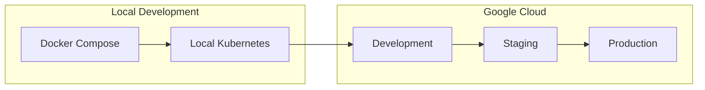
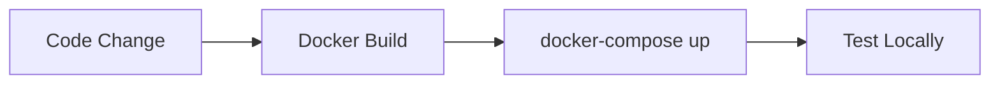
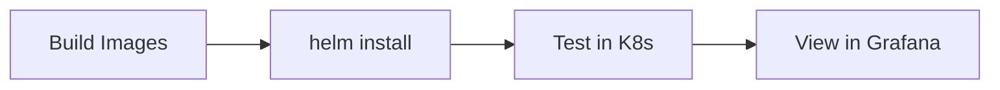
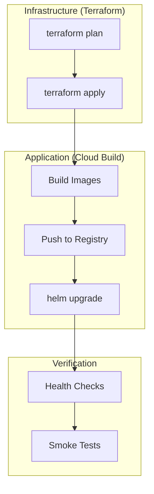
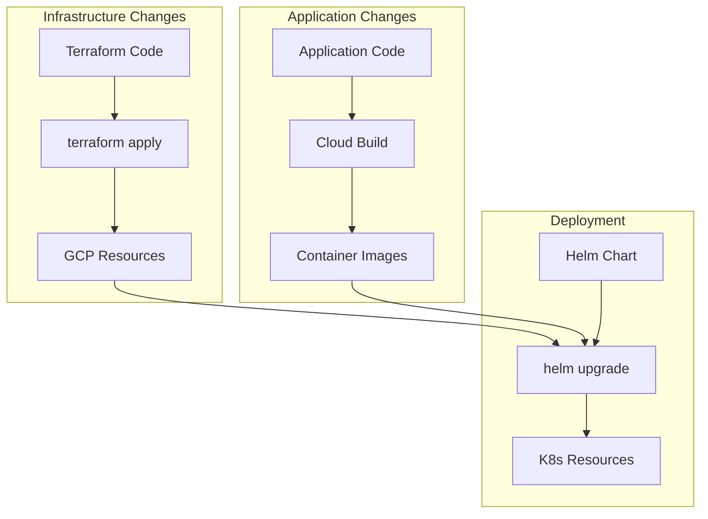

# Deployment Workflow & Environments

> From local development to production deployment

---

## Overview

Cloud Secrets Manager follows a progressive deployment model with distinct environments for development, testing, and production. Each environment has appropriate safeguards and configurations.

---

## Environment Flow



---

## Environment Comparison

| Aspect | Local (Docker) | Local (K8s) | Dev (GCP) | Staging (GCP) | Production (GCP) |
|--------|----------------|-------------|-----------|---------------|------------------|
| **Database** | Local PostgreSQL | Local PostgreSQL | Cloud SQL (small) | Cloud SQL (medium) | Cloud SQL (HA) |
| **Secrets** | .env file | K8s Secrets | Secret Manager + ESO | Secret Manager + ESO | Secret Manager + ESO |
| **Auth** | Optional | Optional | Firebase | Firebase | Firebase |
| **Monitoring** | None | Prometheus/Grafana | Cloud Monitoring | Full stack | Full stack + alerts |
| **Networking** | Docker network | Kind/Docker Desktop | Public nodes | Private nodes | Private nodes |
| **Replicas** | 1 | 1 | 1 | 2 | 3+ |
| **Cost** | Free | Free | ~$5/day | ~$15/day | ~$50/day |

---

## Deployment Methods

### Method 1: Docker Compose (Local Development)

**Best for**: Quick iteration, debugging, no cloud dependencies



**What it provides**:
- PostgreSQL database
- All backend services
- Frontend (optional)
- No Firebase auth by default

### Method 2: Local Kubernetes (Integration Testing)

**Best for**: Testing Helm charts, Kubernetes configs, monitoring



**What it provides**:
- Full Kubernetes environment
- Prometheus + Grafana
- Helm chart validation
- Network policy testing

### Method 3: GCP Deployment (Cloud Environments)

**Best for**: Production-like testing, staging, production



---

## Deployment Steps by Environment

### Local Development (Docker Compose)

1. **Start services**:
   ```bash
   cd docker
   docker compose up --build
   ```

2. **Access**:
   - Backend: http://localhost:8080
   - Frontend: http://localhost:3000
   - Database: localhost:5432

3. **Stop**:
   ```bash
   docker compose down
   ```

### Local Kubernetes (Docker Desktop/Kind)

1. **Build images locally**:
   ```bash
   docker build -t csm/secret-service:local -f apps/backend/secret-service/Dockerfile .
   ```

2. **Deploy with Helm**:
   ```bash
   helm install csm ./infrastructure/helm/cloud-secrets-manager \
     -n csm --create-namespace \
     -f infrastructure/helm/cloud-secrets-manager/values-local.yaml
   ```

3. **Deploy monitoring**:
   ```bash
   ./infrastructure/monitoring/deploy-monitoring.sh
   ```

### Development (GCP)

1. **Provision infrastructure**:
   ```bash
   cd infrastructure/terraform/environments/dev
   terraform plan
   terraform apply
   ```

2. **Get cluster credentials**:
   ```bash
   gcloud container clusters get-credentials cloud-secrets-cluster-dev \
     --region europe-west10
   ```

3. **Deploy application**:
   ```bash
   helm upgrade --install csm ./infrastructure/helm/cloud-secrets-manager \
     -n cloud-secrets-manager --create-namespace \
     -f infrastructure/helm/cloud-secrets-manager/values.yaml
   ```

### Staging (GCP)

1. **Provision infrastructure** (same pattern as dev):
   ```bash
   cd infrastructure/terraform/environments/staging
   terraform apply
   ```

2. **Deploy via Cloud Build** (triggered manually or on schedule)

3. **Run integration tests**

### Production (GCP)

1. **Infrastructure changes require approval**

2. **Deployment requires manual approval in Cloud Build**

3. **Canary deployment** (if configured):
   - Deploy to subset of pods
   - Monitor for errors
   - Roll out to remaining pods

---

## Helm, Terraform, and CI/CD Interaction



### When to Use What

| Change Type | Tool | Process |
|-------------|------|---------|
| New GCP resource | Terraform | PR → Review → terraform apply |
| Application code | Cloud Build | Push → Build → Deploy |
| Kubernetes config | Helm | Update values → helm upgrade |
| Secrets | Secret Manager | Update secret → ESO syncs |
| Environment variables | Helm values | Update values → helm upgrade |

---

## Rollback Procedures

### Application Rollback (Helm)

```bash
# List releases
helm history csm -n cloud-secrets-manager

# Rollback to previous
helm rollback csm -n cloud-secrets-manager

# Rollback to specific revision
helm rollback csm 3 -n cloud-secrets-manager
```

### Infrastructure Rollback (Terraform)

1. Identify previous state version in GCS bucket
2. Download and apply previous state (careful!)
3. Or: Revert Git commit and re-apply

### Database Rollback (Cloud SQL)

1. Point-in-time recovery to before issue
2. Or: Restore from backup

---

## Pre-Deployment Checklist

### Before Staging

- [ ] All tests passing
- [ ] Security scan clean
- [ ] Documentation updated
- [ ] Database migrations tested

### Before Production

- [ ] Staging deployment verified
- [ ] Performance testing completed
- [ ] Rollback plan documented
- [ ] On-call notified
- [ ] Change window scheduled
- [ ] Approval obtained

---

## Post-Deployment Verification

### Automated Checks

1. **Health endpoints**: `/actuator/health` returns 200
2. **Readiness probes**: All pods ready
3. **Basic functionality**: Key API endpoints respond

### Manual Verification

1. Check Grafana dashboards for anomalies
2. Review error logs in Loki
3. Test critical user flows
4. Verify integrations (database, secrets, auth)

---

## Troubleshooting Deployments

### Common Issues

| Issue | Symptoms | Resolution |
|-------|----------|------------|
| Image pull failure | ImagePullBackOff | Check registry permissions |
| Database connection | CrashLoopBackOff | Check Cloud SQL proxy, credentials |
| Secret missing | Pod won't start | Check ESO sync, Secret Manager |
| Resource limits | OOMKilled | Increase memory limits |
| Probe failures | Not ready | Check health endpoint, startup time |

### Diagnostic Commands

```bash
# Check pod events
kubectl describe pod <pod-name> -n cloud-secrets-manager

# Check logs
kubectl logs -f deployment/secret-service -n cloud-secrets-manager

# Check Helm release
helm status csm -n cloud-secrets-manager

# Check ESO sync
kubectl get externalsecrets -n cloud-secrets-manager
```

---

## Related Documentation

- [CI/CD Pipeline](./02-CI-CD-PIPELINE.md) - Automated deployments
- [Kubernetes Architecture](./03-KUBERNETES-ARCHITECTURE.md) - Cluster details
- [Terraform & IaC](./04-TERRAFORM-IAC.md) - Infrastructure provisioning

---

*Last Updated: December 2025*
