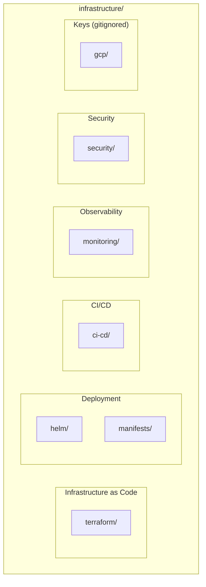

# Recommended Directory Structure Improvements

> Suggestions for a cleaner, more maintainable infrastructure layout

---

## Current Structure Analysis

### Observations

The current `infrastructure/` directory has evolved organically, leading to some inconsistencies:

| Issue | Location | Impact |
|-------|----------|--------|
| **Duplicate configs** | `kubernetes/k8s/` vs `helm/` | Confusion about source of truth |
| **Scattered monitoring** | `kubernetes/monitoring/` vs `monitoring/` | Duplicate deploy scripts |
| **Missing production env** | `terraform/environments/` | Incomplete environment set |
| **No GCP directory** | `gcp/keys/` (in README) | Inconsistent with actual structure |
| **Mixed concerns** | `kubernetes/` has both raw manifests and monitoring | Unclear organization |

### Current Layout

```
infrastructure/
├── ci-cd/                    ✓ Clear purpose
├── helm/                     ✓ Well organized
├── kubernetes/               ⚠ Mixed concerns
│   ├── k8s/                  ⚠ Overlaps with Helm
│   ├── monitoring/           ⚠ Duplicates monitoring/
│   ├── loki-pv*.yaml         ⚠ Scattered files
│   └── README.md
├── monitoring/               ✓ Clear purpose
├── security/                 ✓ Clear purpose
├── terraform/                ✓ Well organized
└── README.md
```

---

## Recommended Structure



### Proposed Layout

```
infrastructure/
├── README.md                           # Overview and quick reference
│
├── terraform/                          # Infrastructure as Code
│   ├── modules/                        # Reusable modules
│   │   ├── artifact-registry/
│   │   ├── gke-cluster/
│   │   ├── postgresql/
│   │   ├── iam/
│   │   ├── billing-budget/
│   │   └── networking/                 # NEW: VPC, firewall, NAT
│   ├── environments/
│   │   ├── dev/
│   │   ├── staging/
│   │   └── production/                 # NEW: Production environment
│   └── README.md
│
├── helm/                               # Kubernetes package management
│   ├── cloud-secrets-manager/          # Application chart
│   │   ├── Chart.yaml
│   │   ├── values.yaml                 # Base values
│   │   ├── values-local.yaml           # Local development
│   │   ├── values-dev.yaml             # RENAMED from values.yaml
│   │   ├── values-staging.yaml
│   │   ├── values-production.yaml
│   │   └── templates/
│   ├── monitoring/                     # NEW: Monitoring chart values
│   │   ├── prometheus-values.yaml
│   │   └── loki-values.yaml
│   └── README.md
│
├── manifests/                          # RENAMED from kubernetes/k8s/
│   ├── base/                           # Base manifests (if using Kustomize)
│   ├── overlays/                       # Environment overlays
│   │   ├── dev/
│   │   ├── staging/
│   │   └── production/
│   ├── external-secrets/               # External Secrets configs
│   │   └── cluster-secret-store.yaml
│   └── README.md
│
├── ci-cd/                              # CI/CD pipelines
│   ├── cloudbuild.yaml                 # Base configuration
│   ├── cloudbuild-dev.yaml
│   ├── cloudbuild-staging.yaml
│   ├── cloudbuild-production.yaml
│   └── README.md
│
├── monitoring/                         # Observability stack
│   ├── alerts/                         # Prometheus alert rules
│   │   └── prometheus-rules.yaml
│   ├── dashboards/                     # Grafana dashboards
│   │   └── *.json
│   ├── servicemonitors/                # ServiceMonitor definitions
│   │   ├── secret-service.yaml
│   │   └── audit-service.yaml
│   ├── tracing/                        # Distributed tracing (Tempo)
│   │   └── tempo.yaml
│   ├── deploy-monitoring.sh            # Deployment script
│   ├── DEPLOYMENT_GUIDE.md
│   └── README.md
│
├── security/                           # Security policies
│   ├── network-policies/               # REORGANIZED
│   │   ├── default-deny.yaml
│   │   ├── secret-service.yaml
│   │   ├── audit-service.yaml
│   │   └── monitoring.yaml
│   ├── pod-security/                   # REORGANIZED
│   │   └── restricted-standards.yaml
│   ├── rbac/                           # NEW: RBAC configurations
│   │   └── service-accounts.yaml
│   └── README.md
│
├── gcp/                                # NEW: GCP-specific configs
│   ├── keys/                           # Service account keys (gitignored)
│   └── README.md
│
└── scripts/                            # NEW: Utility scripts
    ├── setup-local-k8s.sh
    ├── deploy-to-gcp.sh
    └── rotate-secrets.sh
```

---

## Detailed Recommendations

### 1. Consolidate Kubernetes Manifests

**Problem**: `kubernetes/k8s/` contains raw manifests that overlap with Helm templates.

**Solution**: 
- Move necessary manifests to `manifests/`
- Use Helm as primary deployment method
- Keep raw manifests only for resources not managed by Helm (e.g., ExternalSecrets CRDs)

### 2. Unify Monitoring Configuration

**Problem**: Monitoring configs scattered between `kubernetes/monitoring/` and `monitoring/`.

**Solution**:
- Single `monitoring/` directory
- Move Helm values to `helm/monitoring/`
- Keep alerts, dashboards, and ServiceMonitors in `monitoring/`

### 3. Add Production Environment

**Problem**: No production Terraform configuration.

**Solution**:
- Create `terraform/environments/production/` with production-grade settings
- Enable deletion protection, HA, proper sizing

### 4. Create GCP Directory

**Problem**: `infrastructure/gcp/` mentioned in README but doesn't exist.

**Solution**:
- Create `gcp/` for GCP-specific configs
- Store (gitignored) service account keys here
- Add README explaining key management

### 5. Add Scripts Directory

**Problem**: Utility scripts mixed with configuration.

**Solution**:
- Create `scripts/` for operational scripts
- Include setup, deployment, and maintenance scripts

### 6. Reorganize Security Policies

**Problem**: Security policies in flat structure.

**Solution**:
- Separate network policies, pod security, and RBAC
- Clearer organization for different policy types

---

## Migration Steps

### Phase 1: Low-Risk Reorganization

1. Create new directories (`manifests/`, `gcp/`, `scripts/`)
2. Move scripts to `scripts/`
3. Create `gcp/README.md` with key management instructions
4. Update documentation references

### Phase 2: Manifest Consolidation

1. Audit what's in `kubernetes/k8s/`
2. Determine which manifests are needed vs. covered by Helm
3. Move necessary manifests to `manifests/`
4. Remove `kubernetes/` directory

### Phase 3: Monitoring Unification

1. Consolidate monitoring configs in `monitoring/`
2. Move Helm values to `helm/monitoring/`
3. Update deployment scripts
4. Remove duplicate configs

### Phase 4: Add Missing Environments

1. Create `terraform/environments/production/`
2. Add production Helm values
3. Document production deployment process

---

## Files to Remove

| File/Directory | Reason |
|----------------|--------|
| `kubernetes/k8s/` | Covered by Helm charts |
| `kubernetes/monitoring/` | Duplicates `monitoring/` |
| `kubernetes/loki-pv*.yaml` | Move to `manifests/` or remove |

## Files to Add

| File/Directory | Purpose |
|----------------|---------|
| `terraform/environments/production/` | Production infrastructure |
| `manifests/` | Non-Helm Kubernetes resources |
| `gcp/` | GCP-specific configuration |
| `scripts/` | Operational scripts |
| `security/rbac/` | RBAC configurations |

---

## Documentation Gaps

### Missing Documentation

| Document | Location | Content |
|----------|----------|---------|
| Helm Chart Reference | `helm/README.md` | Values documentation |
| Runbooks | `docs/runbooks/` | Operational procedures |
| Architecture Decision Records | `docs/adr/` | Design decisions |
| Disaster Recovery | `docs/infrastructure/` | DR procedures |

### Recommended Additions

1. **Helm values reference**: Document all configurable values
2. **Runbooks**: Step-by-step guides for common operations
3. **ADRs**: Record why architectural decisions were made
4. **DR plan**: Document recovery procedures

---

## Implementation Priority

| Priority | Change | Effort | Impact |
|----------|--------|--------|--------|
| **High** | Add production Terraform | Medium | Enables production deployment |
| **High** | Consolidate monitoring | Low | Reduces confusion |
| **Medium** | Reorganize manifests | Medium | Cleaner structure |
| **Medium** | Add scripts directory | Low | Better organization |
| **Low** | Security reorganization | Low | Marginal improvement |

---

## Related Documentation

- [Overview](./01-OVERVIEW.md) - Infrastructure overview
- [Terraform & IaC](./04-TERRAFORM-IAC.md) - Current Terraform structure
- [Kubernetes Architecture](./03-KUBERNETES-ARCHITECTURE.md) - Current K8s structure

---

*Last Updated: December 2025*
