# Cloud Secrets Manager - Comprehensive Feature Analysis

## Table of Contents
1. [System Architecture](#system-architecture)
2. [Authentication & Authorization](#authentication--authorization)
3. [Project Management](#project-management)
4. [Secret Management](#secret-management)
5. [Team Management](#team-management)
6. [Workflow Management](#workflow-management)
7. [Invitation System](#invitation-system)
8. [Activity & Audit Logging](#activity--audit-logging)
9. [User Preferences](#user-preferences)
10. [Database Schema](#database-schema)
11. [API Endpoints](#api-endpoints)

---

## System Architecture

### High-Level Architecture
 
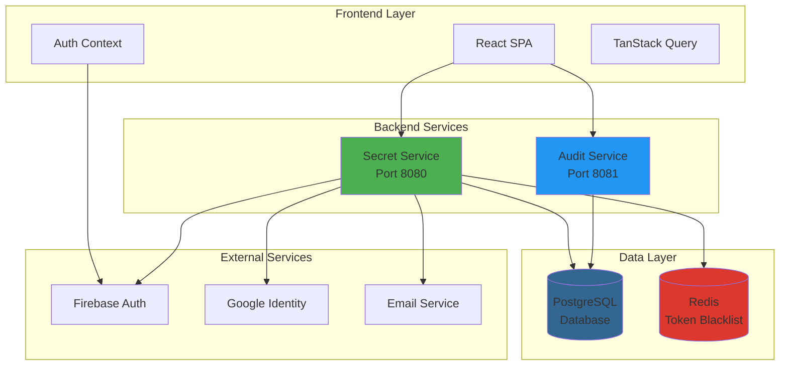
```mermaid
graph TB
    subgraph "Frontend Layer"
        UI[React SPA]
        AuthCtx[Auth Context]
        Query[TanStack Query]
    end
    
    subgraph "Backend Services"
        SecretService[Secret Service<br/>Port 8080]
        AuditService[Audit Service<br/>Port 8081]
    end
    
    subgraph "External Services"
        Firebase[Firebase Auth]
        Google[Google Identity]
        Email[Email Service]
    end
    
    subgraph "Data Layer"
        Postgres[(PostgreSQL<br/>Database)]
        Redis[(Redis<br/>Token Blacklist)]
    end
    
    UI --> SecretService
    UI --> AuditService
    AuthCtx --> Firebase
    SecretService --> Postgres
    SecretService --> Redis
    SecretService --> Firebase
    SecretService --> Google
    SecretService --> Email
    AuditService --> Postgres
    
    style SecretService fill:#4CAF50
    style AuditService fill:#2196F3
    style Postgres fill:#336791
    style Redis fill:#DC382D
```

### Component Architecture

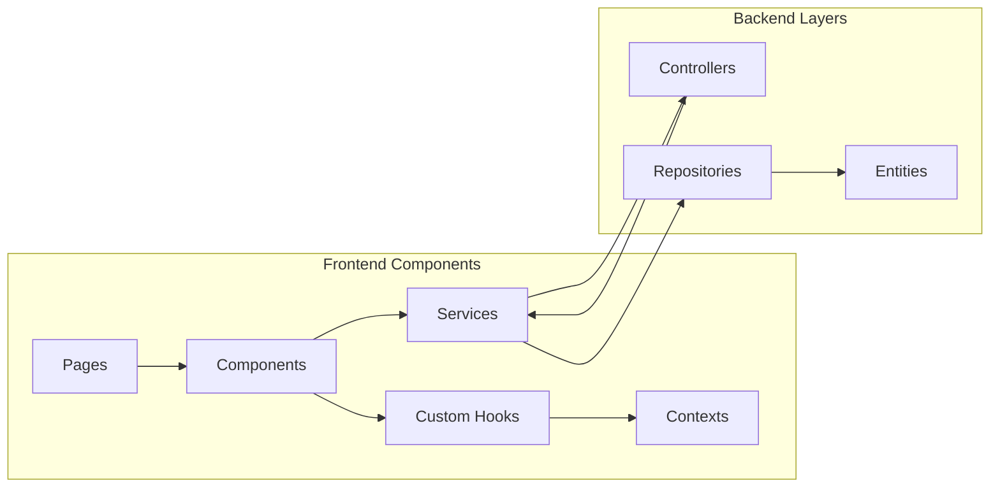
```mermaid
graph LR
    subgraph "Frontend Components"
        Pages[Pages]
        Components[Components]
        Services[API Services]
        Hooks[Custom Hooks]
        Contexts[Contexts]
    end
    
    subgraph "Backend Layers"
        Controllers[Controllers]
        Services[Services]
        Repositories[Repositories]
        Entities[Entities]
    end
    
    Pages --> Components
    Components --> Services
    Components --> Hooks
    Hooks --> Contexts
    Services --> Controllers
    Controllers --> Services
    Services --> Repositories
    Repositories --> Entities
```

---

## Authentication & Authorization

### Authentication Flow

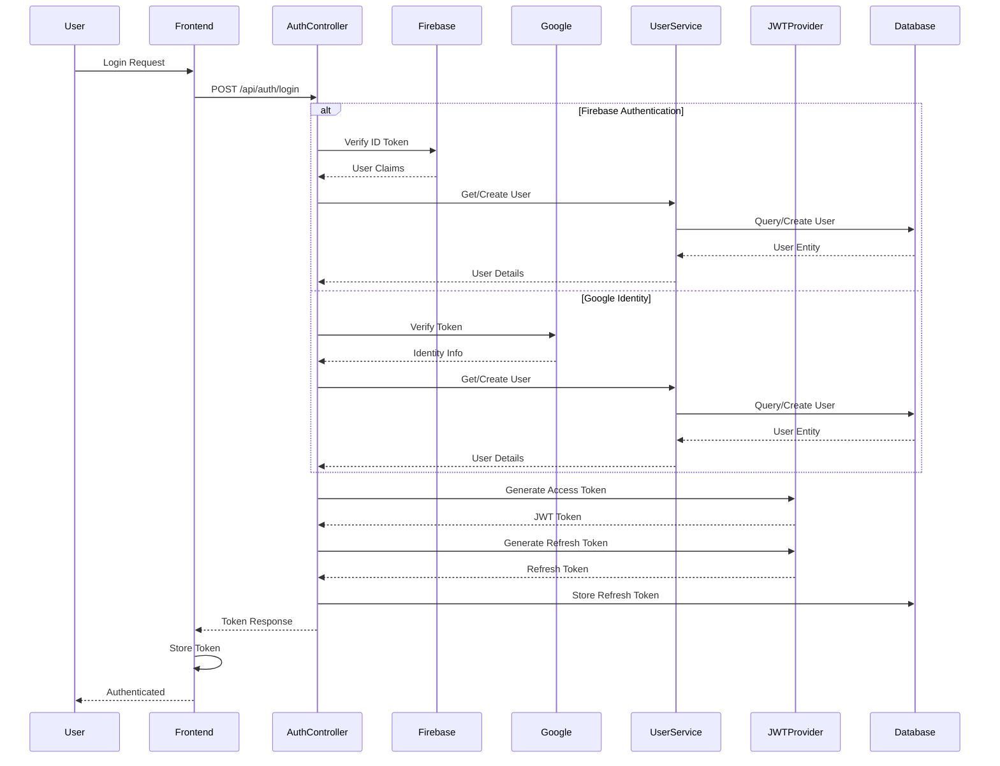
```mermaid
sequenceDiagram
    participant User
    participant Frontend
    participant AuthController
    participant Firebase
    participant Google
    participant UserService
    participant JWTProvider
    participant Database

    User->>Frontend: Login Request
    Frontend->>AuthController: POST /api/auth/login
    
    alt Firebase Authentication
        AuthController->>Firebase: Verify ID Token
        Firebase-->>AuthController: User Claims
        AuthController->>UserService: Get/Create User
        UserService->>Database: Query/Create User
        Database-->>UserService: User Entity
        UserService-->>AuthController: User Details
    else Google Identity
        AuthController->>Google: Verify Token
        Google-->>AuthController: Identity Info
        AuthController->>UserService: Get/Create User
        UserService->>Database: Query/Create User
        Database-->>UserService: User Entity
        UserService-->>AuthController: User Details
    end
    
    AuthController->>JWTProvider: Generate Access Token
    JWTProvider-->>AuthController: JWT Token
    AuthController->>JWTProvider: Generate Refresh Token
    JWTProvider-->>AuthController: Refresh Token
    AuthController->>Database: Store Refresh Token
    AuthController-->>Frontend: Token Response
    Frontend->>Frontend: Store Token
    Frontend-->>User: Authenticated
```

### Token Refresh Flow

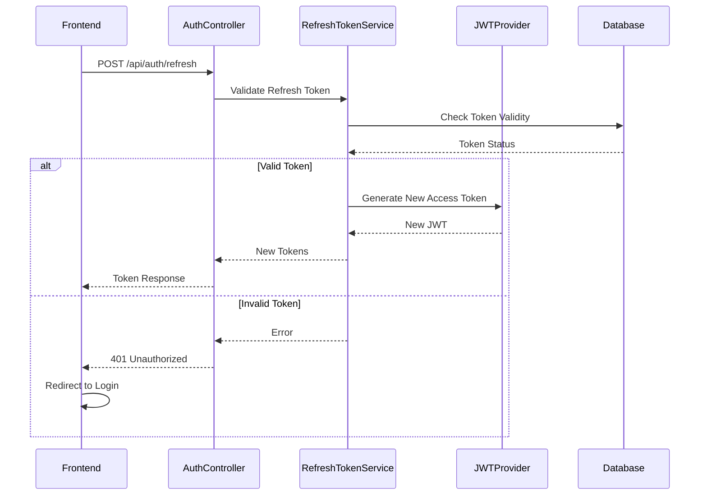
```mermaid
sequenceDiagram
    participant Frontend
    participant AuthController
    participant RefreshTokenService
    participant JWTProvider
    participant Database

    Frontend->>AuthController: POST /api/auth/refresh
    AuthController->>RefreshTokenService: Validate Refresh Token
    RefreshTokenService->>Database: Check Token Validity
    Database-->>RefreshTokenService: Token Status
    
    alt Valid Token
        RefreshTokenService->>JWTProvider: Generate New Access Token
        JWTProvider-->>RefreshTokenService: New JWT
        RefreshTokenService-->>AuthController: New Tokens
        AuthController-->>Frontend: Token Response
    else Invalid Token
        RefreshTokenService-->>AuthController: Error
        AuthController-->>Frontend: 401 Unauthorized
        Frontend->>Frontend: Redirect to Login
    end
```

### Authorization Flow (Project-Scoped RBAC)

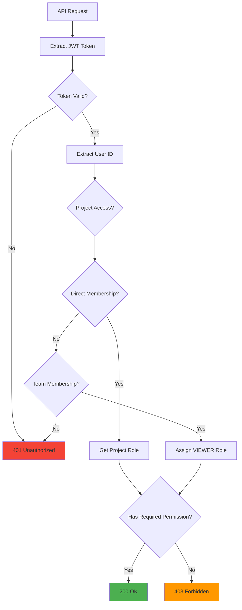
```mermaid
graph TD
    Start[API Request] --> ExtractToken[Extract JWT Token]
    ExtractToken --> ValidateToken{Token Valid?}
    ValidateToken -->|No| Reject[401 Unauthorized]
    ValidateToken -->|Yes| ExtractUser[Extract User ID]
    ExtractUser --> CheckProjectAccess{Project Access?}
    
    CheckProjectAccess --> CheckDirectMembership{Direct Membership?}
    CheckDirectMembership -->|Yes| GetRole[Get Project Role]
    CheckDirectMembership -->|No| CheckTeamMembership{Team Membership?}
    CheckTeamMembership -->|Yes| AssignViewer[Assign VIEWER Role]
    CheckTeamMembership -->|No| Reject
    
    GetRole --> CheckPermission{Has Required Permission?}
    AssignViewer --> CheckPermission
    CheckPermission -->|Yes| Allow[200 OK]
    CheckPermission -->|No| Forbid[403 Forbidden]
    
    style Allow fill:#4CAF50
    style Reject fill:#F44336
    style Forbid fill:#FF9800
```

### Role Hierarchy

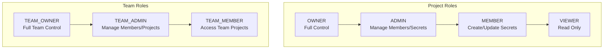
```mermaid
graph TD
    subgraph "Project Roles"
        OWNER[OWNER<br/>Full Control]
        ADMIN[ADMIN<br/>Manage Members/Secrets]
        MEMBER[MEMBER<br/>Create/Update Secrets]
        VIEWER[VIEWER<br/>Read Only]
    end
    
    subgraph "Team Roles"
        TEAM_OWNER[TEAM_OWNER<br/>Full Team Control]
        TEAM_ADMIN[TEAM_ADMIN<br/>Manage Members/Projects]
        TEAM_MEMBER[TEAM_MEMBER<br/>Access Team Projects]
    end
    
    OWNER --> ADMIN
    ADMIN --> MEMBER
    MEMBER --> VIEWER
    
    TEAM_OWNER --> TEAM_ADMIN
    TEAM_ADMIN --> TEAM_MEMBER
```

---

## Project Management

### Project Creation Flow

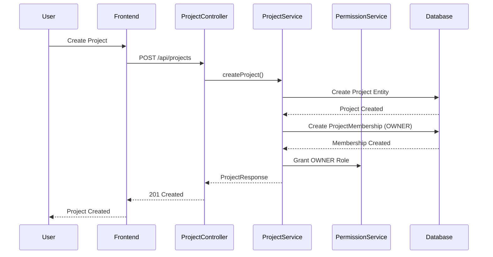
```mermaid
sequenceDiagram
    participant User
    participant Frontend
    participant ProjectController
    participant ProjectService
    participant PermissionService
    participant Database

    User->>Frontend: Create Project
    Frontend->>ProjectController: POST /api/projects
    ProjectController->>ProjectService: createProject()
    ProjectService->>Database: Create Project Entity
    Database-->>ProjectService: Project Created
    ProjectService->>Database: Create ProjectMembership (OWNER)
    Database-->>ProjectService: Membership Created
    ProjectService->>PermissionService: Grant OWNER Role
    ProjectService-->>ProjectController: ProjectResponse
    ProjectController-->>Frontend: 201 Created
    Frontend-->>User: Project Created
```

### Project Access Flow

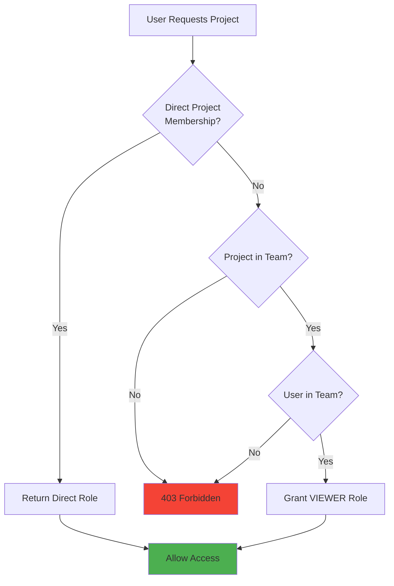
```mermaid
graph TD
    Start[User Requests Project] --> CheckDirectMembership{Direct Project<br/>Membership?}
    CheckDirectMembership -->|Yes| ReturnDirectRole[Return Direct Role]
    CheckDirectMembership -->|No| CheckTeamAccess{Project in Team?}
    CheckTeamAccess -->|No| DenyAccess[403 Forbidden]
    CheckTeamAccess -->|Yes| CheckTeamMembership{User in Team?}
    CheckTeamMembership -->|No| DenyAccess
    CheckTeamMembership -->|Yes| GrantViewer[Grant VIEWER Role]
    ReturnDirectRole --> AllowAccess[Allow Access]
    GrantViewer --> AllowAccess
    
    style AllowAccess fill:#4CAF50
    style DenyAccess fill:#F44336
```

### Project List Flow

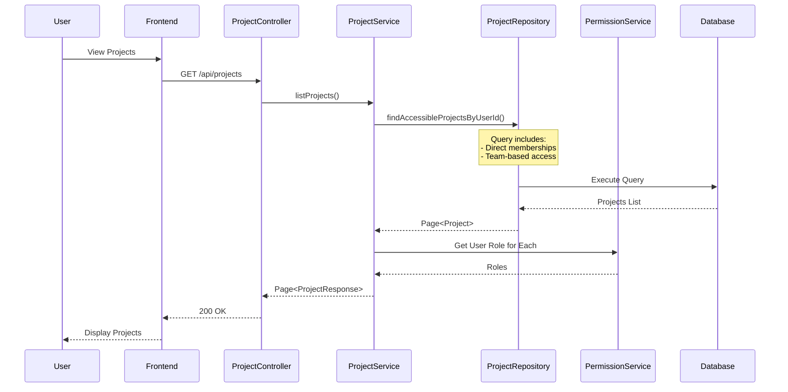
```mermaid
sequenceDiagram
    participant User
    participant Frontend
    participant ProjectController
    participant ProjectService
    participant ProjectRepository
    participant PermissionService
    participant Database

    User->>Frontend: View Projects
    Frontend->>ProjectController: GET /api/projects
    ProjectController->>ProjectService: listProjects()
    ProjectService->>ProjectRepository: findAccessibleProjectsByUserId()
    
    Note over ProjectRepository: Query includes:<br/>- Direct memberships<br/>- Team-based access
    
    ProjectRepository->>Database: Execute Query
    Database-->>ProjectRepository: Projects List
    ProjectRepository-->>ProjectService: Page<Project>
    ProjectService->>PermissionService: Get User Role for Each
    PermissionService-->>ProjectService: Roles
    ProjectService-->>ProjectController: Page<ProjectResponse>
    ProjectController-->>Frontend: 200 OK
    Frontend-->>User: Display Projects
```

---

## Secret Management

### Secret Creation Flow

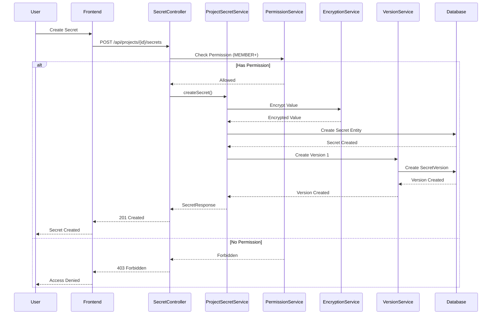
```mermaid
sequenceDiagram
    participant User
    participant Frontend
    participant SecretController
    participant ProjectSecretService
    participant PermissionService
    participant EncryptionService
    participant VersionService
    participant Database

    User->>Frontend: Create Secret
    Frontend->>SecretController: POST /api/projects/{id}/secrets
    SecretController->>PermissionService: Check Permission (MEMBER+)
    
    alt Has Permission
        PermissionService-->>SecretController: Allowed
        SecretController->>ProjectSecretService: createSecret()
        ProjectSecretService->>EncryptionService: Encrypt Value
        EncryptionService-->>ProjectSecretService: Encrypted Value
        ProjectSecretService->>Database: Create Secret Entity
        Database-->>ProjectSecretService: Secret Created
        ProjectSecretService->>VersionService: Create Version 1
        VersionService->>Database: Create SecretVersion
        Database-->>VersionService: Version Created
        VersionService-->>ProjectSecretService: Version Created
        ProjectSecretService-->>SecretController: SecretResponse
        SecretController-->>Frontend: 201 Created
        Frontend-->>User: Secret Created
    else No Permission
        PermissionService-->>SecretController: Forbidden
        SecretController-->>Frontend: 403 Forbidden
        Frontend-->>User: Access Denied
    end
```

### Secret Retrieval Flow

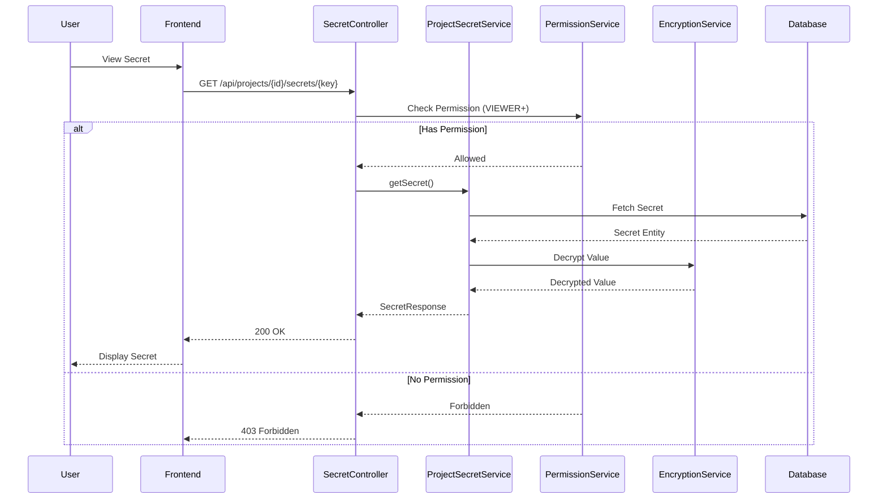
```mermaid
sequenceDiagram
    participant User
    participant Frontend
    participant SecretController
    participant ProjectSecretService
    participant PermissionService
    participant EncryptionService
    participant Database

    User->>Frontend: View Secret
    Frontend->>SecretController: GET /api/projects/{id}/secrets/{key}
    SecretController->>PermissionService: Check Permission (VIEWER+)
    
    alt Has Permission
        PermissionService-->>SecretController: Allowed
        SecretController->>ProjectSecretService: getSecret()
        ProjectSecretService->>Database: Fetch Secret
        Database-->>ProjectSecretService: Secret Entity
        ProjectSecretService->>EncryptionService: Decrypt Value
        EncryptionService-->>ProjectSecretService: Decrypted Value
        ProjectSecretService-->>SecretController: SecretResponse
        SecretController-->>Frontend: 200 OK
        Frontend-->>User: Display Secret
    else No Permission
        PermissionService-->>SecretController: Forbidden
        SecretController-->>Frontend: 403 Forbidden
    end
```

### Secret Update & Versioning Flow

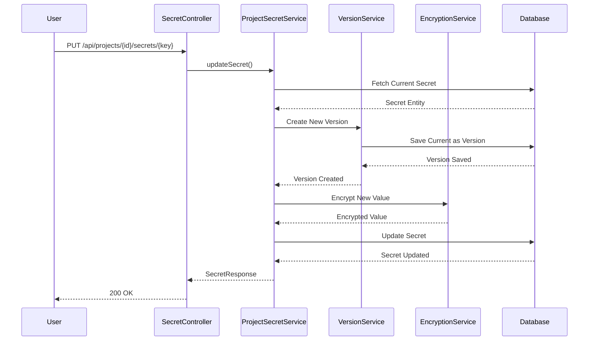
```mermaid
sequenceDiagram
    participant User
    participant SecretController
    participant ProjectSecretService
    participant VersionService
    participant EncryptionService
    participant Database

    User->>SecretController: PUT /api/projects/{id}/secrets/{key}
    SecretController->>ProjectSecretService: updateSecret()
    ProjectSecretService->>Database: Fetch Current Secret
    Database-->>ProjectSecretService: Secret Entity
    ProjectSecretService->>VersionService: Create New Version
    VersionService->>Database: Save Current as Version
    Database-->>VersionService: Version Saved
    VersionService-->>ProjectSecretService: Version Created
    ProjectSecretService->>EncryptionService: Encrypt New Value
    EncryptionService-->>ProjectSecretService: Encrypted Value
    ProjectSecretService->>Database: Update Secret
    Database-->>ProjectSecretService: Secret Updated
    ProjectSecretService-->>SecretController: SecretResponse
    SecretController-->>User: 200 OK
```

### Secret Rotation Flow

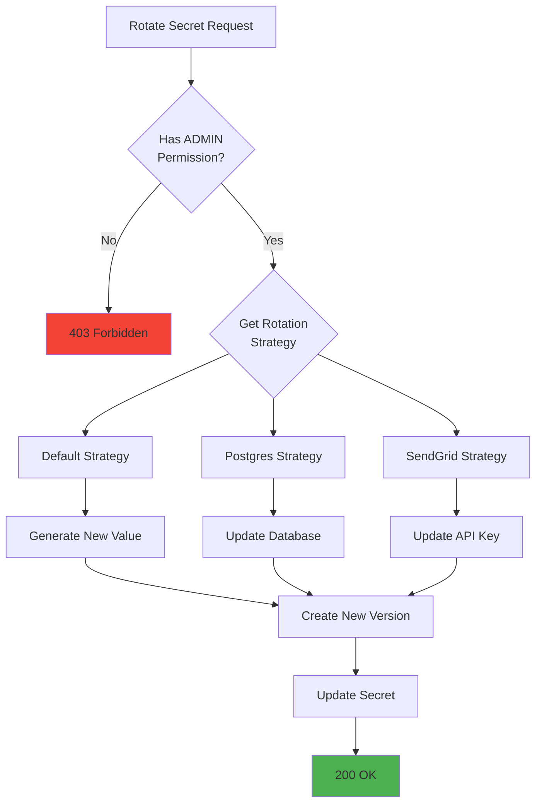
```mermaid
graph TD
    Start[Rotate Secret Request] --> CheckPermission{Has ADMIN<br/>Permission?}
    CheckPermission -->|No| Deny[403 Forbidden]
    CheckPermission -->|Yes| GetStrategy{Get Rotation<br/>Strategy}
    GetStrategy --> Default[Default Strategy]
    GetStrategy --> Postgres[Postgres Strategy]
    GetStrategy --> SendGrid[SendGrid Strategy]
    
    Default --> GenerateNew[Generate New Value]
    Postgres --> UpdateDB[Update Database]
    SendGrid --> UpdateAPI[Update API Key]
    
    GenerateNew --> CreateVersion[Create New Version]
    UpdateDB --> CreateVersion
    UpdateAPI --> CreateVersion
    
    CreateVersion --> UpdateSecret[Update Secret]
    UpdateSecret --> Success[200 OK]
    
    style Success fill:#4CAF50
    style Deny fill:#F44336
```

---

## Team Management

### Team Creation Flow

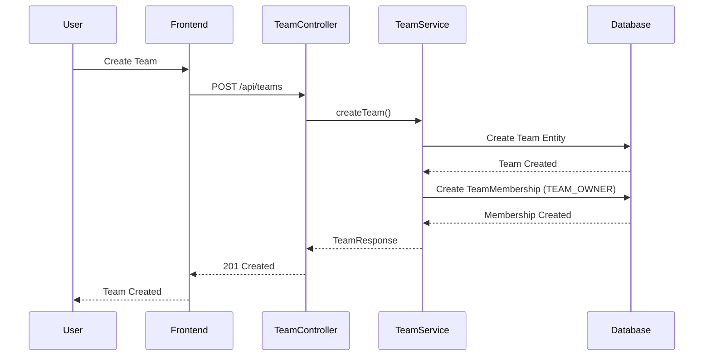
```mermaid
sequenceDiagram
    participant User
    participant Frontend
    participant TeamController
    participant TeamService
    participant Database

    User->>Frontend: Create Team
    Frontend->>TeamController: POST /api/teams
    TeamController->>TeamService: createTeam()
    TeamService->>Database: Create Team Entity
    Database-->>TeamService: Team Created
    TeamService->>Database: Create TeamMembership (TEAM_OWNER)
    Database-->>TeamService: Membership Created
    TeamService-->>TeamController: TeamResponse
    TeamController-->>Frontend: 201 Created
    Frontend-->>User: Team Created
```

### Add Member to Team Flow

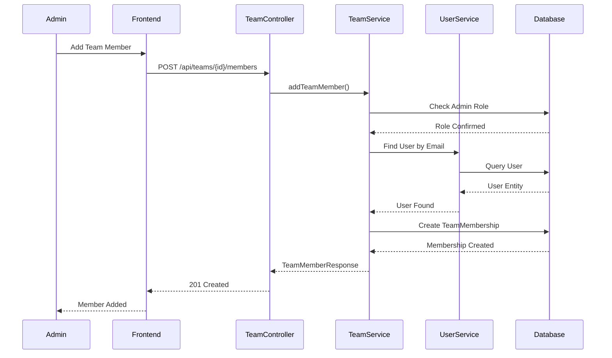
```mermaid
sequenceDiagram
    participant Admin
    participant Frontend
    participant TeamController
    participant TeamService
    participant UserService
    participant Database

    Admin->>Frontend: Add Team Member
    Frontend->>TeamController: POST /api/teams/{id}/members
    TeamController->>TeamService: addTeamMember()
    
    TeamService->>Database: Check Admin Role
    Database-->>TeamService: Role Confirmed
    
    TeamService->>UserService: Find User by Email
    UserService->>Database: Query User
    Database-->>UserService: User Entity
    UserService-->>TeamService: User Found
    
    TeamService->>Database: Create TeamMembership
    Database-->>TeamService: Membership Created
    TeamService-->>TeamController: TeamMemberResponse
    TeamController-->>Frontend: 201 Created
    Frontend-->>Admin: Member Added
```

### Add Project to Team Flow

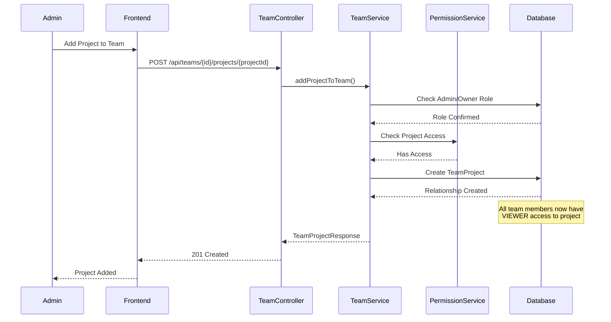
```mermaid
sequenceDiagram
    participant Admin
    participant Frontend
    participant TeamController
    participant TeamService
    participant PermissionService
    participant Database

    Admin->>Frontend: Add Project to Team
    Frontend->>TeamController: POST /api/teams/{id}/projects/{projectId}
    TeamController->>TeamService: addProjectToTeam()
    
    TeamService->>Database: Check Admin/Owner Role
    Database-->>TeamService: Role Confirmed
    
    TeamService->>PermissionService: Check Project Access
    PermissionService-->>TeamService: Has Access
    
    TeamService->>Database: Create TeamProject
    Database-->>TeamService: Relationship Created
    
    Note over Database: All team members now have<br/>VIEWER access to project
    
    TeamService-->>TeamController: TeamProjectResponse
    TeamController-->>Frontend: 201 Created
    Frontend-->>Admin: Project Added
```

### Team-Based Project Access Flow

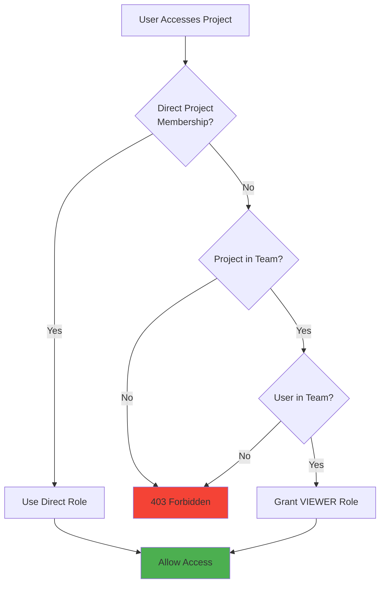
```mermaid
graph TD
    Start[User Accesses Project] --> CheckDirect{Direct Project<br/>Membership?}
    CheckDirect -->|Yes| UseDirectRole[Use Direct Role]
    CheckDirect -->|No| CheckTeam{Project in Team?}
    CheckTeam -->|No| Deny[403 Forbidden]
    CheckTeam -->|Yes| CheckMember{User in Team?}
    CheckMember -->|No| Deny
    CheckMember -->|Yes| GrantViewer[Grant VIEWER Role]
    UseDirectRole --> Allow[Allow Access]
    GrantViewer --> Allow
    
    style Allow fill:#4CAF50
    style Deny fill:#F44336
```

---

## Workflow Management

### Workflow Creation Flow

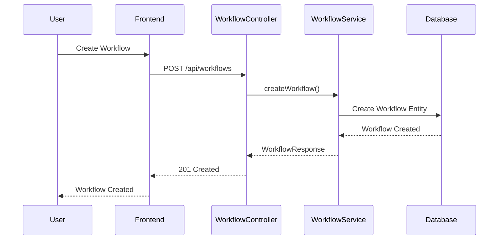
```mermaid
sequenceDiagram
    participant User
    participant Frontend
    participant WorkflowController
    participant WorkflowService
    participant Database

    User->>Frontend: Create Workflow
    Frontend->>WorkflowController: POST /api/workflows
    WorkflowController->>WorkflowService: createWorkflow()
    WorkflowService->>Database: Create Workflow Entity
    Database-->>WorkflowService: Workflow Created
    WorkflowService-->>WorkflowController: WorkflowResponse
    WorkflowController-->>Frontend: 201 Created
    Frontend-->>User: Workflow Created
```

### Add Project to Workflow Flow

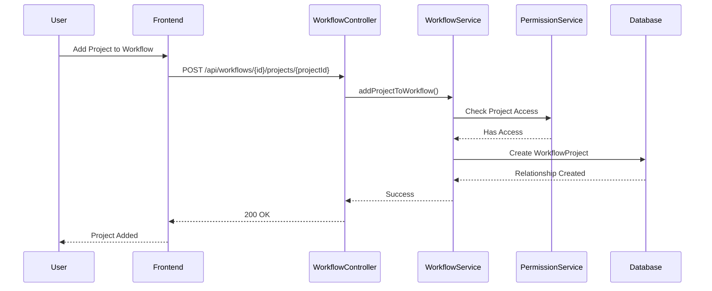
```mermaid
sequenceDiagram
    participant User
    participant Frontend
    participant WorkflowController
    participant WorkflowService
    participant PermissionService
    participant Database

    User->>Frontend: Add Project to Workflow
    Frontend->>WorkflowController: POST /api/workflows/{id}/projects/{projectId}
    WorkflowController->>WorkflowService: addProjectToWorkflow()
    
    WorkflowService->>PermissionService: Check Project Access
    PermissionService-->>WorkflowService: Has Access
    
    WorkflowService->>Database: Create WorkflowProject
    Database-->>WorkflowService: Relationship Created
    WorkflowService-->>WorkflowController: Success
    WorkflowController-->>Frontend: 200 OK
    Frontend-->>User: Project Added
```

---

## Invitation System

### Project Invitation Flow

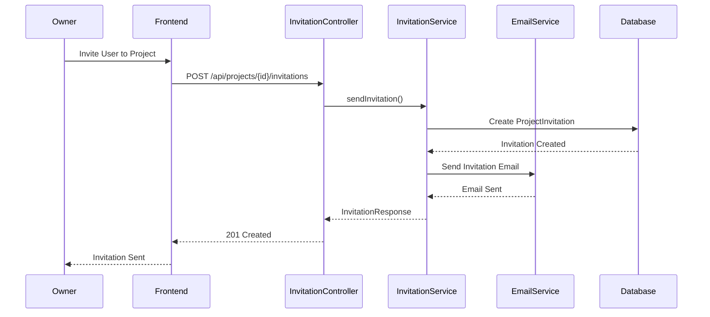
```mermaid
sequenceDiagram
    participant Owner
    participant Frontend
    participant InvitationController
    participant InvitationService
    participant EmailService
    participant Database

    Owner->>Frontend: Invite User to Project
    Frontend->>InvitationController: POST /api/projects/{id}/invitations
    InvitationController->>InvitationService: sendInvitation()
    
    InvitationService->>Database: Create ProjectInvitation
    Database-->>InvitationService: Invitation Created
    
    InvitationService->>EmailService: Send Invitation Email
    EmailService-->>InvitationService: Email Sent
    
    InvitationService-->>InvitationController: InvitationResponse
    InvitationController-->>Frontend: 201 Created
    Frontend-->>Owner: Invitation Sent
```

### Invitation Acceptance Flow

```mermaid
sequenceDiagram
    participant User
    participant Frontend
    participant InvitationController
    participant InvitationService
    participant ProjectService
    participant Database

    User->>Frontend: Click Invitation Link
    Frontend->>InvitationController: GET /api/invitations/{token}
    InvitationController->>InvitationService: getInvitation()
    InvitationService->>Database: Fetch Invitation
    Database-->>InvitationService: Invitation Entity
    
    alt Invitation Valid
        InvitationService-->>InvitationController: Invitation Details
        InvitationController-->>Frontend: 200 OK
        Frontend-->>User: Show Invitation Details
        
        User->>Frontend: Accept Invitation
        Frontend->>InvitationController: POST /api/invitations/{token}/accept
        InvitationController->>InvitationService: acceptInvitation()
        InvitationService->>ProjectService: Add User to Project
        ProjectService->>Database: Create ProjectMembership
        Database-->>ProjectService: Membership Created
        InvitationService->>Database: Mark Invitation Accepted
        Database-->>InvitationService: Updated
        InvitationService-->>InvitationController: Success
        InvitationController-->>Frontend: 200 OK
        Frontend-->>User: Added to Project
    else Invitation Invalid
        InvitationService-->>InvitationController: Error
        InvitationController-->>Frontend: 404/400 Error
        Frontend-->>User: Invalid Invitation
    end
```

---

## Activity & Audit Logging

### Audit Log Flow

```mermaid
sequenceDiagram
    participant Service
    participant AuditLogProxyService
    participant AuditService
    participant Database

    Service->>AuditLogProxyService: Log Action
    AuditLogProxyService->>AuditService: POST /api/audit-logs
    AuditService->>Database: Store Audit Log
    Database-->>AuditService: Log Stored
    AuditService-->>AuditLogProxyService: Success
    AuditLogProxyService-->>Service: Logged
```

### Activity View Flow

```mermaid
sequenceDiagram
    participant User
    participant Frontend
    participant AuditController
    participant AuditService
    participant Database

    User->>Frontend: View Activity
    Frontend->>AuditController: GET /api/audit-logs
    AuditController->>AuditService: listAuditLogs()
    AuditService->>Database: Query Audit Logs
    Database-->>AuditService: Logs List
    AuditService-->>AuditController: AuditLogsResponse
    AuditController-->>Frontend: 200 OK
    Frontend-->>User: Display Activity
```

---

## User Preferences

### Preferences Flow

```mermaid
sequenceDiagram
    participant User
    participant Frontend
    participant PreferencesController
    participant UserService
    participant Database

    User->>Frontend: Update Preferences
    Frontend->>PreferencesController: PUT /api/preferences
    PreferencesController->>UserService: updatePreferences()
    UserService->>Database: Update User Preferences
    Database-->>UserService: Updated
    UserService-->>PreferencesController: UserResponse
    PreferencesController-->>Frontend: 200 OK
    Frontend-->>User: Preferences Saved
```

---

## Database Schema

### Entity Relationship Diagram

```mermaid
erDiagram
    USER ||--o{ PROJECT : creates
    USER ||--o{ PROJECT_MEMBERSHIP : has
    USER ||--o{ TEAM_MEMBERSHIP : has
    USER ||--o{ WORKFLOW : owns
    USER ||--o{ REFRESH_TOKEN : has
    
    PROJECT ||--o{ SECRET : contains
    PROJECT ||--o{ PROJECT_MEMBERSHIP : has
    PROJECT ||--o{ PROJECT_INVITATION : has
    PROJECT ||--o{ WORKFLOW_PROJECT : "belongs to"
    PROJECT ||--o{ TEAM_PROJECT : "belongs to"
    
    SECRET ||--o{ SECRET_VERSION : has
    
    TEAM ||--o{ TEAM_MEMBERSHIP : has
    TEAM ||--o{ TEAM_PROJECT : has
    
    WORKFLOW ||--o{ WORKFLOW_PROJECT : contains
    
    USER {
        uuid id PK
        string email UK
        string displayName
        string role
        jsonb notificationPreferences
        string timezone
        string dateFormat
    }
    
    PROJECT {
        uuid id PK
        string name
        text description
        uuid createdBy FK
        boolean isArchived
        timestamp createdAt
        timestamp updatedAt
    }
    
    SECRET {
        uuid id PK
        uuid projectId FK
        string secretKey UK
        text encryptedValue
        string encryptionAlgorithm
        timestamp expiresAt
        timestamp createdAt
        timestamp updatedAt
    }
    
    SECRET_VERSION {
        uuid id PK
        uuid secretId FK
        integer versionNumber
        text encryptedValue
        timestamp createdAt
    }
    
    PROJECT_MEMBERSHIP {
        uuid id PK
        uuid projectId FK
        uuid userId FK
        enum role
        timestamp joinedAt
    }
    
    TEAM {
        uuid id PK
        string name
        text description
        uuid createdBy FK
        boolean isActive
        timestamp createdAt
    }
    
    TEAM_MEMBERSHIP {
        uuid id PK
        uuid teamId FK
        uuid userId FK
        enum role
        timestamp joinedAt
    }
    
    TEAM_PROJECT {
        uuid id PK
        uuid teamId FK
        uuid projectId FK
        timestamp addedAt
    }
    
    WORKFLOW {
        uuid id PK
        uuid userId FK
        string name
        text description
        boolean isDefault
        integer displayOrder
    }
    
    WORKFLOW_PROJECT {
        uuid id PK
        uuid workflowId FK
        uuid projectId FK
        integer displayOrder
    }
    
    PROJECT_INVITATION {
        uuid id PK
        uuid projectId FK
        string email
        enum role
        string token UK
        timestamp expiresAt
        timestamp acceptedAt
    }
```

---

## API Endpoints

### API Structure

```mermaid
graph TD
    API[API Gateway] --> Auth[/api/auth]
    API --> Projects[/api/projects]
    API --> Secrets[/api/projects/:id/secrets]
    API --> Teams[/api/teams]
    API --> Workflows[/api/workflows]
    API --> Invitations[/api/invitations]
    API --> Preferences[/api/preferences]
    API --> Admin[/api/admin]
    API --> Audit[/api/audit-logs]
    
    Auth --> Login[POST /login]
    Auth --> Refresh[POST /refresh]
    Auth --> Me[GET /me]
    
    Projects --> List[GET /]
    Projects --> Create[POST /]
    Projects --> Get[GET /:id]
    Projects --> Update[PUT /:id]
    Projects --> Delete[DELETE /:id]
    Projects --> Members[GET /:id/members]
    Projects --> Invite[POST /:id/invitations]
    
    Secrets --> ListSecrets[GET /]
    Secrets --> CreateSecret[POST /]
    Secrets --> GetSecret[GET /:key]
    Secrets --> UpdateSecret[PUT /:key]
    Secrets --> DeleteSecret[DELETE /:key]
    Secrets --> Rotate[POST /:key/rotate]
    Secrets --> Versions[GET /:key/versions]
    
    Teams --> ListTeams[GET /]
    Teams --> CreateTeam[POST /]
    Teams --> GetTeam[GET /:id]
    Teams --> UpdateTeam[PUT /:id]
    Teams --> DeleteTeam[DELETE /:id]
    Teams --> Members[GET /:id/members]
    Teams --> AddMember[POST /:id/members]
    Teams --> Projects[GET /:id/projects]
    Teams --> AddProject[POST /:id/projects/:projectId]
```

---

## Permission Matrix

### Project Permissions

| Action | OWNER | ADMIN | MEMBER | VIEWER |
|--------|-------|-------|--------|--------|
| View Project | ✅ | ✅ | ✅ | ✅ |
| Edit Project | ✅ | ✅ | ❌ | ❌ |
| Delete Project | ✅ | ❌ | ❌ | ❌ |
| Archive Project | ✅ | ❌ | ❌ | ❌ |
| View Secrets | ✅ | ✅ | ✅ | ✅ |
| Create Secrets | ✅ | ✅ | ✅ | ❌ |
| Update Secrets | ✅ | ✅ | ✅ | ❌ |
| Delete Secrets | ✅ | ✅ | ❌ | ❌ |
| Rotate Secrets | ✅ | ✅ | ❌ | ❌ |
| Invite Members | ✅ | ✅ | ❌ | ❌ |
| Remove Members | ✅ | ✅ | ❌ | ❌ |
| Update Member Roles | ✅ | ✅ | ❌ | ❌ |
| Transfer Ownership | ✅ | ❌ | ❌ | ❌ |

### Team Permissions

| Action | TEAM_OWNER | TEAM_ADMIN | TEAM_MEMBER |
|--------|------------|------------|-------------|
| View Team | ✅ | ✅ | ✅ |
| Edit Team | ✅ | ✅ | ❌ |
| Delete Team | ✅ | ❌ | ❌ |
| Add Members | ✅ | ✅ | ❌ |
| Remove Members | ✅ | ✅ | ❌ |
| Update Member Roles | ✅ | ✅ | ❌ |
| Add Projects | ✅ | ✅ | ❌ |
| Remove Projects | ✅ | ✅ | ❌ |
| Access Team Projects | ✅ | ✅ | ✅ (VIEWER) |

---

## Data Flow Diagrams

### Complete Request Flow

```mermaid
graph TD
    Start[User Action] --> Frontend[Frontend App]
    Frontend --> AuthCheck{Authenticated?}
    AuthCheck -->|No| Login[Redirect to Login]
    AuthCheck -->|Yes| API[API Request]
    API --> JWTFilter[JWT Filter]
    JWTFilter --> ValidateToken{Token Valid?}
    ValidateToken -->|No| Reject[401 Unauthorized]
    ValidateToken -->|Yes| Controller[Controller]
    Controller --> PermissionCheck{Check Permission}
    PermissionCheck -->|No| Forbid[403 Forbidden]
    PermissionCheck -->|Yes| Service[Service Layer]
    Service --> Repository[Repository]
    Repository --> Database[(Database)]
    Database --> Repository
    Repository --> Service
    Service --> Audit[Log to Audit Service]
    Service --> Controller
    Controller --> Response[Response]
    Response --> Frontend
    Frontend --> UpdateUI[Update UI]
    
    style Start fill:#E3F2FD
    style Database fill:#4CAF50
    style Reject fill:#F44336
    style Forbid fill:#FF9800
```

---

## Feature Summary

### Core Features

1. **Authentication & Authorization**
   - Firebase Authentication
   - Google Identity Integration
   - JWT Token Management
   - Refresh Token Flow
   - Project-Scoped RBAC
   - Team-Based Access Control

2. **Project Management**
   - CRUD Operations
   - Member Management
   - Role-Based Permissions
   - Project Archiving
   - Search & Filtering

3. **Secret Management**
   - AES-256 Encryption
   - Version Control
   - Secret Rotation
   - Expiration Management
   - Bulk Operations

4. **Team Management**
   - Team CRUD
   - Member Management
   - Project Association
   - Team-Based Access

5. **Workflow Management**
   - Workflow Organization
   - Project Grouping
   - Custom Ordering

6. **Invitation System**
   - Email Invitations
   - Token-Based Acceptance
   - Role Assignment

7. **Activity & Audit**
   - Complete Audit Trail
   - Activity Filtering
   - Export Capabilities

8. **User Preferences**
   - Notification Settings
   - Timezone Configuration
   - Date Format Preferences

---

## Technology Stack

### Frontend
- React 18
- TypeScript
- TanStack Query
- React Router
- Tailwind CSS
- Vite

### Backend
- Spring Boot 3.3.5
- Java 21
- PostgreSQL
- Redis
- Firebase Admin SDK
- JWT

### Infrastructure
- Docker & Docker Compose
- PostgreSQL Database
- Redis Cache
- Nginx (Frontend)

---

## Performance Optimizations

1. **Database Indexes**
   - Composite indexes for team access
   - Indexes on foreign keys
   - Indexes on frequently queried fields

2. **Query Optimization**
   - EXISTS subqueries instead of JOINs
   - Caching with @Cacheable
   - Lazy loading for relationships

3. **Frontend Optimizations**
   - Code splitting with lazy loading
   - TanStack Query caching
   - Optimistic updates

---

*Last Updated: 2025-11-30*
*Version: 1.0.0*

