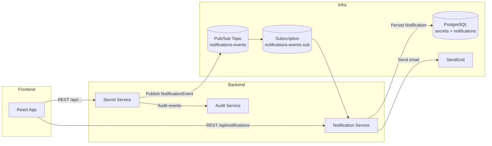
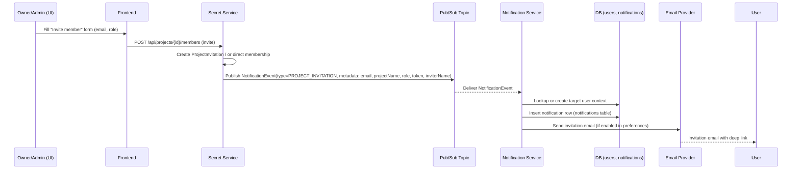
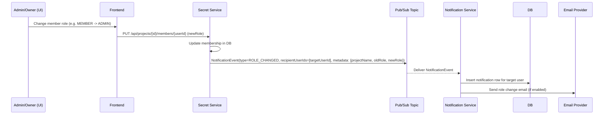
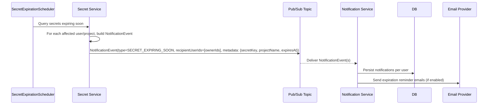
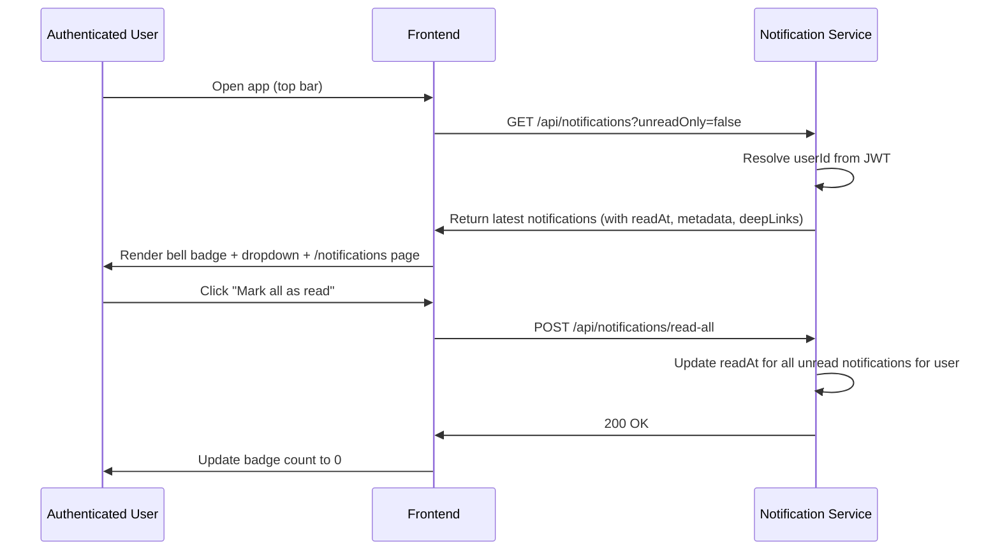
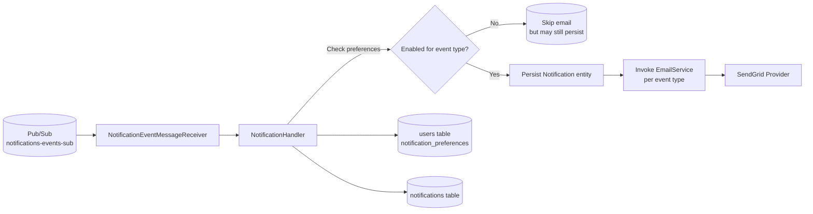

## Project & Notification Workflows – v2 (with Notification Service)

This document captures the **updated end-to-end workflows** for:
- Project lifecycle (create, invite, accept, membership changes)
- Secret expiration handling
- The **new `notification-service`** and Pub/Sub based notification pipeline.

All diagrams use **mermaid** so they can be rendered directly in GitHub / docs tools.

---

## 1. High-Level System View (with Notification Service)



---

## 2. Project Invitation Flow (v2 – Event-Driven Notifications)

### 2.1 Sequence Overview



### 2.2 Updated Backend Responsibilities

- **Secret Service**
  - Owns core project + invitation logic.
  - Emits a `NotificationEvent` with:
    - `type = PROJECT_INVITATION`
    - `recipientUserIds` or target email
    - `metadata`: `projectName`, `inviterName`, `token`, `role`, `deepLink`.
- **Notification Service**
  - Subscribes to `notifications-events`.
  - Checks `users.notification_preferences` for invitation settings.
  - Persists an in-app notification.
  - Sends email (SendGrid) when allowed.

---

## 3. Membership Role Change Flow (with Notifications)



**Result in UI**
- Top bar bell shows a new notification for the affected user.
- Dedicated `/notifications` page lists the event with a deep link to the project/members tab.

---

## 4. Secret Expiration Flow (Scheduler → Notifications)



**User Experience**
- In-app: Notification like _"Secret `DB_PASSWORD` in project `Backend Services` expires in 3 days"_ with a deep link to the secret.
- Email: Consolidated or per-secret reminders based on implementation.

---

## 5. In-App Notification Consumption Flow



**Key Points**
- No `userId` is passed from the frontend; the **JWT subject** is the source of truth.
- `useNotifications` hook handles:
  - Fetching via `GET /api/notifications`.
  - `markAsRead` and `markAllAsRead`.
  - Maintaining `unreadCount` for the bell badge.

---

## 6. Project Lifecycle Workflow (Updated with Notifications Touchpoints)

```mermaid
flowchart TD
    A[User creates Project] --> B[Owner assigns to Workflow]
    B --> C[Owner invites collaborators]
    C -->|User exists| D[Direct membership + NotificationEvent(PROJECT_INVITATION)]
    C -->|User not registered| E[Pending ProjectInvitation + NotificationEvent(PROJECT_INVITATION)]

    D --> F[Member joins project immediately]
    E --> G[User signs up via Firebase/Identity]
    G --> H[Secret Service auto-accepts valid invitations]
    H --> I[ProjectMembership created]

    I --> J[Members manage secrets]
    J --> K[Secret expiration scheduler runs daily]
    K --> L[NotificationEvent(SECRET_EXPIRING_SOON) published]

    I --> M[Owners/Admins update roles]
    M --> N[NotificationEvent(ROLE_CHANGED) published]
```

**Notification touchpoints in the project lifecycle**
- **On invite** → `PROJECT_INVITATION`
- **On signup with pending invite** → in-app + email context
- **On role change** → `ROLE_CHANGED`
- **On secret nearing expiry** → `SECRET_EXPIRING_SOON`

---

## 7. Notification-Service Internal Workflow



**Responsibilities**
- `NotificationEventMessageReceiver`
  - Converts `PubsubMessage` → `NotificationEvent`.
  - Hands off to `NotificationHandler`.
- `NotificationHandler`
  - Applies **per-user preferences** for each event category.
  - Persists standardized `Notification` entity.
  - Calls `EmailService` to send the correct email template.

---

## 8. API Surface Summary (Notifications v2)

- **Secret Service (producer)**
  - Emits `NotificationEvent` only; **no direct email sending**.
- **Notification Service (consumer + API)**
  - **Events in** via Pub/Sub:
    - `PROJECT_INVITATION`
    - `TEAM_INVITATION` (future)
    - `ROLE_CHANGED`
    - `SECRET_EXPIRING_SOON`
    - `SECURITY_ALERT`
  - **REST out**:
    - `GET /api/notifications?unreadOnly={bool}`
    - `POST /api/notifications/{id}/read`
    - `POST /api/notifications/read-all`

---

## 9. Frontend Integration Summary

- `useNotifications(userId)` hook:
  - Uses `notificationsService.list(false)` and `mark(All)AsRead()`.
  - Manages `unreadCount` for the top-bar bell.
- `TopBar`:
  - Shows bell icon with badge.
  - Dropdown for latest notifications (click to mark read + deep link).
- `/notifications` page:
  - Full list of notifications with timestamps and filters.

This document should be used as the **canonical reference** for how project flows and the new notification-service work together end-to-end.


