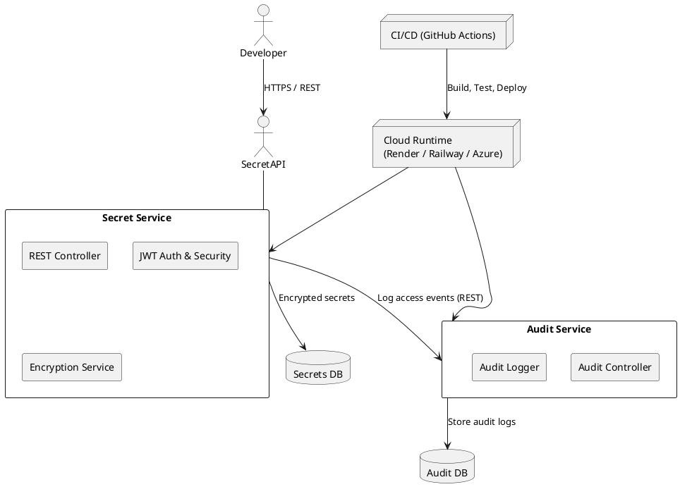

# Cloud Secrets Manager - Complete Setup Guide 💼🔐

A comprehensive guide to building a cloud-native secrets management system with everything you need in one place.

---

## 1️⃣ Architecture Diagram

### ASCII Overview

```
                       +-------------------------+
                       |      Client / CLI       |
                       | (curl, Postman, UI)     |
                       +-----------+-------------+
                                   |
                                   v
                         HTTPS / REST API
                                   |
                     +-------------+--------------+
                     |        Secret Service      |
                     |  (Spring Boot, JWT, AES)   |
                     +-------------+--------------+
                                   |
             +---------------------+----------------------+
             |                                            |
             v                                            v
   +------------------------+                   +------------------------+
   |  Secrets DB            |                   |  Audit DB              |
   | (Postgres/MySQL)       |                   | (Postgres/MySQL)       |
   +------------------------+                   +------------------------+
             ^                                            ^
             |                                            |
             | REST (internal, authenticated)             |
             |                                            |
      +------+---------------------------+                
      |       Audit Service              |                
      | (Spring Boot, logs all events)   |                
      +----------------------------------+                
```

**Infrastructure:**
- All services containerized (Docker)
- docker-compose for local DevProd parity
- Deployed as containers on Render / Railway / Azure
- GitHub Actions for build + test + push + deploy

### PlantUML (Component Diagram)



Save this in `docs/architecture.puml`.

---

## 2️⃣ README.md Starter

# Cloud Secrets Manager (MVP)

A cloud-native **Secrets Manager** that allows developers to securely store and retrieve confidential information such as API keys, database passwords, and access tokens.  
The system is built as a set of containerized Spring Boot microservices and demonstrates **12-Factor App principles**, **JWT-based authentication**, **encryption at rest**, and **automated CI/CD** using GitHub Actions.

---

## ✨ Features

- 🔐 Secure storage of secrets (encrypted at rest with AES)
- ✅ JWT-based authentication and role-based access control
- 📜 Audit logging of all secret operations (create/read/delete)
- 🐳 Fully containerized with Docker & docker-compose
- ☁️ Deployable to cloud providers (Render / Railway / Azure)

---

## 🧱 Architecture Overview

- **Secret Service**
  - REST API for managing secrets
  - JWT authentication & authorization
  - AES encryption/decryption
  - Writes audit events to the Audit Service

- **Audit Service**
  - Receives audit events from Secret Service
  - Persists logs to an Audit database
  - Provides API endpoint to query audit logs

- **Databases**
  - `secrets-db` (MySQL/Postgres)
  - `audit-db` (MySQL/Postgres)

See [`docs/architecture.puml`](docs/architecture.puml) for the detailed diagram.

---

## 🛠 Tech Stack

- Java 21 / 17
- Spring Boot (Web, Security, Data JPA)
- JWT (JSON Web Tokens)
- AES encryption
- PostgreSQL or MySQL
- Docker & Docker Compose
- GitHub Actions (CI/CD)
- Render / Railway / Azure App Service / Container Apps

---

## 📦 Getting Started (Local Development)

### Prerequisites

- Java 17+  
- Maven or Gradle  
- Docker & Docker Compose  
- Git (for cloning the repository)

### 1. Clone the repository

```bash
git clone https://github.com/<your-username>/cloud-secrets-manager.git
cd cloud-secrets-manager
```

### 2. Configure environment variables

Create a `.env` file (or use your shell env) with at least:

```bash
# Secret Service
SECRET_DB_URL=jdbc:postgresql://secrets-db:5432/secrets
SECRET_DB_USERNAME=secret_user
SECRET_DB_PASSWORD=secret_pw
JWT_SECRET=<very-secure-random-string>

# Audit Service
AUDIT_DB_URL=jdbc:postgresql://audit-db:5432/audit
AUDIT_DB_USERNAME=audit_user
AUDIT_DB_PASSWORD=audit_pw
```

### 3. Run locally with Docker Compose

```bash
docker-compose up --build
```

This will start:
- Secret Service (e.g. on http://localhost:8080)
- Audit Service (e.g. on http://localhost:8081)
- Secrets DB
- Audit DB

### 4. Example API usage (curl)

```bash
# 1) Authenticate and get JWT
curl -X POST http://localhost:8080/auth/login \
  -H "Content-Type: application/json" \
  -d '{"username": "admin", "password": "admin"}'

# 2) Store a secret
curl -X POST http://localhost:8080/api/secrets \
  -H "Authorization: Bearer <JWT_TOKEN>" \
  -H "Content-Type: application/json" \
  -d '{"key": "db.password", "value": "myS3cretPw"}'

# 3) Retrieve a secret
curl -X GET "http://localhost:8080/api/secrets/db.password" \
  -H "Authorization: Bearer <JWT_TOKEN>"
```

---

## ☁️ Deployment

The project is designed to be deployable in multiple environments:

**Render / Railway**
- Build Docker images and deploy as web services

**Azure**
- Deploy containers via Azure App Service or Azure Container Apps

See `docs/deployment.md` for detailed instructions.

---

## ✅ Tests

Run unit tests locally:

```bash
mvn test
# or
./mvnw test
```

---

## 🔁 CI/CD

GitHub Actions workflow (`.github/workflows/ci-cd.yml`):
- Build & test on every push/PR
- Build and push Docker image on main branch
- Optionally trigger deploy to cloud provider

---

## 📜 License

MIT (or whatever you choose)

---

## 3️⃣ JWT Authentication Flow – Code Templates

Assume this is inside the **Secret Service**.

### 3.1 `JwtTokenProvider`

```java
@Component
public class JwtTokenProvider {

    @Value("${security.jwt.secret}")
    private String jwtSecret;

    @Value("${security.jwt.expiration-ms:3600000}")
    private long validityInMs;

    public String generateToken(String username, Collection<? extends GrantedAuthority> roles) {
        Date now = new Date();
        Date expiry = new Date(now.getTime() + validityInMs);

        String rolesString = roles.stream()
            .map(GrantedAuthority::getAuthority)
            .collect(Collectors.joining(","));

        return Jwts.builder()
            .setSubject(username)
            .claim("roles", rolesString)
            .setIssuedAt(now)
            .setExpiration(expiry)
            .signWith(SignatureAlgorithm.HS256, jwtSecret)
            .compact();
    }

    public String getUsername(String token) {
        return Jwts.parser()
            .setSigningKey(jwtSecret)
            .parseClaimsJws(token)
            .getBody()
            .getSubject();
    }

    public List<String> getRoles(String token) {
        String roles = (String) Jwts.parser()
            .setSigningKey(jwtSecret)
            .parseClaimsJws(token)
            .getBody()
            .get("roles");
        return Arrays.asList(roles.split(","));
    }

    public boolean validateToken(String token) {
        try {
            Jwts.parser().setSigningKey(jwtSecret).parseClaimsJws(token);
            return true;
        } catch (JwtException | IllegalArgumentException e) {
            return false;
        }
    }
}
```

### 3.2 `JwtAuthenticationFilter`

```java
@Component
public class JwtAuthenticationFilter extends OncePerRequestFilter {

    private final JwtTokenProvider tokenProvider;
    private final UserDetailsService userDetailsService;

    public JwtAuthenticationFilter(JwtTokenProvider tokenProvider,
                                   UserDetailsService userDetailsService) {
        this.tokenProvider = tokenProvider;
        this.userDetailsService = userDetailsService;
    }

    @Override
    protected void doFilterInternal(HttpServletRequest request,
                                    HttpServletResponse response,
                                    FilterChain filterChain)
        throws ServletException, IOException {

        String header = request.getHeader("Authorization");
        String token = null;

        if (header != null && header.startsWith("Bearer ")) {
            token = header.substring(7);
        }

        if (token != null && tokenProvider.validateToken(token)
            && SecurityContextHolder.getContext().getAuthentication() == null) {

            String username = tokenProvider.getUsername(token);
            UserDetails userDetails = userDetailsService.loadUserByUsername(username);

            UsernamePasswordAuthenticationToken auth =
                new UsernamePasswordAuthenticationToken(
                    userDetails, null, userDetails.getAuthorities()
                );
            auth.setDetails(new WebAuthenticationDetailsSource().buildDetails(request));
            SecurityContextHolder.getContext().setAuthentication(auth);
        }

        filterChain.doFilter(request, response);
    }
}
```

### 3.3 `SecurityConfig`

```java
@EnableWebSecurity
@Configuration
public class SecurityConfig {

    private final JwtAuthenticationFilter jwtFilter;
    private final UserDetailsService userDetailsService;

    public SecurityConfig(JwtAuthenticationFilter jwtFilter,
                          UserDetailsService userDetailsService) {
        this.jwtFilter = jwtFilter;
        this.userDetailsService = userDetailsService;
    }

    @Bean
    public SecurityFilterChain filterChain(HttpSecurity http) throws Exception {
        http
            .csrf(AbstractHttpConfigurer::disable)
            .sessionManagement(sm -> sm.sessionCreationPolicy(SessionCreationPolicy.STATELESS))
            .authorizeHttpRequests(auth -> auth
                .requestMatchers("/auth/**").permitAll()
                .requestMatchers(HttpMethod.GET, "/actuator/health").permitAll()
                .anyRequest().authenticated()
            )
            .userDetailsService(userDetailsService);

        http.addFilterBefore(jwtFilter, UsernamePasswordAuthenticationFilter.class);
        return http.build();
    }

    @Bean
    PasswordEncoder passwordEncoder() {
        return new BCryptPasswordEncoder();
    }
}
```

### 3.4 Simple `AuthController`

```java
@RestController
@RequestMapping("/auth")
public class AuthController {

    private final AuthenticationManager authManager;
    private final JwtTokenProvider tokenProvider;

    public AuthController(AuthenticationManager authManager,
                          JwtTokenProvider tokenProvider) {
        this.authManager = authManager;
        this.tokenProvider = tokenProvider;
    }

    @PostMapping("/login")
    public ResponseEntity<?> login(@RequestBody LoginRequest req) {
        Authentication auth = authManager.authenticate(
            new UsernamePasswordAuthenticationToken(req.getUsername(), req.getPassword())
        );

        User user = (User) auth.getPrincipal();
        String token = tokenProvider.generateToken(user.getUsername(), user.getAuthorities());

        return ResponseEntity.ok(Map.of("token", token));
    }
}
```

---

## 4️⃣ Microservice Split – Responsibilities

### Secret Service (port 8080)

**Endpoints:**
- `POST /auth/login` – authenticate user → JWT
- `POST /api/secrets` – create secret
- `GET /api/secrets/{key}` – retrieve secret
- `DELETE /api/secrets/{key}` – delete secret

**Responsibilities:**
- Authenticate & authorize (JWT)
- Encrypt/decrypt secret values (AES)
- Save encrypted secrets in `secrets-db`
- Call Audit Service for every operation

### Audit Service (port 8081)

**Endpoints:**
- `POST /api/audit` – store an audit event
- `GET /api/audit` – list events (admin only)

**Responsibilities:**
- Receive audit events from Secret Service
- Persist them in `audit-db`
- Provide reporting endpoint

### Databases

**secrets-db:**
- Table: `secrets(id, key, value_encrypted, created_by, created_at, updated_at)`

**audit-db:**
- Table: `audit_log(id, username, action, secret_key, timestamp, ip_address)`

---

## 5️⃣ Deployment (Render / Railway / Azure)

### Common Step – Docker Image

Create `Dockerfile` in each service:

```dockerfile
FROM eclipse-temurin:21-jdk-alpine
ARG JAR_FILE=target/*.jar
COPY ${JAR_FILE} app.jar
ENTRYPOINT ["java", "-jar", "/app.jar"]
```

Build & tag:

```bash
mvn clean package -DskipTests
docker build -t <your-docker-username>/secret-service:latest secret-service/
docker build -t <your-docker-username>/audit-service:latest audit-service/
docker push <your-docker-username>/secret-service:latest
docker push <your-docker-username>/audit-service:latest
```

### Render / Railway

1. Create 2 services:
   - `secret-service` → Docker image
   - `audit-service` → Docker image
2. Set environment variables (DB URL, JWT_SECRET, etc.) in dashboard
3. Use managed Postgres if available (or external DB)

### Azure (Container Apps or App Service)

1. Create Container Registry (ACR) or use Docker Hub
2. Create Container App(s) or App Services:
   - Point to the container images
   - Configure env vars & connection strings
3. Optionally: deploy via GitHub Actions using an Azure login action

Put detailed steps later in `docs/deployment.md`.

---

## 6️⃣ GitHub Actions CI/CD Pipeline

Here's a single workflow that:
- Runs on push/PR
- Builds & tests both services
- Builds & pushes Docker images on main
- (Optional) Calls deployment hook (e.g. Render deploy hook URL)

Create `.github/workflows/ci-cd.yml`:

```yaml
name: CI/CD

on:
  push:
    branches: [ "main" ]
  pull_request:
    branches: [ "main" ]

jobs:
  build-test:
    runs-on: ubuntu-latest
    steps:
      - name: Checkout
        uses: actions/checkout@v4

      - name: Set up JDK
        uses: actions/setup-java@v4
        with:
          distribution: temurin
          java-version: '21'

      - name: Build & Test Secret Service
        run: |
          cd secret-service
          mvn -B clean verify

      - name: Build & Test Audit Service
        run: |
          cd audit-service
          mvn -B clean verify

  docker-publish:
    needs: build-test
    runs-on: ubuntu-latest
    if: github.ref == 'refs/heads/main'
    steps:
      - name: Checkout
        uses: actions/checkout@v4

      - name: Log in to DockerHub
        uses: docker/login-action@v3
        with:
          username: ${{ secrets.DOCKERHUB_USERNAME }}
          password: ${{ secrets.DOCKERHUB_TOKEN }}

      - name: Build & Push Secret Service Image
        uses: docker/build-push-action@v6
        with:
          context: ./secret-service
          push: true
          tags: ${{ secrets.DOCKERHUB_USERNAME }}/secret-service:latest

      - name: Build & Push Audit Service Image
        uses: docker/build-push-action@v6
        with:
          context: ./audit-service
          push: true
          tags: ${{ secrets.DOCKERHUB_USERNAME }}/audit-service:latest

      # Optional: Trigger Render / Railway / Azure deploy hook
      - name: Trigger Deploy Hook
        if: secrets.DEPLOY_HOOK_URL != ''
        run: |
          curl -X POST "${{ secrets.DEPLOY_HOOK_URL }}"
```

### Required GitHub Secrets

Set these in your GitHub repository:
- `DOCKERHUB_USERNAME`
- `DOCKERHUB_TOKEN`
- `DEPLOY_HOOK_URL` (optional - for Render, Railway, etc.)

---

## 🎯 Next Steps

1. Copy this guide and customize for your needs
2. Create the directory structure for your microservices
3. Implement the JWT authentication flow
4. Set up your databases and docker-compose
5. Configure CI/CD with GitHub Actions
6. Deploy to your chosen cloud provider

**Happy coding!** 🚀