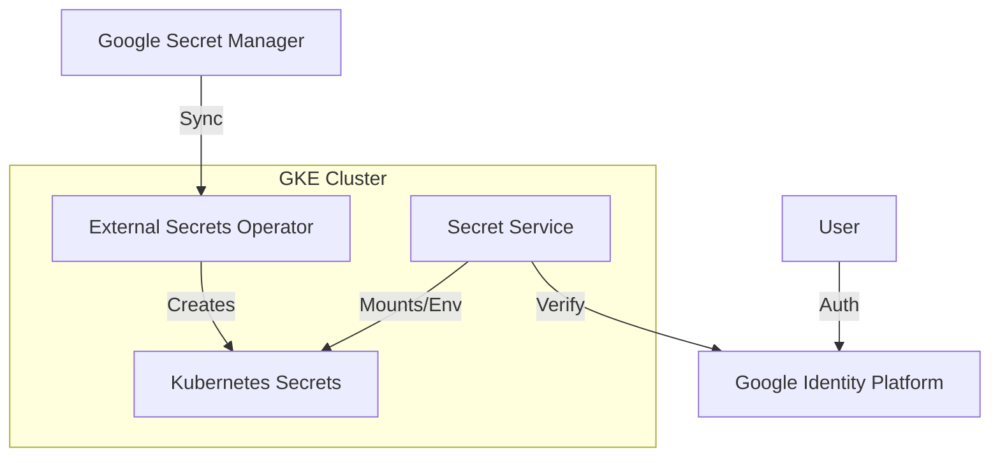

# Current Status: Phase 3 Complete (Cloud SQL Migration)

## Completed Phases

### ✅ Phase 1: Core Infrastructure (Terraform & GKE)
- **Status**: Complete
- **Details**: 
  - GKE Cluster running (`cloud-secrets-cluster-dev`).
  - Cloud SQL (Postgres) running with databases: `secrets`, `audit`.
  - IAM Roles & Workload Identity configured.
  - Artifact Registry configured.

### ✅ Phase 2: Secret Management (External Secrets Operator)
- **Status**: Complete
- **Details**: 
  - **External Secrets Operator (ESO)** installed via Helm.
  - **Google Secret Manager (GSM)** integrated as the backend.
  - `ClusterSecretStore` configured to use Workload Identity.
  - `ExternalSecret` resources created for DB credentials, App config, and Service Accounts.
  - **Sealed Secrets** deprecated and removed.

### ✅ Phase 3: Application Deployment & Cloud SQL Migration
- **Status**: Complete
- **Details**: 
  - Helm charts updated and deployed.
  - **Cloud SQL migration complete** - Local PostgreSQL containers removed.
  - Applications deployed and running with Cloud SQL Proxy sidecar.
  - Database names standardized: `secrets`, `audit`.
  - Database users standardized: `secrets_user`, `audit_user`.
  - All legacy local DB configurations removed.
  - Service accounts configured correctly (`secret-service`, `audit-service`).

---

## Current Deployment Status

### Infrastructure
- ✅ GKE Cluster: Running
- ✅ Cloud SQL: Running (databases: `secrets`, `audit`)
- ✅ External Secrets Operator: Installed and syncing
- ✅ Service Accounts: Configured with Workload Identity

### Applications
- ✅ Secret Service: Deployed (can be scaled up)
- ✅ Audit Service: Deployed (can be scaled up)
- ✅ Cloud SQL Proxy: Running as sidecar
- ✅ Secrets: Syncing from Google Secret Manager

### Known Issues
- ⚠️ GCP Quota: IP address quota limit (8 addresses) - may affect scaling
- ℹ️ Build: Lombok/Java 21 compatibility issue (local only, doesn't affect Docker builds)

---

## Next Steps

1. **Scale Up Applications**: Scale deployments to desired replica count
2. **Configure Ingress**: Set up external access if needed
3. **Monitoring**: Set up Prometheus/Grafana dashboards
4. **CI/CD**: Configure automated deployment pipeline
5. **Backup Strategy**: Configure Cloud SQL automated backups

---

## Architecture Overview

