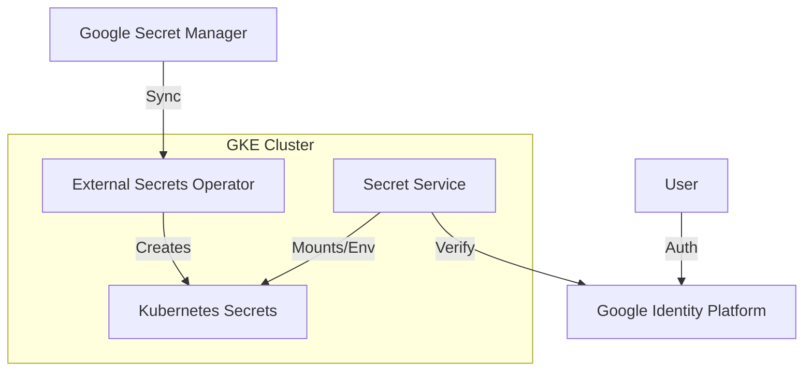

# Current Status: Phase 2 Complete (External Secrets)

## Completed Phases

### ✅ Phase 1: Core Infrastructure (Terraform & GKE)
- **Status**: Complete
- **Details**: 
  - GKE Cluster running (`cloud-secrets-cluster-dev`).
  - Cloud SQL (Postgres) running.
  - IAM Roles & Workload Identity configured.
  - Artifact Registry configured.

### ✅ Phase 2: Secret Management (External Secrets Operator)
- **Status**: Complete
- **Details**: 
  - **External Secrets Operator (ESO)** installed via Helm.
  - **Google Secret Manager (GSM)** integrated as the backend.
  - `ClusterSecretStore` configured to use Workload Identity.
  - `ExternalSecret` resources created for DB credentials, App config, and Service Accounts.
  - **Sealed Secrets** deprecated and removed.

### ✅ Phase 3: Application Deployment (Helm)
- **Status**: In Progress / Next
- **Details**: 
  - Helm charts are ready (`infrastructure/helm/cloud-secrets-manager`).
  - Need to update Helm values to use the new External Secrets (remove old secret generation).
  - Deploy the application to GKE.

---

## Next Steps (Phase 3)

1.  **Update Helm Chart**: Ensure it doesn't try to create the secrets that ESO now manages.
2.  **Deploy Application**: `helm install ...`
3.  **Verify End-to-End**: Test the application accessing the DB using the synced secrets.

---

## Architecture Overview

