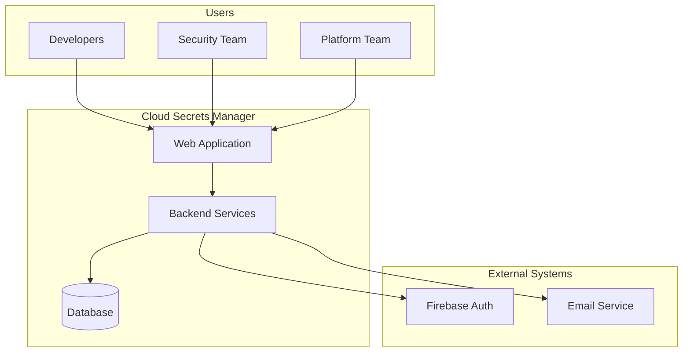

# Overview

## Project Purpose

Cloud Secrets Manager is an enterprise-grade secrets management platform that enables organizations to securely store, manage, and audit sensitive credentials such as API keys, database passwords, and configuration values.

The platform eliminates the security risks of hardcoded secrets in source code and provides centralized control over credential access across teams and applications.

---

## Main Features

- **Encrypted Secret Storage** — All secrets are encrypted at rest using AES-256-GCM encryption before being stored in the database.

- **Project-Based Organization** — Secrets are organized into projects, allowing teams to group related credentials and manage access at the project level.

- **Role-Based Access Control** — Four permission levels (Owner, Admin, Member, Viewer) control what users can do within each project.

- **Version History** — Every secret change creates a new version, enabling rollback and change tracking.

- **Comprehensive Audit Trail** — All actions are logged with user, timestamp, and context for compliance and security investigations.

- **Two-Factor Authentication** — TOTP-based 2FA with recovery codes adds an extra layer of account security.

- **Event-Driven Notifications** — Email and in-app notifications for important events like secret access, sharing, and expiration.

---

## High-Level System Context

---

## Main User Journeys

### Developer Journey

1. Signs in via Google OAuth
2. Creates or joins a project
3. Adds secrets (API keys, passwords, connection strings)
4. Shares project with team members
5. Views audit logs for compliance

### Security Team Journey

1. Reviews audit logs across all projects
2. Monitors secret access patterns
3. Investigates suspicious activity
4. Enforces access policies

### Platform Team Journey

1. Configures project structure
2. Manages user permissions
3. Sets up secret expiration policies
4. Monitors system health and usage

---

## Current Status

| Aspect | Status |
|--------|--------|
| Backend API | Production-ready |
| Frontend | 40% complete (core flows working) |
| Infrastructure | Production-ready |
| Documentation | Comprehensive |
| Testing | Needs improvement |

The system is deployed and functional, with ongoing frontend development to complete the user interface.

---

**Next:** [Features & Workflows →](./02-FEATURES-AND-WORKFLOWS.md)
