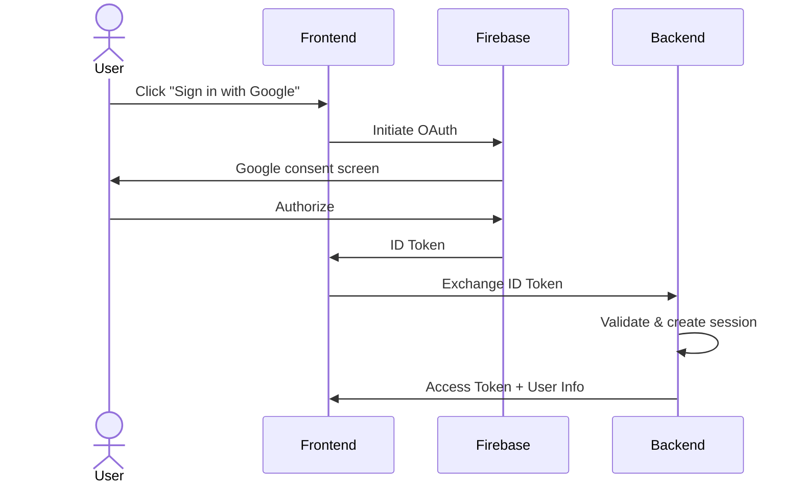
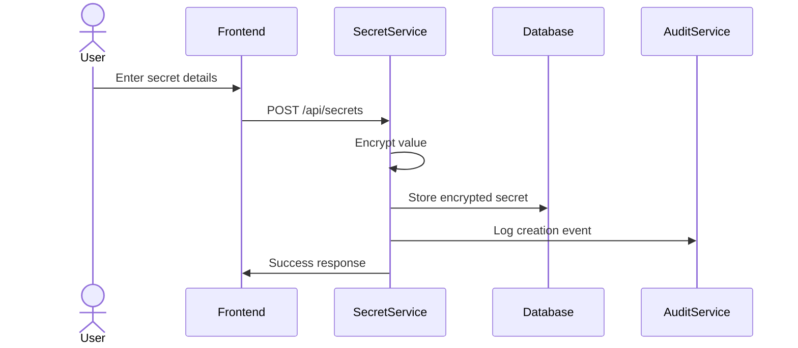
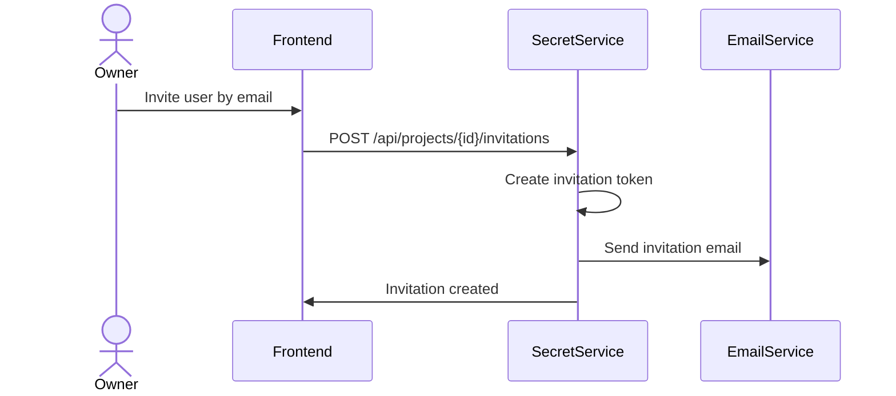

# Features & Workflows

## Core Business Capabilities

### Secret Management

The platform provides complete lifecycle management for secrets:

- **Create** — Add new secrets with optional description and expiration date
- **Read** — Retrieve secret values (with audit logging)
- **Update** — Modify secrets (creates new version, preserves history)
- **Delete** — Soft-delete with 30-day recovery window
- **Bulk Operations** — Import/export multiple secrets at once

### Project Collaboration

Projects serve as the primary collaboration unit:

- **Project Creation** — Users create projects to group related secrets
- **Member Invitations** — Invite users by email with specific roles
- **Role Management** — Promote or demote members as needs change
- **Project Archival** — Archive projects with scheduled permanent deletion

### Access Control

Four role levels provide granular permissions:

| Role | Create Secrets | View Secrets | Manage Members | Delete Project |
|------|----------------|--------------|----------------|----------------|
| **Owner** | ✓ | ✓ | ✓ | ✓ |
| **Admin** | ✓ | ✓ | ✓ | ✗ |
| **Member** | ✓ | ✓ | ✗ | ✗ |
| **Viewer** | ✗ | ✓ | ✗ | ✗ |

### Audit & Compliance

Every action generates an audit record containing:

- Who performed the action
- What was done
- When it occurred
- IP address and user agent
- Before/after state for changes

---

## Key User Workflows

### Authentication Flow

1. User clicks sign-in button
2. Google OAuth consent flow completes
3. Firebase returns an ID token
4. Backend validates the token and creates a session
5. User is redirected to the dashboard

### Creating a Secret

1. User enters key, value, and optional metadata
2. Frontend submits to the Secret Service
3. Backend encrypts the value and stores it
4. Audit log records the creation
5. User sees the new secret in their project

### Sharing a Project

1. Project owner enters invitee's email and desired role
2. System creates an invitation with a secure token
3. Email notification is sent to the invitee
4. Invitee clicks the link and joins the project

### Retrieving a Secret

1. User navigates to a project
2. Clicks to reveal a secret value
3. Backend verifies user's project membership and role
4. Decrypted value is returned to the frontend
5. Access is logged in the audit trail

---

## Event-Driven Features

The system uses asynchronous messaging for non-critical operations:

**Published Events:**
- Secret created, updated, deleted
- User invited to project
- Secret accessed
- Secret approaching expiration

**Triggered Actions:**
- Email notifications to relevant users
- In-app notification creation
- Expiration warning alerts

---

**Next:** [Architecture →](./03-ARCHITECTURE.md)
