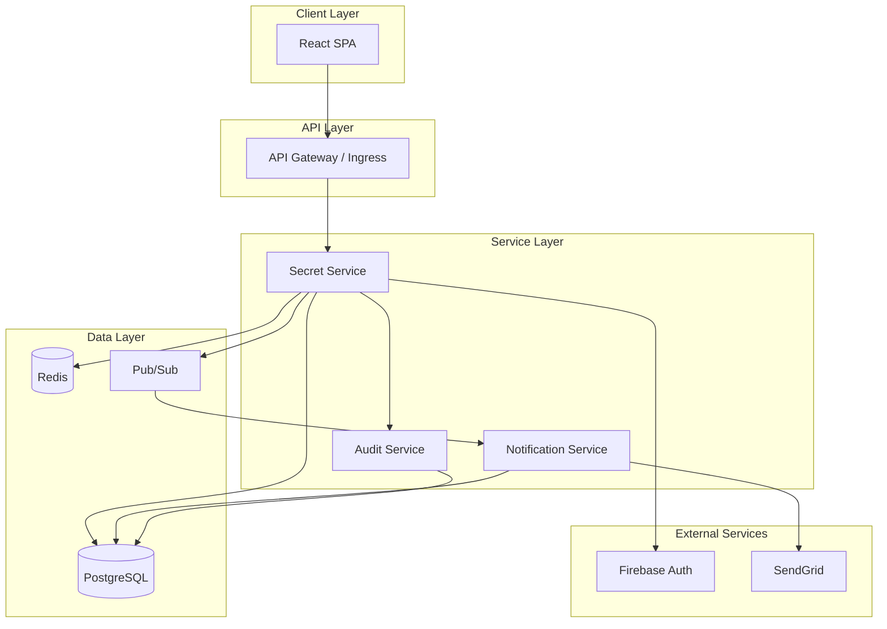

# Architecture

## Overall Design

Cloud Secrets Manager follows a **microservices architecture** with three backend services, a React single-page application frontend, and supporting infrastructure services.

**Design Principles:**
- Separation of concerns — each service has a single responsibility
- Event-driven communication — loose coupling via asynchronous messaging
- Security by design — zero-trust with encryption at rest and in transit
- Observability first — built-in metrics, logging, and tracing

---

## System Components

### Frontend

**React SPA** — A TypeScript-based single-page application providing the user interface. Communicates with the backend exclusively via REST APIs with JWT authentication.

### Backend Services

**Secret Service (Port 8080)** — The core API handling all business logic:
- User authentication and session management
- Project and workflow CRUD operations
- Secret encryption, storage, and retrieval
- Access control enforcement
- Event publishing

**Audit Service (Port 8081)** — Dedicated logging service:
- Receives audit events from Secret Service
- Stores immutable audit records
- Provides query APIs for audit logs
- Generates compliance reports

**Notification Service (Port 8082)** — Handles user communications:
- Subscribes to event messages
- Sends email notifications
- Creates in-app notifications
- Manages notification preferences

### Data Stores

**PostgreSQL** — Primary relational database storing users, projects, secrets, and audit logs. Secrets are stored encrypted; the database never sees plaintext values.

**Redis** — In-memory store for session management and token blacklisting.

**Google Pub/Sub** — Message broker for asynchronous event communication between services.

---

## Architecture Diagram

---

## Communication Patterns

### Synchronous (REST)

| From | To | Purpose |
|------|----|---------|
| Frontend | Secret Service | All user-initiated actions |
| Secret Service | Audit Service | Recording audit events |
| Secret Service | Firebase | Token validation |

**Protocol:** HTTPS with JSON payloads  
**Authentication:** JWT Bearer tokens

### Asynchronous (Pub/Sub)

| Publisher | Subscriber | Events |
|-----------|------------|--------|
| Secret Service | Notification Service | Secret events, invitations |

**Topics:**
- `secret-events` — Secret CRUD operations
- `notification-events` — Triggers for user notifications

---

## Security Architecture

### Authentication Flow

1. User authenticates via Firebase (Google OAuth)
2. Frontend receives Firebase ID token
3. Backend validates token with Firebase Admin SDK
4. Backend issues short-lived access token (15 minutes)
5. Refresh tokens extend sessions without re-authentication

### Authorization Model

- **Platform Roles** — USER or PLATFORM_ADMIN (system-wide)
- **Project Roles** — OWNER, ADMIN, MEMBER, VIEWER (per-project)
- **Custom Claims** — Stored in Firebase tokens for authorization decisions

### Encryption

- **At Rest** — AES-256-GCM for secret values
- **In Transit** — TLS 1.3 for all communications
- **Key Management** — Encryption keys stored in Google Secret Manager

---

## Scalability Considerations

**Horizontal Scaling:**
- All services are stateless and can run multiple replicas
- Kubernetes handles load balancing and auto-scaling
- PostgreSQL uses Cloud SQL with read replicas for scaling reads

**Event-Driven Decoupling:**
- Pub/Sub provides message buffering during traffic spikes
- Notification processing doesn't block API responses
- Services can be scaled independently based on load

---

**Next:** [Data & Database →](./04-DATA-AND-DATABASE.md)
