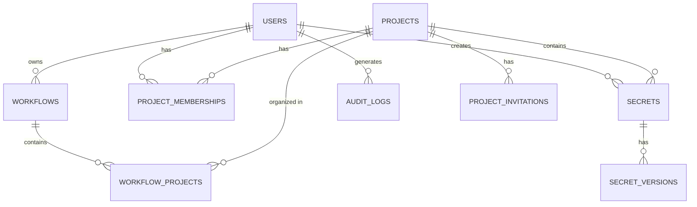

# Data & Database Design

## Overview

The system uses PostgreSQL 16 as the primary data store. The schema follows a **Resource-Scoped RBAC** pattern where access control is defined at the project level.

**Key Design Decisions:**
- UUIDs for all primary keys (no sequential IDs exposed)
- Soft deletes with scheduled permanent deletion
- Encrypted values stored as text (encryption happens at application layer)
- Comprehensive indexing for query performance

---

## Main Entities

### Users

Represents authenticated users. Links Firebase authentication (external identity) to internal user records.

**Key attributes:**
- Firebase UID (external identifier)
- Email (unique)
- Platform role (USER or PLATFORM_ADMIN)
- Account status and timestamps

### Workflows

Personal organization containers. Each user has their own workflows to organize projects. Workflows are **not shared** between users.

**Key attributes:**
- Owner user reference
- Name (unique per user)
- Display order for UI sorting
- Optional icon and color

### Projects

The core collaboration unit. Multiple users can access the same project with different roles.

**Key attributes:**
- Name and description
- Creator reference
- Archive status and deletion schedule
- Timestamps

### Project Memberships

Defines user access to projects. The junction table that enables role-based access control.

**Key attributes:**
- Project and user references
- Role (OWNER, ADMIN, MEMBER, VIEWER)
- Inviter reference and join timestamp

### Secrets

Encrypted key-value pairs within projects. The secret key is unique within a project.

**Key attributes:**
- Project reference
- Secret key (unique within project)
- Encrypted value
- Description and metadata
- Expiration and rotation settings

### Secret Versions

Maintains history of secret values. Each update creates a new version.

**Key attributes:**
- Secret reference
- Version number (sequential per secret)
- Encrypted value snapshot
- Change note and creator

### Audit Logs

Immutable record of all system actions for compliance and security.

**Key attributes:**
- Action type and resource details
- Actor (user) reference
- Before/after state (JSONB)
- Request metadata (IP, user agent)
- Timestamp

---

## Entity Relationships

---

## Relationship Details

### User → Projects (Many-to-Many)

Users access projects through **project_memberships**. A user can be a member of many projects, and a project can have many members.

### User → Workflows (One-to-Many)

Each user has their own workflows. Workflows are personal and not shared.

### Workflow → Projects (Many-to-Many)

Projects can appear in multiple users' workflows through **workflow_projects**. Each user organizes the same project in their own way.

### Project → Secrets (One-to-Many)

Secrets belong to exactly one project. Deleting a project cascades to delete its secrets.

### Secret → Versions (One-to-Many)

Each secret maintains a version history. The current value is also stored on the secrets table for performance.

---

## Important Constraints

| Constraint | Purpose |
|------------|---------|
| Users email must be unique | Prevent duplicate accounts |
| Workflow name unique per user | Allow same name across users |
| Secret key unique per project | Allow same key in different projects |
| One project membership per user-project pair | Prevent duplicate memberships |

---

## Indexing Strategy

**Primary indexes** exist on all primary keys and foreign keys.

**Additional indexes for common queries:**
- Users by Firebase UID and email (login lookup)
- Projects by creator and archive status
- Secrets by project and expiration date
- Audit logs by project, user, and timestamp (descending)

---

## Data Retention

| Data Type | Retention |
|-----------|-----------|
| Active data | Indefinite |
| Archived projects | 30 days before permanent deletion |
| Audit logs | 1 year (configurable) |
| Secret versions | Indefinite |

---

**Next:** [Request Flows →](./05-REQUEST-FLOWS.md)
