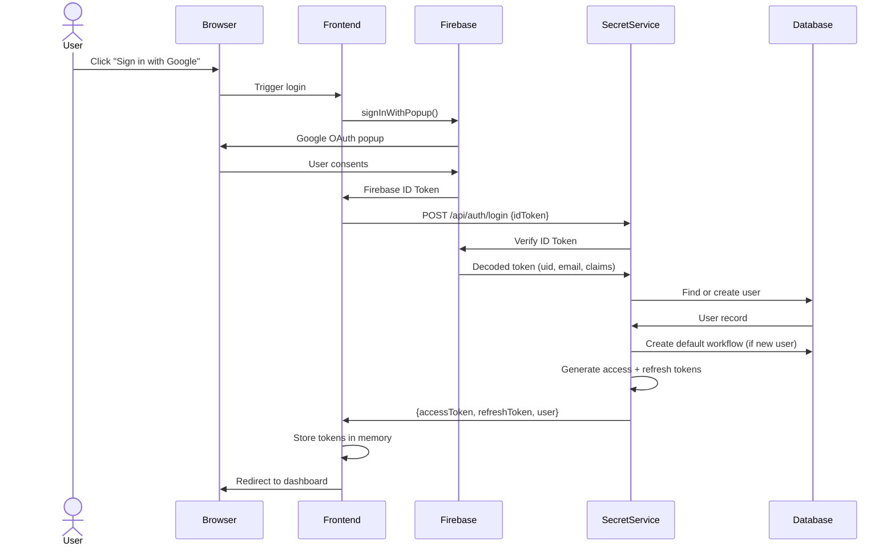
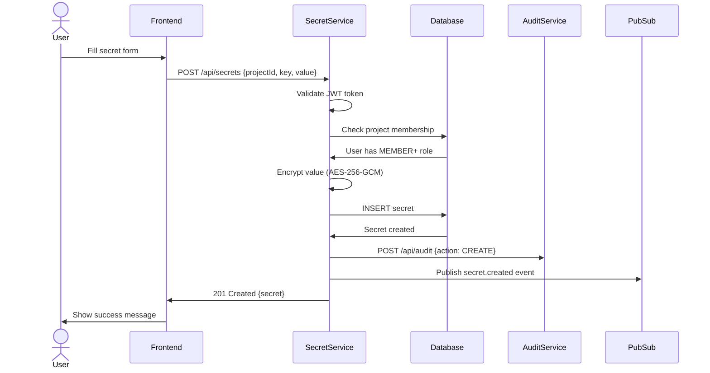
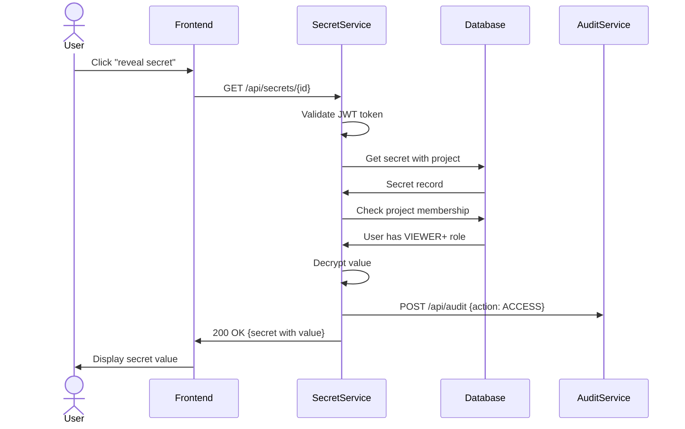
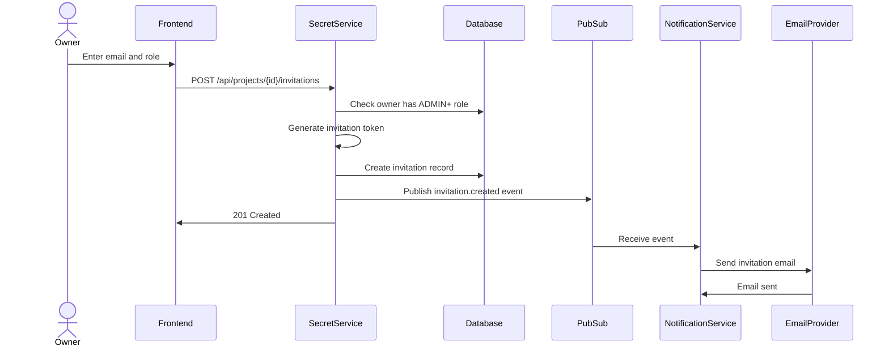
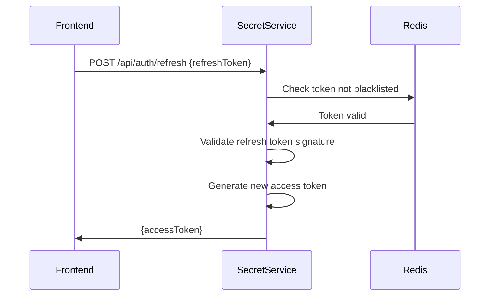

# Request & Sequence Flows

## Overview

This page describes how requests flow through the system for key operations. Understanding these flows helps with debugging and development.

---

## Authentication Flow (Login)

The login flow integrates Firebase authentication with the backend session management.

**Key Points:**
- Firebase handles the OAuth complexity
- Backend validates Firebase tokens and creates local sessions
- New users get a default workflow created automatically
- Access tokens are short-lived (15 minutes); refresh tokens last 7 days

---

## Secret Creation Flow

Creating a secret involves encryption, storage, and audit logging.

**Key Points:**
- Authorization check happens before any data operation
- Encryption occurs in the service layer, not the database
- Audit logging is synchronous to ensure compliance
- Pub/Sub event enables async notifications

---

## Secret Retrieval Flow

Retrieving a secret value requires authorization and generates an audit record.

**Key Points:**
- Every access is logged for compliance
- Decryption only happens after authorization succeeds
- The value is never logged or stored in plaintext

---

## Project Invitation Flow

Inviting a user involves email notification and pending invitation tracking.

**Key Points:**
- Invitation tokens expire after a configured period
- If the invitee already has an account, they see the invitation immediately
- Email sending is asynchronous via Pub/Sub

---

## Token Refresh Flow

Maintaining sessions without forcing re-login.

**Key Points:**
- Refresh tokens can be revoked by blacklisting in Redis
- Access tokens are rotated frequently for security
- Logout blacklists the refresh token

---

## General Request Pattern

All authenticated API requests follow this pattern:

1. **Request arrives** at the API gateway / ingress
2. **JWT validation** extracts user identity and claims
3. **Authorization check** verifies the user can perform the action
4. **Business logic** executes the operation
5. **Audit logging** records the action
6. **Response** returns to the client

**Error Handling:**
- 401 Unauthorized — Invalid or missing token
- 403 Forbidden — Valid token but insufficient permissions
- 404 Not Found — Resource doesn't exist or user can't see it
- 422 Unprocessable Entity — Validation errors

---

**Next:** [Infrastructure & Deployment →](./06-INFRASTRUCTURE-AND-DEPLOYMENT.md)
