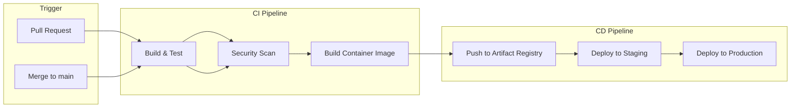

# Infrastructure & Deployment

## Overview

The application runs on Google Cloud Platform with Kubernetes for orchestration. Infrastructure is managed as code using Terraform and Helm.

---

## Environments

| Environment | Purpose | Database | Scaling |
|-------------|---------|----------|---------|
| **Development** | Local development | Local PostgreSQL | Single instance |
| **Staging** | Integration testing | Cloud SQL (small) | 1-2 replicas |
| **Production** | Live traffic | Cloud SQL (HA) | Auto-scaling |

---

## CI/CD Pipeline

The project uses **Google Cloud Build** for continuous integration and deployment.

**Pipeline Stages:**

1. **Build & Test** — Compile code, run unit tests
2. **Security Scan** — Trivy vulnerability scanning on container images
3. **Image Push** — Tagged images pushed to Google Artifact Registry
4. **Staging Deployment** — Automatic deployment on merge
5. **Production Deployment** — Manual approval required

---

## Kubernetes Architecture

### Namespaces

| Namespace | Purpose |
|-----------|---------|
| `csm` | Application workloads (secret-service, audit-service, notification-service) |
| `monitoring` | Prometheus, Grafana, Loki, Promtail |
| `external-secrets` | External Secrets Operator for syncing secrets |
| `ingress-nginx` | Ingress controller |

### Deployments

Each service runs as a Kubernetes Deployment with:
- Multiple replicas (configurable per environment)
- Resource requests and limits
- Liveness and readiness probes
- Pod security context (non-root, read-only filesystem)

### Services

ClusterIP services expose each deployment internally. The ingress controller handles external traffic routing.

### Ingress

A single Ingress resource routes external traffic:
- `/api/*` → secret-service
- `/audit/*` → audit-service
- TLS termination with managed certificates

### ConfigMaps and Secrets

- **ConfigMaps** store non-sensitive configuration (feature flags, service URLs)
- **Kubernetes Secrets** store sensitive values, synced from Google Secret Manager via External Secrets Operator

---

## Terraform Infrastructure

Terraform manages all GCP resources. The codebase is organized into reusable modules.

### Module Structure

| Module | Resources Created |
|--------|-------------------|
| `gke-cluster` | GKE cluster, node pools, Workload Identity |
| `postgresql` | Cloud SQL instance, databases, users |
| `artifact-registry` | Container image repositories |
| `iam` | Service accounts, IAM bindings |
| `pubsub` | Topics and subscriptions |
| `secrets` | Google Secret Manager secrets |

### Environment Configurations

Each environment has its own Terraform configuration that composes modules with environment-specific values:
- `infrastructure/terraform/environments/dev/`
- `infrastructure/terraform/environments/staging/`
- `infrastructure/terraform/environments/production/`

### State Management

Terraform state is stored remotely in Google Cloud Storage with state locking to prevent concurrent modifications.

---

## Google Cloud Components

### Compute

| Service | Usage |
|---------|-------|
| **GKE** | Kubernetes cluster running application workloads |
| **Cloud SQL** | Managed PostgreSQL database with high availability |

### Storage

| Service | Usage |
|---------|-------|
| **Artifact Registry** | Container image storage |
| **Cloud Storage** | Terraform state, backups |
| **Secret Manager** | Encryption keys, service credentials |

### Networking

| Service | Usage |
|---------|-------|
| **VPC** | Private network for all resources |
| **Cloud NAT** | Outbound internet access for private nodes |
| **Cloud Load Balancer** | External traffic ingress (via GKE Ingress) |

### Messaging

| Service | Usage |
|---------|-------|
| **Pub/Sub** | Asynchronous event messaging between services |

### Security

| Service | Usage |
|---------|-------|
| **Workload Identity** | Pod-level authentication to GCP services (no key files) |
| **IAM** | Access control for GCP resources |

---

## Helm Charts

The project includes a Helm chart for deploying to Kubernetes.

### Chart Structure

The chart deploys all three services with configurable values for:
- Image tags and pull policies
- Replica counts
- Resource limits
- Environment-specific settings
- Feature flags

### Values Files

| File | Purpose |
|------|---------|
| `values.yaml` | Default development configuration |
| `values-staging.yaml` | Staging overrides |
| `values-production.yaml` | Production overrides (HA settings, larger resources) |

---

## Security Configuration

### Network Policies

Kubernetes Network Policies restrict pod-to-pod communication:
- Default deny all ingress
- Explicit allow rules for required communication paths
- Egress rules for external service access

### Pod Security Standards

Pods run with restricted security context:
- Non-root user
- Read-only root filesystem
- No privilege escalation
- Dropped capabilities

### External Secrets Operator

Syncs secrets from Google Secret Manager to Kubernetes:
- Automatic rotation on source change
- No secrets stored in Git
- Workload Identity for authentication

---

**Next:** [Monitoring & Observability →](./07-MONITORING-AND-OBSERVABILITY.md)
