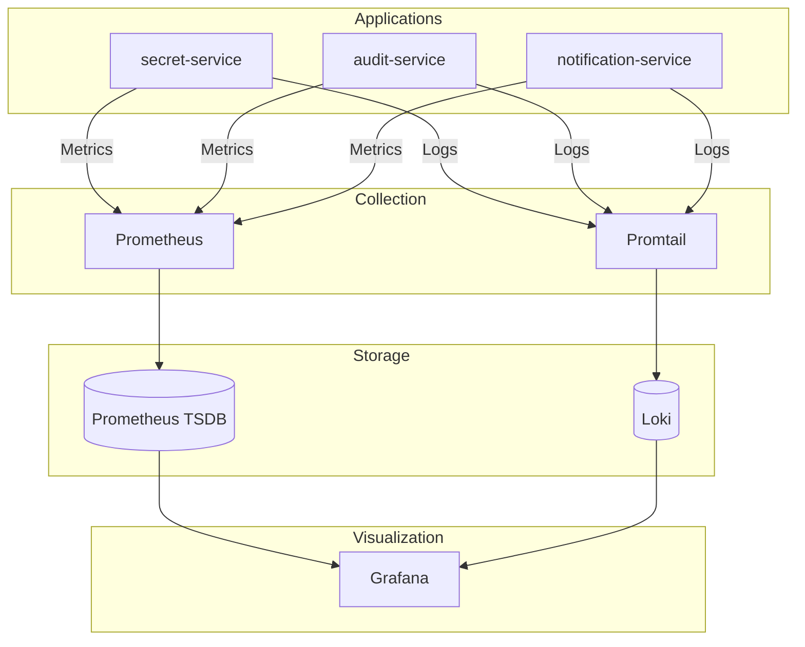

# Monitoring & Observability

## Overview

The observability stack follows the three pillars model: **metrics**, **logs**, and **traces**. All components are deployed in the `monitoring` namespace.



---

## Metrics (Prometheus)

### How Metrics Work

Each service exposes a metrics endpoint at `/actuator/prometheus`. Prometheus scrapes these endpoints at regular intervals (15 seconds by default).

### ServiceMonitors

Kubernetes ServiceMonitor resources configure Prometheus to discover and scrape application pods automatically. When a new pod starts, Prometheus begins scraping it without manual configuration.

### Key Metrics

| Metric | Type | Description |
|--------|------|-------------|
| `http_server_requests_seconds` | Histogram | Request latency distribution |
| `http_server_requests_seconds_count` | Counter | Total request count |
| `jvm_memory_used_bytes` | Gauge | JVM memory usage |
| `db_pool_active_connections` | Gauge | Database connection pool status |

### Alert Rules

Pre-configured alerts notify on:
- High error rate (>5% of requests returning 5xx)
- High latency (95th percentile > 2 seconds)
- Pod not ready for extended period
- Database connection pool exhaustion
- Memory pressure

---

## Logs (Loki + Promtail)

### How Logging Works

**Promtail** runs as a DaemonSet on every node, tailing container logs from the filesystem. It enriches logs with Kubernetes metadata (namespace, pod name, labels) and pushes them to **Loki**.

**Loki** stores logs efficiently by only indexing metadata (labels), not the log content. This makes it cost-effective for high-volume logging.

### Log Labels

All logs are automatically labeled with:
- `namespace` — Kubernetes namespace
- `pod` — Pod name
- `container` — Container name
- `app` — Application label from deployment

### Retention

Logs are retained for 30 days by default. Older logs are automatically deleted.

### Querying Logs (LogQL)

Engineers query logs using LogQL in Grafana Explore. Common patterns:

**All logs from a service:**
```
{namespace="csm", app="secret-service"}
```

**Error logs only:**
```
{namespace="csm"} |= "ERROR"
```

**Logs for a specific request:**
```
{namespace="csm"} |= "request-id-xyz"
```

**Structured field extraction:**
```
{namespace="csm"} | json | level="ERROR"
```

---

## Traces (OpenTelemetry)

Distributed tracing is configured but not fully deployed. The architecture supports OpenTelemetry integration.

**Current status:** Tracing headers are propagated between services, but trace collection is not active.

**Future state:** Traces will be collected by an OpenTelemetry Collector and visualized in Grafana Tempo.

---

## Grafana Dashboards

Grafana provides the unified interface for all observability data.

### Pre-built Dashboards

| Dashboard | Purpose |
|-----------|---------|
| **API Overview** | Request rate, latency, error rate |
| **JVM Metrics** | Memory, GC, thread pools |
| **Database** | Connection pool, query latency |
| **Kubernetes** | Pod status, resource usage |

### Accessing Grafana

In development, port-forward to the Grafana service. In production, access via the configured ingress URL with SSO authentication.

---

## Debugging Common Issues

### High Latency

1. Check the **API Overview** dashboard for latency spikes
2. Correlate with database dashboard for slow queries
3. Check logs for stack traces or timeout messages
4. Review resource usage (CPU, memory) for saturation

### Error Rate Spike

1. Check alert firing in Grafana
2. Query logs for error messages: `{namespace="csm"} |= "ERROR"`
3. Check downstream service health (database, external APIs)
4. Review recent deployments for potential regressions

### Pod Not Starting

1. Check pod events: `kubectl describe pod <name>`
2. Check logs for startup errors
3. Verify secrets are synced (External Secrets status)
4. Check resource quota and node capacity

### Database Issues

1. Check Cloud SQL metrics in GCP Console
2. Review connection pool gauges in Grafana
3. Check for long-running queries or deadlocks
4. Verify network connectivity to Cloud SQL

---

## Alerting

### Alert Channels

Alerts route to:
- Slack channel (if configured)
- Email to on-call engineer
- PagerDuty for critical alerts (production)

### Alert Severity

| Severity | Response Time | Examples |
|----------|---------------|----------|
| **Critical** | Immediate | Service down, data loss risk |
| **Warning** | Within 1 hour | High error rate, approaching limits |
| **Info** | Next business day | Performance degradation, unusual patterns |

---

**Next:** [Operations & Local Development →](./08-OPERATIONS-AND-LOCAL-DEVELOPMENT.md)
