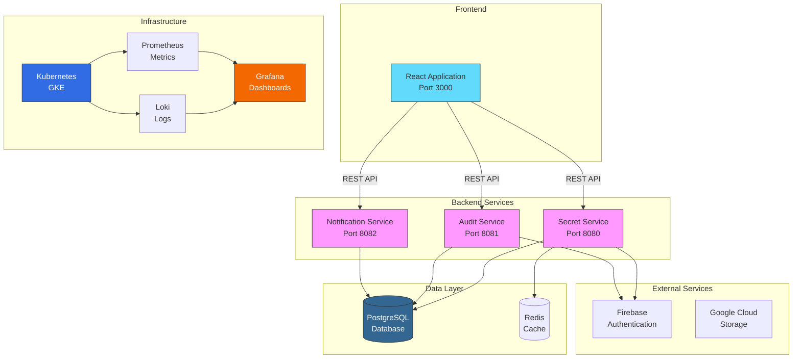
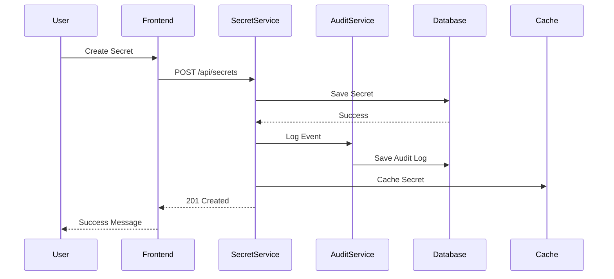
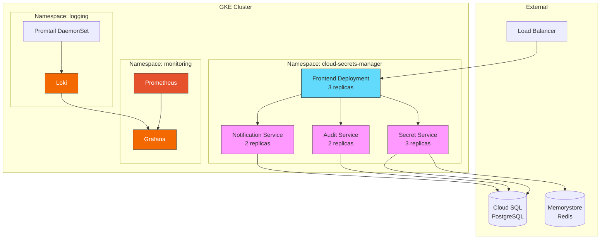
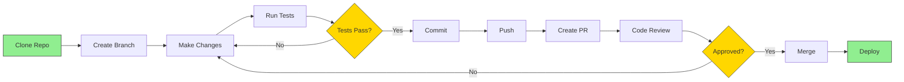
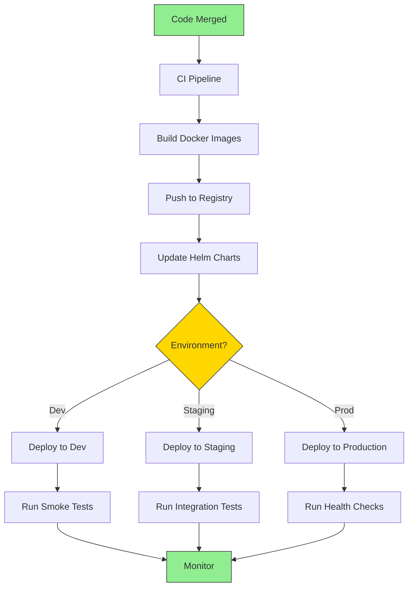

# Cloud Secrets Manager - Project Wiki

**Last Updated:** December 5, 2025  
**Purpose:** Comprehensive project documentation and knowledge base

---

## 📚 Wiki Structure

This wiki serves as the central knowledge base for the Cloud Secrets Manager project, containing comprehensive documentation on workflows, features, architecture, and user guides.

---

## 🗂️ Wiki Sections

### 1. [Workflows](./workflows/)

Step-by-step guides for common development and operational workflows:

- **[Development Workflow](./workflows/DEVELOPMENT_WORKFLOW.md)** - Daily development tasks
- **[Deployment Workflow](./workflows/DEPLOYMENT_WORKFLOW.md)** - Deploying to environments
- **[Testing Workflow](./workflows/TESTING_WORKFLOW.md)** - Running and writing tests
- **[Monitoring Workflow](./workflows/MONITORING_WORKFLOW.md)** - Observability practices
- **[Incident Response Workflow](./workflows/INCIDENT_RESPONSE.md)** - Handling incidents

### 2. [Features](./features/)

Detailed documentation for each feature:

- **[Secret Management](./features/SECRET_MANAGEMENT.md)** - Core secret operations
- **[Project Management](./features/PROJECT_MANAGEMENT.md)** - Project organization
- **[User Management](./features/USER_MANAGEMENT.md)** - User and team management
- **[Audit Logging](./features/AUDIT_LOGGING.md)** - Audit trail and compliance
- **[Notifications](./features/NOTIFICATIONS.md)** - Alert and notification system
- **[Two-Factor Authentication](./features/TWO_FACTOR_AUTH.md)** - 2FA implementation

### 3. [Architecture](./architecture/)

System architecture and design documentation:

- **[System Overview](./architecture/SYSTEM_OVERVIEW.md)** - High-level architecture
- **[Microservices Architecture](./architecture/MICROSERVICES.md)** - Service design
- **[Data Model](./architecture/DATA_MODEL.md)** - Database schema and relationships
- **[API Design](./architecture/API_DESIGN.md)** - RESTful API patterns
- **[Security Architecture](./architecture/SECURITY.md)** - Security model
- **[Infrastructure](./architecture/INFRASTRUCTURE.md)** - Cloud infrastructure

### 4. [User Guides](./user-guides/)

End-user documentation:

- **[Getting Started](./user-guides/GETTING_STARTED.md)** - Quick start guide
- **[Creating Secrets](./user-guides/CREATING_SECRETS.md)** - Secret creation guide
- **[Managing Projects](./user-guides/MANAGING_PROJECTS.md)** - Project management
- **[Team Collaboration](./user-guides/TEAM_COLLABORATION.md)** - Working with teams
- **[Security Best Practices](./user-guides/SECURITY_BEST_PRACTICES.md)** - Security guidelines

---

## 🎯 Quick Navigation

### For Developers

1. Start with [Development Workflow](./workflows/DEVELOPMENT_WORKFLOW.md)
2. Review [System Overview](./architecture/SYSTEM_OVERVIEW.md)
3. Explore [Features](./features/) you'll be working on
4. Check [API Design](./architecture/API_DESIGN.md) patterns

### For DevOps Engineers

1. Review [Deployment Workflow](./workflows/DEPLOYMENT_WORKFLOW.md)
2. Study [Infrastructure](./architecture/INFRASTRUCTURE.md)
3. Learn [Monitoring Workflow](./workflows/MONITORING_WORKFLOW.md)
4. Prepare for [Incident Response](./workflows/INCIDENT_RESPONSE.md)

### For Product Managers

1. Understand [System Overview](./architecture/SYSTEM_OVERVIEW.md)
2. Review all [Features](./features/)
3. Check [User Guides](./user-guides/) for user experience
4. Review [Security Architecture](./architecture/SECURITY.md)

### For End Users

1. Start with [Getting Started](./user-guides/GETTING_STARTED.md)
2. Learn [Creating Secrets](./user-guides/CREATING_SECRETS.md)
3. Explore [Managing Projects](./user-guides/MANAGING_PROJECTS.md)
4. Follow [Security Best Practices](./user-guides/SECURITY_BEST_PRACTICES.md)

---

## 📊 Architecture Diagrams

### System Architecture



### Data Flow



### Deployment Architecture



---

## 🔄 Common Workflows

### Development Workflow



### Deployment Workflow



---

## 📝 Documentation Standards

### Document Structure

All wiki documents should follow this structure:

```markdown
# Document Title

**Last Updated:** YYYY-MM-DD  
**Status:** Draft | Review | Published  
**Owner:** Team/Person

---

## Overview

Brief description of the document's purpose.

## Content Sections

Detailed content organized logically.

## Examples

Practical examples and code snippets.

## References

Links to related documentation.
```

### Diagram Standards

- Use Mermaid for all diagrams
- Keep diagrams simple and focused
- Use consistent colors and styles
- Include legends when necessary

### Code Examples

- Use syntax highlighting
- Include comments
- Show expected output
- Provide context

---

## 🔗 Related Documentation

### Technical Documentation

- [Architecture Specification](../101/Architecture_Specification_v3.md)
- [API Documentation](http://localhost:8080/swagger-ui.html)
- [Database Schema](../04_DATA_MODEL_AND_DB_DIAGRAMS.md)

### Operational Documentation

- [Deployment Guide](../deployment/FIRST_TIME_DEPLOYMENT.md)
- [Operations Guide](../deployment/operations/OPERATIONS_GUIDE.md)
- [Logging Setup](../deployment/logging/LOGGING_SETUP.md)

### Learning Resources

- [Kubernetes 101](../101/01-KUBERNETES-101.md)
- [Helm 101](../101/02-HELM-101.md)
- [Loki & Promtail 101](../101/08-LOKI-PROMTAIL-101.md)

---

## 🤝 Contributing to the Wiki

### Adding New Documentation

1. Create document in appropriate section
2. Follow documentation standards
3. Add entry to this README
4. Update related documents
5. Submit PR for review

### Updating Existing Documentation

1. Update "Last Updated" date
2. Mark outdated sections clearly
3. Maintain backward compatibility
4. Update related documents
5. Submit PR for review

### Archiving Documentation

1. Move to `../archive/` directory
2. Add "ARCHIVED" prefix to title
3. Add archive date and reason
4. Update references in other docs
5. Remove from this index

---

## 📧 Contact

**Documentation Team:** DevOps Team  
**Questions:** Create an issue in the repository  
**Suggestions:** Submit a PR with improvements

---

**Last Review:** December 5, 2025  
**Next Review:** January 5, 2026
