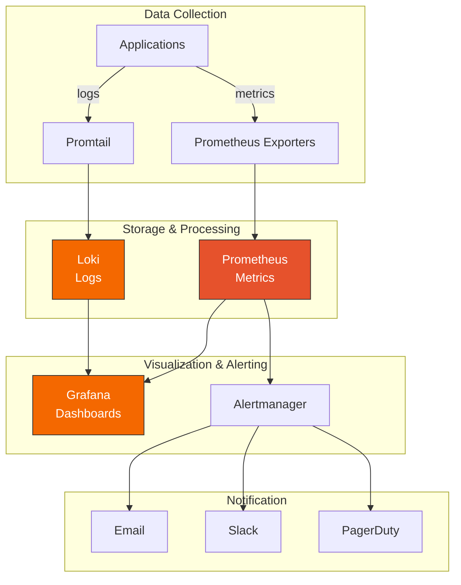
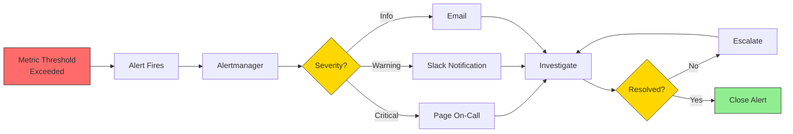

# Monitoring Workflow

**Last Updated:** December 5, 2025  
**Status:** Published  
**Owner:** DevOps Team

---

## Overview

This document describes the complete monitoring workflow for the Cloud Secrets Manager project, covering metrics collection, log aggregation, alerting, and incident response.

---

## Table of Contents

1. [Monitoring Stack](#monitoring-stack)
2. [Daily Monitoring Tasks](#daily-monitoring-tasks)
3. [Metrics Monitoring](#metrics-monitoring)
4. [Log Monitoring](#log-monitoring)
5. [Alert Management](#alert-management)
6. [Dashboard Usage](#dashboard-usage)
7. [Troubleshooting](#troubleshooting)

---

## Monitoring Stack

### Components



### Access Points

- **Grafana**: `http://grafana.monitoring.svc.cluster.local:3000`
- **Prometheus**: `http://prometheus.monitoring.svc.cluster.local:9090`
- **Loki**: `http://loki.logging.svc.cluster.local:3100`
- **Alertmanager**: `http://alertmanager.monitoring.svc.cluster.local:9093`

---

## Daily Monitoring Tasks

### Morning Checklist

```bash
#!/bin/bash
# Daily monitoring check script

echo "=== Daily Monitoring Check ==="
echo "Date: $(date)"
echo ""

# 1. Check all monitoring pods
echo "1. Checking monitoring pods..."
kubectl get pods -n monitoring
kubectl get pods -n logging
echo ""

# 2. Check Prometheus targets
echo "2. Checking Prometheus targets..."
kubectl port-forward -n monitoring svc/prometheus 9090:9090 &
sleep 2
curl -s http://localhost:9090/api/v1/targets | jq '.data.activeTargets | length'
echo ""

# 3. Check Loki health
echo "3. Checking Loki health..."
kubectl port-forward -n logging svc/loki 3100:3100 &
sleep 2
curl -s http://localhost:3100/ready
echo ""

# 4. Check for firing alerts
echo "4. Checking for firing alerts..."
curl -s http://localhost:9090/api/v1/alerts | jq '.data.alerts[] | select(.state=="firing")'
echo ""

# 5. Check resource usage
echo "5. Checking resource usage..."
kubectl top nodes
kubectl top pods -n cloud-secrets-manager
echo ""

# Cleanup
pkill -f "port-forward"

echo "=== Check Complete ==="
```

### Weekly Tasks

1. **Review Dashboards**
   - Check all service dashboards
   - Verify data is flowing
   - Look for anomalies

2. **Review Alerts**
   - Check alert history
   - Tune alert thresholds
   - Update alert rules

3. **Capacity Planning**
   - Review resource trends
   - Plan for scaling
   - Optimize resource allocation

4. **Documentation**
   - Update runbooks
   - Document incidents
   - Share learnings

---

## Metrics Monitoring

### Key Metrics to Monitor

#### Application Metrics

**Request Rate:**
```promql
# Requests per second
rate(http_requests_total[5m])

# By service
sum by (service) (rate(http_requests_total[5m]))
```

**Error Rate:**
```promql
# Error percentage
sum(rate(http_requests_total{status=~"5.."}[5m])) 
/ 
sum(rate(http_requests_total[5m])) 
* 100
```

**Response Time:**
```promql
# 95th percentile
histogram_quantile(0.95, 
  rate(http_request_duration_seconds_bucket[5m])
)

# By endpoint
histogram_quantile(0.95, 
  sum by (endpoint, le) (
    rate(http_request_duration_seconds_bucket[5m])
  )
)
```

#### Infrastructure Metrics

**CPU Usage:**
```promql
# Node CPU usage
100 - (avg by (instance) (rate(node_cpu_seconds_total{mode="idle"}[5m])) * 100)

# Pod CPU usage
sum by (pod) (rate(container_cpu_usage_seconds_total[5m]))
```

**Memory Usage:**
```promql
# Node memory usage
(node_memory_MemTotal_bytes - node_memory_MemAvailable_bytes) 
/ 
node_memory_MemTotal_bytes 
* 100

# Pod memory usage
sum by (pod) (container_memory_usage_bytes)
```

**Disk Usage:**
```promql
# Disk usage percentage
(node_filesystem_size_bytes - node_filesystem_avail_bytes) 
/ 
node_filesystem_size_bytes 
* 100
```

#### Database Metrics

**Connection Pool:**
```promql
# Active connections
hikaricp_connections_active

# Pending connections
hikaricp_connections_pending
```

**Query Performance:**
```promql
# Slow queries
rate(postgresql_slow_queries_total[5m])

# Query duration
histogram_quantile(0.95, 
  rate(postgresql_query_duration_seconds_bucket[5m])
)
```

### Accessing Metrics

**Via Grafana:**
1. Open Grafana
2. Navigate to Explore
3. Select Prometheus data source
4. Enter PromQL query
5. Visualize results

**Via Prometheus UI:**
```bash
# Port-forward Prometheus
kubectl port-forward -n monitoring svc/prometheus 9090:9090

# Open browser
open http://localhost:9090
```

**Via API:**
```bash
# Query current value
curl -G http://localhost:9090/api/v1/query \
  --data-urlencode 'query=up'

# Query range
curl -G http://localhost:9090/api/v1/query_range \
  --data-urlencode 'query=rate(http_requests_total[5m])' \
  --data-urlencode 'start=2025-12-05T10:00:00Z' \
  --data-urlencode 'end=2025-12-05T11:00:00Z' \
  --data-urlencode 'step=60s'
```

---

## Log Monitoring

### Key Log Queries

**Error Logs:**
```logql
# All errors
{namespace="cloud-secrets-manager"} |= "ERROR"

# Errors by service
sum by (service) (
  count_over_time({namespace="cloud-secrets-manager"} |= "ERROR" [5m])
)
```

**Performance Issues:**
```logql
# Slow requests
{service="secret-service"} 
  | json 
  | duration_ms > 1000

# Database timeouts
{namespace="cloud-secrets-manager"} 
  |~ "timeout|timed out" 
  |= "database"
```

**Security Events:**
```logql
# Failed logins
{service="audit-service"} 
  | json 
  | event_type="LOGIN_FAILED"

# Unauthorized access
{namespace="cloud-secrets-manager"} 
  | json 
  | status_code="403"
```

### Accessing Logs

**Via Grafana:**
1. Open Grafana
2. Navigate to Explore
3. Select Loki data source
4. Enter LogQL query
5. View results

**Via Loki API:**
```bash
# Port-forward Loki
kubectl port-forward -n logging svc/loki 3100:3100

# Query logs
curl -G http://localhost:3100/loki/api/v1/query_range \
  --data-urlencode 'query={service="secret-service"}' \
  --data-urlencode "start=$(date -u -v-1H +%s)000000000" \
  --data-urlencode "end=$(date -u +%s)000000000" \
  | jq '.data.result'
```

**Via kubectl:**
```bash
# View pod logs
kubectl logs -n cloud-secrets-manager <pod-name> -f

# View logs from all pods of a service
kubectl logs -n cloud-secrets-manager -l app=secret-service -f

# View previous logs (after crash)
kubectl logs -n cloud-secrets-manager <pod-name> --previous
```

---

## Alert Management

### Alert Workflow



### Alert Severity Levels

**Critical (P1):**
- Service completely down
- Data loss occurring
- Security breach
- **Response Time:** Immediate (page on-call)

**High (P2):**
- Degraded performance
- High error rate
- Partial service outage
- **Response Time:** 15 minutes

**Medium (P3):**
- Minor performance issues
- Elevated error rate
- Non-critical component failure
- **Response Time:** 1 hour

**Low (P4):**
- Informational alerts
- Capacity warnings
- Maintenance reminders
- **Response Time:** Next business day

### Common Alerts

**Service Down:**
```yaml
alert: ServiceDown
expr: up{job="secret-service"} == 0
for: 5m
severity: critical
description: "Secret service is down"
```

**High Error Rate:**
```yaml
alert: HighErrorRate
expr: |
  sum(rate(http_requests_total{status=~"5.."}[5m])) 
  / 
  sum(rate(http_requests_total[5m])) 
  > 0.05
for: 5m
severity: warning
description: "Error rate above 5%"
```

**High Response Time:**
```yaml
alert: HighResponseTime
expr: |
  histogram_quantile(0.95, 
    rate(http_request_duration_seconds_bucket[5m])
  ) > 1
for: 10m
severity: warning
description: "95th percentile response time above 1s"
```

### Responding to Alerts

1. **Acknowledge Alert**
   - Acknowledge in Alertmanager
   - Notify team in Slack

2. **Investigate**
   - Check relevant dashboards
   - Review logs
   - Check recent changes

3. **Mitigate**
   - Apply immediate fix
   - Scale resources if needed
   - Rollback if necessary

4. **Resolve**
   - Verify fix
   - Close alert
   - Document incident

5. **Post-Mortem**
   - Write incident report
   - Identify root cause
   - Implement preventive measures

---

## Dashboard Usage

### Available Dashboards

1. **System Overview**
   - All services health
   - Resource usage
   - Error rates
   - Request rates

2. **Service Dashboards**
   - Secret Service
   - Audit Service
   - Notification Service

3. **Infrastructure Dashboards**
   - Kubernetes Cluster
   - Node Metrics
   - Pod Metrics

4. **Logging Dashboards**
   - Log Volume
   - Error Analysis
   - Service Logs

### Creating Custom Dashboards

1. **Open Grafana**
2. **Create New Dashboard**
3. **Add Panel**
4. **Select Data Source** (Prometheus or Loki)
5. **Enter Query**
6. **Configure Visualization**
7. **Save Dashboard**

### Dashboard Best Practices

- Use consistent time ranges
- Add meaningful titles
- Include descriptions
- Use appropriate visualizations
- Set up variables for filtering
- Add links to related dashboards

---

## Troubleshooting

### No Metrics Appearing

**Check Prometheus targets:**
```bash
kubectl port-forward -n monitoring svc/prometheus 9090:9090
open http://localhost:9090/targets
```

**Check service monitors:**
```bash
kubectl get servicemonitor -n monitoring
```

**Check pod annotations:**
```bash
kubectl get pod <pod-name> -n cloud-secrets-manager -o yaml | grep prometheus
```

### No Logs Appearing

**Check Promtail:**
```bash
kubectl logs -n logging -l app=promtail --tail=100
```

**Check Loki:**
```bash
kubectl logs -n logging loki-0 --tail=100
```

**Test log flow:**
```bash
# Send test log
curl -H "Content-Type: application/json" \
  -XPOST "http://localhost:3100/loki/api/v1/push" \
  --data-raw '{
    "streams": [{
      "stream": {"job": "test"},
      "values": [["'$(date +%s)'000000000", "test"]]
    }]
  }'

# Query test log
curl -G "http://localhost:3100/loki/api/v1/query_range" \
  --data-urlencode 'query={job="test"}' \
  | jq
```

### Alerts Not Firing

**Check alert rules:**
```bash
kubectl get prometheusrule -n monitoring
```

**Check Alertmanager:**
```bash
kubectl port-forward -n monitoring svc/alertmanager 9093:9093
open http://localhost:9093
```

**Test alert:**
```bash
# Manually trigger alert
curl -X POST http://localhost:9093/api/v1/alerts \
  -H 'Content-Type: application/json' \
  -d '[{
    "labels": {"alertname": "TestAlert", "severity": "warning"},
    "annotations": {"summary": "Test alert"}
  }]'
```

---

## Resources

- [Prometheus Documentation](https://prometheus.io/docs/)
- [Loki Documentation](https://grafana.com/docs/loki/latest/)
- [Grafana Documentation](https://grafana.com/docs/grafana/latest/)
- [PromQL Cheat Sheet](https://promlabs.com/promql-cheat-sheet/)
- [LogQL Cheat Sheet](https://grafana.com/docs/loki/latest/logql/)

---

**Next Steps:**
- Review [Incident Response Workflow](./INCIDENT_RESPONSE.md)
- Check [Logging Runbook](../../deployment/logging/LOGGING_RUNBOOK.md)
- Explore [LogQL Examples](../../deployment/logging/LOGQL_EXAMPLES.md)
