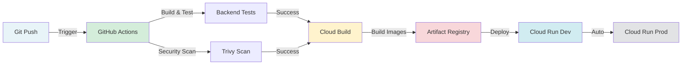

# CI/CD Infrastructure

This directory contains CI/CD pipeline configurations for Cloud Secrets Manager.

## Overview

The CI/CD pipeline uses **GitHub Actions** for orchestration and **Google Cloud Build** for building Docker images and deploying to **Cloud Run**. The pipeline is designed to be simple, maintainable, and cost-effective.

## Architecture



## Pipeline Flow

1. **Build & Test** - Compiles and tests all backend services (secret, audit, notification)
2. **Security Scan** - Runs Trivy vulnerability scanner on codebase
3. **Build Images** - Uses Cloud Build to build Docker images for all 4 services
4. **Deploy** - Deploys to Cloud Run (dev on `develop` branch, prod on `main` branch)

## Files

```
ci-cd/
├── cloudbuild-images.yaml           # Build all Docker images (4 services)
├── cloudbuild-deploy-cloudrun.yaml  # Deploy all services to Cloud Run
├── cloudbuild-frontend-cloudrun.yaml # Build frontend with backend URLs
└── README.md                         # This file
```

### Legacy Files (GKE-focused, not used)

- `cloudbuild.yaml` - GKE deployment (legacy)
- `cloudbuild-dev.yaml` - GKE dev config (legacy)
- `cloudbuild-staging.yaml` - GKE staging config (legacy)
- `cloudbuild-production.yaml` - GKE prod config (legacy)

## Environments

### Development (`develop` branch)
- **Trigger**: Automatic on push to `develop`
- **Deployment**: Cloud Run services in dev environment
- **Cloud SQL**: `secrets-manager-db-dev-3631da18`
- **Min Instances**: 0 (scales to zero for cost savings)
- **Image Tag**: `dev-{SHA}`

### Production (`main` branch)
- **Trigger**: Automatic on push to `main`
- **Deployment**: Cloud Run services in prod environment
- **Cloud SQL**: `secrets-manager-db-prod` (configure as needed)
- **Min Instances**: 1 for critical services (secret-service, notification-service)
- **Image Tag**: `prod-{SHA}`

## Services Deployed

The pipeline deploys **4 services** to Cloud Run:

1. **secret-service** (Port 8080)
   - Main API service
   - Memory: 512Mi, CPU: 1
   - Min instances: 1 (prod) / 0 (dev)

2. **audit-service** (Port 8081)
   - Audit logging service
   - Memory: 512Mi, CPU: 1
   - Min instances: 0 (scales to zero)

3. **notification-service** (Port 8082)
   - Notification service with SSE support
   - Memory: 512Mi, CPU: 1
   - Min instances: 1 (prod) / 0 (dev)
   - Timeout: 3600s (for SSE connections)

4. **frontend** (Port 8080)
   - React SPA served by Nginx
   - Memory: 256Mi, CPU: 1
   - Min instances: 0 (scales to zero)

## GitHub Actions Workflow

The workflow (`.github/workflows/ci-cd.yml`) consists of:

- **build-test**: Builds and tests all backend services
- **security-scan**: Runs Trivy vulnerability scanner
- **build-images**: Triggers Cloud Build to build Docker images
- **deploy-dev**: Deploys to dev environment (develop branch)
- **deploy-prod**: Deploys to prod environment (main branch)

## Required Setup

### GitHub Secrets

- `GCP_SA_KEY` - Service account JSON key with permissions:
  - Cloud Build Editor
  - Cloud Run Admin
  - Secret Manager Secret Accessor
  - Service Account User

### GCP Prerequisites

1. **APIs Enabled**:
   - Cloud Build API
   - Cloud Run API
   - Artifact Registry API
   - Secret Manager API
   - Cloud SQL Admin API

2. **Artifact Registry**:
   - Repository: `docker-images` in `europe-west10-docker.pkg.dev`

3. **Cloud SQL Instances**:
   - Dev: `secrets-manager-db-dev-3631da18`
   - Prod: `secrets-manager-db-prod` (configure as needed)

4. **Secret Manager Secrets**:
   - `csm-firebase-api-key`
   - `csm-firebase-messaging-sender-id`
   - `csm-firebase-app-id`
   - `csm-audit-api-key`
   - `csm-jwt-secret`
   - `csm-aes-key`
   - `csm-firebase-admin-key`
   - Database credentials (per environment)

5. **Service Accounts** (per environment):
   - `secret-service-{env}@PROJECT_ID.iam.gserviceaccount.com`
   - `audit-service-{env}@PROJECT_ID.iam.gserviceaccount.com`
   - `notification-service-{env}@PROJECT_ID.iam.gserviceaccount.com`

## Manual Deployment

You can also trigger deployments manually:

```bash
# Build images
gcloud builds submit . \
  --config=infrastructure/ci-cd/cloudbuild-images.yaml \
  --substitutions=_TAG=manual-build \
  --project=cloud-secrets-manager

# Deploy to Cloud Run
gcloud builds submit . \
  --config=infrastructure/ci-cd/cloudbuild-deploy-cloudrun.yaml \
  --substitutions=_ENV=dev,_IMAGE_TAG=manual-build,_CLOUD_SQL_INSTANCE=secrets-manager-db-dev-3631da18 \
  --project=cloud-secrets-manager
```

## Troubleshooting

### Build Failures

- Check Cloud Build logs in GCP Console
- Verify all secrets exist in Secret Manager
- Ensure service accounts have correct permissions

### Deployment Failures

- Verify Cloud SQL instance exists and is accessible
- Check service account permissions
- Ensure image exists in Artifact Registry

### Frontend Build Issues

- Verify backend services are deployed first (needs URLs)
- Check Firebase secrets are correctly set
- Ensure all VITE_* build args are provided

## Cost Optimization

- **Dev environment**: All services scale to zero (min-instances=0)
- **Prod environment**: Only critical services keep 1 instance running
- **Image caching**: Cloud Build uses layer caching to speed up builds
- **Parallel builds**: All services build in parallel

## Monitoring

After deployment, monitor services in:
- [Cloud Run Console](https://console.cloud.google.com/run)
- [Cloud Build History](https://console.cloud.google.com/cloud-build/builds)
- [Artifact Registry](https://console.cloud.google.com/artifacts)
