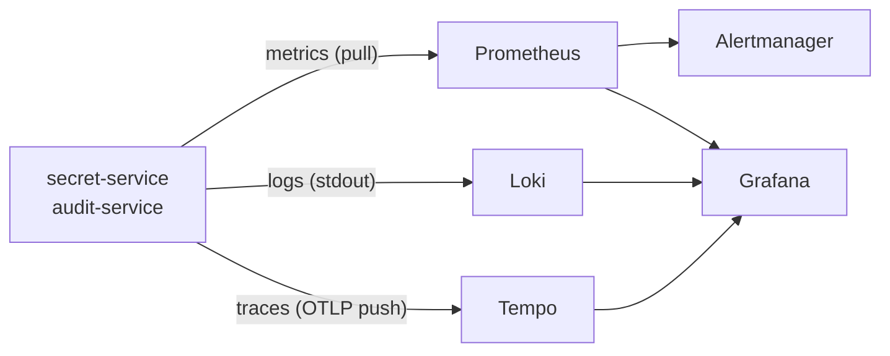
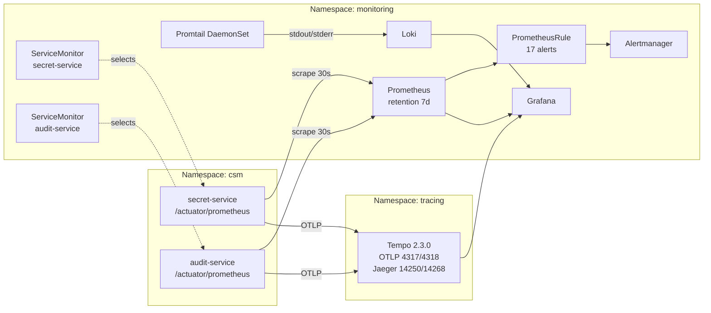

# Cloud Secrets Manager — Monitoring Stack Interview Guide

> Entry-level guide to understand, explain, and defend the monitoring stack of this project in an interview.
> Built strictly from the actual monitoring assets in `infrastructure/monitoring/` (no external docs).

---

## Table of contents

1. [Big picture](#1-big-picture)
2. [How it's deployed](#2-how-its-deployed)
3. [Metrics — Prometheus](#3-metrics--prometheus)
4. [Alerting — PrometheusRule](#4-alerting--prometheusrule)
5. [Dashboards — Grafana](#5-dashboards--grafana)
6. [Tracing — Tempo](#6-tracing--tempo)
7. [Logs — Loki + Promtail](#7-logs--loki--promtail)
8. [Cloud Run alternative stack](#8-cloud-run-alternative-stack)
9. [End-to-end data flow](#9-end-to-end-data-flow)
10. [Crib sheet (1-page summary)](#10-crib-sheet-1-page-summary)
11. [Mock Q&A](#11-mock-qa)
12. [Delivery tips](#12-delivery-tips)

---

## 1. Big picture

The project runs two Spring Boot backends (`secret-service`, `audit-service`) on Kubernetes. The monitoring stack collects the **three pillars of observability** and shows them in Grafana.

| Pillar  | Tool                | Answers                                                |
| ------- | ------------------- | ------------------------------------------------------ |
| Metrics | **Prometheus**      | Is it fast? Is it healthy? How much traffic?           |
| Logs    | **Loki + Promtail** | What did the app say just before it broke?             |
| Traces  | **Grafana Tempo**   | Where exactly inside one request did the time go?      |

Everything is visualized in **Grafana**, and **Alertmanager** handles alert routing.



### Component map by namespace



---

## 2. How it's deployed

A single bash script: [`infrastructure/monitoring/deploy-monitoring.sh`](deploy-monitoring.sh).

Steps it performs:

1. Checks `kubectl` and `helm` are installed and the cluster is reachable.
2. Creates the `monitoring` namespace.
3. Installs **`kube-prometheus-stack`** (Prometheus + Grafana + Alertmanager + Operator).
4. Installs **`loki-stack`** (Loki + Promtail).
5. Applies the custom **alert rules** and **ServiceMonitors**.

### Key Helm flags

```bash
helm upgrade --install prometheus prometheus-community/kube-prometheus-stack \
  --namespace monitoring \
  --set grafana.adminPassword="${GRAFANA_PASSWORD}" \
  --set grafana.persistence.enabled=false \
  --set prometheus.prometheusSpec.retention=7d \
  --set prometheus.prometheusSpec.resources.requests.memory=256Mi \
  --set prometheus.prometheusSpec.resources.limits.memory=512Mi \
  --set alertmanager.enabled=true
```

- **Retention: 7 days** — short, dev-friendly.
- **No persistence** — everything ephemeral on pod restart.
- **Grafana admin password** — randomly generated with `openssl rand -base64 16`.

**Interview one-liner:** *"We use the Prometheus Operator pattern via `kube-prometheus-stack` — scraping is configured through Kubernetes CRDs, not static `prometheus.yml` files."*

---

## 3. Metrics — Prometheus

### App side (Spring Boot)

Both Java services use **Spring Boot Actuator + Micrometer**. They expose metrics at `/actuator/prometheus` in Prometheus text format.

From `application-observability.yml`:

```yaml
management:
  endpoints:
    web:
      exposure:
        include: health,info,prometheus,metrics,env,loggers,httptrace
```

### Prometheus side — ServiceMonitor

Prometheus discovery is defined declaratively with a `ServiceMonitor` CRD:

```yaml
# infrastructure/monitoring/servicemonitors/secret-service-monitor.yaml
spec:
  selector:
    matchLabels:
      app: secret-service
  endpoints:
  - port: http
    path: /actuator/prometheus
    interval: 30s
    scrapeTimeout: 10s
    relabelings:
    - targetLabel: job
      replacement: secret-service
  namespaceSelector:
    matchNames:
    - csm
```

Translation: *"Find every Kubernetes Service labeled `app=secret-service` in namespace `csm`, and scrape its `/actuator/prometheus` endpoint every 30 seconds. Tag everything with `job=secret-service`."*

The Prometheus Operator reads this CRD and rewrites Prometheus's scrape config automatically — you never touch `prometheus.yml` by hand.

### Metric vocabulary collected

| Source                         | Examples                                                                              |
| ------------------------------ | ------------------------------------------------------------------------------------- |
| Micrometer HTTP                | `http_server_requests_seconds_{count,bucket,sum}`                                     |
| JVM                            | `jvm_memory_used_bytes`, `jvm_gc_pause_seconds_*`, `jvm_threads_live`                 |
| HikariCP (DB pool)             | `hikaricp_connections_{active,idle,pending,max}`, `hikaricp_connections_acquire_*`    |
| kube-state-metrics / cAdvisor  | `kube_pod_container_status_restarts_total`, `container_memory_working_set_bytes`, ... |
| Custom business metrics        | `secret_rotation_failed_total`, `audit_events_total`, `secrets_total`                 |

---

## 4. Alerting — PrometheusRule

File: [`infrastructure/monitoring/alerts/prometheus-rules.yaml`](alerts/prometheus-rules.yaml).
**17 alerts in 7 groups**, all evaluated every 30 seconds.

| Group                | Alert                           | Severity | What it checks                              |
| -------------------- | ------------------------------- | -------- | ------------------------------------------- |
| service-availability | ServiceDown                     | critical | `up == 0` for 1m                            |
| service-availability | HighPodRestartRate              | warning  | Pod restarts > 0.1/s for 5m                 |
| slo-error-rate       | HighErrorRate                   | critical | 5xx ratio > 1% for 5m                       |
| slo-error-rate       | ErrorBudgetBurn                 | warning  | 5xx ratio > 0.5% over 1h for 15m            |
| slo-latency          | HighLatencyP95                  | warning  | p95 > 500ms for 10m                         |
| slo-latency          | HighLatencyP99                  | critical | p99 > 1s for 10m                            |
| secret-operations    | SecretRotationFailed            | warning  | Any rotation failure in 10m                 |
| secret-operations    | SecretEncryptionFailure         | critical | Any encryption failure in 5m                |
| secret-operations    | HighSecretAccessRate            | info     | > 100 accesses/s for 10m                    |
| database             | HighDatabaseConnectionUsage     | warning  | Pool active/max > 80% for 5m                |
| database             | DatabaseConnectionPoolExhausted | critical | Any pending connection for 2m               |
| database             | SlowDatabaseQueries             | warning  | p95 connection usage > 1s for 10m           |
| resource-utilization | HighMemoryUsage                 | warning  | container working_set / limit > 85% for 10m |
| resource-utilization | HighCPUUsage                    | warning  | CPU > 85% for 15m                           |
| resource-utilization | PodNearOOMKilled                | critical | Memory > 95% of limit for 5m                |
| audit-service        | AuditEventProcessingLag         | warning  | Queue > 1000 for 5m                         |
| audit-service        | AuditStorageFailure             | critical | Any storage failure in 5m                   |
| jvm-health           | HighGCTime                      | warning  | Avg GC pause > 100ms for 10m                |
| jvm-health           | HighThreadCount                 | warning  | > 200 live threads for 10m                  |

### A typical alert, broken down

```yaml
- alert: HighErrorRate
  expr: |
    (
      sum(rate(http_server_requests_seconds_count{status=~"5..",job=~"secret-service|audit-service"}[5m]))
      /
      sum(rate(http_server_requests_seconds_count{job=~"secret-service|audit-service"}[5m]))
    ) > 0.01
  for: 5m
  labels:
    severity: critical
    slo: error_rate
```

In English:

- Take the rate of 5xx responses over the last 5 minutes.
- Divide by the rate of all responses in the last 5 minutes.
- If that ratio stays above 1% for 5 minutes straight, fire a `critical` alert.

Why 1%? Because the **SLO is 99% success**. Anything above 1% errors is a SLO violation.

### SLO vocabulary

- **SLO** (Service Level Objective) = the target (e.g. 99% success).
- **SLI** (Service Level Indicator) = the actual measurement.
- **Error budget** = `1 - SLO`. With 99% SLO, you're allowed ~43 minutes of errors per month.

---

## 5. Dashboards — Grafana

Dashboards are deployed as **Kubernetes ConfigMaps** labeled `grafana_dashboard: "1"`. Grafana's sidecar watches for that label and auto-imports them.

### Dashboards in the repo

1. **CSM Overview** — `grafana/csm-dashboard-configmap.yaml`, UID `csm-overview`, 12 panels:
   - Request rate by service
   - Error rate (stat)
   - Latency p50 / p95 / p99
   - Requests by status code
   - JVM heap gauge
   - DB pool gauge
   - Services up / healthy pods
   - JVM memory, DB pool, GC pause rate, thread count (timeseries)
2. **Overview & SLOs** — `grafana/dashboards/overview-dashboard.json`, UID `csm-overview-slo`:
   - Request rate, error rate (per service)
   - Latency percentiles
   - DB connection pool
   - SLO panels: availability per service over 30d, error budget remaining
3. **JVM & Database** — `grafana/dashboards/jvm-database-dashboard.json`, UID `csm-jvm-db`:
   - JVM heap vs non-heap
   - GC pause time
   - Threads (live/daemon/peak)
   - HikariCP active/idle/pending
   - Connection acquisition p50/p95/p99

### Dashboard design methods

- **RED** (Rate, Errors, Duration) — applied to HTTP traffic.
- **USE** (Utilization, Saturation, Errors) — applied to resources (CPU, memory, pool).

---

## 6. Tracing — Tempo

File: [`infrastructure/monitoring/tracing/tempo-deployment.yaml`](tracing/tempo-deployment.yaml).

- Deploys **Grafana Tempo 2.3.0** in its own `tracing` namespace.
- Accepts traces via:
  - **OTLP gRPC** on port 4317
  - **OTLP HTTP** on port 4318
  - **Jaeger** on ports 14250 (gRPC) and 14268 (HTTP)
- Stores traces locally at `/var/tempo/traces` (emptyDir).
- Configured retention: 30 days.

A second deployment, **`tempo-query`**, exposes a Jaeger-compatible UI on port 16686.

### App → Tempo wiring

From `application-observability.yml`:

```yaml
management:
  tracing:
    sampling:
      probability: 1.0
  otlp:
    tracing:
      endpoint: http://tempo.tracing.svc.cluster.local:4318/v1/traces
```

So every incoming HTTP request gets a **trace ID**, every DB call becomes a **span**, and Spring pushes the whole trace to Tempo over OTLP.

---

## 7. Logs — Loki + Promtail

Installed by the deploy script via `grafana/loki-stack` Helm chart.

- **Promtail** runs as a DaemonSet (one pod per Kubernetes node). It tails container stdout/stderr.
- **Loki** stores logs, indexed by Kubernetes labels (`namespace`, `pod`, `container`, `app`).
- Grafana queries Loki with **LogQL**. Example: `{app="secret-service"} |= "error"`.

Logs → Loki is **push-based**. Metrics → Prometheus is **pull-based**. That's a classic interview contrast.

---

## 8. Cloud Run alternative stack

The project can also be deployed on **Google Cloud Run**. For that environment, monitoring lives in `infrastructure/monitoring/cloudrun/`:

- [`alert-policy.yaml`](cloudrun/alert-policy.yaml) — 4 GCP Cloud Monitoring policies:
  1. High Error Rate (5xx class)
  2. High Latency (p95 > 2s)
  3. High Memory Usage (> 80%)
  4. Service Unavailable (no requests for 5m)
- [`cloud-monitoring-dashboard.json`](cloudrun/cloud-monitoring-dashboard.json) — a GCP-native dashboard with Request Rate, Error Rate, Latency, Memory, CPU, Instance Count, and Status Code panels.

GCP provides metrics automatically via `run.googleapis.com/*` — no agents or scrapers needed.

---

## 9. End-to-end data flow

> *"A user hits the frontend. The request reaches `secret-service`. Three things happen in parallel:*
>
> 1. **Metrics:** Micrometer increments a counter (`http_server_requests_seconds_count`). Prometheus pulls it on the next 30-second scrape via a ServiceMonitor.
> 2. **Logs:** any `log.info` goes to stdout; Promtail ships it to Loki.
> 3. **Traces:** Spring's tracing creates a span, and the OpenTelemetry exporter pushes it to Tempo over OTLP.
>
> *All three land in Grafana. If the error ratio goes over 1% for 5 minutes, Prometheus evaluates the `HighErrorRate` rule and Alertmanager sends a notification."*

---

## 10. Crib sheet (1-page summary)

### Stack in one breath

> "Prometheus for metrics, Loki for logs, Tempo for traces, Grafana for dashboards, Alertmanager for alerts — all deployed to Kubernetes via the `kube-prometheus-stack` Helm chart. Spring Boot apps expose metrics on `/actuator/prometheus`, send traces over OTLP, and log to stdout."

### The 3 pillars

- **Metrics** = Prometheus (pull, 30s scrape) → `/actuator/prometheus`
- **Logs** = Loki + Promtail (push, stdout tailing)
- **Traces** = Tempo (push, OTLP gRPC/HTTP on 4317/4318)

### Key Kubernetes objects

- **ServiceMonitor** → tells Prometheus *what* to scrape
- **PrometheusRule** → defines alerts + recording rules
- **ConfigMap with `grafana_dashboard: "1"`** → auto-imports a dashboard

### The SLOs

- **99% success rate** → HighErrorRate fires if 5xx ratio > 1% for 5m
- **p95 latency < 500ms** → HighLatencyP95 warns if exceeded for 10m
- **p99 latency < 1s** → HighLatencyP99 critical if exceeded for 10m
- **Error budget** = `1 - SLO` = 1% ≈ 43 min/month of allowed errors

### 17 alerts in 7 groups

availability · error-rate SLO · latency SLO · secret-ops · database · resources · JVM

### Useful methods

- **RED** (Rate, Errors, Duration) → user-facing services
- **USE** (Utilization, Saturation, Errors) → resources (CPU, memory, pool)

### Pull vs Push

- Prometheus = **pull** (scrapes `/actuator/prometheus`)
- Loki + Tempo = **push** (apps send to them)

### Two environments

- **Kubernetes** → Prometheus stack (Helm + CRDs)
- **Cloud Run** → GCP Cloud Monitoring (`run.googleapis.com/*` metrics + alert policies)

### Vocabulary to drop naturally

Actuator · Micrometer · PromQL · LogQL · OTLP · SLO / SLI · error budget · RED / USE · Prometheus Operator · ServiceMonitor · CRD · scrape interval · `histogram_quantile` · recording rule · burn rate

---

## 11. Mock Q&A

Try answering each out loud before reading the model answer.

---

### Q1. "What monitoring stack does this project use?"

> Prometheus for metrics, Loki for logs, Tempo for traces, Grafana for visualization, and Alertmanager for alerting. It's deployed to Kubernetes with the `kube-prometheus-stack` Helm chart, plus Loki separately. There's also a Cloud Run path using GCP Cloud Monitoring.

### Q2. "How does Prometheus know where to find the metrics?"

> The Spring Boot services expose a `/actuator/prometheus` endpoint via Micrometer. Instead of configuring scrape targets manually, we use a `ServiceMonitor` CRD. It selects Kubernetes Services by label — for example `app=secret-service` — and the Prometheus Operator reads the CRD and auto-configures Prometheus to scrape that endpoint every 30 seconds.

### Q3. "What's the difference between a ServiceMonitor and a PrometheusRule?"

> A `ServiceMonitor` tells Prometheus *what* to scrape. A `PrometheusRule` tells Prometheus *what to alert on or pre-compute*. Both are CRDs from the Prometheus Operator.

### Q4. "Walk me through what happens when an error rate spikes."

> A request to `secret-service` returns a 500. Micrometer increments `http_server_requests_seconds_count{status="500"}`. On the next 30-second scrape, Prometheus pulls that counter. Every 30 seconds, Prometheus evaluates the `HighErrorRate` rule — it computes the ratio of 5xx over total requests in the last 5 minutes. If it stays above 1% for 5 minutes, the alert fires and is sent to Alertmanager, which would notify on-call.

### Q5. "What's an SLO and how is it used here?"

> SLO stands for Service Level Objective — it's the target, like "99% of requests succeed" or "p95 latency under 500ms". The SLI is the actual measurement. The error budget is `1 - SLO`, so with a 99% SLO you're allowed about 1% errors per month. The alert thresholds in this project — 1% error rate, 500ms p95, 1s p99 — are derived directly from those SLOs.

### Q6. "Why a histogram instead of a gauge for latency?"

> Because you can compute any percentile after the fact. `http_server_requests_seconds_bucket` is a histogram with pre-defined buckets. Using `histogram_quantile(0.95, ...)` you calculate the p95 across any time range. A gauge would only give you the current value, not a distribution.

### Q7. "What's PromQL and can you explain one query?"

> PromQL is Prometheus's query language. Example: `rate(http_server_requests_seconds_count[5m])` — `rate` computes the per-second increase of a counter over the last 5 minutes. You wrap that with `sum(...) by (status)` to aggregate by HTTP status code. For percentiles you combine `rate` on the `_bucket` metric with `histogram_quantile`.

### Q8. "How do the three pillars connect? Can you jump from a metric to a log to a trace?"

> Ideally yes. Each request gets a trace ID from Spring's tracing. That trace is pushed to Tempo over OTLP. If the app logs with the trace ID included, Loki can be queried by that trace ID too. In Grafana you click a spike on a latency graph, jump to the trace, and from the trace you can pivot to the logs. Honest answer: this project has the pieces in place — Tempo + Loki + Prometheus exemplars are possible — but full end-to-end correlation would need some extra wiring.

### Q9. "Pull vs push — which does each tool use and why does it matter?"

> Prometheus pulls — it scrapes targets on a schedule. Pull makes service discovery easier in Kubernetes because Prometheus already knows what's running. Loki and Tempo are push — apps send data to them. Push is better for short-lived workloads like batch jobs or serverless, where a puller would miss them.

### Q10. "What is Alertmanager, and where would alerts go?"

> Alertmanager is the component that receives alerts from Prometheus, deduplicates them, groups related ones, and routes them to notification channels — Slack, PagerDuty, email, etc. In this project it's enabled through the Helm chart, but the actual routing config would be added via an `AlertmanagerConfig` CRD.

### Q11. "Why kube-prometheus-stack instead of installing each component separately?"

> It bundles Prometheus, Grafana, Alertmanager, the Prometheus Operator, and default exporters like kube-state-metrics and node-exporter into one Helm release. That saves a lot of wiring, and it enforces the operator pattern — you configure everything with CRDs instead of editing `prometheus.yml` by hand.

### Q12. "How do dashboards get into Grafana?"

> Grafana has a sidecar that watches for ConfigMaps labeled `grafana_dashboard: "1"`. The dashboard JSON is stored in the ConfigMap under the `data` field and is auto-imported. That way dashboards are version-controlled and deployed as code.

### Q13. "What would you improve if this went to production?"

> First, persistent storage — Prometheus, Loki, and Tempo currently use ephemeral volumes, so data is lost on pod restarts. Second, add notification routing to Alertmanager so alerts actually reach a human. Beyond that, I'd add recording rules to speed up expensive queries, and consider multi-window burn-rate alerts for cleaner SLO paging.

### Q14 (curveball). "What's a recording rule?"

> It's a pre-computed PromQL expression that Prometheus evaluates on a schedule and stores as a new metric. Useful when a query is expensive — for example, the p95 latency is computed from a histogram, which is slow. You create a recording rule once, and dashboards query the pre-computed series instead of recalculating it every refresh.

### Q15 (curveball). "If a service stops sending metrics, how do you detect it?"

> Prometheus automatically emits an `up` metric for every scrape target — `1` if the scrape succeeded, `0` if it failed. The `ServiceDown` alert in this project watches exactly that: `up{job=~"secret-service|audit-service"} == 0` for 1 minute.

---

## 12. Delivery tips

- If you don't know something, say: *"I know the piece lives in `X`, I haven't gone deep on it, but my mental model is..."* — honesty beats bluffing at entry level.
- When explaining a query, say the **intent first**, the syntax second: *"We're computing the ratio of errors over total requests over a 5-minute window, which in PromQL is..."*
- Use **their language back at them**: if they say "scrape", you say "scrape"; if they say "pull metrics", match that wording.
- Anchor answers to concrete files when you can: *"It's defined in `alerts/prometheus-rules.yaml` under the `slo-error-rate` group."*
- Keep answers short at first. Let them ask for more depth — that signals interest and avoids overexplaining.

---

### Quick reference table — files in this stack

| Area        | Path                                                    |
| ----------- | ------------------------------------------------------- |
| Deploy      | `infrastructure/monitoring/deploy-monitoring.sh`        |
| Scraping    | `infrastructure/monitoring/servicemonitors/*.yaml`      |
| Alerting    | `infrastructure/monitoring/alerts/prometheus-rules.yaml`|
| Dashboards  | `infrastructure/monitoring/grafana/*.yaml` / `*.json`   |
| Tracing     | `infrastructure/monitoring/tracing/tempo-deployment.yaml`|
| Cloud Run   | `infrastructure/monitoring/cloudrun/*.yaml` / `*.json`  |
