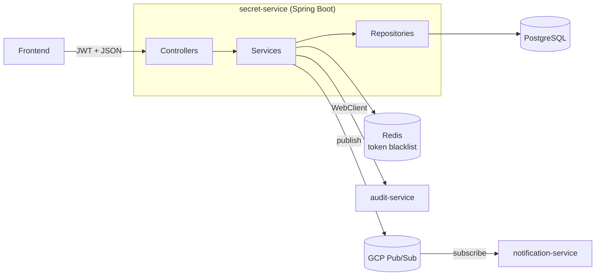
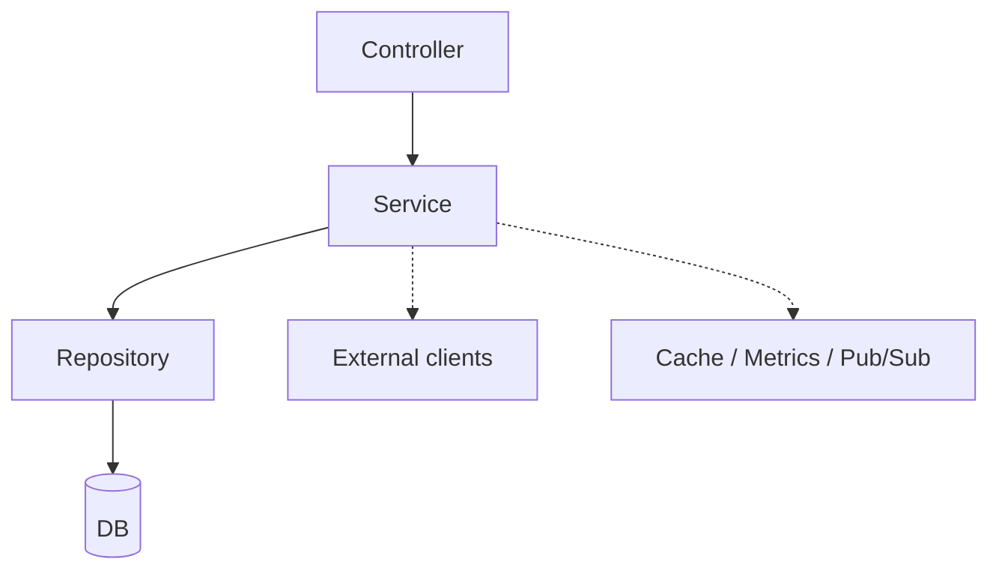
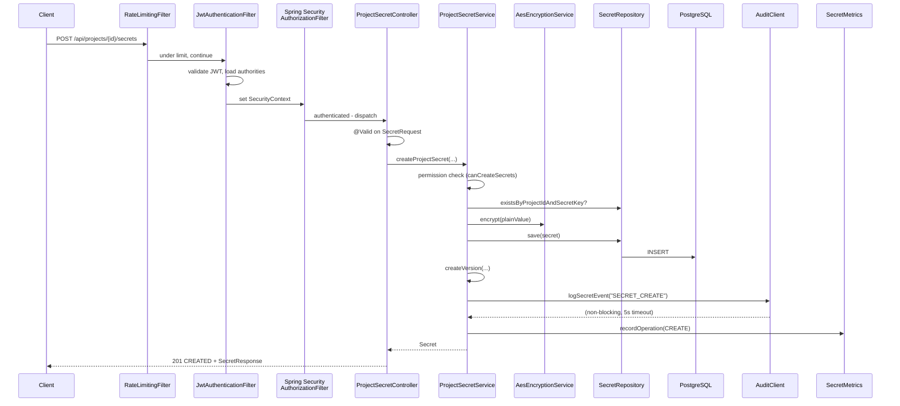

# `secret-service` — Spring Boot Interview Guide

> Entry-level guide to understand, explain, and defend the `secret-service` Spring Boot application in an interview.
> Built strictly from the actual source code under `apps/backend/secret-service/`.

---

## Table of contents

1. [Big picture](#1-big-picture)
2. [Tech stack (what's in the `pom.xml`)](#2-tech-stack-whats-in-the-pomxml)
3. [Project structure](#3-project-structure)
4. [The application entry point](#4-the-application-entry-point)
5. [Configuration (`application.yml`)](#5-configuration-applicationyml)
6. [JPA entities and the database](#6-jpa-entities-and-the-database)
7. [Repositories (Spring Data JPA)](#7-repositories-spring-data-jpa)
8. [Services (business logic)](#8-services-business-logic)
9. [Controllers (REST API)](#9-controllers-rest-api)
10. [Security — Spring Security + JWT](#10-security--spring-security--jwt)
11. [Encryption — AES-256-GCM](#11-encryption--aes-256-gcm)
12. [Exception handling — `@RestControllerAdvice`](#12-exception-handling--restcontrolleradvice)
13. [Cross-cutting concerns (cache, rate limit, scheduler, audit, metrics)](#13-cross-cutting-concerns)
14. [Request lifecycle end-to-end](#14-request-lifecycle-end-to-end)
15. [Dockerfile](#15-dockerfile)
16. [Crib sheet (1-page summary)](#16-crib-sheet-1-page-summary)
17. [Mock Q&A](#17-mock-qa)
18. [Delivery tips](#18-delivery-tips)

---

## 1. Big picture

`secret-service` is the **core backend service** of Cloud Secrets Manager. It is a Spring Boot 3 / Java 21 application that:

- Manages users, teams, projects, and **secrets** (encrypted key/value pairs).
- Exposes a **REST API** (`/api/...`) consumed by the frontend.
- **Encrypts** secret values with AES-256-GCM before storing them in PostgreSQL.
- **Authenticates** requests using JWT (local) or Firebase ID tokens (optional).
- Calls the **audit-service** for every sensitive action and publishes **notifications** via Google Cloud Pub/Sub.
- Exposes metrics on `/actuator/prometheus` for the monitoring stack.



---

## 2. Tech stack (what's in the `pom.xml`)

From [`apps/backend/secret-service/pom.xml`](pom.xml):

| Category         | Dependency                                          | Why it's there                        |
| ---------------- | --------------------------------------------------- | ------------------------------------- |
| Web              | `spring-boot-starter-web`                           | REST controllers (Spring MVC, Tomcat) |
| Persistence      | `spring-boot-starter-data-jpa` + `postgresql`       | ORM + Postgres driver                 |
| Security         | `spring-boot-starter-security`                      | Auth, filter chain, method security   |
| Validation       | `spring-boot-starter-validation`                    | `@Valid` on DTOs                      |
| Actuator         | `spring-boot-starter-actuator`                      | `/actuator/health`, `/prometheus`     |
| Reactive HTTP    | `spring-boot-starter-webflux`                       | `WebClient` to call other services    |
| Cache            | `spring-boot-starter-cache` + `caffeine`            | In-memory cache for hot lookups       |
| Redis            | `spring-boot-starter-data-redis`                    | JWT blacklist storage                 |
| JWT              | `jjwt-api`, `jjwt-impl`, `jjwt-jackson`             | Sign/verify JWT                       |
| Mapping          | `mapstruct`                                         | DTO ↔ entity mapping                  |
| OpenAPI          | `springdoc-openapi-starter-webmvc-ui`               | Auto-generated Swagger UI             |
| Auth providers   | `firebase-admin`, `google-auth-library`             | Optional Firebase/Google sign-in      |
| Messaging        | `google-cloud-pubsub`                               | Publish notification events           |
| 2FA              | `java-otp`, `zxing` (QR), `commons-codec` (Base32)  | TOTP + QR setup                       |
| Metrics          | `micrometer-registry-prometheus`                    | Expose metrics in Prometheus format   |
| Testing          | `spring-boot-starter-test`, `testcontainers`, `h2`  | Unit + integration tests              |

**Build:** Maven, Java 21 (from Dockerfile), repackaged as a Spring Boot executable jar.

---

## 3. Project structure

```
com.secrets/
├── SecretServiceApplication.java    # main @SpringBootApplication
├── config/                          # beans: security, cache, CORS, WebClient, Firebase, Pub/Sub
├── controller/                      # @RestController HTTP endpoints
├── service/                         # business logic, @Service beans
│   └── rotation/                    # Strategy pattern for secret rotation
├── repository/                      # Spring Data JPA interfaces
├── entity/                          # @Entity JPA models
├── dto/                             # request/response DTOs (grouped by feature)
├── security/                        # JWT, filters, permission evaluator
├── exception/                       # custom exceptions + @RestControllerAdvice
├── scheduler/                       # @Scheduled cron jobs
├── client/                          # WebClient-based clients for other services
├── metrics/                         # custom Micrometer metrics
└── util/                            # helpers (EncryptionUtil, …)
```

Each package maps to a classic Spring Boot **layered architecture**:



---

## 4. The application entry point

File: [`SecretServiceApplication.java`](src/main/java/com/secrets/SecretServiceApplication.java).

```java
@SpringBootApplication
@EnableJpaAuditing
@EnableScheduling
@EnableAsync
public class SecretServiceApplication {
    public static void main(String[] args) {
        SpringApplication.run(SecretServiceApplication.class, args);
    }
}
```

Four annotations to know:

- **`@SpringBootApplication`** = `@Configuration` + `@EnableAutoConfiguration` + `@ComponentScan`. Spring Boot scans this package and boots an embedded Tomcat + the DI container.
- **`@EnableJpaAuditing`** — enables `@CreatedDate` / `@LastModifiedDate` on entities (used by `Secret`).
- **`@EnableScheduling`** — allows `@Scheduled` cron jobs (used for secret-expiration warnings).
- **`@EnableAsync`** — allows `@Async` methods (fire-and-forget work).

---

## 5. Configuration (`application.yml`)

File: [`src/main/resources/application.yml`](src/main/resources/application.yml). Spring Boot externalizes all environment-dependent values. Key sections:

### Database + connection pool
```yaml
spring:
  datasource:
    url: ${SPRING_DATASOURCE_URL:jdbc:postgresql://localhost:5432/secrets}
    username: ${SPRING_DATASOURCE_USERNAME:secret_user}
    hikari:
      maximum-pool-size: ${HIKARI_MAX_POOL_SIZE:5}
      minimum-idle: ${HIKARI_MIN_IDLE:1}
      connection-timeout: 10000
  jpa:
    hibernate:
      ddl-auto: update        # 'validate' in prod profile
    open-in-view: false       # good practice - disables OSIV anti-pattern
```

### Profiles
The YAML has three profiles separated by `---`:
- **default** — local dev (5 connections, `ddl-auto: update`)
- **docker** — overrides DB host to `secrets-db`
- **prod** — `ddl-auto: validate`, pool size 20, WARN logs

### Actuator
```yaml
management:
  endpoints:
    web:
      exposure:
        include: health,info,metrics,prometheus
```
That's how Prometheus scrapes `/actuator/prometheus` (see the monitoring guide).

### Secrets pulled from env vars
- `JWT_SECRET` — required, no default (HMAC key for signing JWTs)
- `ENCRYPTION_KEY` — required, exactly 32 bytes (AES-256 key)
- `AUDIT_SERVICE_API_KEY` — shared secret between services
- `SENDGRID_API_KEY`, `GOOGLE_SERVICE_ACCOUNT_PATH`, etc.

**Interview point:** *"We follow Spring's externalized-configuration pattern — env vars override `application.yml`, which means the same jar runs in dev, Docker, and Cloud Run without code changes."*

---

## 6. JPA entities and the database

Twelve JPA entities in `com.secrets.entity`:

```
User, Team, TeamMembership, TeamProject,
Project, ProjectMembership, ProjectInvitation,
Secret, SecretVersion,
Workflow, WorkflowProject,
RefreshToken
```

### Flagship entity: `Secret`

```java
@Entity
@Table(name = "secrets",
  indexes = {
    @Index(columnList = "projectId"),
    @Index(columnList = "secretKey"),
    @Index(columnList = "expiresAt"),
    @Index(columnList = "createdBy")
  },
  uniqueConstraints = {
    @UniqueConstraint(columnNames = {"projectId", "secretKey"})
  })
@EntityListeners(AuditingEntityListener.class)
public class Secret {
    @Id @GeneratedValue(strategy = GenerationType.UUID)
    private UUID id;

    @Column(name = "encrypted_value", nullable = false, columnDefinition = "TEXT")
    private String encryptedValue;

    @CreatedDate  private LocalDateTime createdAt;
    @LastModifiedDate private LocalDateTime updatedAt;

    @OneToMany(mappedBy = "secret", cascade = CascadeType.ALL, orphanRemoval = true)
    @OrderBy("versionNumber DESC")
    private List<SecretVersion> versions;
    // ...
}
```

Things to point out:

- **`@Entity`** → table in Postgres managed by Hibernate.
- **`@Id` + UUID** — primary key is a UUID generated by Hibernate.
- **Indexes** declared on the hot columns (`projectId`, `secretKey`, `expiresAt`).
- **Unique constraint** on (`projectId`, `secretKey`) — one key per project.
- **`@CreatedDate` / `@LastModifiedDate`** — populated automatically thanks to `@EnableJpaAuditing`.
- **`@OneToMany` to `SecretVersion`** — gives you the version history in-place.
- **The value is stored as `encrypted_value`**, never plaintext — encryption happens in the service layer before save.

---

## 7. Repositories (Spring Data JPA)

Example: [`SecretRepository.java`](src/main/java/com/secrets/repository/SecretRepository.java).

```java
@Repository
public interface SecretRepository extends JpaRepository<Secret, UUID> {

    @Query("SELECT s FROM Secret s LEFT JOIN FETCH s.creator " +
           "WHERE s.projectId = :projectId AND s.secretKey = :secretKey")
    Optional<Secret> findByProjectIdAndSecretKey(@Param("projectId") UUID projectId,
                                                  @Param("secretKey") String secretKey);

    boolean existsByProjectIdAndSecretKey(UUID projectId, String secretKey);

    @Query("SELECT s FROM Secret s WHERE s.expiresAt IS NOT NULL AND s.expiresAt <= :now")
    List<Secret> findExpiredSecrets(@Param("now") LocalDateTime now);
}
```

Three patterns in one interface, all worth naming in an interview:

1. **Derived query methods** — `existsByProjectIdAndSecretKey(...)`: Spring Data parses the method name and generates the SQL for you.
2. **`@Query` with JPQL** — when the derived name would be too long or you need a join.
3. **`LEFT JOIN FETCH`** — eagerly loads `creator` in the same query to avoid the **N+1 select problem**.

Extending `JpaRepository<Secret, UUID>` gives you `findAll`, `findById`, `save`, `delete`, plus pagination via `Pageable`.

---

## 8. Services (business logic)

Flagship service: [`ProjectSecretService.java`](src/main/java/com/secrets/service/ProjectSecretService.java).

```java
@Service
@Transactional
public class ProjectSecretService {

    public Secret createProjectSecret(UUID projectId, SecretRequest request, UUID userId) {
        if (!permissionService.canCreateSecrets(projectId, userId)) {
            throw new AccessDeniedException("...");
        }
        if (secretRepository.existsByProjectIdAndSecretKey(projectId, request.getKey())) {
            throw new SecretAlreadyExistsException("...");
        }

        String encryptedValue = encryptionService.encrypt(request.getValue());

        Secret secret = new Secret();
        secret.setProjectId(projectId);
        secret.setSecretKey(request.getKey());
        secret.setEncryptedValue(encryptedValue);
        secret.setCreatedBy(userId);

        Secret saved = secretRepository.save(secret);
        secretVersionService.createVersion(saved, userId, "Initial version");
        auditClient.logSecretEvent(projectId, userId, "SECRET_CREATE", request.getKey());
        secretMetrics.recordOperation(SecretOperation.CREATE);
        return saved;
    }
}
```

Things to highlight:

- **`@Service`** registers the class as a Spring bean.
- **`@Transactional`** at class level wraps every public method in a DB transaction; `@Transactional(readOnly = true)` optimizes read-only ones.
- **Constructor injection** (no `@Autowired` on fields) — the recommended modern pattern, makes testing easier and dependencies explicit.
- **Permission check → existence check → encrypt → save → version → audit → metric** is the standard shape of every mutating method.
- **Strategy pattern** for rotation: `ProjectSecretService` holds `List<SecretRotationStrategy>` and picks one per secret (`DefaultRotationStrategy`, `PostgresRotationStrategy`, `SendGridRotationStrategy`).

---

## 9. Controllers (REST API)

Flagship controller: [`ProjectSecretController.java`](src/main/java/com/secrets/controller/ProjectSecretController.java).

```java
@RestController
@RequestMapping("/api/projects/{projectId}/secrets")
@Tag(name = "Project Secrets", description = "...")
@SecurityRequirement(name = "bearerAuth")
public class ProjectSecretController {

    @PostMapping
    public ResponseEntity<SecretResponse> createProjectSecret(
            @PathVariable UUID projectId,
            @Valid @RequestBody SecretRequest request,
            @AuthenticationPrincipal UserDetails userDetails) {

        UUID userId = userService.getCurrentUserId(userDetails.getUsername());
        Secret secret = projectSecretService.createProjectSecret(projectId, request, userId);
        String decryptedValue = encryptionUtil.decryptSecretValue(secret);

        return ResponseEntity.status(HttpStatus.CREATED)
            .body(SecretResponse.from(secret, decryptedValue));
    }
}
```

Annotations to know cold:

| Annotation                  | What it does                                                         |
| --------------------------- | -------------------------------------------------------------------- |
| `@RestController`           | Combines `@Controller` + `@ResponseBody`. Returns JSON, not views.   |
| `@RequestMapping("/...")`   | Base path for all methods in the class.                              |
| `@GetMapping` / `@PostMapping` / `@PutMapping` / `@DeleteMapping` | HTTP verb + sub-path. |
| `@PathVariable`             | Binds `{projectId}` to a method param.                               |
| `@RequestParam`             | Binds `?page=0&size=20` query string params.                         |
| `@RequestBody`              | Deserializes the JSON body into a DTO.                               |
| `@Valid`                    | Triggers bean-validation (`@NotNull`, `@Size`, ...) on the body.     |
| `@AuthenticationPrincipal`  | Injects the authenticated user straight from the SecurityContext.    |
| `@Tag`, `@Operation`, `@SecurityRequirement` | OpenAPI metadata for Swagger UI.                   |

Endpoints in the secret controller:

```
GET    /api/projects/{id}/secrets                      list (paginated)
GET    /api/projects/{id}/secrets/{key}                get one
POST   /api/projects/{id}/secrets                      create
PUT    /api/projects/{id}/secrets/{key}                update
DELETE /api/projects/{id}/secrets/{key}                delete
POST   /api/projects/{id}/secrets/{key}/rotate         rotate
POST   /api/projects/{id}/secrets/{key}/move           move to another project
POST   /api/projects/{id}/secrets/{key}/copy           copy to another project
GET    /api/projects/{id}/secrets/{key}/versions       version history
GET    /api/projects/{id}/secrets/{key}/versions/{n}   get one version
POST   /api/projects/{id}/secrets/{key}/versions/{n}/restore
```

---

## 10. Security — Spring Security + JWT

### The filter chain

File: [`config/SecurityConfig.java`](src/main/java/com/secrets/config/SecurityConfig.java).

```java
@Configuration
@EnableWebSecurity
@EnableMethodSecurity
public class SecurityConfig {

    @Bean
    public SecurityFilterChain filterChain(HttpSecurity http) throws Exception {
        http
            .csrf(AbstractHttpConfigurer::disable)
            .cors(cors -> cors.configurationSource(corsConfigurationSource))
            .sessionManagement(s -> s.sessionCreationPolicy(SessionCreationPolicy.STATELESS))
            .authorizeHttpRequests(auth -> auth
                .requestMatchers("/api/auth/**").permitAll()
                .requestMatchers("/actuator/health/**", "/actuator/info").permitAll()
                .requestMatchers("/swagger-ui/**", "/v3/api-docs/**").permitAll()
                .requestMatchers("/api/admin/**").hasRole("ADMIN")
                .anyRequest().authenticated())
            .addFilterBefore(jwtAuthenticationFilter,
                             UsernamePasswordAuthenticationFilter.class);
        return http.build();
    }

    @Bean public PasswordEncoder passwordEncoder() { return new BCryptPasswordEncoder(); }
}
```

What to say in the interview:

- **`@EnableWebSecurity`** turns on Spring Security.
- **`@EnableMethodSecurity`** enables `@PreAuthorize` / `@PostAuthorize` on methods.
- **Stateless session policy** — no HTTP session is created. Every request must carry a JWT. Required for REST APIs and for serverless (Cloud Run).
- **CSRF disabled** — safe because the API is stateless and there's no cookie-based auth.
- **CORS** is loaded from a separate `CorsConfig`.
- **Authorization rules** are built top-down: public routes first (`/api/auth`, actuator health, Swagger), then role-based (`/api/admin` requires `ROLE_ADMIN`), then catch-all `authenticated()`.
- **`BCryptPasswordEncoder`** for password hashing (used when Firebase isn't enabled).
- **Custom JWT filter** is inserted **before** the built-in username/password filter so that it populates the SecurityContext from the Authorization header.

### The JWT filter

File: [`security/JwtAuthenticationFilter.java`](src/main/java/com/secrets/security/JwtAuthenticationFilter.java).

It extends `OncePerRequestFilter`. On every request:

1. Pulls `Authorization: Bearer <token>` from the header.
2. If Firebase is enabled, tries Firebase validation first — if valid, auto-creates the user locally.
3. Otherwise validates via `JwtTokenProvider` (HMAC signature + expiration).
4. Checks a **token blacklist** in Redis (`TokenBlacklistService`) — rejects revoked tokens.
5. Extracts username + authorities and puts them into `SecurityContextHolder`.

### The token provider

File: [`security/JwtTokenProvider.java`](src/main/java/com/secrets/security/JwtTokenProvider.java).

```java
public String generateToken(String username, Collection<? extends GrantedAuthority> authorities) {
    return Jwts.builder()
        .subject(username)
        .claim("roles", rolesJoined)
        .issuedAt(now)
        .expiration(new Date(now.getTime() + validityInMs))
        .signWith(secretKey)       // HMAC using JWT_SECRET
        .compact();
}
```

- HMAC-SHA256 signing (jjwt).
- Access token validity: 15 min (`security.jwt.expiration-ms=900000`).
- Refresh token validity: 7 days, includes a `jti` (UUID) for uniqueness and stored in the DB so it can be revoked.

### Authorization logic
- [`security/PermissionEvaluator.java`](src/main/java/com/secrets/security/PermissionEvaluator.java) — maps GrantedAuthorities like `PERMISSION_SECRET_READ` to a typed `Permission` enum.
- [`service/ProjectPermissionService.java`](src/main/java/com/secrets/service/ProjectPermissionService.java) — project-scoped checks (`canCreateSecrets`, `canRotate`, ...) enforced in each service method.

---

## 11. Encryption — AES-256-GCM

File: [`service/AesEncryptionService.java`](src/main/java/com/secrets/service/AesEncryptionService.java).

```java
@Service
public class AesEncryptionService implements EncryptionService {

    private static final String TRANSFORMATION = "AES/GCM/NoPadding";
    private static final int GCM_IV_LENGTH = 12;
    private static final int GCM_TAG_LENGTH = 16;
    private static final int KEY_LENGTH = 32; // 256 bits

    public AesEncryptionService(@Value("${encryption.key}") String encryptionKey) {
        byte[] keyBytes = encryptionKey.getBytes(StandardCharsets.UTF_8);
        if (keyBytes.length != KEY_LENGTH) {
            throw new IllegalArgumentException("Encryption key must be 32 bytes (AES-256)");
        }
        this.secretKey = new SecretKeySpec(keyBytes, "AES");
    }

    @Override public String encrypt(String plainText) {
        byte[] iv = new byte[GCM_IV_LENGTH];
        new SecureRandom().nextBytes(iv);        // random IV each call
        Cipher cipher = Cipher.getInstance(TRANSFORMATION);
        cipher.init(Cipher.ENCRYPT_MODE, secretKey, new GCMParameterSpec(GCM_TAG_LENGTH * 8, iv));
        byte[] cipherText = cipher.doFinal(plainText.getBytes(StandardCharsets.UTF_8));

        // Layout: [IV (12B)] + [ciphertext+tag]  → base64
        return Base64.getEncoder().encodeToString(ByteBuffer.allocate(iv.length + cipherText.length)
                 .put(iv).put(cipherText).array());
    }
}
```

Interview-ready talking points:

- **AES-GCM** is an AEAD cipher: authenticated encryption with associated data. It produces both ciphertext and an integrity tag; tampering is detected at decrypt time.
- **256-bit key** loaded from `ENCRYPTION_KEY` env var. The constructor validates the length → fails fast at startup if misconfigured.
- **Fresh random IV per encryption** (12 bytes), prepended to the ciphertext. IV reuse with the same key is catastrophic in GCM — this code explicitly avoids that.
- Result is **Base64-encoded** so it fits in a `TEXT` Postgres column.

---

## 12. Exception handling — `@RestControllerAdvice`

File: [`exception/GlobalExceptionHandler.java`](src/main/java/com/secrets/exception/GlobalExceptionHandler.java).

```java
@RestControllerAdvice
public class GlobalExceptionHandler {

    @ExceptionHandler(SecretNotFoundException.class)
    public ResponseEntity<ErrorResponse> handleSecretNotFound(SecretNotFoundException ex) {
        return ResponseEntity.status(HttpStatus.NOT_FOUND).body(ErrorResponse.builder()
            .timestamp(LocalDateTime.now())
            .status(404).error("Not Found").message(ex.getMessage()).build());
    }

    @ExceptionHandler(MethodArgumentNotValidException.class)
    public ResponseEntity<Map<String, Object>> handleValidation(MethodArgumentNotValidException ex) {
        // extracts field errors from @Valid failures
    }

    @ExceptionHandler(AccessDeniedException.class)      // → 403
    @ExceptionHandler(BadCredentialsException.class)    // → 401
    @ExceptionHandler(SecretAlreadyExistsException.class) // → 409
    @ExceptionHandler(IllegalArgumentException.class)   // → 400
    @ExceptionHandler(Exception.class)                  // → 500 catch-all
}
```

Why this pattern is good:

- One place for **all** HTTP error mappings — controllers don't try/catch.
- Business layer throws `SecretNotFoundException` and doesn't care it becomes a 404.
- Consistent JSON shape via `ErrorResponse` (timestamp, status, error, message).
- `@Valid` failures automatically surface as 400 with per-field errors.

---

## 13. Cross-cutting concerns

### Caching (Caffeine, in-memory)

File: [`config/CacheConfig.java`](src/main/java/com/secrets/config/CacheConfig.java).

```java
@Configuration
@EnableCaching
public class CacheConfig {
    @Bean
    public CacheManager cacheManager(MeterRegistry meterRegistry) {
        // projectMemberships: TTL 2m, max 10 000 entries
        // userIdsByEmail:     TTL 5m, max 20 000 entries
        // Each cache is wired to Micrometer for hit/miss metrics.
    }
}
```

`@EnableCaching` + `@Cacheable` / `@CacheEvict` on service methods speed up the hottest lookups (is user a member of project X? what's the UUID for this email?) and the cache emits metrics (`cache.projectMemberships.*`) to Prometheus.

### Rate limiting

Files: [`config/RateLimitingConfig.java`](src/main/java/com/secrets/config/RateLimitingConfig.java) + [`security/RateLimitingFilter.java`](src/main/java/com/secrets/security/RateLimitingFilter.java).

- Registered as a **servlet filter** via `FilterRegistrationBean` on `/api/*`.
- Default: **100 requests / minute / IP**.
- Uses a `ConcurrentHashMap<ip, RateLimitInfo>` (in-memory; not shared across pods).
- Extracts client IP from `X-Forwarded-For` / `X-Real-IP` headers.
- Returns `429 Too Many Requests` + `Retry-After` JSON when exceeded.
- Skips actuator and Swagger URLs.

### Scheduled job — expiration warnings

File: [`scheduler/SecretExpirationScheduler.java`](src/main/java/com/secrets/scheduler/SecretExpirationScheduler.java).

```java
@Component
public class SecretExpirationScheduler {
    @Scheduled(cron = "0 0 9 * * *")   // every day at 9:00 AM
    public void sendExpirationWarnings() {
        List<Secret> soon = secretRepository.findSecretsExpiringBetween(now, now.plusDays(7));
        for (Secret s : soon) {
            notificationEventPublisher.publish(new NotificationEvent(..., SECRET_EXPIRING_SOON));
        }
    }
}
```

Daily cron job, enabled by `@EnableScheduling` on the main class. Publishes events to Pub/Sub.

### Audit client (WebClient)

File: [`client/AuditClient.java`](src/main/java/com/secrets/client/AuditClient.java).

```java
webClient.post()
    .uri("/api/audit/log")
    .bodyValue(auditEvent)
    .retrieve()
    .bodyToMono(Void.class)
    .timeout(Duration.ofMillis(5000))
    .onErrorResume(error -> Mono.empty())
    .block();
```

- Uses the **reactive `WebClient`** (from `spring-boot-starter-webflux`) to call `audit-service`.
- 5-second timeout.
- Errors are logged but swallowed — audit failures should not break the main request (design trade-off worth mentioning).
- Every mutating service method ends with `auditClient.logSecretEvent(...)`.

### Custom metrics (Micrometer)

File: [`metrics/SecretMetrics.java`](src/main/java/com/secrets/metrics/SecretMetrics.java).

```java
@Component
public class SecretMetrics {
    public SecretMetrics(MeterRegistry meterRegistry) {
        for (SecretOperation op : SecretOperation.values()) {
            operationCounters.put(op, Counter.builder("secrets.operations.count")
                .tag("operation", op.metricTag()).register(meterRegistry));
        }
        this.rotationTimer = Timer.builder("secrets.rotation.duration")
            .publishPercentileHistogram().register(meterRegistry);
    }
    public void recordOperation(SecretOperation op) { ... }
    public <T> T recordRotation(Supplier<T> s) { return rotationTimer.record(s); }
}
```

- Counter `secrets_operations_count{operation="create|read|update|delete|rotate"}`.
- Timer `secrets_rotation_duration_seconds` with percentile histogram — feeds p95/p99 dashboards in Grafana.

---

## 14. Request lifecycle end-to-end

Here's what happens on a single `POST /api/projects/{id}/secrets` call — great paragraph to memorize:



Four things happen that make this production-grade:

1. **Rate limit** first — prevents abuse before any work.
2. **JWT** validated and context set — no downstream code has to think about auth.
3. **Transactional service method** — encrypts, saves, versions, audits, and records a metric as one unit of work.
4. **GlobalExceptionHandler** waits in the wings — any thrown exception becomes a clean JSON error.

---

## 15. Dockerfile

```dockerfile
FROM eclipse-temurin:21-jdk-alpine AS builder
# … copy POMs, go offline, copy src, `mvn package -pl secret-service -DskipTests`

FROM eclipse-temurin:21-jre-alpine
RUN addgroup -g 1000 app && adduser -u 1000 -G app -D app
USER app
COPY --from=builder /build/app.jar app.jar
EXPOSE 8080
HEALTHCHECK --interval=30s --timeout=3s --retries=3 \
  CMD wget -q --spider http://localhost:8080/actuator/health || exit 1
ENTRYPOINT exec java $JAVA_OPTS -jar app.jar
```

Points to name:

- **Multi-stage build** — the fat JDK is only in the builder stage; the final image has just the JRE.
- **Alpine + JRE** keeps the image small.
- **Non-root user** (`uid 1000`) — security best practice, required by Cloud Run anyway.
- **Docker HEALTHCHECK** hits `/actuator/health`.
- `$JAVA_OPTS` is overridable at runtime (heap size, GC flags, etc.).

---

## 16. Crib sheet (1-page summary)

### What it is, in one sentence
> "It's the core Spring Boot 3 / Java 21 REST API of the Cloud Secrets Manager. It stores projects and encrypted secrets in PostgreSQL, authenticates users with JWT or Firebase, encrypts values with AES-256-GCM, and emits metrics, audit events, and Pub/Sub notifications."

### Layered architecture
`Controller` → `Service (@Transactional)` → `Repository (Spring Data JPA)` → `PostgreSQL`
Cross-cutting: filters (rate limit, JWT), cache (Caffeine), metrics (Micrometer), scheduled jobs, WebClient to sister services.

### Key Spring annotations
- `@SpringBootApplication`, `@EnableJpaAuditing`, `@EnableScheduling`, `@EnableAsync`
- `@Configuration`, `@Bean`, `@Component`, `@Service`, `@Repository`, `@RestController`
- `@Entity`, `@Id`, `@GeneratedValue`, `@OneToMany`, `@ManyToOne`, `@JoinColumn`, `@Index`, `@UniqueConstraint`
- `@Transactional`, `@Cacheable`, `@Scheduled`, `@Async`
- `@RequestMapping`, `@GetMapping`/`@PostMapping`/`@PutMapping`/`@DeleteMapping`
- `@PathVariable`, `@RequestParam`, `@RequestBody`, `@Valid`, `@AuthenticationPrincipal`
- `@RestControllerAdvice`, `@ExceptionHandler`
- `@EnableWebSecurity`, `@EnableMethodSecurity`, `@PreAuthorize`

### Security stack
1. `RateLimitingFilter` (100 req/min/IP)
2. `JwtAuthenticationFilter` (Firebase → local JWT → Redis blacklist check)
3. `SecurityFilterChain` (stateless, CSRF off, CORS on, route rules)
4. `PermissionEvaluator` + `ProjectPermissionService` (fine-grained project checks)

### Encryption
AES-256-GCM, 12-byte random IV per call, prepended to ciphertext, base64-encoded.

### Config highlights
- Hikari: `maximum-pool-size=5` (dev) / `20` (prod), `ddl-auto=update` (dev) / `validate` (prod).
- Actuator exposes `health,info,metrics,prometheus`.
- JWT: 15 min access / 7 day refresh with DB-backed revocation.
- Cache: Caffeine, TTL 2-5 min, max 10-20k entries.

### External interactions
- PostgreSQL — state (JPA/Hibernate).
- Redis — JWT blacklist.
- audit-service — `WebClient` POST for every write.
- notification-service — via GCP Pub/Sub.
- Firebase / Google Identity — optional authentication.

### Observability
- `/actuator/health` (with `liveness`/`readiness` probes enabled).
- `/actuator/prometheus` scraped by the monitoring stack.
- Custom metrics `secrets_operations_count{operation}` and `secrets_rotation_duration` histogram.
- Cache metrics auto-registered by `CaffeineCacheMetrics`.

---

## 17. Mock Q&A

Try answering out loud before reading the model answer.

---

### Q1. "What does `secret-service` do?"
> It's the main backend of Cloud Secrets Manager — a Spring Boot 3 REST API that manages projects, users, and encrypted secrets. It handles auth with JWT, encrypts values with AES-256-GCM, persists everything to PostgreSQL, and notifies `audit-service` and `notification-service` for every significant operation.

### Q2. "Walk me through the layers of this app."
> Classic three-tier. Controllers in `com.secrets.controller` receive HTTP requests and validate DTOs. Services in `com.secrets.service` hold the business logic, are annotated `@Transactional`, and call out to repositories, encryption, and the audit client. Repositories in `com.secrets.repository` are Spring Data JPA interfaces on top of PostgreSQL. Cross-cutting concerns — security filters, caching, rate limiting, scheduled jobs, metrics — live in their own packages.

### Q3. "Explain `@SpringBootApplication`."
> It's a convenience annotation that combines three: `@Configuration` so the class itself can define `@Bean` methods, `@EnableAutoConfiguration` which tells Spring Boot to configure beans based on the classpath (seeing `spring-boot-starter-data-jpa` auto-wires Hibernate), and `@ComponentScan` which picks up `@Component`, `@Service`, `@Repository`, `@Controller` in this package and below.

### Q4. "What's the difference between `@Component`, `@Service`, `@Repository`, `@Controller`?"
> Functionally, all four register a class as a Spring bean. The more specific annotations are stereotypes for readability and tooling. `@Repository` also enables JPA exception translation — data-access exceptions become Spring's `DataAccessException` hierarchy. `@Controller` (or `@RestController`) is required for Spring MVC to route HTTP requests.

### Q5. "How does dependency injection work here?"
> Constructor injection. The `ProjectSecretController` takes its dependencies as constructor arguments, and Spring sees a single public constructor so it wires them automatically. No `@Autowired` needed. This makes the class easy to unit-test with plain `new ProjectSecretController(mockService, ...)`.

### Q6. "What is `@Transactional` doing?"
> It opens a JPA transaction at the start of the method and commits at the end. If a runtime exception is thrown, the transaction rolls back. Class-level `@Transactional` applies to every public method; `@Transactional(readOnly = true)` hints to Hibernate that no flush is needed, which is a small performance win for read methods.

### Q7. "What is the N+1 problem and how is it handled?"
> N+1 happens when you load N parents and then Hibernate does one query per parent to fetch a lazy association — N+1 queries total. In `SecretRepository` we use `LEFT JOIN FETCH s.creator` in a `@Query` to force Hibernate to load the creator in the same SQL, turning N+1 into a single query.

### Q8. "Walk me through a `POST /api/projects/{id}/secrets` from socket to database."
> Rate-limit filter checks the IP is under 100 req/min. Then the JWT filter validates the Bearer token, checks it isn't blacklisted in Redis, sets the SecurityContext. Spring Security's authorization filter sees the route needs auth, which is satisfied. The DispatcherServlet routes to `ProjectSecretController.createProjectSecret`. `@Valid` validates the body. The service method opens a transaction, checks `canCreateSecrets` on the `ProjectPermissionService`, checks the key doesn't already exist, calls `AesEncryptionService.encrypt`, saves the entity via `SecretRepository.save`, creates an initial version, fires an audit event to `audit-service` over WebClient, increments the create counter in Micrometer, commits, and returns. The controller maps the entity to a `SecretResponse` DTO and returns 201.

### Q9. "How does authentication work?"
> Stateless JWT. On login, `AuthController` generates a signed JWT with the username and roles. The client sends it back as `Authorization: Bearer …`. `JwtAuthenticationFilter` extends `OncePerRequestFilter`, pulls the header, validates the signature and expiration with `JwtTokenProvider`, checks a Redis-based blacklist, and sets a `UsernamePasswordAuthenticationToken` in the `SecurityContext`. The rest of Spring Security then sees the user as authenticated.

### Q10. "Why is CSRF disabled?"
> Because this is a stateless REST API. CSRF protection matters when browsers auto-attach cookies to requests from third-party sites — but our API uses `Authorization: Bearer` tokens that the browser doesn't send automatically. So CSRF doesn't apply, and the `CookieCsrfTokenRepository` overhead would be wasted.

### Q11. "How are exceptions turned into HTTP responses?"
> `GlobalExceptionHandler` is a `@RestControllerAdvice` with one `@ExceptionHandler` method per exception type. Services throw domain exceptions like `SecretNotFoundException`; the advice maps that to 404, `SecretAlreadyExistsException` to 409, `AccessDeniedException` to 403, and so on. `MethodArgumentNotValidException` (from `@Valid`) becomes a 400 with per-field error messages.

### Q12. "How does the app validate DTOs?"
> The controller annotates the body with `@Valid`, and the DTO class uses bean-validation annotations like `@NotBlank`, `@Size`, `@Email`. When validation fails Spring throws a `MethodArgumentNotValidException`, which the global handler turns into a 400 response.

### Q13. "What is Micrometer?"
> It's the vendor-neutral metrics facade Spring Boot uses. We define `Counter` and `Timer` beans in `SecretMetrics`, register them with the `MeterRegistry`, and the `micrometer-registry-prometheus` dependency exposes them on `/actuator/prometheus` for the monitoring stack to scrape.

### Q14. "How does the app encrypt secrets?"
> AES-256 in GCM mode. On startup we load `ENCRYPTION_KEY` from the environment — it must be exactly 32 bytes or the app fails to start. On each `encrypt`, we generate a fresh 12-byte IV with `SecureRandom`, run `AES/GCM/NoPadding`, prepend the IV to the ciphertext, and base64-encode the result. GCM gives us both confidentiality and authenticity — tampering is detected on decrypt.

### Q15. "How does the connection pool work?"
> HikariCP, bundled with Spring Boot. `spring.datasource.hikari.maximum-pool-size` caps concurrent connections — 5 in dev, 20 in prod. `connection-timeout: 10000` means callers wait at most 10s for a free connection before failing fast, which keeps the service responsive under DB pressure.

### Q16. "What's a Spring profile, and how does the app use them?"
> Profiles let you swap config per environment. `application.yml` defines three: default for local dev, `docker` to talk to the Compose DB host, and `prod` with stricter Hibernate settings and a bigger pool. You activate one via `SPRING_PROFILES_ACTIVE=prod`.

### Q17. "What's the Strategy pattern and where is it used?"
> The rotation logic. `SecretRotationStrategy` is an interface with one method `rotate(String current)`. Three beans implement it — `DefaultRotationStrategy`, `PostgresRotationStrategy`, `SendGridRotationStrategy`. `ProjectSecretService` injects `List<SecretRotationStrategy>` and picks the right one per secret based on context. Adding a new rotation type is just a new bean — no changes elsewhere.

### Q18. "Why `WebClient` and not `RestTemplate` for the audit call?"
> `RestTemplate` is in maintenance mode. `WebClient` (from `spring-webflux`) is the modern, reactive HTTP client — non-blocking by default, with built-in timeout and retry operators. We still `.block()` in the audit client because we want fire-and-forget semantics inside a servlet thread, but we get the better API and configurable timeout.

### Q19 (curveball). "What is `@EnableJpaAuditing` doing in the main class?"
> It wires up the auditing infrastructure that populates `@CreatedDate`, `@LastModifiedDate`, `@CreatedBy`, `@LastModifiedBy` fields on `@EntityListeners(AuditingEntityListener.class)` entities. In `Secret`, that's how `createdAt` and `updatedAt` get set without us writing code for it.

### Q20 (curveball). "What if the audit-service is down?"
> The WebClient call has a 5-second timeout and `.onErrorResume(err -> Mono.empty())`, so an audit failure is logged and swallowed. The main transaction still commits and the user gets their 201. It's an explicit reliability trade-off — we'd rather drop an audit record than fail the secret create. A hardened version would push audit events through a queue (Pub/Sub) instead.

---

## 18. Delivery tips

- If you don't know something, say so. Entry-level interviewers expect *"I know where it lives but I haven't dug into the details"* — that's honest and shows self-awareness.
- Anchor your answer in a **file or annotation** whenever you can: *"That's in `JwtAuthenticationFilter`, which extends `OncePerRequestFilter`..."*
- Start with the **intent**, then the mechanism: *"The filter rejects revoked tokens — it does that by checking the `jti` claim against a Redis set."*
- If asked to design something, sketch the layers out loud: controller → service → repository. They're looking for the mental model, not perfect code.
- Interviewers love trade-off answers: *"We swallow audit failures so the user isn't punished — the trade-off is we might lose an audit log; a queue would be better."*

---

### Quick-reference table — key files in this service

| Concern           | File                                                                                    |
| ----------------- | --------------------------------------------------------------------------------------- |
| Entry point       | `src/main/java/com/secrets/SecretServiceApplication.java`                               |
| Config            | `src/main/resources/application.yml`                                                    |
| Security chain    | `src/main/java/com/secrets/config/SecurityConfig.java`                                  |
| JWT filter        | `src/main/java/com/secrets/security/JwtAuthenticationFilter.java`                       |
| JWT provider      | `src/main/java/com/secrets/security/JwtTokenProvider.java`                              |
| Encryption        | `src/main/java/com/secrets/service/AesEncryptionService.java`                           |
| Rate limiting     | `src/main/java/com/secrets/security/RateLimitingFilter.java`                            |
| Caching           | `src/main/java/com/secrets/config/CacheConfig.java`                                     |
| Flagship entity   | `src/main/java/com/secrets/entity/Secret.java`                                          |
| Flagship service  | `src/main/java/com/secrets/service/ProjectSecretService.java`                           |
| Flagship repo     | `src/main/java/com/secrets/repository/SecretRepository.java`                            |
| Flagship REST API | `src/main/java/com/secrets/controller/ProjectSecretController.java`                     |
| Exception mapper  | `src/main/java/com/secrets/exception/GlobalExceptionHandler.java`                       |
| Metrics           | `src/main/java/com/secrets/metrics/SecretMetrics.java`                                  |
| Scheduler         | `src/main/java/com/secrets/scheduler/SecretExpirationScheduler.java`                    |
| Audit client      | `src/main/java/com/secrets/client/AuditClient.java`                                     |
| Dockerfile        | `Dockerfile`                                                                             |
